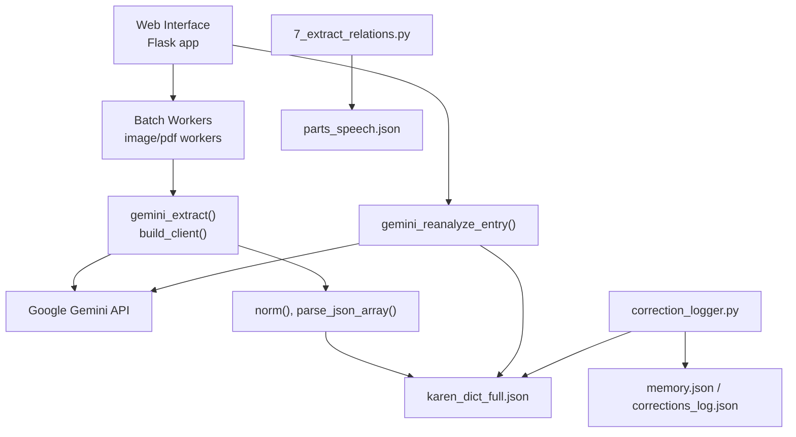
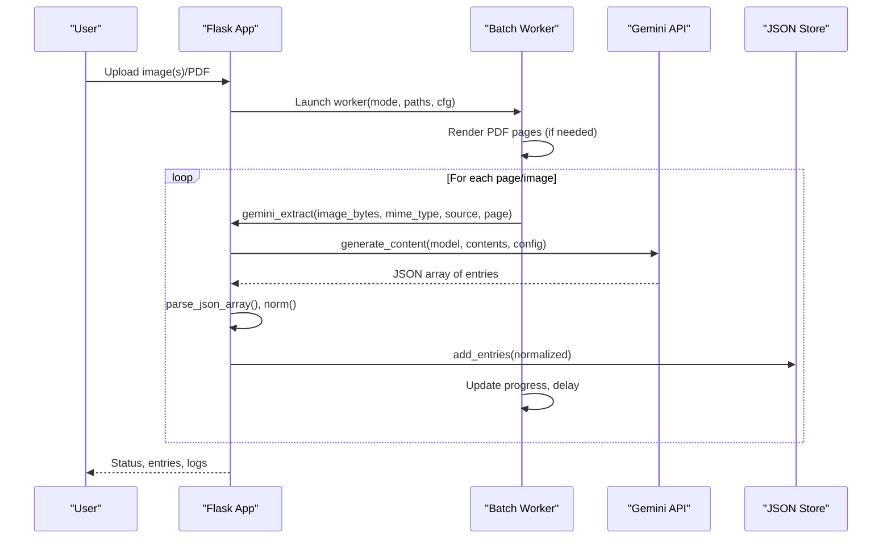
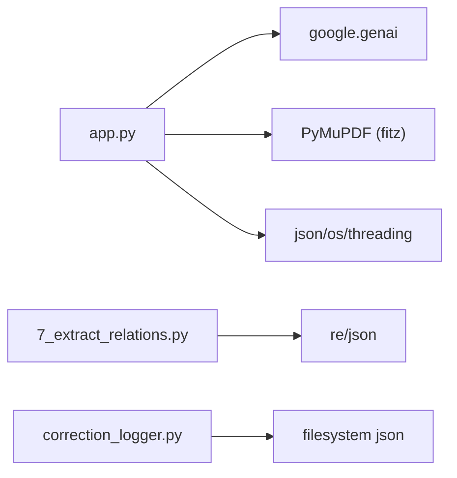

# AI Integration

<cite>
**Referenced Files in This Document**
- [app.py](file://app.py)
- [batch_config.json](file://batch_config.json)
- [check_setup.py](file://pipeline/dictionary_processing/check_setup.py)
- [correction_logger.py](file://pipeline/dictionary_processing/correction_logger.py)
- [7_extract_relations.py](file://pipeline/dictionary_processing/7_extract_relations.py)
</cite>

## Table of Contents
1. [Introduction](#introduction)
2. [Project Structure](#project-structure)
3. [Core Components](#core-components)
4. [Architecture Overview](#architecture-overview)
5. [Detailed Component Analysis](#detailed-component-analysis)
6. [Dependency Analysis](#dependency-analysis)
7. [Performance Considerations](#performance-considerations)
8. [Troubleshooting Guide](#troubleshooting-guide)
9. [Conclusion](#conclusion)
10. [Appendices](#appendices)

## Introduction
This document explains the AI integration sub-feature that uses Google Gemini to extract and enrich dictionary entries from images and PDF pages. It covers authentication, prompt engineering for dictionary extraction, response parsing and validation, error handling with retry logic, intelligent enhancement (semantic analysis, part-of-speech labeling, headword term identification, example sentence extraction), configuration options (API keys, rate limiting, timeouts), integration patterns with the web interface and batch processing system, and security considerations for API key management and data privacy.

## Project Structure
The AI integration is centered around a Flask application that orchestrates image/PDF ingestion, calls to Google Gemini, normalization and enrichment of extracted entries, and persistence to JSON files. Supporting scripts provide correction logging, auto-propagation of fixes, and relation extraction for parts-of-speech and cross-references. Batch configuration controls pacing and rendering quality.

**Diagram sources**
- [app.py:356-613](file://app.py#L356-L613)
- [7_extract_relations.py:62-145](file://pipeline/dictionary_processing/7_extract_relations.py#L62-L145)
- [correction_logger.py:21-150](file://pipeline/dictionary_processing/correction_logger.py#L21-L150)

**Section sources**
- [app.py:17-66](file://app.py#L17-L66)
- [batch_config.json:1-9](file://batch_config.json#L1-L9)

## Core Components
- Authentication and client initialization: reads API key from environment and constructs the Gemini client.
- Extraction pipeline: sends image bytes plus a structured prompt to Gemini; parses JSON responses into normalized entries.
- Reanalysis pipeline: re-analyzes existing entries to enhance analysis fields without altering definitions.
- Normalization and validation: enforces schema, deduplicates lists, normalizes entry types, and ensures safe display markup.
- Batch processing: workers iterate over images or PDF pages, apply delays, track progress, and persist results.
- Relation extraction: scans definitions for markers to build parts-of-speech and relational metadata.
- Correction logging: records human-corrected mistakes and auto-propagates fixes across the dictionary.

**Section sources**
- [app.py:356-359](file://app.py#L356-L359)
- [app.py:536-613](file://app.py#L536-L613)
- [app.py:303-353](file://app.py#L303-L353)
- [app.py:638-720](file://app.py#L638-L720)
- [7_extract_relations.py:62-145](file://pipeline/dictionary_processing/7_extract_relations.py#L62-L145)
- [correction_logger.py:21-150](file://pipeline/dictionary_processing/correction_logger.py#L21-L150)

## Architecture Overview
The system integrates Gemini via the Google GenAI SDK. The Flask app exposes routes and background workers that render PDFs to images, call Gemini for extraction, normalize outputs, and save them. A secondary script extracts relations and parts-of-speech from definitions. A correction logger captures mistakes and propagates fixes.

**Diagram sources**
- [app.py:536-613](file://app.py#L536-L613)
- [app.py:638-720](file://app.py#L638-L720)

## Detailed Component Analysis

### Authentication Setup
- API key is read from an environment variable and used to create a Gemini client. If missing, a runtime error is raised before any request.
- Model name is configurable via environment variable with a default model.

Configuration options:
- GEMINI_API_KEY: Required. Set before running the app or scripts.
- GEMINI_MODEL: Optional. Defaults to a specific model if not set.

Security notes:
- Never hardcode API keys in code or configs. Use environment variables.
- Avoid logging full keys; only partial visibility checks are used in setup helpers.

**Section sources**
- [app.py:36-37](file://app.py#L36-L37)
- [app.py:356-359](file://app.py#L356-L359)
- [check_setup.py:54-60](file://pipeline/dictionary_processing/check_setup.py#L54-L60)

### Prompt Engineering for Dictionary Extraction
- System rules define strict preservation of original definitions and structure.
- Extraction prompt instructs the model to return a JSON array with fields for headword, definitions, entry type, page, flags, and analysis (examples, headword terms, related items, segments, sense labels).
- Reanalysis prompt focuses on enhancing analysis fields without changing definitions.

Prompt characteristics:
- Enforces verbatim definition preservation.
- Requires structured JSON output with explicit schema guidance.
- Uses low temperature for deterministic outputs.

**Section sources**
- [app.py:69-89](file://app.py#L69-L89)
- [app.py:536-571](file://app.py#L536-L571)
- [app.py:574-607](file://app.py#L574-L607)

### Response Parsing and Validation
- Raw model output is cleaned of markdown fences and parsed as JSON arrays or wrapped objects containing an entries list.
- Entries are normalized to a consistent schema with enforced types, defaults, and safe HTML decoration for display.
- Analysis fields are normalized and deduplicated to ensure stable UI rendering.

Validation behaviors:
- Rejects non-array outputs by attempting fallback extraction within brackets.
- Normalizes entry_type to allowed values.
- Ensures analysis subfields exist and are lists.

**Section sources**
- [app.py:336-353](file://app.py#L336-L353)
- [app.py:303-326](file://app.py#L303-L326)
- [app.py:268-300](file://app.py#L268-L300)

### Error Handling and Retry Logic
- Global exception handler returns structured error payloads with truncated traces for safety.
- Workers catch per-item exceptions, log errors, continue processing, and update state safely under locks.
- Delays between requests help avoid rate limits; no automatic retry is implemented at the worker level.

Operational notes:
- Use delay_seconds in batch configuration to pace requests.
- Monitor logs for failures and consider external retries at the orchestration layer if needed.

**Section sources**
- [app.py:22-30](file://app.py#L22-L30)
- [app.py:638-720](file://app.py#L638-L720)
- [batch_config.json:1-9](file://batch_config.json#L1-L9)

### Intelligent Dictionary Enhancement
- Semantic segmentation: segments are tagged (example, cross_reference, cognate, grammar, headword) and rendered with classes for highlighting.
- Part-of-speech labeling: sense_labels can be injected into numbered senses; a separate script extracts POS tags from definitions using regex patterns.
- Headword term identification: headword_terms are extracted and linked to other entries in the dictionary.
- Example sentence extraction: examples are collected from definitions and presented in dedicated tabs.

Enhancement flow:
- gemini_reanalyze_entry enhances analysis without altering definitions.
- decorate_definition wraps matched segments with styled spans.
- inject_pos_labels annotates numbered senses with inferred POS labels.
- link_headword_terms creates clickable links to related entries.

**Section sources**
- [app.py:362-413](file://app.py#L362-L413)
- [app.py:443-471](file://app.py#L443-L471)
- [app.py:574-607](file://app.py#L574-L607)
- [7_extract_relations.py:62-145](file://pipeline/dictionary_processing/7_extract_relations.py#L62-L145)

### Web Interface Integration
- The Flask app serves a dark-themed UI that displays status, logs, and dictionary entries with highlighted segments and linked headwords.
- Health check indicates whether the Gemini key is present.
- Routes support uploading images/PDFs and triggering batch jobs.

Integration points:
- Status polling and progress updates are driven by shared state updated by workers.
- Entry view renders enhanced definitions with POS labels and links.

**Section sources**
- [app.py:734-800](file://app.py#L734-L800)
- [app.py:1420-1520](file://app.py#L1420-L1520)

### Batch Processing System
- Two workers handle images and PDF pages respectively.
- They respect skip_processed to avoid reprocessing, honor delay_seconds for rate limiting, and track per-page progress.
- Results are appended to the main dictionary file and processed tracking is persisted.

Configuration options:
- pdf_pages_per_batch, images_per_batch: control chunk sizes.
- delay_seconds: inter-request delay.
- render_dpi: image quality for PDF rendering.
- page_offset: adjust page numbering.
- skip_processed: toggle resuming behavior.
- auto_import_bootstrap: automatically import bootstrap JSON files.

**Section sources**
- [app.py:638-720](file://app.py#L638-L720)
- [batch_config.json:1-9](file://batch_config.json#L1-L9)

### Correction Logging and Auto-Propagation
- Logs human corrections with classification of error types (wrong headword, wrong definition, formatting error).
- Auto-propagation scans the full dictionary to flag or correct similar issues based on the recorded pattern.
- Builds smart prompts incorporating recent corrections to improve future extractions.

Usage patterns:
- After catching a mistake, log it with image source, predicted output, corrected output, and note.
- Review flagged entries and regenerate prompts incorporating lessons learned.

**Section sources**
- [correction_logger.py:21-123](file://pipeline/dictionary_processing/correction_logger.py#L21-L123)
- [correction_logger.py:126-150](file://pipeline/dictionary_processing/correction_logger.py#L126-L150)
- [correction_logger.py:153-181](file://pipeline/dictionary_processing/correction_logger.py#L153-L181)

## Dependency Analysis
The core dependencies include the Google GenAI SDK for Gemini, PyMuPDF for PDF rendering, and standard library modules for JSON and threading. External scripts depend on filesystem I/O and regex-based extraction.

**Diagram sources**
- [app.py:12-15](file://app.py#L12-L15)
- [7_extract_relations.py:1-6](file://pipeline/dictionary_processing/7_extract_relations.py#L1-L6)
- [correction_logger.py:7-15](file://pipeline/dictionary_processing/correction_logger.py#L7-L15)

**Section sources**
- [app.py:12-15](file://app.py#L12-L15)
- [7_extract_relations.py:1-6](file://pipeline/dictionary_processing/7_extract_relations.py#L1-L6)
- [correction_logger.py:7-15](file://pipeline/dictionary_processing/correction_logger.py#L7-L15)

## Performance Considerations
- Rate limiting: Use delay_seconds to space out requests and avoid throttling.
- Rendering DPI: Adjust render_dpi to balance image clarity and processing time.
- Batch sizing: Tune pdf_pages_per_batch and images_per_batch to optimize throughput.
- Caching and skipping: Enable skip_processed to avoid redundant work.
- Output token limits: max_output_tokens is set to constrain Gemini responses and reduce latency.

[No sources needed since this section provides general guidance]

## Troubleshooting Guide
Common issues and resolutions:
- Missing API key: Ensure GEMINI_API_KEY is set; use the setup checker to verify presence.
- Invalid JSON output: parse_json_array attempts multiple strategies; if still failing, inspect raw model output and refine prompts.
- Excessive errors: Increase delay_seconds and review logs for repeated failures.
- Stuck batch job: Force reset via UI if state is inconsistent; check global exception handler for trace snippets.
- Corrupt progress files: Delete or repair progress-related files as indicated by setup checks.

**Section sources**
- [check_setup.py:54-60](file://pipeline/dictionary_processing/check_setup.py#L54-L60)
- [app.py:22-30](file://app.py#L22-L30)
- [app.py:336-353](file://app.py#L336-L353)

## Conclusion
The AI integration leverages Google Gemini to extract and enrich dictionary entries from visual inputs, with robust normalization, validation, and enhancement pipelines. Configuration supports secure API key usage, rate limiting, and performance tuning. The web interface and batch system provide practical workflows for production use, while correction logging enables continuous improvement through feedback-driven prompt refinement.

[No sources needed since this section summarizes without analyzing specific files]

## Appendices

### Configuration Options Summary
- Environment variables:
  - GEMINI_API_KEY: Required for authentication.
  - GEMINI_MODEL: Optional model selection.
  - PADAUK_FONT: Optional font path override.
- Batch configuration (batch_config.json):
  - pdf_pages_per_batch, images_per_batch: batch sizes.
  - delay_seconds: inter-request delay.
  - render_dpi: PDF rendering resolution.
  - page_offset: page numbering offset.
  - skip_processed: resume behavior.
  - auto_import_bootstrap: auto-import bootstrap files.

**Section sources**
- [app.py:36-37](file://app.py#L36-L37)
- [app.py:57-66](file://app.py#L57-L66)
- [batch_config.json:1-9](file://batch_config.json#L1-L9)

### Security Considerations
- Keep API keys in environment variables; never commit secrets to version control.
- Avoid logging sensitive data; use partial visibility checks in diagnostics.
- Restrict access to directories storing dictionary JSON and logs.
- Validate and sanitize all user inputs before processing.

**Section sources**
- [app.py:356-359](file://app.py#L356-L359)
- [check_setup.py:54-60](file://pipeline/dictionary_processing/check_setup.py#L54-L60)