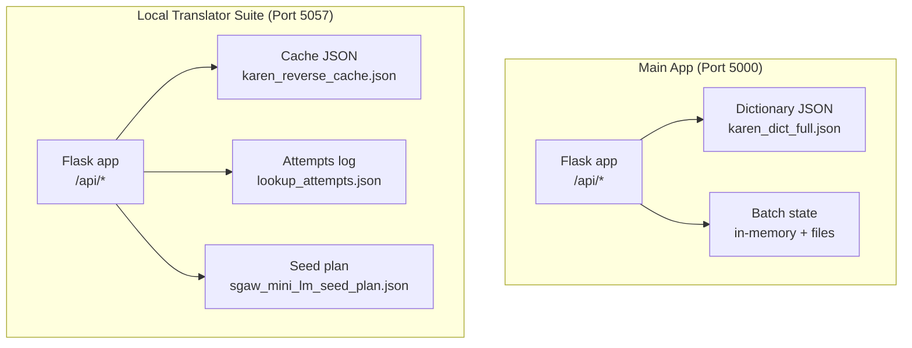
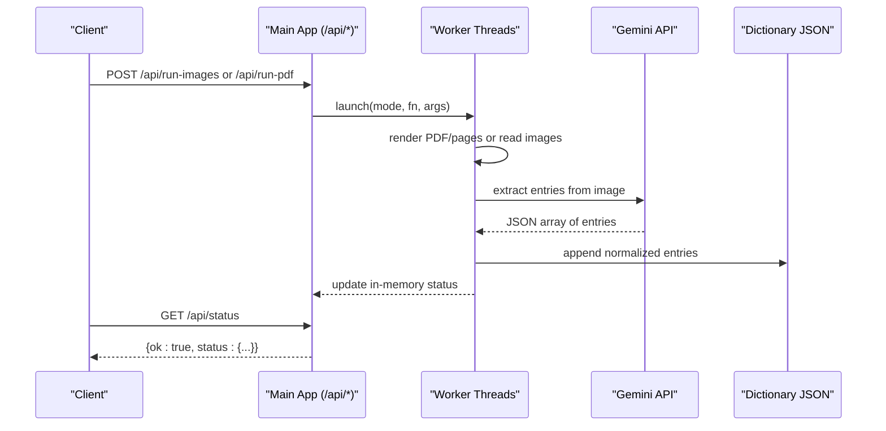
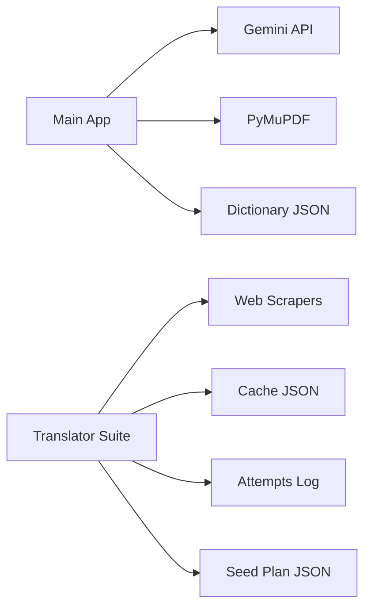

# API Reference

<cite>
**Referenced Files in This Document**
- [app.py](file://app.py)
- [local_translator_suite/app.py](file://pipeline/dictionary_processing/local_translator_suite/app.py)
- [README.md](file://README.md)
</cite>

## Table of Contents
1. [Introduction](#introduction)
2. [Project Structure](#project-structure)
3. [Core Components](#core-components)
4. [Architecture Overview](#architecture-overview)
5. [Detailed Component Analysis](#detailed-component-analysis)
6. [Dependency Analysis](#dependency-analysis)
7. [Performance Considerations](#performance-considerations)
8. [Troubleshooting Guide](#troubleshooting-guide)
9. [Conclusion](#conclusion)
10. [Appendices](#appendices)

## Introduction
This document provides API reference documentation for the Sgaw Karen OCR and Dictionary Pipeline, covering two Flask-based services:
- Main application (dictionary workbench): health checks, status monitoring, entry management, batch processing, search, configuration, and bootstrap import.
- Local translator suite: translation endpoints, cache management, live batch streaming, attempts audit, and mini language model seed plan.

The main app runs on port 5000 by default; the local translator suite runs on port 5057 by default. Authentication is not implemented; all endpoints are intended for local or trusted network use.

**Section sources**
- [README.md:33-45](file://README.md#L33-L45)

## Project Structure
At a high level:
- The root Flask app implements dictionary workbench APIs and serves HTML UIs.
- The local translator suite under pipeline/dictionary_processing/local_translator_suite implements translation, reverse parsing, web scraping, caching, and batch processing with server-sent events (SSE).

**Diagram sources**
- [app.py:1510-1664](file://app.py#L1510-L1664)
- [local_translator_suite/app.py:1919-2011](file://pipeline/dictionary_processing/local_translator_suite/app.py#L1919-L2011)

**Section sources**
- [app.py:1510-1664](file://app.py#L1510-L1664)
- [local_translator_suite/app.py:1919-2011](file://pipeline/dictionary_processing/local_translator_suite/app.py#L1919-L2011)

## Core Components
- Health and status: /api/health, /api/status
- Configuration: /api/config
- Entries: GET /api/entries, POST/DELETE /api/entry/<index>, POST /api/promote/<index>, POST /api/reanalyze/<index>
- Batch control: POST /api/run-images, POST /api/run-pdf, POST /api/cancel, POST /api/force-reset, POST /api/import-bootstrap
- Fonts: GET /fonts/padauk_reg.ttf
- Local translator suite:
  - Lookup: POST /api/lookup, POST /api/lookup-stream
  - Batch streaming: POST /api/batch-stream, POST /api/live-file-stream, POST /api/live-stop, GET /api/live-state
  - Audit and cache: GET /api/attempts, GET /api/cache, GET /api/mini-lm-seed-plan

Authentication: None. All endpoints return JSON unless serving static assets or HTML templates.

Error handling:
- Global exception handler returns JSON with ok=false and error details.
- 404 handler returns JSON with ok=false and route-not-found message.

Rate limiting and quotas: Not implemented at the API layer. Some operations include internal delays (e.g., scrape delay) to be respectful to external sites.

Versioning: No explicit versioning prefix. Backward compatibility is maintained by preserving existing routes and response shapes as observed in code.

**Section sources**
- [app.py:22-31](file://app.py#L22-L31)
- [app.py:1515-1664](file://app.py#L1515-L1664)
- [local_translator_suite/app.py:1931-2006](file://pipeline/dictionary_processing/local_translator_suite/app.py#L1931-L2006)

## Architecture Overview
The main app orchestrates OCR extraction using an external Gemini model and persists results to a JSON file. It exposes REST endpoints for querying entries, editing metadata, running batch jobs, and controlling workers.

The local translator suite performs bidirectional translation:
- English to Karen: uses seed translations, local cache, web dictionaries, internet context, and a mini grammar model to compose definitions.
- Karen to English: reverse parses Karen text into syllables, identifies connectors, and resolves chunks via cache/web lookups.

Both services expose SSE endpoints for real-time progress during long-running tasks.

**Diagram sources**
- [app.py:638-729](file://app.py#L638-L729)
- [app.py:1631-1658](file://app.py#L631-L658)
- [app.py:536-572](file://app.py#L536-L572)

**Section sources**
- [app.py:536-729](file://app.py#L536-L729)
- [app.py:1631-1658](file://app.py#L1631-L1658)

## Detailed Component Analysis

### Main Application Endpoints

#### Health and Status
- GET /api/health
  - Response fields: ok, key_ok, model, entries, dictionary_file
  - Purpose: verify service health and environment configuration
- GET /api/status
  - Response fields: ok, status (running, mode, file, page, done, total, entries_added, started, finished, error, log)
  - Purpose: monitor batch job progress and logs

Example request/response payloads:
- Request: GET /api/health
- Response: {"ok": true, "key_ok": true, "model": "gemini-2.5-flash", "entries": 1234, "dictionary_file": "karen_dict_full.json"}

- Request: GET /api/status
- Response: {"ok": true, "status": {"running": false, "mode": "", "file": "", "page": "", "done": 0, "total": 0, "entries_added": 0, "started": "", "finished": "", "error": "", "log": []}}

**Section sources**
- [app.py:1515-1531](file://app.py#L1515-L1531)

#### Configuration
- GET /api/config
  - Returns current config merged with defaults
- POST /api/config
  - Accepts JSON object to update config; returns updated config

Config keys include pdf_pages_per_batch, images_per_batch, delay_seconds, page_offset, render_dpi, skip_processed, auto_import_bootstrap.

**Section sources**
- [app.py:1533-1537](file://app.py#L1533-L1537)
- [app.py:57-67](file://app.py#L57-L67)

#### Entries Management
- GET /api/entries
  - Query parameters: q (search string or #index), page (filter by page number), flagged (1 to show only flagged)
  - Response fields: ok, entries (list of view entries), total (count of all entries), shown (number returned), correction_count
- POST /api/entry/<int:index>
  - Body: JSON with fields like karen, definitions; updates entry and records edit
  - Response: ok, entry (updated entry with index)
- DELETE /api/entry/<int:index>
  - Removes entry and records deletion
  - Response: ok, deleted (index)
- POST /api/promote/<int:index>
  - Marks entry as promoted headword
  - Response: ok, index
- POST /api/reanalyze/<int:index>
  - Re-analyzes entry using Gemini to refine analysis and entry_type
  - Response: ok, entry (updated entry with index)

Search behavior:
- If q starts with "#" and numeric, filters to that index.
- Otherwise, searches across karen text, definitions, source, and analysis blob.
- Results are limited to 200 entries per request.

**Section sources**
- [app.py:1540-1567](file://app.py#L1540-L1567)
- [app.py:1570-1598](file://app.py#L1570-L1598)
- [app.py:1600-1611](file://app.py#L1600-L1611)

#### Batch Processing
- POST /api/run-images
  - Multipart form field: images (multiple image files)
  - Saves uploaded images and launches worker thread to extract entries
  - Response: ok, queued (count)
- POST /api/run-pdf
  - Multipart form fields: pdf (PDF file), start (integer), end (integer)
  - Renders pages and launches worker thread to extract entries
  - Response: ok, queued (pdf name, start, end)
- POST /api/cancel
  - Signals cancellation to running worker
  - Response: ok
- POST /api/force-reset
  - Forces finish/reset of worker state
  - Response: ok
- POST /api/import-bootstrap
  - Imports bootstrap files if enabled in config
  - Response: ok, added (count)

Workers:
- Image worker processes each image, optionally skipping already processed ones based on configuration.
- PDF worker renders specified page range and processes each page similarly.
- Progress and logs are exposed via /api/status.

**Section sources**
- [app.py:1631-1658](file://app.py#L1631-L1658)
- [app.py:638-729](file://app.py#L638-L729)
- [app.py:1613-1628](file://app.py#L1613-L1628)

#### Font Serving
- GET /fonts/padauk_reg.ttf
  - Serves a TTF font file used by the UI for rendering Karen Unicode correctly
  - Returns 404 if font not found

**Section sources**
- [app.py:518-530](file://app.py#L518-L530)

### Local Translator Suite Endpoints

#### Translation Lookup
- POST /api/lookup
  - Body: JSON with text (string) and mode ("auto", "en-to-ksw", "ksw-to-en")
  - Performs direction detection and lookup; returns result and audit events
  - Response: result (direction, input, output, source, description, grammarized, optional sources/internet_context/mini_lm/word_thoughts), audit (list of event objects)
- POST /api/lookup-stream
  - Same payload as /api/lookup
  - Streams events via Server-Sent Events (SSE) until completion

Direction detection:
- Auto mode inspects Unicode ranges and leading lines to choose direction.
- Manual modes force en-to-ksw or ksw-to-en.

Lookup flow:
- Seeds -> local cache -> web dictionaries (Glosbe, KarenDictionary.org, Drum fallback) -> internet context -> mini LM analysis -> composed definition -> forced generic fallback.

Reverse parse flow:
- Split Karen into syllables, identify connector spans, try whole string first, then forward-match candidates, infer English from parts.

**Section sources**
- [local_translator_suite/app.py:1931-1946](file://pipeline/dictionary_processing/local_translator_suite/app.py#L1931-L1946)
- [local_translator_suite/app.py:666-686](file://pipeline/dictionary_processing/local_translator_suite/app.py#L666-L686)
- [local_translator_suite/app.py:1222-1302](file://pipeline/dictionary_processing/local_translator_suite/app.py#L1222-L1302)
- [local_translator_suite/app.py:1429-1516](file://pipeline/dictionary_processing/local_translator_suite/app.py#L1429-L1516)

#### Batch Streaming
- POST /api/batch-stream
  - Form fields: mode (optional), file (text file upload) or content (text body)
  - Streams line-by-line processing events via SSE
  - Writes updated output to translations_updated.txt and samples/translations_updated.txt
- POST /api/live-file-stream
  - Reads translations_website.txt and streams processing with live write enabled
  - Prevents concurrent runs while active
- POST /api/live-stop
  - Stops a running live file stream
  - Response: ok, state (live state snapshot)
- GET /api/live-state
  - Returns current live state including running flag, timestamps, counts, rows, and output tail

Live state fields include running, started_at, updated_at, source_file, output_file, total_lines, processed_lines, changed_count, parsed_count, current, rows, output_tail, message.

**Section sources**
- [local_translator_suite/app.py:1948-1988](file://pipeline/dictionary_processing/local_translator_suite/app.py#L1948-L1988)
- [local_translator_suite/app.py:1654-1884](file://pipeline/dictionary_processing/local_translator_suite/app.py#L1654-L1884)

#### Cache and Audit
- GET /api/cache
  - Returns count and full cache contents
  - Cache keys are direction::query; values include result, source, updated_at
- GET /api/attempts?limit=200
  - Returns recent lookup attempts with direction, query, stage, source, status, results, url, elapsed_ms, error, metadata
- GET /api/mini-lm-seed-plan
  - Returns seed plan JSON used by the mini language model guidance

**Section sources**
- [local_translator_suite/app.py:1991-2006](file://pipeline/dictionary_processing/local_translator_suite/app.py#L1991-L2006)
- [local_translator_suite/app.py:610-647](file://pipeline/dictionary_processing/local_translator_suite/app.py#L610-L647)
- [local_translator_suite/app.py:577-608](file://pipeline/dictionary_processing/local_translator_suite/app.py#L577-L608)

### Data Models

#### Entry Model (Normalized)
Fields commonly present in entry responses:
- karen: string
- definitions: list of strings
- page: string or null
- flag: boolean
- source: string
- entry_type: "headword" | "compound" | "example"
- promoted: boolean
- analysis: object with examples, headword_terms, related_items, segments, sense_labels
- created_at: ISO timestamp
- updated_at: ISO timestamp
- index: integer (for UI navigation)

View entry enhancements:
- display_definitions: list of plain definitions
- linked_definitions: HTML-rendered definitions with highlighted segments and headword links
- tab_examples, tab_headwords, tab_related: deduplicated lists for UI tabs

**Section sources**
- [app.py:303-327](file://app.py#L303-L327)
- [app.py:455-471](file://app.py#L455-L471)

#### Live State Model (Translator Suite)
Fields:
- running: boolean
- started_at: ISO timestamp
- updated_at: ISO timestamp
- source_file: string
- output_file: string
- total_lines: integer
- processed_lines: integer
- changed_count: integer
- parsed_count: integer
- current: object or null
- rows: list of row snapshots
- output_tail: string
- message: string

**Section sources**
- [local_translator_suite/app.py:490-504](file://pipeline/dictionary_processing/local_translator_suite/app.py#L490-L504)
- [local_translator_suite/app.py:1540-1583](file://pipeline/dictionary_processing/local_translator_suite/app.py#L1540-L1583)

### Error Handling and Codes
- Global exceptions: HTTP 500 with JSON {ok:false, error:string, trace:string}
- Route not found: HTTP 404 with JSON {ok:false, error:"Route not found: ..."}
- Missing inputs:
  - /api/run-images without files: HTTP 400 with {ok:false, error:"No image files uploaded"}
  - /api/run-pdf without pdf: HTTP 400 with {ok:false, error:"No PDF uploaded"}

Common errors:
- Batch already running: RuntimeError raised when launching new batch while one is active
- External API failures: captured in attempts log and emitted events; endpoints may still succeed with partial results

**Section sources**
- [app.py:22-31](file://app.py#L22-L31)
- [app.py:1631-1658](file://app.py#L1631-L1658)
- [local_translator_suite/app.py:1964-1966](file://pipeline/dictionary_processing/local_translator_suite/app.py#L1964-L1966)

### Security and Access Control
- No authentication middleware is present.
- Intended for local development or trusted networks.
- Secrets:
  - GEMINI_API_KEY required for OCR extraction and re-analysis
  - Environment variables control scrape delays and timeouts in the translator suite

**Section sources**
- [app.py:36-38](file://app.py#L36-L38)
- [local_translator_suite/app.py:31-40](file://pipeline/dictionary_processing/local_translator_suite/app.py#L31-L40)

## Dependency Analysis
- Main app depends on:
  - Google GenAI client for OCR extraction
  - PyMuPDF (fitz) for PDF rendering
  - Filesystem for dictionary storage and batch artifacts
- Translator suite depends on:
  - requests for HTTP scraping
  - BeautifulSoup for HTML parsing
  - Filesystem for cache, attempts log, and batch outputs

**Diagram sources**
- [app.py:12-15](file://app.py#L12-L15)
- [app.py:536-572](file://app.py#L536-L572)
- [local_translator_suite/app.py:15-17](file://pipeline/dictionary_processing/local_translator_suite/app.py#L15-L17)
- [local_translator_suite/app.py:689-784](file://pipeline/dictionary_processing/local_translator_suite/app.py#L689-L784)

**Section sources**
- [app.py:12-15](file://app.py#L12-L15)
- [local_translator_suite/app.py:15-17](file://pipeline/dictionary_processing/local_translator_suite/app.py#L15-L17)

## Performance Considerations
- Batch delays:
  - Configurable delay_seconds between processing items to avoid overwhelming external services
  - Scrape delay configured via KAREN_SCRAPE_DELAY_SECONDS
- Pagination and limits:
  - /api/entries caps results to 200 entries per request
- Concurrency:
  - Workers run in daemon threads; only one batch can run at a time per service
- I/O:
  - Dictionary and cache writes use atomic tmp+replace pattern to reduce corruption risk
- Rendering:
  - PDF DPI configurable via render_dpi; higher DPI increases memory and processing time

Optimization tips:
- Use page filtering and flagged-only queries to reduce payload size
- Increase delay_seconds if rate-limiting occurs with external scrapers
- Prefer streaming endpoints for large batches to observe progress and stop early

[No sources needed since this section provides general guidance]

## Troubleshooting Guide
- Health check fails:
  - Verify GEMINI_API_KEY is set for OCR features
  - Check network connectivity to external APIs
- Batch stuck:
  - Use /api/cancel to signal cancellation
  - Use /api/force-reset to clear stuck state
  - Inspect logs via /api/status
- No entries extracted:
  - Confirm images/PDFs are valid and readable
  - Check worker logs for errors and retry with lower DPI or different page ranges
- Translator suite returns no result:
  - Inspect /api/attempts for detailed stages and errors
  - Use /api/lookup-stream to see step-by-step events
  - Validate input text direction or set mode explicitly

**Section sources**
- [app.py:1515-1531](file://app.py#L1515-L1531)
- [app.py:1618-1628](file://app.py#L1618-L1628)
- [local_translator_suite/app.py:1991-1996](file://pipeline/dictionary_processing/local_translator_suite/app.py#L1991-L1996)

## Conclusion
The Sgaw Karen OCR and Dictionary Pipeline provides a comprehensive set of REST APIs for managing dictionary entries, running batch OCR jobs, and performing bidirectional translation with rich auditing and streaming capabilities. While lacking authentication and explicit versioning, the APIs are designed for local or trusted environments and maintain stable response shapes. Clients should leverage streaming endpoints for long-running tasks and monitor status endpoints for operational visibility.

[No sources needed since this section summarizes without analyzing specific files]

## Appendices

### Common Use Cases and Client Guidelines
- Health monitoring:
  - Poll GET /api/health periodically to detect service readiness and key presence
- Status polling:
  - Poll GET /api/status every few seconds during batch runs to update UI
- Entry search:
  - Use GET /api/entries?q=<term> for keyword search; use ?flagged=1 to focus on flagged entries
- Batch OCR:
  - Upload images via POST /api/run-images or PDF via POST /api/run-pdf
  - Monitor progress via /api/status; cancel or reset if needed
- Translation lookup:
  - Use POST /api/lookup for simple requests; use POST /api/lookup-stream for real-time insights
- Batch translation:
  - Use POST /api/batch-stream or POST /api/live-file-stream to process large texts with SSE
  - Stop live runs with POST /api/live-stop

Authentication flows:
- Not applicable; rely on network-level security controls.

Performance optimization tips:
- Tune delay_seconds and render_dpi in /api/config
- Use page filtering and flagged-only queries
- Leverage streaming endpoints to avoid long polling overhead

API versioning and deprecation:
- No version prefixes; changes should preserve existing routes and response structures to maintain backward compatibility.

Debugging tools and monitoring:
- /api/attempts for detailed lookup audit
- /api/status for batch logs
- /api/live-state for live batch progress
- /api/cache to inspect cached translations

**Section sources**
- [app.py:1515-1664](file://app.py#L1515-L1664)
- [local_translator_suite/app.py:1931-2006](file://pipeline/dictionary_processing/local_translator_suite/app.py#L1931-L2006)