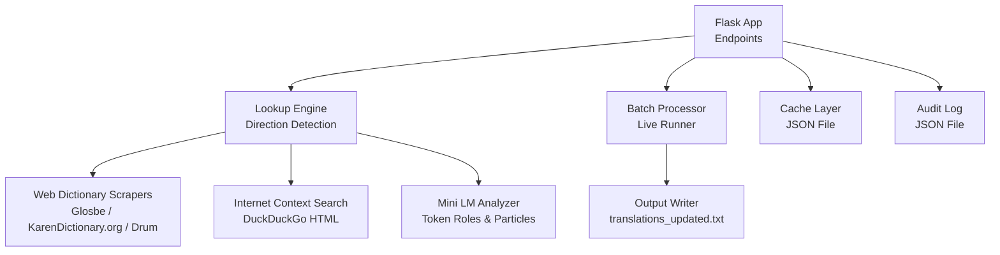
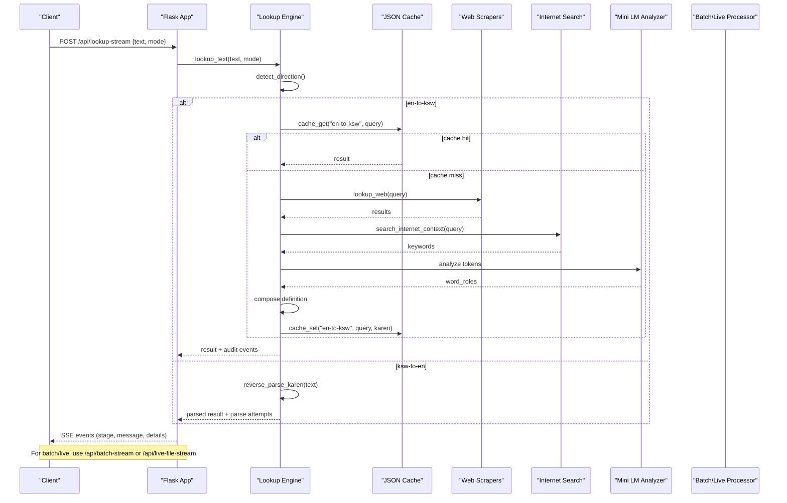
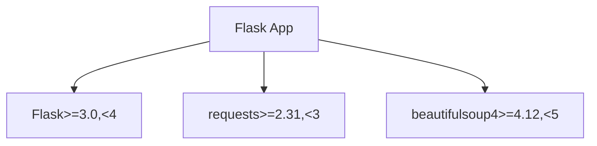

# Local Translator Suite APIs

<cite>
**Referenced Files in This Document**
- [app.py](file://pipeline/dictionary_processing/local_translator_suite/app.py)
- [requirements.txt](file://pipeline/dictionary_processing/local_translator_suite/requirements.txt)
- [index.html](file://pipeline/dictionary_processing/local_translator_suite/templates/index.html)
- [app.js](file://pipeline/dictionary_processing/local_translator_suite/static/app.js)
- [sgaw_mini_lm_seed_plan.json](file://pipeline/dictionary_processing/local_translator_suite/data/sgaw_mini_lm_seed_plan.json)
</cite>

## Table of Contents
1. [Introduction](#introduction)
2. [Project Structure](#project-structure)
3. [Core Components](#core-components)
4. [Architecture Overview](#architecture-overview)
5. [Detailed Component Analysis](#detailed-component-analysis)
6. [Dependency Analysis](#dependency-analysis)
7. [Performance Considerations](#performance-considerations)
8. [Troubleshooting Guide](#troubleshooting-guide)
9. [Conclusion](#conclusion)
10. [Appendices](#appendices)

## Introduction
This document provides API documentation for the standalone local translator suite that translates between English and S'gaw Karen. It covers translation request/response formats, cache lookup mechanisms, reverse parsing capabilities, batch processing interfaces, and live file processing. It also documents authentication, rate limiting, integration patterns, client implementation guidelines, and error handling strategies.

The service is a Flask application exposing REST endpoints and Server-Sent Events (SSE) streams for real-time progress. It supports:
- Single translation lookups with automatic or manual direction detection
- Reverse parsing of Karen text into English
- Batch processing of key=value files with live updates
- Live runner for the website translations file
- Cache inspection and audit logs retrieval

## Project Structure
The translator suite is implemented as a single Flask application with templates and static assets for the web UI. Key elements include:
- Application logic and endpoints in the main module
- Templates for the HTML interface
- Client-side JavaScript for SSE streaming and UI interactions
- Data files for seed plans and sample inputs
- Requirements defining runtime dependencies

**Diagram sources**
- [app.py:1919-2011](file://pipeline/dictionary_processing/local_translator_suite/app.py#L1919-L2011)
- [app.py:1533-1538](file://pipeline/dictionary_processing/local_translator_suite/app.py#L1533-L1538)
- [app.py:1654-1884](file://pipeline/dictionary_processing/local_translator_suite/app.py#L1654-L1884)
- [app.py:610-648](file://pipeline/dictionary_processing/local_translator_suite/app.py#L610-L648)
- [app.py:577-608](file://pipeline/dictionary_processing/local_translator_suite/app.py#L577-L608)
- [app.py:847-876](file://pipeline/dictionary_processing/local_translator_suite/app.py#L847-L876)
- [app.py:896-954](file://pipeline/dictionary_processing/local_translator_suite/app.py#L896-L954)
- [app.py:1039-1076](file://pipeline/dictionary_processing/local_translator_suite/app.py#L1039-L1076)

**Section sources**
- [app.py:1919-2011](file://pipeline/dictionary_processing/local_translator_suite/app.py#L1919-L2011)
- [index.html:1-193](file://pipeline/dictionary_processing/local_translator_suite/templates/index.html#L1-L193)
- [app.js:1-477](file://pipeline/dictionary_processing/local_translator_suite/static/app.js#L1-L477)
- [sgaw_mini_lm_seed_plan.json:1-73](file://pipeline/dictionary_processing/local_translator_suite/data/sgaw_mini_lm_seed_plan.json#L1-L73)

## Core Components
- Direction detection and routing: Automatically detects whether input is English or Karen and routes to the appropriate pipeline. Supports manual mode override.
- English-to-Karen translation: Uses seed translations, local cache, web dictionary scrapers, internet context search, mini grammar model analysis, and composition fallbacks.
- Karen-to-English reverse parsing: Splits Karen syllables, identifies connectors, attempts whole-string matches, then forward-matches prioritized chunks to infer English.
- Batch processing: Processes key=value files line-by-line, translating missing Karen values or parsing Karen keys, writing updated output and analysis sections.
- Live runner: Streams progress while processing the website translations file, updating live state and output tail.
- Cache management: JSON-backed cache storing translation pairs with metadata and timestamps.
- Audit logging: Records all lookup attempts with direction, query, stage, source, status, results, timing, and errors.

**Section sources**
- [app.py:666-686](file://pipeline/dictionary_processing/local_translator_suite/app.py#L666-L686)
- [app.py:1222-1302](file://pipeline/dictionary_processing/local_translator_suite/app.py#L1222-L1302)
- [app.py:1429-1516](file://pipeline/dictionary_processing/local_translator_suite/app.py#L1429-L1516)
- [app.py:1654-1884](file://pipeline/dictionary_processing/local_translator_suite/app.py#L1654-L1884)
- [app.py:610-648](file://pipeline/dictionary_processing/local_translator_suite/app.py#L610-L648)
- [app.py:577-608](file://pipeline/dictionary_processing/local_translator_suite/app.py#L577-L608)

## Architecture Overview
The system exposes REST endpoints and SSE streams for interactive and batch workflows. Requests are processed by a unified lookup engine that routes based on detected language direction. Web scraping and internet search provide external context, while local caches and seed data accelerate responses. Batch and live modes stream events back to clients for real-time feedback.

**Diagram sources**
- [app.py:1931-1945](file://pipeline/dictionary_processing/local_translator_suite/app.py#L1931-L1945)
- [app.py:1533-1538](file://pipeline/dictionary_processing/local_translator_suite/app.py#L1533-L1538)
- [app.py:666-686](file://pipeline/dictionary_processing/local_translator_suite/app.py#L666-L686)
- [app.py:957-979](file://pipeline/dictionary_processing/local_translator_suite/app.py#L957-L979)
- [app.py:847-876](file://pipeline/dictionary_processing/local_translator_suite/app.py#L847-L876)
- [app.py:896-954](file://pipeline/dictionary_processing/local_translator_suite/app.py#L896-L954)
- [app.py:1039-1076](file://pipeline/dictionary_processing/local_translator_suite/app.py#L1039-L1076)
- [app.py:1429-1516](file://pipeline/dictionary_processing/local_translator_suite/app.py#L1429-L1516)

## Detailed Component Analysis

### Translation Request/Response Formats
- Endpoint: POST /api/lookup
  - Request body: JSON object with fields:
    - text: string (source text to translate)
    - mode: string ("auto", "en-to-ksw", "ksw-to-en")
  - Response: JSON object with:
    - result: translation result object
    - audit: array of event objects describing stages and details
- Endpoint: POST /api/lookup-stream
  - Same request body as /api/lookup
  - Response: Server-Sent Events stream emitting event payloads with fields:
    - id: unique identifier
    - time: ISO timestamp
    - stage: event type (e.g., "detect", "route", "cache", "dictionary", "match", "fallback", "mini_lm", "compose", "complete")
    - message: human-readable status
    - details: context-specific fields (query, result, source, etc.)

Example request:
- Method: POST
- URL: /api/lookup-stream
- Headers: Content-Type: application/json
- Body: {"text": "new song wizard", "mode": "auto"}

Example response payload (streamed):
- {"stage": "detect", "message": "Scanning Unicode and manual mode.", "details": {"forced_mode": "auto", "has_karen": false, "has_english": true, "starts_with_karen_line": false}}
- {"stage": "route", "message": "English letters detected; routing to English-to-Karen.", "details": {"direction": "en-to-ksw"}}
- {"stage": "complete", "message": "Complete.", "result": {"direction": "en-to-ksw", "input": "...", "output": "...", "source": "...", "description": "...", "grammarized": "...", "internet_context": {...}, "mini_lm": {...}}}

**Section sources**
- [app.py:1931-1945](file://pipeline/dictionary_processing/local_translator_suite/app.py#L1931-L1945)
- [app.py:1887-1916](file://pipeline/dictionary_processing/local_translator_suite/app.py#L1887-L1916)
- [app.py:560-574](file://pipeline/dictionary_processing/local_translator_suite/app.py#L560-L574)

### Cache Lookup Mechanisms
- Cache storage: JSON file at data/karen_reverse_cache.json
- Keys: direction::query (e.g., "en-to-ksw::normalized_query")
- Values: object containing:
  - result: translated string
  - source: origin of the translation (e.g., "web", "seed-translations", "composed-definition")
  - updated_at: ISO timestamp
- Endpoints:
  - GET /api/cache returns count and full cache content
- Behavior:
  - Cache hits return immediately with source metadata
  - Misses proceed to web lookup or composition and update cache on success
  - Legacy reverse cache format supported for Karen-to-English queries

**Section sources**
- [app.py:610-648](file://pipeline/dictionary_processing/local_translator_suite/app.py#L610-L648)
- [app.py:1998-2001](file://pipeline/dictionary_processing/local_translator_suite/app.py#L1998-L2001)

### Reverse Parsing Capabilities
- Input: Karen text
- Process:
  - Split into syllables by consonant anchors
  - Identify connector spans using known particles
  - Attempt whole-string match first
  - Forward-match prioritized chunks (connectors, before/after connectors, contiguous combinations)
  - Record parse attempts and stuck points
  - Infer English from matched chunk meanings
- Output:
  - direction: "ksw-to-en"
  - input: original Karen text
  - output: inferred English phrase
  - whole_match: optional match info
  - syllables: list of syllable strings
  - connectors: list of connector spans with meaning
  - parse_attempts: detailed attempt log
  - parts: matched segments with meaning and source
  - breakdown: formatted segment explanation
  - source: "reverse-parser"

**Section sources**
- [app.py:1305-1331](file://pipeline/dictionary_processing/local_translator_suite/app.py#L1305-L1331)
- [app.py:1334-1416](file://pipeline/dictionary_processing/local_translator_suite/app.py#L1334-L1416)
- [app.py:1419-1426](file://pipeline/dictionary_processing/local_translator_suite/app.py#L1419-L1426)
- [app.py:1429-1516](file://pipeline/dictionary_processing/local_translator_suite/app.py#L1429-L1516)
- [app.py:1519-1530](file://pipeline/dictionary_processing/local_translator_suite/app.py#L1519-L1530)

### Batch Processing Interfaces
- Endpoint: POST /api/batch-stream
  - Form fields:
    - mode: "auto", "en-to-ksw", "ksw-to-en"
    - file: optional uploaded .txt file
    - content: optional raw text if no file provided
  - Behavior:
    - Processes lines sequentially
    - Detects direction per line based on content around "=" or leading Karen
    - Translates English keys to Karen when right side is empty
    - Parses Karen keys/values to generate English explanations
    - Writes updated content to translations_updated.txt and samples copy
    - Emits SSE events for each line and completion
  - Completion payload includes:
    - processed_text: final content
    - changed_count: number of lines filled
    - parsed_count: number of lines parsed
    - output_file: path to written file
    - download_name: filename for download

- Endpoint: POST /api/live-file-stream
  - Reads predefined source file (samples/translations_website.txt)
  - Streams live progress and writes output periodically
  - Supports stop via /api/live-stop

- Endpoint: GET /api/live-state
  - Returns current live run state including progress, current row, rows history, and output tail

**Section sources**
- [app.py:1654-1884](file://pipeline/dictionary_processing/local_translator_suite/app.py#L1654-L1884)
- [app.py:1948-1956](file://pipeline/dictionary_processing/local_translator_suite/app.py#L1948-L1956)
- [app.py:1959-1976](file://pipeline/dictionary_processing/local_translator_suite/app.py#L1959-L1976)
- [app.py:1986-1988](file://pipeline/dictionary_processing/local_translator_suite/app.py#L1986-L1988)

### Translation Quality Metrics
- Quality signals are embedded in result objects:
  - source: indicates origin (e.g., "seed-translations", "local cached direct translation", "direct dictionary translation", "composed-definition", "forced-generic-definition")
  - description: human-readable explanation of how the translation was derived
  - grammarized: normalized target phrase used for construction
  - internet_context: keywords and snippets from search
  - mini_lm: token roles and suggested particles
  - word_thoughts: per-word decisions and sources
  - parse_attempts: detailed attempts during reverse parsing
  - breakdown: formatted explanation of Karen chunk mappings
- Audit log entries record:
  - direction, query, stage, source, status, results, url, elapsed_ms, error, metadata

**Section sources**
- [app.py:1222-1302](file://pipeline/dictionary_processing/local_translator_suite/app.py#L1222-L1302)
- [app.py:1429-1516](file://pipeline/dictionary_processing/local_translator_suite/app.py#L1429-L1516)
- [app.py:577-608](file://pipeline/dictionary_processing/local_translator_suite/app.py#L577-L608)

### Authentication Methods
- No built-in authentication is implemented in the endpoints.
- The application runs locally by default (host 127.0.0.1).
- To secure access, deploy behind a reverse proxy with authentication and TLS.

**Section sources**
- [app.py:2009-2011](file://pipeline/dictionary_processing/local_translator_suite/app.py#L2009-L2011)

### Rate Limiting for Translation Requests
- Web scraping uses a configurable delay between requests:
  - Environment variable KAREN_SCRAPE_DELAY_SECONDS controls pause before each scrape
- HTTP timeouts are enforced:
  - Environment variable KAREN_REQUEST_TIMEOUT_SECONDS sets request timeout
- These settings help avoid overwhelming external sites and handle network failures gracefully.

**Section sources**
- [app.py:38-39](file://pipeline/dictionary_processing/local_translator_suite/app.py#L38-L39)
- [app.py:689-711](file://pipeline/dictionary_processing/local_translator_suite/app.py#L689-L711)

### Integration Patterns with External Systems
- Web dictionaries:
  - Glosbe: constructs URL with source/target languages and extracts candidates from HTML
  - KarenDictionary.org: searches by query parameter and parses results
  - Drum Publications: fallback source with direction-aware URLs
- Internet context:
  - DuckDuckGo HTML search extracts titles, snippets, and keywords to inform composition
- Seed plan:
  - sgaw_mini_lm_seed_plan.json defines lexicon bands and targets for building a deterministic mini language model

**Section sources**
- [app.py:759-783](file://pipeline/dictionary_processing/local_translator_suite/app.py#L759-L783)
- [app.py:786-816](file://pipeline/dictionary_processing/local_translator_suite/app.py#L786-L816)
- [app.py:819-844](file://pipeline/dictionary_processing/local_translator_suite/app.py#L819-L844)
- [app.py:896-954](file://pipeline/dictionary_processing/local_translator_suite/app.py#L896-L954)
- [sgaw_mini_lm_seed_plan.json:1-73](file://pipeline/dictionary_processing/local_translator_suite/data/sgaw_mini_lm_seed_plan.json#L1-L73)

### Client Implementation Guidelines
- Use /api/lookup-stream for real-time progress:
  - Send JSON with text and mode
  - Parse SSE stream events to display stages and final result
- Use /api/batch-stream for bulk operations:
  - Upload file or send content via form
  - Stream events to update UI and download final file
- Use /api/live-file-stream to process the predefined website translations file:
  - Monitor /api/live-state for progress
  - Stop processing via /api/live-stop
- Error handling:
  - Handle SSE stream termination and error events
  - Retry failed requests with exponential backoff
  - Validate response structures before rendering

**Section sources**
- [app.js:211-241](file://pipeline/dictionary_processing/local_translator_suite/static/app.js#L211-L241)
- [app.js:243-292](file://pipeline/dictionary_processing/local_translator_suite/static/app.js#L243-L292)
- [app.js:384-418](file://pipeline/dictionary_processing/local_translator_suite/static/app.js#L384-L418)

## Dependency Analysis
The application depends on Flask for HTTP serving, requests for HTTP calls, and beautifulsoup4 for HTML parsing. Dependencies are pinned to major versions to ensure stability.

**Diagram sources**
- [requirements.txt:1-4](file://pipeline/dictionary_processing/local_translator_suite/requirements.txt#L1-L4)

**Section sources**
- [requirements.txt:1-4](file://pipeline/dictionary_processing/local_translator_suite/requirements.txt#L1-L4)

## Performance Considerations
- Cache hits reduce latency and external calls
- Seed translations provide fast paths for known phrases
- Internet context search adds overhead but improves composition quality
- Batch processing writes output incrementally and limits parse attempts to prevent excessive computation
- Live runner throttles file writes to every 0.5 seconds to balance responsiveness and disk I/O

[No sources needed since this section provides general guidance]

## Troubleshooting Guide
Common issues and diagnostics:
- No translation found:
  - Check audit trail for stages like "fallback" or "empty"
  - Inspect internet search results and keywords
  - Verify cache contents via /api/cache
- Network errors:
  - Review elapsed_ms and error fields in audit entries
  - Adjust KAREN_REQUEST_TIMEOUT_SECONDS if needed
- Slow performance:
  - Increase KAREN_SCRAPE_DELAY_SECONDS to reduce load on external sites
  - Use cache to avoid repeated lookups
- Batch processing stalls:
  - Monitor /api/live-state for current row and message
  - Stop long-running jobs via /api/live-stop

**Section sources**
- [app.py:577-608](file://pipeline/dictionary_processing/local_translator_suite/app.py#L577-L608)
- [app.py:1991-1995](file://pipeline/dictionary_processing/local_translator_suite/app.py#L1991-L1995)
- [app.py:1986-1988](file://pipeline/dictionary_processing/local_translator_suite/app.py#L1986-L1988)

## Conclusion
The Local Translator Suite provides robust translation capabilities between English and S'gaw Karen through a combination of local caches, web dictionaries, internet context, and a mini grammar model. It supports interactive lookups, batch processing, and live runners with real-time streaming. Clients can integrate via REST and SSE endpoints, leveraging audit logs and cache inspection for debugging and quality assessment. Proper configuration of timeouts and delays ensures reliable operation against external services.

[No sources needed since this section summarizes without analyzing specific files]

## Appendices

### API Endpoints Summary
- GET /
  - Renders the web UI
- POST /api/lookup
  - Synchronous lookup returning result and audit events
- POST /api/lookup-stream
  - Streaming lookup with SSE events
- POST /api/batch-stream
  - Batch processing with SSE events
- POST /api/live-file-stream
  - Live runner for predefined file with SSE events
- POST /api/live-stop
  - Stops a running live file job
- GET /api/live-state
  - Returns current live run state
- GET /api/attempts
  - Retrieves recent audit log entries
- GET /api/cache
  - Returns cache contents and count
- GET /api/mini-lm-seed-plan
  - Returns seed plan for lexicon building

**Section sources**
- [app.py:1926-2006](file://pipeline/dictionary_processing/local_translator_suite/app.py#L1926-L2006)