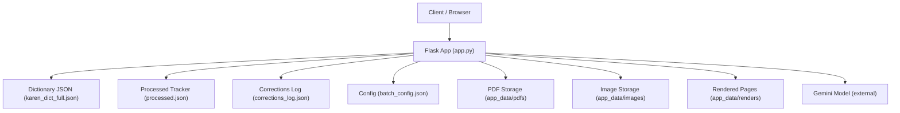
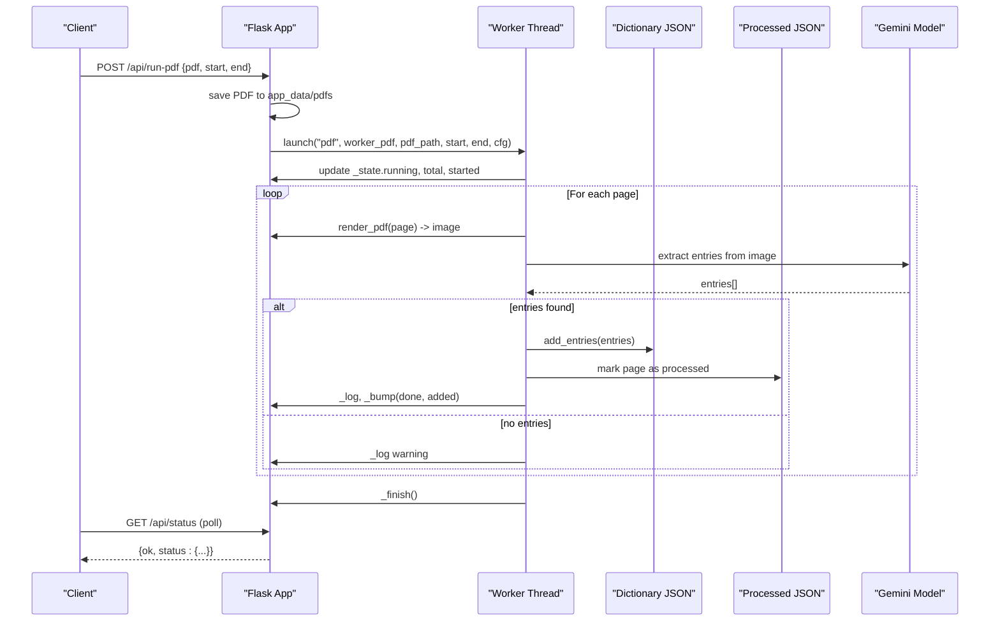
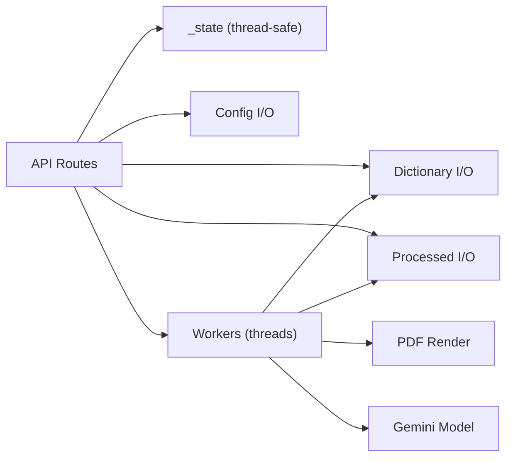

# Main Application APIs

<cite>
**Referenced Files in This Document**
- [app.py](file://app.py)
- [batch_config.json](file://batch_config.json)
</cite>

## Table of Contents
1. [Introduction](#introduction)
2. [Project Structure](#project-structure)
3. [Core Components](#core-components)
4. [Architecture Overview](#architecture-overview)
5. [Detailed Component Analysis](#detailed-component-analysis)
6. [Dependency Analysis](#dependency-analysis)
7. [Performance Considerations](#performance-considerations)
8. [Troubleshooting Guide](#troubleshooting-guide)
9. [Conclusion](#conclusion)

## Introduction
This document provides API documentation for the main Flask application endpoints that power the Sgaw Karen OCR and Dictionary Pipeline. It covers health checks, status monitoring, dictionary entry management, batch processing (PDF and images), file uploads, search functionality, and configuration management. It also documents error handling patterns, background job management, and real-time status polling mechanisms implemented via HTTP polling.

## Project Structure
The application is a single-file Flask app with embedded HTML templates and JSON-based persistence for dictionary entries, processed files, and corrections. Configuration is stored in a JSON file and merged with defaults at runtime.

**Diagram sources**
- [app.py:40-65](file://app.py#L40-L65)
- [app.py:171-233](file://app.py#L171-L233)
- [app.py:536-614](file://app.py#L536-L614)
- [app.py:619-632](file://app.py#L619-L632)
- [app.py:1631-1658](file://app.py#L631-L658)

**Section sources**
- [app.py:17-65](file://app.py#L17-L65)
- [batch_config.json:1-9](file://batch_config.json#L1-L9)

## Core Components
- Health and Status:
  - GET /api/health: Returns service health, model info, and dictionary size.
  - GET /api/status: Returns current batch job state and log snapshot.
- Configuration:
  - GET /api/config: Returns current configuration merged with defaults.
  - POST /api/config: Updates configuration; returns updated config.
- Entries:
  - GET /api/entries: Searchable, filterable list of entries with view enrichment.
  - POST /api/entry/<index>: Update an entry by index.
  - DELETE /api/entry/<index>: Delete an entry by index.
  - POST /api/promote/<index>: Promote an entry to headword.
  - POST /api/reanalyze/<index>: Re-analyze an entry using the model.
- Batch Processing:
  - POST /api/run-images: Upload multiple images and start batch extraction.
  - POST /api/run-pdf: Upload a PDF and start page-by-page extraction.
  - POST /api/cancel: Request cancellation of running batch.
  - POST /api/force-reset: Reset stuck batch state.
  - POST /api/import-bootstrap: Import bootstrap files into the dictionary.
- Static Assets:
  - GET /fonts/padauk_reg.ttf: Serves a font file required by the UI.

Authentication:
- No authentication middleware is implemented. All endpoints are publicly accessible.

Rate Limiting:
- No rate limiting middleware is implemented. Clients should implement client-side throttling for polling and batch initiation.

Error Handling:
- Global exception handler returns JSON with ok=false, error message, and truncated traceback on unhandled exceptions.
- Route-level validation returns 400 with ok=false when inputs are invalid (e.g., missing files).

Background Jobs:
- Batch jobs run in daemon threads. A shared in-memory state tracks progress, logs, and control flags.
- Real-time status is exposed via GET /api/status and polled by clients.

**Section sources**
- [app.py:22-30](file://app.py#L22-L30)
- [app.py:1515-1537](file://app.py#L1515-L1537)
- [app.py:1540-1610](file://app.py#L1540-L1610)
- [app.py:1613-1658](file://app.py#L1613-L1658)
- [app.py:518-530](file://app.py#L518-L530)
- [app.py:723-729](file://app.py#L723-L729)

## Architecture Overview
The API exposes RESTful endpoints backed by JSON storage and optional external model calls. Batch operations render PDFs to images and extract dictionary entries from images or pages using a model. Progress and logs are tracked in memory and exposed via status polling.

**Diagram sources**
- [app.py:619-632](file://app.py#L619-L632)
- [app.py:678-720](file://app.py#L678-L720)
- [app.py:723-729](file://app.py#L723-L729)
- [app.py:1648-1658](file://app.py#L1648-L1658)
- [app.py:1528-1530](file://app.py#L1528-L1530)

## Detailed Component Analysis

### Health Check
- Method: GET
- URL: /api/health
- Authentication: None
- Response Schema:
  - ok: boolean
  - key_ok: boolean (whether model API key is present)
  - model: string (model name)
  - entries: integer (current dictionary size)
  - dictionary_file: string (filename)
- Example Response:
  - {"ok": true, "key_ok": true, "model": "gemini-2.5-flash", "entries": 1234, "dictionary_file": "karen_dict_full.json"}
- Error Handling:
  - Unhandled exceptions return 500 with JSON error payload.

**Section sources**
- [app.py:1515-1525](file://app.py#L1515-L1525)
- [app.py:22-30](file://app.py#L22-L30)

### Status Monitoring
- Method: GET
- URL: /api/status
- Authentication: None
- Purpose: Poll for batch job progress and logs.
- Response Schema:
  - ok: boolean
  - status: object
    - running: boolean
    - cancel: boolean
    - mode: string ("images" | "pdf")
    - file: string (last file being processed)
    - page: string (current page number for PDF runs)
    - done: integer (items completed)
    - total: integer (total items)
    - entries_added: integer (cumulative entries added)
    - started: string (ISO timestamp)
    - finished: string (ISO timestamp or empty)
    - error: string (error message if any)
    - log: array of strings (recent log lines)
- Example Response:
  - {"ok": true, "status": {"running": true, "mode": "pdf", "file": "dict.pdf", "page": "3", "done": 3, "total": 10, "entries_added": 42, "started": "2024-01-01T12:00:00", "finished": "", "error": "", "log": ["..."]}}
- Notes:
  - Clients should poll periodically (e.g., every 1–2 seconds) while a job is running.

**Section sources**
- [app.py:1528-1530](file://app.py#L1528-L1530)
- [app.py:96-110](file://app.py#L96-L110)
- [app.py:129-169](file://app.py#L129-L169)

### Configuration Management
- Methods: GET, POST
- URL: /api/config
- Authentication: None
- Behavior:
  - GET: Returns current configuration merged with defaults.
  - POST: Accepts JSON body to update configuration; returns updated config.
- Config Keys:
  - pdf_pages_per_batch: integer
  - images_per_batch: integer
  - delay_seconds: number (float)
  - page_offset: integer
  - render_dpi: integer
  - skip_processed: boolean
  - auto_import_bootstrap: boolean
- Example Request (POST):
  - Body: {"delay_seconds": 1.5, "render_dpi": 200}
- Example Response:
  - {"ok": true, "config": {"pdf_pages_per_batch": 10, "images_per_batch": 50, "delay_seconds": 1.5, "page_offset": 0, "render_dpi": 200, "skip_processed": true, "auto_import_bootstrap": true}}
- Notes:
  - Defaults are applied if keys are missing.

**Section sources**
- [app.py:57-65](file://app.py#L57-L65)
- [app.py:198-210](file://app.py#L198-L210)
- [app.py:1533-1537](file://app.py#L1533-L1537)
- [batch_config.json:1-9](file://batch_config.json#L1-L9)

### Dictionary Entry Management
- List/Search Entries
  - Method: GET
  - URL: /api/entries
  - Query Parameters:
    - q: string (search text or "#<index>" to fetch a specific entry)
    - page: string (filter by page number)
    - flagged: string ("1" to show only flagged entries)
  - Response Schema:
    - ok: boolean
    - entries: array of view-enriched entries (up to 200)
    - total: integer (total entries in dictionary)
    - shown: integer (number of entries returned)
    - correction_count: integer (number of recorded corrections)
  - Example Request:
    - GET /api/entries?q=example&page=5&flagged=1
  - Example Response:
    - {"ok": true, "entries": [...], "total": 1234, "shown": 200, "correction_count": 12}
- Create/Update Entry
  - Method: POST
  - URL: /api/entry/<index>
  - Authentication: None
  - Request Schema:
    - karen: string
    - definitions: array of strings
  - Response Schema:
    - ok: boolean
    - entry: normalized entry object including index
  - Example Request:
    - POST /api/entry/42
    - Body: {"karen": "က", "definitions": ["definition text"]}
  - Example Response:
    - {"ok": true, "entry": {"karen": "က", "definitions": ["definition text"], "index": 42, ...}}
- Delete Entry
  - Method: DELETE
  - URL: /api/entry/<index>
  - Response Schema:
    - ok: boolean
    - deleted: integer (index)
  - Example Response:
    - {"ok": true, "deleted": 42}
- Promote Entry
  - Method: POST
  - URL: /api/promote/<index>
  - Response Schema:
    - ok: boolean
    - index: integer
  - Example Response:
    - {"ok": true, "index": 42}
- Re-analyze Entry
  - Method: POST
  - URL: /api/reanalyze/<index>
  - Response Schema:
    - ok: boolean
    - entry: updated entry with analysis fields
  - Example Response:
    - {"ok": true, "entry": {"entry_type": "headword", "analysis": {...}, "index": 42}}

Notes:
- Entries are normalized to a consistent schema before saving.
- Changes are recorded in the corrections log for auditability.

**Section sources**
- [app.py:1494-1507](file://app.py#L1494-L1507)
- [app.py:1540-1610](file://app.py#L1540-L1610)
- [app.py:236-243](file://app.py#L236-L243)

### Batch Processing: Image Upload and Extraction
- Method: POST
- URL: /api/run-images
- Authentication: None
- Request:
  - Content-Type: multipart/form-data
  - Field: images (multiple image files)
- Behavior:
  - Saves uploaded images to app_data/images.
  - Launches a background worker to process images sequentially with configurable delay.
  - Skips already processed images if configured.
- Response Schema:
  - ok: boolean
  - queued: integer (number of images queued)
- Example Request:
  - Multipart form with field "images" containing one or more image files.
- Example Response:
  - {"ok": true, "queued": 5}
- Notes:
  - Use GET /api/status to monitor progress.
  - Use POST /api/cancel to request cancellation.

**Section sources**
- [app.py:638-676](file://app.py#L638-L676)
- [app.py:723-729](file://app.py#L723-L729)
- [app.py:1631-1645](file://app.py#L1631-L1645)
- [app.py:1528-1530](file://app.py#L1528-L1530)
- [app.py:1618-1622](file://app.py#L1618-L1622)

### Batch Processing: PDF Upload and Page Rendering
- Method: POST
- URL: /api/run-pdf
- Authentication: None
- Request:
  - Content-Type: multipart/form-data
  - Field: pdf (single PDF file)
  - Fields: start (integer), end (integer)
- Behavior:
  - Saves PDF to app_data/pdfs.
  - Renders specified pages to images and processes each page through the model.
  - Tracks per-page progress and skips pages if already processed.
- Response Schema:
  - ok: boolean
  - queued: object with pdf filename and page range
- Example Request:
  - Multipart form with field "pdf" and fields "start" and "end".
- Example Response:
  - {"ok": true, "queued": {"pdf": "dict.pdf", "start": 1, "end": 10}}
- Notes:
  - Use GET /api/status to monitor page-by-page progress.
  - Use POST /api/cancel to request cancellation.

**Section sources**
- [app.py:619-632](file://app.py#L619-L632)
- [app.py:678-720](file://app.py#L678-L720)
- [app.py:723-729](file://app.py#L723-L729)
- [app.py:1648-1658](file://app.py#L1648-L1658)
- [app.py:1528-1530](file://app.py#L1528-L1530)
- [app.py:1618-1622](file://app.py#L1618-L1622)

### Control Endpoints
- Cancel Batch
  - Method: POST
  - URL: /api/cancel
  - Response: {"ok": true}
  - Behavior: Sets cancel flag checked by workers between tasks.
- Force Reset
  - Method: POST
  - URL: /api/force-reset
  - Response: {"ok": true}
  - Behavior: Resets running state to allow starting new batches.
- Import Bootstrap
  - Method: POST
  - URL: /api/import-bootstrap
  - Response: {"ok": true, "added": integer}
  - Behavior: Imports matching bootstrap files into the dictionary based on patterns.

**Section sources**
- [app.py:1613-1628](file://app.py#L1613-L1628)
- [app.py:486-512](file://app.py#L486-L512)

### Font Asset
- Method: GET
- URL: /fonts/padauk_reg.ttf
- Purpose: Serves a TTF font used by the embedded UI.
- Response: Binary font content or 404 if not found.

**Section sources**
- [app.py:518-530](file://app.py#L518-L530)

## Dependency Analysis
- External Dependencies:
  - Google GenAI client for model interactions.
  - PyMuPDF (fitz) for PDF rendering.
- Internal Dependencies:
  - JSON files for dictionary, processed tracking, and corrections.
  - In-memory state protected by a threading lock for concurrent access.
- Coupling:
  - Batch workers depend on configuration and file system paths.
  - Entry normalization and view building are reused across endpoints.

**Diagram sources**
- [app.py:96-110](file://app.py#L96-L110)
- [app.py:171-233](file://app.py#L171-L233)
- [app.py:619-632](file://app.py#L619-L632)
- [app.py:638-720](file://app.py#L638-L720)
- [app.py:536-614](file://app.py#L536-L614)

**Section sources**
- [app.py:96-110](file://app.py#L96-L110)
- [app.py:171-233](file://app.py#L171-L233)
- [app.py:536-614](file://app.py#L536-L614)
- [app.py:619-720](file://app.py#L619-L720)

## Performance Considerations
- Background Processing:
  - Batch jobs run in daemon threads to avoid blocking requests.
  - Use delay_seconds to pace model calls and reduce load.
- Skip Processed:
  - Enable skip_processed to avoid reprocessing identical files/pages.
- DPI and Rendering:
  - Adjust render_dpi to balance quality and speed for PDF rendering.
- Pagination and Limits:
  - Entry listing caps results at 200 items to limit payload size.
- Concurrency:
  - Only one batch can run at a time; force reset may be needed if stuck.
- Client Throttling:
  - Implement client-side delays when polling /api/status to avoid excessive requests.

[No sources needed since this section provides general guidance]

## Troubleshooting Guide
Common Issues and Resolutions:
- Missing Model Key:
  - Health endpoint reports key_ok=false. Set GEMINI_API_KEY environment variable.
- No Files Uploaded:
  - Batch endpoints return 400 with ok=false when required files are missing. Ensure correct multipart fields.
- Stuck Batch:
  - Use POST /api/force-reset to clear running state, then restart.
- Cancellation Not Taking Effect:
  - Workers check cancel flag between tasks; ensure enough delay or wait for next iteration.
- Errors During Processing:
  - Check /api/status log for detailed messages and stack traces.

Error Patterns:
- Global Exception Handler:
  - Returns 500 with JSON payload including error and truncated traceback.
- Validation Errors:
  - Return 400 with ok=false and descriptive error message.

**Section sources**
- [app.py:22-30](file://app.py#L22-L30)
- [app.py:1515-1525](file://app.py#L1515-L1525)
- [app.py:1631-1658](file://app.py#L1631-L1658)
- [app.py:1618-1628](file://app.py#L1618-L1628)
- [app.py:1528-1530](file://app.py#L1528-L1530)

## Conclusion
The Flask application provides a comprehensive set of APIs for managing dictionary entries, performing batch OCR on images and PDFs, and monitoring progress via polling. While it lacks authentication and rate limiting, it offers robust background job management and clear error responses. Clients should implement safe polling intervals and handle errors gracefully. Configuration options allow tuning performance and behavior for different environments.

[No sources needed since this section summarizes without analyzing specific files]