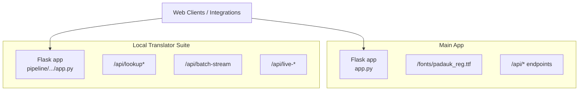
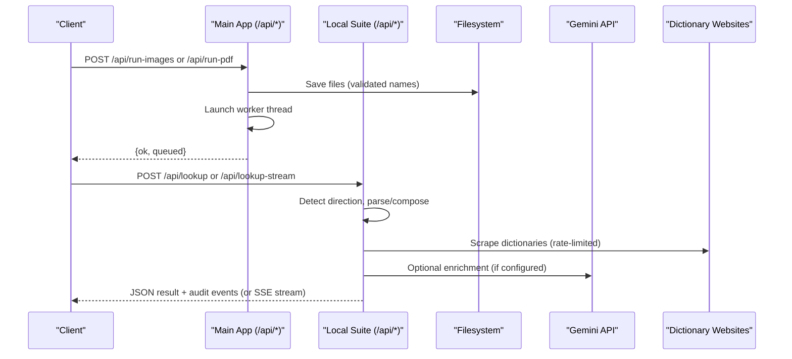
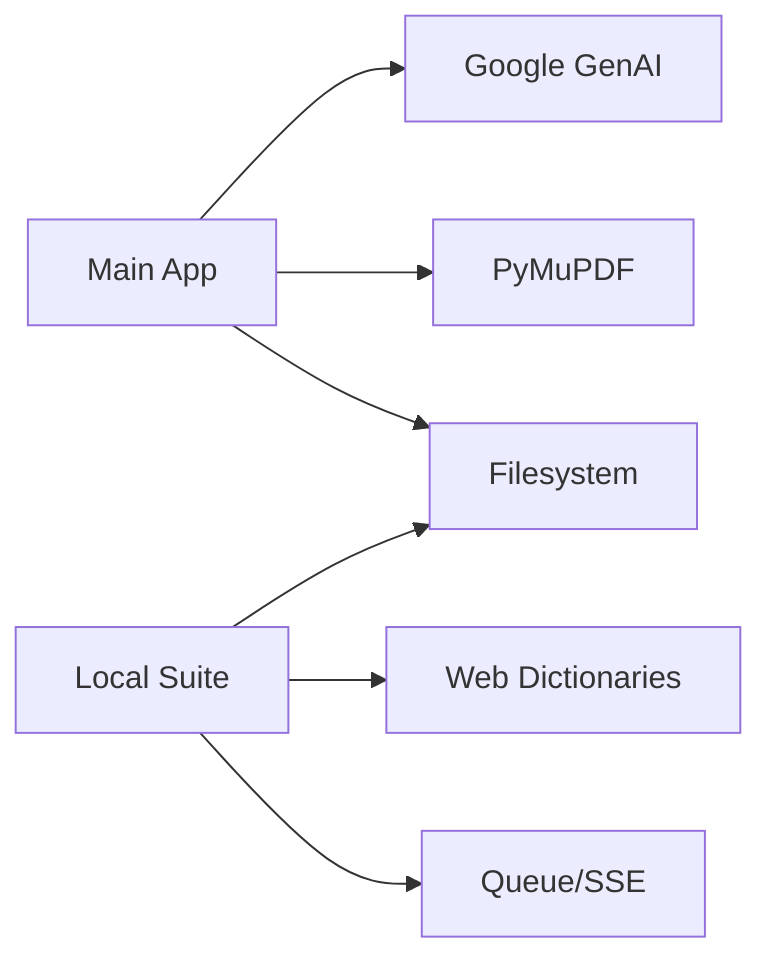

# Shared Endpoints and Utilities

<cite>
**Referenced Files in This Document**
- [app.py](file://app.py)
- [local_translator_suite/app.py](file://pipeline/dictionary_processing/local_translator_suite/app.py)
</cite>

## Table of Contents
1. [Introduction](#introduction)
2. [Project Structure](#project-structure)
3. [Core Components](#core-components)
4. [Architecture Overview](#architecture-overview)
5. [Detailed Component Analysis](#detailed-component-analysis)
6. [Dependency Analysis](#dependency-analysis)
7. [Performance Considerations](#performance-considerations)
8. [Troubleshooting Guide](#troubleshooting-guide)
9. [Conclusion](#conclusion)
10. [Appendices](#appendices)

## Introduction
This document describes shared utility endpoints and common functionality used across the main application and the local translator suite. It focuses on:
- Font serving endpoints for web rendering
- File type validation utilities and MIME type detection
- Common data transformation helpers
- Batch processing and streaming endpoints
- Error handling patterns, security considerations for file access, and performance optimization techniques
- CORS policies and content security headers guidance for web-based integrations

The goal is to provide clear API references, examples, and best practices for integrating with these services.

## Project Structure
Two Flask applications expose shared capabilities:
- Main application (OCR dictionary workbench): provides font serving, health/status/config, entry management, batch image/PDF processing, and reanalysis endpoints.
- Local translator suite: provides translation lookup, reverse parsing, batch/streaming processing, live state, attempts, cache, and seed plan endpoints.

**Diagram sources**
- [app.py:518-530](file://app.py#L518-L530)
- [app.py:1515-1658](file://app.py#L1515-L1658)
- [local_translator_suite/app.py:1926-2006](file://pipeline/dictionary_processing/local_translator_suite/app.py#L1926-L2006)

**Section sources**
- [app.py:17-55](file://app.py#L17-L55)
- [local_translator_suite/app.py:1919-1923](file://pipeline/dictionary_processing/local_translator_suite/app.py#L1919-L1923)

## Core Components
- Font serving: Serves a TTF font for web rendering via a dedicated route.
- File upload validation: Validates accepted file types and sanitizes filenames before saving.
- MIME type detection: Maps file extensions to MIME types for OCR pipeline inputs.
- Data transformation: Normalizes entries, merges analysis, deduplicates values, and builds view-ready structures.
- Batch processing: Queues background workers for images and PDFs; returns status and logs.
- Streaming APIs: Server-sent events for real-time progress during lookups and batch runs.
- Health and diagnostics: Health checks, status, configuration, attempts log, and cache inspection.

**Section sources**
- [app.py:251-265](file://app.py#L251-L265)
- [app.py:268-326](file://app.py#L268-L326)
- [app.py:638-728](file://app.py#L638-L728)
- [local_translator_suite/app.py:1887-1916](file://pipeline/dictionary_processing/local_translator_suite/app.py#L1887-L1916)

## Architecture Overview
The system exposes REST endpoints for client apps and integrates with external AI and web dictionaries. The main app handles OCR extraction and entry management; the local translator suite performs translation and reverse parsing with caching and streaming feedback.

**Diagram sources**
- [app.py:1631-1658](file://app.py#L1631-L1658)
- [app.py:638-728](file://app.py#L638-L728)
- [local_translator_suite/app.py:1931-1945](file://pipeline/dictionary_processing/local_translator_suite/app.py#L1931-L1945)
- [local_translator_suite/app.py:689-876](file://pipeline/dictionary_processing/local_translator_suite/app.py#L689-L876)

## Detailed Component Analysis

### Font Serving Endpoint
- Purpose: Serve a TTF font required by the UI to render Karen Unicode correctly.
- Route: GET /fonts/padauk_reg.ttf
- Behavior:
  - Resolves font path from environment variable or fallback locations.
  - Returns the file with appropriate MIME type if found; otherwise returns 404.
- Security note: Ensure only trusted fonts are served and restrict access if needed.

Example usage:
- Request: GET /fonts/padauk_reg.ttf
- Response: Binary TTF content with correct MIME type or 404 if missing.

**Section sources**
- [app.py:91-92](file://app.py#L91-L92)
- [app.py:518-530](file://app.py#L518-L530)

### File Upload Validation and Safe Naming
- Accepted image types: png, jpg, jpeg, webp, bmp, tif, tiff.
- Filename sanitization: Strips unsafe characters and ensures unique names.
- PDF upload: Accepts .pdf files; validates presence and saves safely.
- Validation responses:
  - Missing files return error JSON with ok=false and descriptive message.

Examples:
- POST /api/run-images with multiple images
  - Success: {ok: true, queued: N}
  - Failure: {ok: false, error: "No image files uploaded"}
- POST /api/run-pdf with a PDF and optional start/end page range
  - Success: {ok: true, queued: {"pdf": "...", "start": ..., "end": ...}}
  - Failure: {ok: false, error: "No PDF uploaded"}

**Section sources**
- [app.py:245-265](file://app.py#L245-L265)
- [app.py:1631-1658](file://app.py#L1631-L1658)

### MIME Type Detection Utility
- Functionality: Maps file extension to MIME type for OCR input handling.
- Supported mappings include common image formats; defaults to a safe image MIME type when unknown.
- Usage: Used internally to pass correct MIME types to OCR model calls.

Example behavior:
- Input: ".png" -> Output: "image/png"
- Input: ".jpg" -> Output: "image/jpeg"
- Unknown extension -> Output: default image MIME type

**Section sources**
- [app.py:251-261](file://app.py#L251-L261)

### Common Data Transformation Endpoints
- Entry normalization and view building:
  - Normalize entries to consistent structure with fields like karen, definitions, entry_type, analysis, timestamps.
  - Build view entries with linked definitions and tabs for examples/headwords/related items.
- Search and filtering:
  - Query by text, page number, or flagged entries; limited to top results for performance.
- Entry CRUD:
  - Update or delete entries by index; promote entries to headword; reanalyze entries using AI.

Examples:
- GET /api/entries?q=...&page=...&flagged=1
  - Response includes entries array, total count, shown count, correction count.
- POST /api/entry/<index>
  - Updates entry fields; returns updated entry with index.
- DELETE /api/entry/<index>
  - Deletes entry; returns deleted index.
- POST /api/promote/<index>
  - Promotes entry to headword; returns success.
- POST /api/reanalyze/<index>
  - Re-analyzes entry; returns updated entry.

**Section sources**
- [app.py:268-326](file://app.py#L268-L326)
- [app.py:1494-1610](file://app.py#L1494-L1610)

### Batch Processing Endpoints
- Image batch:
  - POST /api/run-images: Accepts multiple images, validates, saves, queues worker, returns queued count.
- PDF batch:
  - POST /api/run-pdf: Accepts PDF with optional page range, saves, queues worker, returns queued metadata.
- Status and control:
  - GET /api/status: Returns current batch state, progress, logs.
  - POST /api/cancel: Signals cancellation to running worker.
  - POST /api/force-reset: Resets stuck state.

Worker behavior:
- Renders PDF pages to images at configurable DPI.
- Extracts entries via OCR pipeline with rate limiting and skip logic based on processed tracking.
- Records corrections and updates processed lists to avoid reprocessing.

**Section sources**
- [app.py:619-728](file://app.py#L619-L728)
- [app.py:1528-1628](file://app.py#L1528-L1628)

### Streaming Lookup and Batch APIs
- Lookup:
  - POST /api/lookup: Returns translation result and audit events.
  - POST /api/lookup-stream: Streams events via Server-Sent Events for real-time progress.
- Batch processing:
  - POST /api/batch-stream: Processes uploaded or provided text content line-by-line, streaming events.
  - POST /api/live-file-stream: Runs against translations_website.txt with live write and stop support.
  - POST /api/live-stop: Stops a live run.
  - GET /api/live-state: Returns current live state snapshot.

Event stream format:
- Each event is a JSON payload wrapped in SSE data frames.
- Includes stages like normalize, detect, dictionary, match, fallback, parse_candidate, word_thought, thought_process, mini_lm, internet_search, compose, batch_line, batch_done.

**Section sources**
- [local_translator_suite/app.py:1931-1988](file://pipeline/dictionary_processing/local_translator_suite/app.py#L1931-L1988)
- [local_translator_suite/app.py:1887-1916](file://pipeline/dictionary_processing/local_translator_suite/app.py#L1887-L1916)

### Health, Configuration, Cache, Attempts, Seed Plan
- Health:
  - GET /api/health: Reports Gemini key presence, model, entry count, dictionary file name.
- Configuration:
  - GET/POST /api/config: Read or update batch processing configuration.
- Cache:
  - GET /api/cache: Inspects local translation cache size and contents.
- Attempts:
  - GET /api/attempts?limit=N: Retrieves recent lookup attempts with status and metadata.
- Seed plan:
  - GET /api/mini-lm-seed-plan: Returns target totals and bands for mini LM seeding.

**Section sources**
- [app.py:1515-1537](file://app.py#L1515-L1537)
- [local_translator_suite/app.py:1991-2006](file://pipeline/dictionary_processing/local_translator_suite/app.py#L1991-L2006)

### Error Handling Patterns
- Global exception handler:
  - Returns JSON with ok=false, error message, and truncated traceback for debugging.
- 404 handler:
  - Returns JSON with ok=false and route not found details.
- Validation errors:
  - File upload endpoints return structured error responses when inputs are missing or invalid.
- Worker errors:
  - Workers log exceptions and continue or finish gracefully; status reflects errors.

Examples:
- Any unhandled exception: {ok: false, error: "...", trace: "..."}
- Missing file upload: {ok: false, error: "No image files uploaded"}

**Section sources**
- [app.py:22-30](file://app.py#L22-L30)
- [app.py:1631-1658](file://app.py#L1631-L1658)

### Security Considerations for File Access
- Filename sanitization:
  - Sanitizes uploaded filenames to prevent directory traversal and injection.
- Path resolution:
  - Uses absolute paths within controlled directories (images, PDFs, renders).
- MIME validation:
  - Relies on extension mapping; consider additional content validation for stricter security.
- Access controls:
  - Current implementation serves fonts publicly; restrict routes behind authentication if exposing externally.

Recommendations:
- Add authentication middleware for sensitive endpoints.
- Validate file content beyond extension (e.g., magic bytes).
- Limit upload sizes and enforce quotas.
- Serve static assets through a secure CDN or hardened server.

**Section sources**
- [app.py:245-265](file://app.py#L245-L265)
- [app.py:518-530](file://app.py#L518-L530)

### Performance Optimization Techniques
- Skip processed items:
  - Tracks processed images and PDF pages to avoid reprocessing.
- Rate limiting:
  - Delays between requests to external websites to respect rate limits.
- Streaming:
  - SSE streams reduce latency and improve UX for long-running tasks.
- Caching:
  - Local JSON cache stores translation results to minimize redundant lookups.
- Configurable DPI and delays:
  - Adjust render DPI and delay seconds to balance quality and throughput.

**Section sources**
- [app.py:638-728](file://app.py#L638-L728)
- [local_translator_suite/app.py:689-711](file://pipeline/dictionary_processing/local_translator_suite/app.py#L689-L711)
- [local_translator_suite/app.py:1991-2001](file://pipeline/dictionary_processing/local_translator_suite/app.py#L1991-L2001)

### CORS Policies and Content Security Headers
Current codebase does not explicitly configure CORS or content security headers. For web-based integrations:
- Enable CORS if clients originate from different domains:
  - Use a CORS extension or middleware to allow specific origins, methods, and headers.
- Set content security headers:
  - Configure CSP, X-Content-Type-Options, X-Frame-Options, and Referrer-Policy to mitigate XSS and clickjacking.
- Restrict font serving:
  - If fonts are sensitive, add authentication or referer checks.

Guidance:
- Allow only trusted origins for API endpoints.
- Use HTTPS in production.
- Log and monitor cross-origin requests.

[No sources needed since this section provides general guidance]

## Dependency Analysis
Key dependencies and interactions:
- Main app depends on Flask, PyMuPDF (fitz), Google GenAI, and filesystem I/O.
- Local translator suite depends on Flask, requests, BeautifulSoup, and filesystem I/O.
- External integrations:
  - Gemini API for OCR extraction and reanalysis.
  - Dictionary websites for translation lookup.

**Diagram sources**
- [app.py:12-15](file://app.py#L12-L15)
- [app.py:619-632](file://app.py#L619-L632)
- [local_translator_suite/app.py:15-17](file://pipeline/dictionary_processing/local_translator_suite/app.py#L15-L17)
- [local_translator_suite/app.py:689-876](file://pipeline/dictionary_processing/local_translator_suite/app.py#L689-L876)

**Section sources**
- [app.py:12-15](file://app.py#L12-L15)
- [local_translator_suite/app.py:15-17](file://pipeline/dictionary_processing/local_translator_suite/app.py#L15-L17)

## Performance Considerations
- Batch processing:
  - Use skip_processed to avoid reprocessing large datasets.
  - Tune delay_seconds and render_dpi for optimal throughput.
- Streaming:
  - Prefer /api/lookup-stream and /api/batch-stream for responsive UIs.
- Caching:
  - Leverage local cache to reduce network calls.
- Resource limits:
  - Monitor memory usage during PDF rendering and OCR extraction.
- Concurrency:
  - Workers run in threads; ensure thread-safe operations and avoid blocking calls.

[No sources needed since this section provides general guidance]

## Troubleshooting Guide
Common issues and resolutions:
- No Gemini key:
  - Health endpoint indicates missing key; set GEMINI_API_KEY environment variable.
- Stuck batch:
  - Use /api/force-reset to reset state; check logs for errors.
- Missing files:
  - Ensure uploads contain valid files; check accepted types and filename sanitization.
- Web scraping failures:
  - Check rate limits and timeouts; review attempts log for errors.
- Streaming interruptions:
  - Verify SSE support in client; handle connection drops and reconnect.

**Section sources**
- [app.py:1515-1525](file://app.py#L1515-L1525)
- [app.py:1618-1628](file://app.py#L1618-L1628)
- [local_translator_suite/app.py:1991-2001](file://pipeline/dictionary_processing/local_translator_suite/app.py#L1991-L2001)

## Conclusion
The shared endpoints and utilities provide robust font serving, file validation, MIME detection, data transformation, and streaming APIs for both OCR and translation workflows. By following the recommended security and performance practices, integrations can reliably consume these services while maintaining safety and efficiency.

[No sources needed since this section summarizes without analyzing specific files]

## Appendices

### API Reference Summary
- Font serving:
  - GET /fonts/padauk_reg.ttf
- Health and status:
  - GET /api/health
  - GET /api/status
  - GET/POST /api/config
- Entries:
  - GET /api/entries
  - POST /api/entry/<index>
  - DELETE /api/entry/<index>
  - POST /api/promote/<index>
  - POST /api/reanalyze/<index>
- Batch processing:
  - POST /api/run-images
  - POST /api/run-pdf
  - POST /api/cancel
  - POST /api/force-reset
- Translation and streaming:
  - POST /api/lookup
  - POST /api/lookup-stream
  - POST /api/batch-stream
  - POST /api/live-file-stream
  - POST /api/live-stop
  - GET /api/live-state
- Diagnostics:
  - GET /api/attempts
  - GET /api/cache
  - GET /api/mini-lm-seed-plan

**Section sources**
- [app.py:518-530](file://app.py#L518-L530)
- [app.py:1515-1658](file://app.py#L1515-L1658)
- [local_translator_suite/app.py:1931-2006](file://pipeline/dictionary_processing/local_translator_suite/app.py#L1931-L2006)