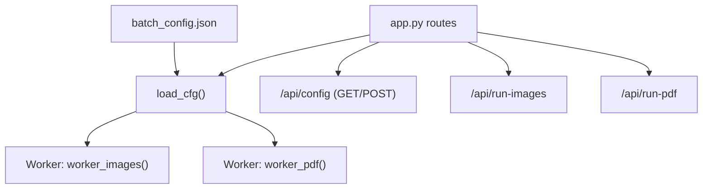
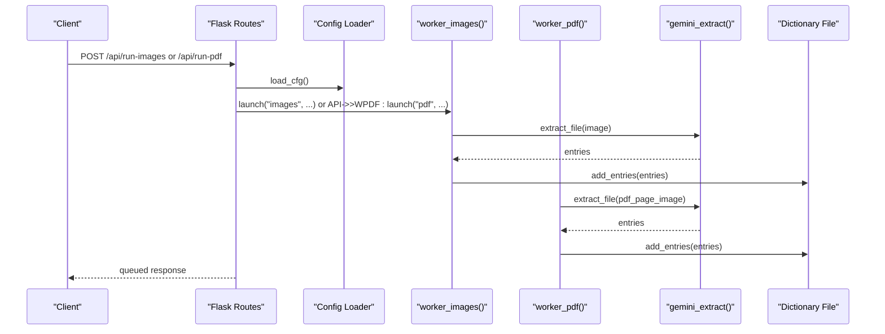
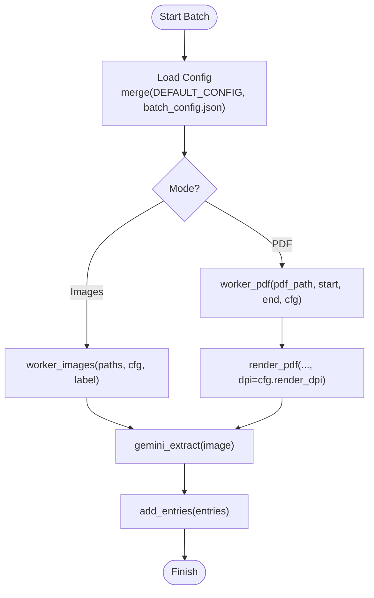

# Batch Processing Configuration

<cite>
**Referenced Files in This Document**
- [batch_config.json](file://batch_config.json)
- [app.py](file://app.py)
</cite>

## Table of Contents
1. [Introduction](#introduction)
2. [Project Structure](#project-structure)
3. [Core Components](#core-components)
4. [Architecture Overview](#architecture-overview)
5. [Detailed Component Analysis](#detailed-component-analysis)
6. [Dependency Analysis](#dependency-analysis)
7. [Performance Considerations](#performance-considerations)
8. [Troubleshooting Guide](#troubleshooting-guide)
9. [Conclusion](#conclusion)
10. [Appendices](#appendices)

## Introduction
This document explains the batch processing configuration system used by the OCR dictionary workbench. It focuses on how batch_config.json controls batch sizes, delays, rendering quality, and skip behavior; how these settings affect OCR processing, dictionary operations, and resource allocation; and how to update configuration at runtime via a REST API. It also provides example profiles for development, testing, and production use cases.

## Project Structure
The batch processing configuration is defined in a JSON file and consumed by the application’s worker threads that process images and PDFs through OCR. The application merges user-provided configuration with built-in defaults and exposes an API to read or update configuration at runtime.

**Diagram sources**
- [app.py:57-65](file://app.py#L57-L65)
- [app.py:198-210](file://app.py#L198-L210)
- [app.py:638-720](file://app.py#L638-L720)
- [app.py:1533-1537](file://app.py#L1533-L1537)
- [app.py:1631-1658](file://app.py#L1631-L1658)

**Section sources**
- [batch_config.json:1-9](file://batch_config.json#L1-L9)
- [app.py:57-65](file://app.py#L57-L65)
- [app.py:198-210](file://app.py#L198-L210)
- [app.py:1533-1537](file://app.py#L1533-L1537)
- [app.py:1631-1658](file://app.py#L1631-L1658)

## Core Components
- Configuration storage and defaults:
  - Default values are defined in the application and merged with any user-provided values from batch_config.json.
  - Configuration is loaded into memory each time it is needed and can be updated via API.
- Worker threads:
  - Two workers handle batch processing: one for images, one for PDF pages.
  - Workers read current configuration at launch time and apply settings such as delay, DPI, page offset, and skip behavior.
- Runtime configuration:
  - GET /api/config returns the effective configuration (defaults merged with saved values).
  - POST /api/config updates the saved configuration and returns the new effective configuration.

Key behaviors:
- Delay between items: reduces API rate limits pressure and smooths throughput.
- Render DPI: affects image quality and OCR accuracy vs. memory/CPU usage.
- Page offset: shifts page numbering for extracted entries.
- Skip processed: avoids reprocessing already handled files/pages.
- Auto import bootstrap: automatically imports initial dictionary data when enabled.

**Section sources**
- [app.py:57-65](file://app.py#L57-L65)
- [app.py:198-210](file://app.py#L198-L210)
- [app.py:638-720](file://app.py#L638-L720)
- [app.py:1533-1537](file://app.py#L1533-L1537)

## Architecture Overview
Batch processing is orchestrated by Flask routes that start background threads. Each thread reads the current configuration and processes items sequentially with optional delays. OCR calls are made per item, and results are appended to the dictionary.

**Diagram sources**
- [app.py:1631-1658](file://app.py#L1631-L1658)
- [app.py:638-720](file://app.py#L638-L720)
- [app.py:536-571](file://app.py#L536-L571)
- [app.py:329-333](file://app.py#L329-L333)

## Detailed Component Analysis

### Configuration Schema and Defaults
The effective configuration is a merge of default values and the contents of batch_config.json. If a key exists in both, the saved value overrides the default.

- pdf_pages_per_batch: Number of PDF pages to render per batch. Used to control chunking during PDF processing.
- images_per_batch: Number of images to process per batch. Used to control chunking during image processing.
- delay_seconds: Sleep interval between processing items to manage API rate limits and reduce resource spikes.
- page_offset: Numeric offset added to page numbers when recording extracted entries.
- render_dpi: Resolution used when rendering PDF pages to images for OCR. Higher DPI improves OCR accuracy but increases memory and CPU usage.
- skip_processed: When true, skips images or PDF pages that have already been processed.
- auto_import_bootstrap: When true, automatically imports bootstrap dictionary files on startup or when triggered.

Defaults are defined in the application and will be applied if keys are missing in batch_config.json.

Acceptable ranges and impact:
- pdf_pages_per_batch: Positive integer. Larger batches increase memory usage during PDF rendering and may slow down progress reporting. Smaller batches improve responsiveness and reduce peak memory.
- images_per_batch: Positive integer. Larger batches increase memory usage for image handling and OCR payloads. Smaller batches reduce memory footprint and allow finer-grained error recovery.
- delay_seconds: Non-negative number. Increasing reduces API rate limit pressure and server load; decreasing increases throughput but risks throttling or errors.
- page_offset: Integer. Impacts only metadata (page numbers recorded with entries).
- render_dpi: Positive integer. Typical range 150–300. Higher values improve OCR accuracy but increase memory and CPU usage significantly. Lower values speed up processing but may reduce accuracy.
- skip_processed: Boolean. Enabling prevents redundant work and speeds up reruns. Disabling forces reprocessing.
- auto_import_bootstrap: Boolean. Enables automatic ingestion of initial dictionary content.

Where these are used:
- Workers read delay_seconds, page_offset, render_dpi, and skip_processed at runtime.
- PDF rendering uses render_dpi to generate images for OCR.
- Auto-import behavior is controlled by auto_import_bootstrap.

**Section sources**
- [batch_config.json:1-9](file://batch_config.json#L1-L9)
- [app.py:57-65](file://app.py#L57-L65)
- [app.py:198-210](file://app.py#L198-L210)
- [app.py:638-720](file://app.py#L638-L720)
- [app.py:487-512](file://app.py#L487-L512)

### Worker Threads and Batch Execution
- Image worker:
  - Iterates over provided image paths.
  - Optionally skips already processed images based on skip_processed and persisted state.
  - Extracts entries via OCR and appends them to the dictionary.
  - Records progress and logs status.
- PDF worker:
  - Renders specified page range to images using render_dpi.
  - For each page, optionally skips if already processed.
  - Extracts entries via OCR and appends them to the dictionary.
  - Records progress and logs status.

Concurrency model:
- Each batch run starts a single daemon thread for the selected mode (images or PDF).
- There is no explicit thread pool; batches are sequential within a run.
- A global lock protects shared state and ensures safe updates to logs and counters.

Error handling:
- Exceptions during OCR or rendering are caught and logged without stopping the entire batch.
- Status includes error messages and timestamps for diagnostics.

Cancellation and reset:
- A cancel flag can be set via API to stop further processing gracefully.
- Force reset clears running state to recover from stuck runs.

**Section sources**
- [app.py:638-720](file://app.py#L638-L720)
- [app.py:723-728](file://app.py#L723-L728)
- [app.py:1618-1628](file://app.py#L1618-L1628)

### OCR Processing and Dictionary Operations
- OCR extraction:
  - Uses a client configured via environment variables to call an external model.
  - Prompts instruct the model to return structured JSON arrays of dictionary entries.
  - Responses are parsed and normalized before being added to the dictionary.
- Dictionary persistence:
  - Entries are appended to a JSON file and saved atomically using a temporary file and rename.
  - Normalization ensures consistent structure and types across entries.
- Reanalysis:
  - Individual entries can be re-analyzed to enrich analysis fields without altering definitions.

Impact of configuration:
- render_dpi influences OCR accuracy by changing input image quality.
- delay_seconds helps avoid API throttling and stabilizes throughput.
- skip_processed avoids duplicate OCR calls for already processed items.

**Section sources**
- [app.py:536-571](file://app.py#L536-L571)
- [app.py:329-333](file://app.py#L329-L333)
- [app.py:1600-1610](file://app.py#L1600-L1610)

### Runtime Configuration Updates and Hot-Reloading
- GET /api/config:
  - Returns the effective configuration (merged defaults + saved values).
- POST /api/config:
  - Accepts a JSON object with configuration keys to update.
  - Merges provided values with defaults and persists the result.
  - Returns the new effective configuration.

Hot-reloading behavior:
- Configuration is read at the time a batch is launched.
- Updating configuration while a batch is running does not change the running worker’s parameters; subsequent runs will use the updated configuration.
- To apply changes immediately to a running batch, restart the batch after updating configuration.

**Section sources**
- [app.py:1533-1537](file://app.py#L1533-L1537)
- [app.py:198-210](file://app.py#L198-L210)
- [app.py:1631-1658](file://app.py#L1631-L1658)

## Dependency Analysis
Configuration flows from the JSON file into the application’s config loader and then into worker functions. Routes trigger batch execution and pass the current configuration to workers.

**Diagram sources**
- [app.py:198-210](file://app.py#L198-L210)
- [app.py:638-720](file://app.py#L638-L720)
- [app.py:536-571](file://app.py#L536-L571)
- [app.py:329-333](file://app.py#L329-L333)

**Section sources**
- [app.py:198-210](file://app.py#L198-L210)
- [app.py:638-720](file://app.py#L638-L720)
- [app.py:536-571](file://app.py#L536-L571)
- [app.py:329-333](file://app.py#L329-L333)

## Performance Considerations
- Throughput vs. accuracy:
  - Increase render_dpi to improve OCR accuracy; expect higher memory and CPU usage.
  - Decrease delay_seconds to increase throughput; risk API throttling or transient errors.
- Memory usage:
  - Larger images_per_batch or pdf_pages_per_batch increase memory consumption due to more concurrent image handling and rendering.
  - Prefer smaller batches on constrained systems.
- Stability:
  - Enable skip_processed to avoid redundant work and reduce load on reruns.
  - Use moderate delay_seconds to stabilize API interactions.
- Startup overhead:
  - auto_import_bootstrap can add initial entries; disable if starting fresh or importing manually.

[No sources needed since this section provides general guidance]

## Troubleshooting Guide
Common issues and remedies:
- No entries extracted:
  - Check OCR client configuration and API key availability.
  - Verify render_dpi is sufficient for the source quality.
  - Ensure delay_seconds is not too low causing rate-limit errors.
- Stuck batch:
  - Use cancel to stop processing and force-reset to clear state.
  - Review logs for errors and retry with adjusted settings.
- Duplicate entries:
  - Disable skip_processed to force reprocessing if necessary.
  - Inspect persisted processed state and clean if needed.

Operational endpoints:
- Cancel batch: POST /api/cancel
- Force reset: POST /api/force-reset
- View status: GET /api/status
- Update config: POST /api/config
- Run images: POST /api/run-images
- Run PDF: POST /api/run-pdf

**Section sources**
- [app.py:1618-1628](file://app.py#L1618-L1628)
- [app.py:1528-1537](file://app.py#L1528-L1537)
- [app.py:1631-1658](file://app.py#L1631-L1658)

## Conclusion
The batch processing configuration system provides fine-grained control over OCR throughput, accuracy, and resource usage. By tuning batch sizes, delays, and rendering DPI, operators can balance performance and reliability across development, testing, and production environments. Runtime configuration updates enable dynamic adjustments without restarting the service, though changes apply to subsequent runs rather than active workers.

[No sources needed since this section summarizes without analyzing specific files]

## Appendices

### Example Configuration Profiles
These profiles illustrate typical settings for different environments. Apply them via POST /api/config or by editing batch_config.json directly.

- Development
  - images_per_batch: small (e.g., 5)
  - pdf_pages_per_batch: small (e.g., 5)
  - delay_seconds: moderate (e.g., 1.5–2.0)
  - render_dpi: medium (e.g., 200)
  - skip_processed: true
  - auto_import_bootstrap: false

- Testing
  - images_per_batch: medium (e.g., 10–20)
  - pdf_pages_per_batch: medium (e.g., 10)
  - delay_seconds: low-moderate (e.g., 1.0–1.5)
  - render_dpi: high (e.g., 220–260)
  - skip_processed: false (to validate full pipeline)
  - auto_import_bootstrap: true (to seed test data)

- Production
  - images_per_batch: tuned to capacity (e.g., 20–50)
  - pdf_pages_per_batch: tuned to capacity (e.g., 10–20)
  - delay_seconds: conservative (e.g., 1.5–3.0)
  - render_dpi: balanced (e.g., 200–220)
  - skip_processed: true
  - auto_import_bootstrap: false (manual import preferred)

Note: Adjust values based on observed API limits, hardware resources, and desired OCR accuracy.

**Section sources**
- [app.py:57-65](file://app.py#L57-L65)
- [app.py:198-210](file://app.py#L198-L210)
- [app.py:638-720](file://app.py#L638-L720)
- [app.py:1533-1537](file://app.py#L1533-L1537)