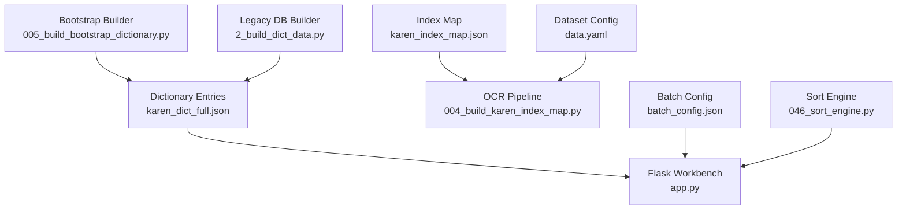
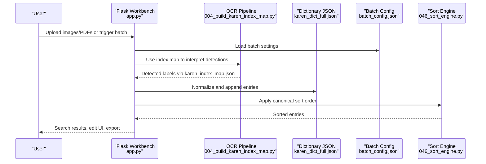
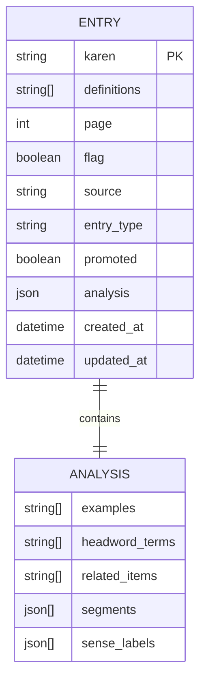
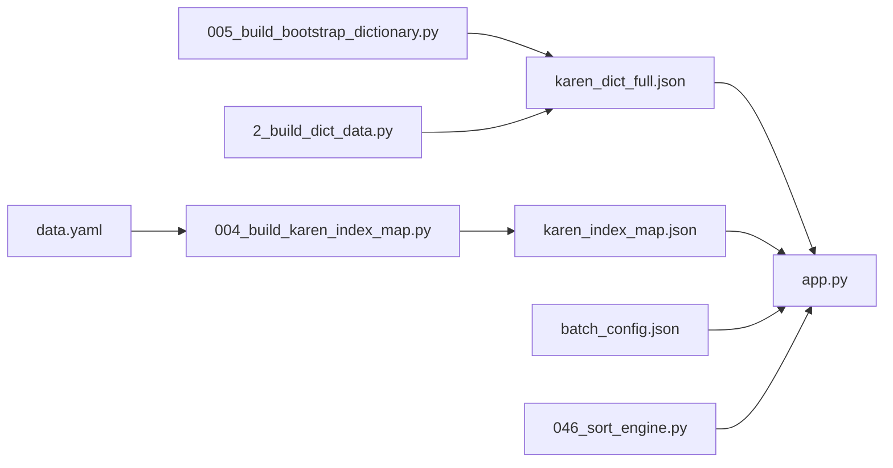
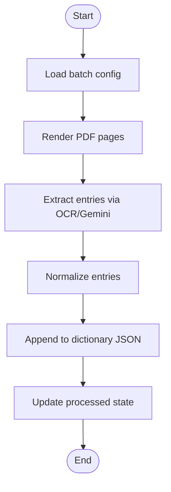
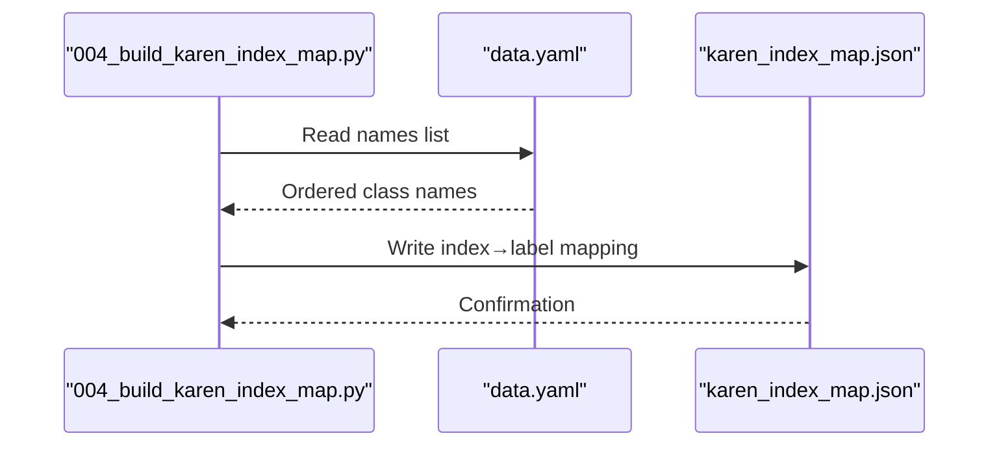

# Data Models and Storage

<cite>
**Referenced Files in This Document**
- [karen_dict_full.json](file://karen_dict_full.json)
- [karen_index_map.json](file://karen_index_map.json)
- [batch_config.json](file://batch_config.json)
- [data.yaml](file://data.yaml)
- [README.md](file://README.md)
- [app.py](file://app.py)
- [2_build_dict_data.py](file://pipeline/dictionary_processing/2_build_dict_data.py)
- [004_build_karen_index_map.py](file://pipeline/ocr_training/004_build_karen_index_map.py)
- [005_build_bootstrap_dictionary.py](file://pipeline/ocr_training/005_build_bootstrap_dictionary.py)
- [046_sort_engine.py](file://pipeline/dictionary_processing/046_sort_engine.py)
</cite>

## Table of Contents
1. Introduction
2. Project Structure
3. Core Components
4. Architecture Overview
5. Detailed Component Analysis
6. Dependency Analysis
7. Performance Considerations
8. Troubleshooting Guide
9. Conclusion
10. Appendices

## Introduction
This document describes the data models and storage design for the Sgaw Karen dictionary system. It explains the dictionary entry schema, index map structure, batch processing configuration, relationships between entities, validation rules, and business constraints. It also covers data access patterns, caching strategies for the index map, performance considerations for large dictionary files, lifecycle management (creation, modification, archival), migration paths, backup strategies, security and privacy requirements, and access control mechanisms.

## Project Structure
The repository contains:
- A JSON-based dictionary dataset with entries containing Karen text, definitions, page references, and analysis metadata.
- An index map that bridges YOLO class indices to human-readable labels used by OCR pipelines.
- Batch processing configuration controlling rendering, batching, and import behavior.
- Scripts that build dictionaries, bootstrap datasets, sort entries according to Sgaw Karen conventions, and provide a Flask workbench for search, editing, and batch operations.

**Diagram sources**
- [karen_dict_full.json:1-800](file://karen_dict_full.json#L1-L800)
- [karen_index_map.json:1-800](file://karen_index_map.json#L1-L800)
- [batch_config.json:1-9](file://batch_config.json#L1-L9)
- [data.yaml:1-800](file://data.yaml#L1-L800)
- [app.py:1-800](file://app.py#L1-L800)
- [004_build_karen_index_map.py:1-54](file://pipeline/ocr_training/004_build_karen_index_map.py#L1-L54)
- [005_build_bootstrap_dictionary.py:1-71](file://pipeline/ocr_training/005_build_bootstrap_dictionary.py#L1-L71)
- [2_build_dict_data.py:1-206](file://pipeline/dictionary_processing/2_build_dict_data.py#L1-L206)
- [046_sort_engine.py:1-313](file://pipeline/dictionary_processing/046_sort_engine.py#L1-L313)

**Section sources**
- [README.md:1-63](file://README.md#L1-L63)

## Core Components
- Dictionary entries: The primary data model is an array of entries where each entry includes Karen text, one or more definitions, optional page reference, flags, source tracking, entry type, promotion status, normalized analysis metadata, and timestamps.
- Index map: A mapping from integer class indices to label strings produced from the dataset configuration; used to bridge OCR outputs to lexical items.
- Batch configuration: Controls PDF/page batching, image batching, delays, DPI, skip logic, and auto-import behavior.
- Sort engine: Implements canonical Sgaw Karen sorting across consonant, tone, vowel, and medial levels, plus safe correction propagation.

Key responsibilities:
- app.py provides persistence helpers, normalization, search, and batch workers that read/write the dictionary file and related state files.
- 004_build_karen_index_map.py generates karen_index_map.json from data.yaml.
- 005_build_bootstrap_dictionary.py creates a bootstrap dictionary to enable pipeline runs before full parsing.
- 2_build_dict_data.py parses legacy PDFs into structured entries and builds indexes.
- 046_sort_engine.py ensures correct ordering and safe corrections.

**Section sources**
- [app.py:189-333](file://app.py#L189-L333)
- [karen_dict_full.json:1-800](file://karen_dict_full.json#L1-L800)
- [karen_index_map.json:1-800](file://karen_index_map.json#L1-L800)
- [batch_config.json:1-9](file://batch_config.json#L1-L9)
- [004_build_karen_index_map.py:1-54](file://pipeline/ocr_training/004_build_karen_index_map.py#L1-L54)
- [005_build_bootstrap_dictionary.py:1-71](file://pipeline/ocr_training/005_build_bootstrap_dictionary.py#L1-L71)
- [2_build_dict_data.py:135-206](file://pipeline/dictionary_processing/2_build_dict_data.py#L135-L206)
- [046_sort_engine.py:139-161](file://pipeline/dictionary_processing/046_sort_engine.py#L139-L161)

## Architecture Overview
The system combines OCR-derived syllable detection with dictionary extraction and review. The index map connects OCR class indices to labels, while the dictionary JSON stores curated entries. The Flask workbench orchestrates batch processing, search, editing, and persistence.

**Diagram sources**
- [app.py:619-729](file://app.py#L619-L729)
- [karen_index_map.json:1-800](file://karen_index_map.json#L1-L800)
- [karen_dict_full.json:1-800](file://karen_dict_full.json#L1-L800)
- [batch_config.json:1-9](file://batch_config.json#L1-L9)
- [004_build_karen_index_map.py:1-54](file://pipeline/ocr_training/004_build_karen_index_map.py#L1-L54)
- [046_sort_engine.py:139-161](file://pipeline/dictionary_processing/046_sort_engine.py#L139-L161)

## Detailed Component Analysis

### Dictionary Entry Schema
The dictionary is stored as a JSON array of entries. Each entry includes:
- karen: string representing the headword in Sgaw Karen Unicode.
- definitions: array of definition strings; may include part-of-speech hints, examples, cross-references, and grammar notes.
- page: optional numeric page reference indicating source location.
- flag: boolean marker for review or attention.
- source: string describing origin (e.g., bootstrap, PDF page, image).
- entry_type: enum-like value constrained to headword, compound, example.
- promoted: boolean to prioritize certain entries during lookups.
- analysis: structured metadata including examples, headword_terms, related_items, segments, and sense_labels.
- created_at / updated_at: ISO timestamps for lifecycle tracking.

Normalization and validation are enforced by the workbench’s norm function, which:
- Ensures karen is a non-empty string.
- Normalizes definitions to a list of non-empty strings.
- Constrains entry_type to allowed values.
- Normalizes analysis fields to consistent structures.
- Sets default timestamps if missing.

Business constraints:
- Definitions must be preserved verbatim per extraction rules; only metadata and analysis are augmented.
- Cross-references within definitions should remain intact and can be linked to other entries when possible.
- Promoted entries and headword-type entries take precedence in lookup prioritization.

Data validation rules:
- entry_type must be one of the allowed set; otherwise defaults to headword.
- analysis fields are normalized to lists even if absent or malformed.
- Duplicate values in analysis arrays are deduplicated.

Primary and foreign key relationships:
- There is no relational database; instead, relationships are represented through:
  - Headword terms in analysis referencing other karen entries.
  - Page references linking entries to source pages.
  - Source field indicating provenance (bootstrap, PDF, image).
  - Promotion and entry_type influencing lookup priority.

**Diagram sources**
- [app.py:268-326](file://app.py#L268-L326)
- [karen_dict_full.json:1-800](file://karen_dict_full.json#L1-L800)

**Section sources**
- [app.py:268-326](file://app.py#L268-L326)
- [karen_dict_full.json:1-800](file://karen_dict_full.json#L1-L800)

### Index Map Structure
The index map is a JSON object mapping integer indices (as strings) to label strings derived from the dataset configuration. It serves as the first bridge in the translation chain from OCR class indices to meaningful labels.

Key characteristics:
- Keys are stringified integers representing YOLO class indices.
- Values are label strings that may include romanized forms or identifiers.
- Generated from data.yaml names list, preserving training order.

Usage:
- OCR outputs class indices; the index map translates them to labels for downstream processing and dictionary enrichment.

Performance considerations:
- The index map is small enough to load into memory at startup for O(1) lookups.
- For very large datasets, consider partitioning or sharding if needed, but current size supports in-memory caching.

**Section sources**
- [karen_index_map.json:1-800](file://karen_index_map.json#L1-L800)
- [004_build_karen_index_map.py:1-54](file://pipeline/ocr_training/004_build_karen_index_map.py#L1-L54)
- [data.yaml:1-800](file://data.yaml#L1-L800)

### Batch Processing Configuration
Batch configuration controls how PDFs and images are processed:
- pdf_pages_per_batch: number of PDF pages to process per batch.
- images_per_batch: number of images to process per batch.
- delay_seconds: pause between processing steps to avoid rate limits or resource exhaustion.
- page_offset: offset applied to page numbers for indexing.
- render_dpi: resolution for PDF rendering.
- skip_processed: whether to skip already processed items based on state tracking.
- auto_import_bootstrap: whether to automatically import bootstrap files into the dictionary.

Lifecycle integration:
- The workbench loads defaults and merges user overrides.
- Processed state tracks images, PDF pages, and imported bootstrap files to avoid reprocessing.

**Section sources**
- [batch_config.json:1-9](file://batch_config.json#L1-L9)
- [app.py:57-65](file://app.py#L57-L65)
- [app.py:213-224](file://app.py#L213-L224)

### Sorting and Correction Logic
The sort engine implements canonical Sgaw Karen dictionary order:
- Levels: consonant → tone → vowel → medial.
- Decomposition identifies components of a syllable string.
- Sort keys produce tuples enabling stable ordering matching the printed dictionary.

Smart correction propagation:
- Detects error types (tone, medial, consonant).
- Applies corrections only within the same linguistic context to avoid false positives.
- Returns counts of fixed and skipped entries for auditability.

**Section sources**
- [046_sort_engine.py:139-161](file://pipeline/dictionary_processing/046_sort_engine.py#L139-L161)
- [046_sort_engine.py:168-252](file://pipeline/dictionary_processing/046_sort_engine.py#L168-L252)

### Data Access Patterns and Caching
- Dictionary loading/saving uses atomic write patterns (write to temp then replace) to prevent corruption.
- Index map is loaded once and cached in memory for fast lookups.
- Processed state is persisted to avoid redundant work.
- Corrections log records changes with timestamps for traceability.

Caching strategy:
- In-memory cache for index map and configuration.
- Optional LRU cache could be added for frequent lookups if latency becomes critical.

**Section sources**
- [app.py:171-186](file://app.py#L171-L186)
- [app.py:213-233](file://app.py#L213-L233)

### Data Lifecycle
Entry creation:
- Bootstrap imports add placeholder entries.
- OCR extraction adds new entries with normalized fields.
- Manual edits update existing entries.

Modification:
- Norm function enforces constraints and normalizes structure.
- Merge functions combine analysis fields without losing original definitions.

Archival:
- Processed state tracks imported bootstrap files to prevent duplicate imports.
- Corrections log preserves history of changes.

**Section sources**
- [app.py:486-512](file://app.py#L486-L512)
- [app.py:297-301](file://app.py#L297-L301)
- [app.py:236-243](file://app.py#L236-L243)

### Data Migration Paths
- Bootstrap builder creates initial entries from dataset classes.
- Legacy DB builder parses PDFs into structured entries and builds indexes.
- Workbench normalizes entries and merges analysis, ensuring compatibility across versions.

Migration recommendations:
- Maintain versioned backups of dictionary JSON.
- Use corrections log to track migrations and validate integrity.
- Re-run bootstrap and legacy parsers when dataset or PDF sources change.

**Section sources**
- [005_build_bootstrap_dictionary.py:1-71](file://pipeline/ocr_training/005_build_bootstrap_dictionary.py#L1-L71)
- [2_build_dict_data.py:135-206](file://pipeline/dictionary_processing/2_build_dict_data.py#L135-L206)
- [app.py:268-326](file://app.py#L268-L326)

### Backup Strategies
- Atomic writes reduce risk of partial updates.
- Periodic snapshots of dictionary JSON and processed state recommended.
- Store corrections log alongside backups for audit trails.

**Section sources**
- [app.py:182-186](file://app.py#L182-L186)
- [app.py:213-233](file://app.py#L213-L233)

### Security and Privacy
- API keys for external services are read from environment variables, not hardcoded.
- Error handlers return sanitized messages to avoid leaking sensitive details.
- Input sanitization is applied to filenames and MIME types.

Access control:
- The workbench exposes routes for search, edit, and batch operations; consider adding authentication in production deployments.
- Environment-based configuration allows restricting features requiring API keys.

**Section sources**
- [app.py:22-30](file://app.py#L22-L30)
- [app.py:36-37](file://app.py#L36-L37)
- [app.py:245-265](file://app.py#L245-L265)

## Dependency Analysis
The system has clear separation between data, processing, and presentation:
- Data layer: JSON files for dictionary, index map, and configuration.
- Processing layer: Scripts for building dictionaries, generating index maps, and sorting.
- Presentation layer: Flask workbench providing UI and APIs.

**Diagram sources**
- [karen_dict_full.json:1-800](file://karen_dict_full.json#L1-L800)
- [karen_index_map.json:1-800](file://karen_index_map.json#L1-L800)
- [batch_config.json:1-9](file://batch_config.json#L1-L9)
- [data.yaml:1-800](file://data.yaml#L1-L800)
- [004_build_karen_index_map.py:1-54](file://pipeline/ocr_training/004_build_karen_index_map.py#L1-L54)
- [005_build_bootstrap_dictionary.py:1-71](file://pipeline/ocr_training/005_build_bootstrap_dictionary.py#L1-L71)
- [2_build_dict_data.py:135-206](file://pipeline/dictionary_processing/2_build_dict_data.py#L135-L206)
- [046_sort_engine.py:139-161](file://pipeline/dictionary_processing/046_sort_engine.py#L139-L161)
- [app.py:189-333](file://app.py#L189-L333)

**Section sources**
- [app.py:189-333](file://app.py#L189-L333)

## Performance Considerations
- Large dictionary files: Loading entire JSON into memory is feasible for current sizes; consider streaming or chunked processing if growth exceeds memory limits.
- Index map: Small and fast to load; keep in memory for O(1) lookups.
- Batch processing: Use configurable delays and batch sizes to balance throughput and stability.
- Sorting: Canonical sort keys ensure efficient ordering; avoid repeated decomposition by caching results if needed.

[No sources needed since this section provides general guidance]

## Troubleshooting Guide
Common issues and resolutions:
- Missing API key: Ensure environment variable is set for batch OCR and re-analysis.
- Corrupted JSON: Atomic writes reduce risk; restore from backups if needed.
- Duplicate entries: Deduplication logic handles analysis fields; verify entry uniqueness by karen text.
- Incorrect sorting: Validate sort engine usage and ensure entries have valid karen text.

**Section sources**
- [app.py:22-30](file://app.py#L22-L30)
- [app.py:171-186](file://app.py#L171-L186)
- [046_sort_engine.py:139-161](file://pipeline/dictionary_processing/046_sort_engine.py#L139-L161)

## Conclusion
The Sgaw Karen dictionary system uses a robust JSON-based data model with clear schemas, validation, and lifecycle management. The index map enables efficient OCR-to-label translation, while the sort engine ensures culturally accurate ordering. The Flask workbench provides a flexible interface for batch processing, search, and editing. With careful backup, migration, and security practices, the system can scale to support growing dictionary content and diverse use cases.

[No sources needed since this section summarizes without analyzing specific files]

## Appendices

### Appendix A: Entry Creation Flow

**Diagram sources**
- [app.py:619-729](file://app.py#L619-L729)
- [app.py:213-233](file://app.py#L213-L233)

### Appendix B: Index Map Generation

**Diagram sources**
- [004_build_karen_index_map.py:1-54](file://pipeline/ocr_training/004_build_karen_index_map.py#L1-L54)
- [data.yaml:1-800](file://data.yaml#L1-L800)
- [karen_index_map.json:1-800](file://karen_index_map.json#L1-L800)