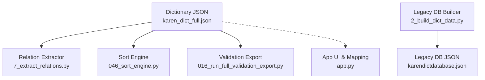
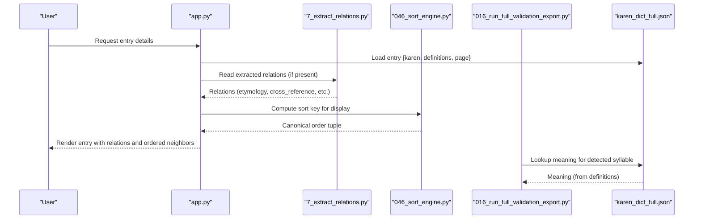
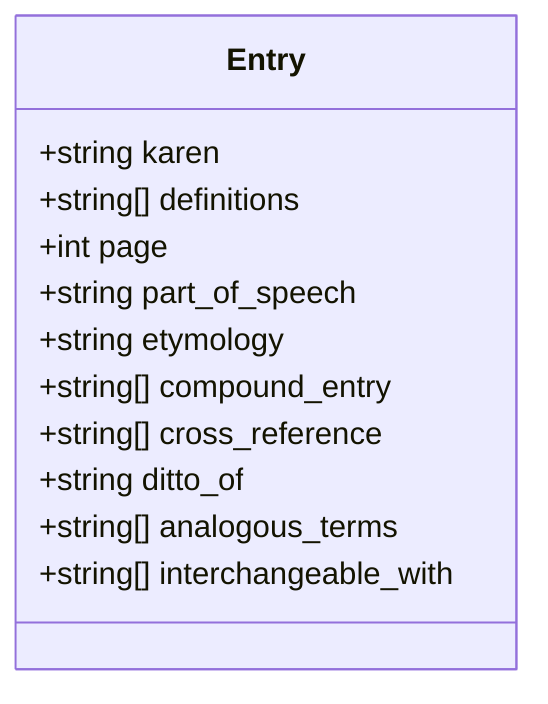
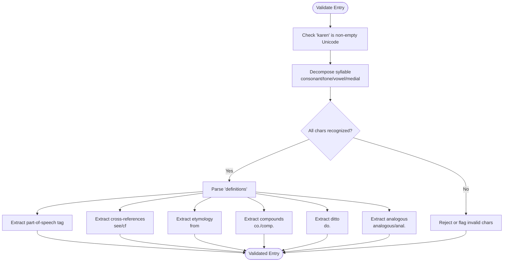
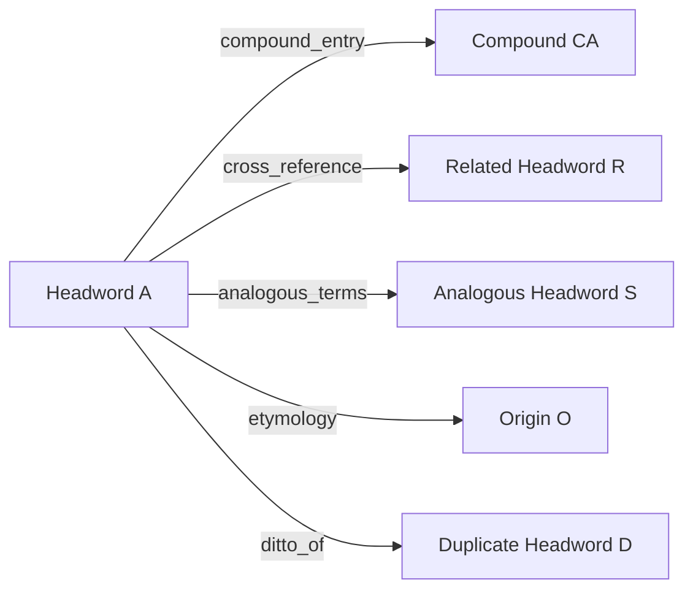
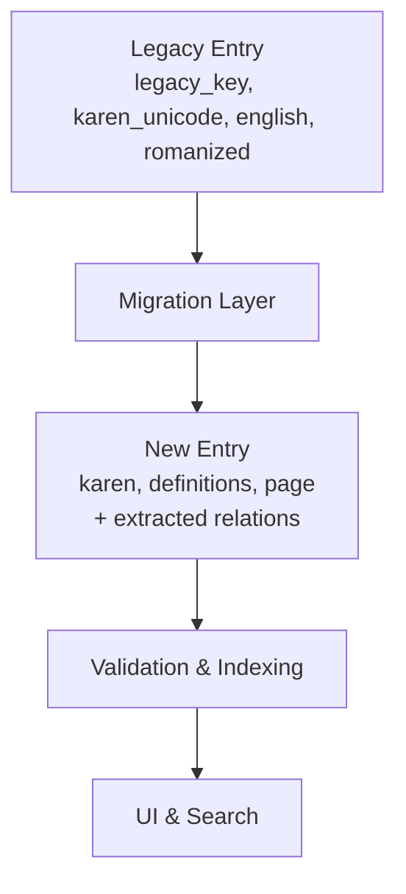
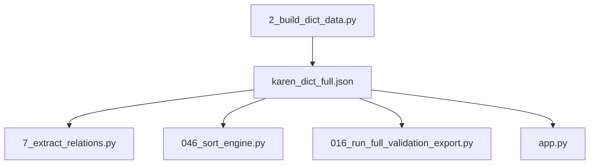

# Dictionary Entry Schema

<cite>
**Referenced Files in This Document**
- [karen_dict_full.json](file://karen_dict_full.json)
- [7_extract_relations.py](file://pipeline/dictionary_processing/7_extract_relations.py)
- [046_sort_engine.py](file://pipeline/dictionary_processing/046_sort_engine.py)
- [2_build_dict_data.py](file://pipeline/dictionary_processing/2_build_dict_data.py)
- [016_run_full_validation_export.py](file://pipeline/ocr_training/016_run_full_validation_export.py)
- [app.py](file://app.py)
</cite>

## Table of Contents
1. Introduction
2. Project Structure
3. Core Components
4. Architecture Overview
5. Detailed Component Analysis
6. Dependency Analysis
7. Performance Considerations
8. Troubleshooting Guide
9. Conclusion

## Introduction
This document specifies the data model for Sgaw Karen dictionary entries used by the project. It defines the canonical entry structure, validation rules for Karen text and definitions, cross-reference patterns, hierarchical relationships between entries, and examples across parts of speech. It also outlines schema evolution and migration strategies to maintain backward compatibility with legacy formats.

## Project Structure
The dictionary dataset is stored as a JSON array of entries. Each entry contains:
- karen: the headword in Sgaw Karen Unicode
- definitions: an array of definition strings (may include part-of-speech tags and cross-references)
- page: the source page number from the printed dictionary

Additional processing scripts extract metadata and relations:
- Relation extraction identifies etymology, compounds, cross-references, ditto references, and analogous terms from definition text.
- Sorting engine enforces canonical Karen sort order based on consonant, tone, vowel, medial.
- Legacy database builder supports older schemas with fields like legacy_key, karen_unicode, english, romanized.
- Validation export utilities reference the dictionary for lookup during OCR evaluation.

**Diagram sources**
- [karen_dict_full.json:1-800](file://karen_dict_full.json#L1-L800)
- [7_extract_relations.py:1-145](file://pipeline/dictionary_processing/7_extract_relations.py#L1-L145)
- [046_sort_engine.py:1-313](file://pipeline/dictionary_processing/046_sort_engine.py#L1-L313)
- [2_build_dict_data.py:1-206](file://pipeline/dictionary_processing/2_build_dict_data.py#L1-L206)
- [016_run_full_validation_export.py:1-206](file://pipeline/ocr_training/016_run_full_validation_export.py#L1-L206)
- [app.py:360-380](file://app.py#L360-L380)

**Section sources**
- [karen_dict_full.json:1-800](file://karen_dict_full.json#L1-L800)
- [7_extract_relations.py:1-145](file://pipeline/dictionary_processing/7_extract_relations.py#L1-L145)
- [046_sort_engine.py:1-313](file://pipeline/dictionary_processing/046_sort_engine.py#L1-L313)
- [2_build_dict_data.py:1-206](file://pipeline/dictionary_processing/2_build_dict_data.py#L1-L206)
- [016_run_full_validation_export.py:1-206](file://pipeline/ocr_training/016_run_full_validation_export.py#L1-L206)
- [app.py:360-380](file://app.py#L360-L380)

## Core Components
- Entry object
  - karen: string; Sgaw Karen headword in Unicode
  - definitions: array of strings; one or more definitions per entry
  - page: integer; source page number
- Optional metadata fields (extracted or added by tools)
  - part_of_speech: v.i., v.t., v., n., adj., adv., prep., conj., pron., interj., part.
  - etymology: string; original form derived from
  - compound_entry: array; compounds containing this headword
  - cross_reference: array; see/cf targets within definitions
  - ditto_of: string; duplicate of another headword
  - analogous_terms: array; semantically related terms
  - interchangeable_with: array; synonyms or variants

These fields are inferred from definition text using marker-based parsing and may also be provided directly by upstream processes.

**Section sources**
- [karen_dict_full.json:1-800](file://karen_dict_full.json#L1-L800)
- [7_extract_relations.py:62-136](file://pipeline/dictionary_processing/7_extract_relations.py#L62-L136)

## Architecture Overview
The schema is consumed by multiple components:
- Relation extractor reads entries and scans definitions for markers to populate relation fields.
- Sort engine decomposes Karen syllables into consonant, tone, vowel, medial to produce canonical ordering.
- Validation export uses the dictionary to map detected syllables to English meanings when available.
- App layer maps user-facing labels to internal relation fields and renders them in the UI.

**Diagram sources**
- [app.py:360-380](file://app.py#L360-L380)
- [7_extract_relations.py:1-145](file://pipeline/dictionary_processing/7_extract_relations.py#L1-L145)
- [046_sort_engine.py:1-313](file://pipeline/dictionary_processing/046_sort_engine.py#L1-L313)
- [016_run_full_validation_export.py:1-206](file://pipeline/ocr_training/016_run_full_validation_export.py#L1-L206)
- [karen_dict_full.json:1-800](file://karen_dict_full.json#L1-L800)

## Detailed Component Analysis

### Entry Data Model
- karen: required; must be valid Sgaw Karen Unicode
- definitions: required; non-empty array of strings
- page: required; positive integer indicating source page
- Optional fields populated by extraction:
  - part_of_speech: single token matched from definitions
  - etymology: single target after “from”
  - compound_entry: list after “co.” or “comp.”
  - cross_reference: list after “see” or “cf.”
  - ditto_of: single target after “do.”
  - analogous_terms: list after “analogous”, “analogously”, “anal.”
  - interchangeable_with: optional synonym set

**Diagram sources**
- [karen_dict_full.json:1-800](file://karen_dict_full.json#L1-L800)
- [7_extract_relations.py:62-136](file://pipeline/dictionary_processing/7_extract_relations.py#L62-L136)

**Section sources**
- [karen_dict_full.json:1-800](file://karen_dict_full.json#L1-L800)
- [7_extract_relations.py:62-136](file://pipeline/dictionary_processing/7_extract_relations.py#L62-L136)

### Validation Rules
- Karen text encoding
  - Must contain valid Sgaw Karen Unicode characters
  - Syllable decomposition follows consonant → tone → vowel → medial hierarchy
  - Special handling for ASAT contractions and medial restrictions for specific consonants
- Definition formatting
  - May include part-of-speech tags such as v.i., v.t., v., n., adj., adv., prep., conj., pron., interj., part.
  - Cross-references use markers: “see ”, “cf.”
  - Etymology uses “from ”
  - Compounds use “co. ” or “comp. ”
  - Ditto references use “do. ”
  - Analogous terms use “analogous”, “analogously”, “anal. ”
- Cross-reference patterns
  - Targets can be Karen Unicode or English words depending on context
  - Multiple targets allowed for compound_entry, cross_reference, analogous_terms

**Diagram sources**
- [046_sort_engine.py:93-160](file://pipeline/dictionary_processing/046_sort_engine.py#L93-L160)
- [7_extract_relations.py:40-118](file://pipeline/dictionary_processing/7_extract_relations.py#L40-L118)

**Section sources**
- [046_sort_engine.py:93-160](file://pipeline/dictionary_processing/046_sort_engine.py#L93-L160)
- [7_extract_relations.py:40-118](file://pipeline/dictionary_processing/7_extract_relations.py#L40-L118)

### Hierarchical Relationships and Semantic Connections
- Hierarchical
  - Compound entries link headwords to multi-word forms that contain them
  - Ditto references indicate duplication of another headword’s content
- Semantic
  - Cross-references connect related concepts across entries
  - Analogous terms group semantically similar headwords
  - Etymology links derived forms to their origins

**Diagram sources**
- [7_extract_relations.py:62-136](file://pipeline/dictionary_processing/7_extract_relations.py#L62-L136)

**Section sources**
- [7_extract_relations.py:62-136](file://pipeline/dictionary_processing/7_extract_relations.py#L62-L136)

### Examples by Part of Speech
- Noun
  - karen: noun headword
  - definitions: includes “(n.) ...”
  - page: source page
- Verb
  - karen: verb headword
  - definitions: includes “(v.) ...” or “(v.i.) ...”, “(v.t.) ...”
  - page: source page
- Adjective
  - karen: adjective headword
  - definitions: includes “(adj.) ...”
  - page: source page

These patterns are consistently observed in the dataset and parsed into part_of_speech by the relation extractor.

**Section sources**
- [karen_dict_full.json:1-800](file://karen_dict_full.json#L1-L800)
- [7_extract_relations.py:78-118](file://pipeline/dictionary_processing/7_extract_relations.py#L78-L118)

### Schema Evolution and Migration
- Current schema
  - Entries: karen, definitions, page
  - Extracted fields: part_of_speech, etymology, compound_entry, cross_reference, ditto_of, analogous_terms, interchangeable_with
- Legacy schema
  - Fields: legacy_key, karen_unicode, english, romanized
  - Used by earlier pipeline stages and referenced by validation/export tools
- Migration strategy
  - Maintain both schemas during transition
  - Map legacy fields to current schema where applicable
  - Preserve legacy_key for traceability
  - Use app mappings to align user-facing labels to internal fields
  - Validate new entries against current rules while accepting legacy inputs

**Diagram sources**
- [2_build_dict_data.py:135-200](file://pipeline/dictionary_processing/2_build_dict_data.py#L135-L200)
- [016_run_full_validation_export.py:60-70](file://pipeline/ocr_training/016_run_full_validation_export.py#L60-L70)
- [app.py:360-380](file://app.py#L360-L380)

**Section sources**
- [2_build_dict_data.py:135-200](file://pipeline/dictionary_processing/2_build_dict_data.py#L135-L200)
- [016_run_full_validation_export.py:60-70](file://pipeline/ocr_training/016_run_full_validation_export.py#L60-L70)
- [app.py:360-380](file://app.py#L360-L380)

## Dependency Analysis
- karen_dict_full.json is the central dataset consumed by:
  - Relation extractor to build semantic and structural links
  - Sort engine to compute canonical ordering
  - Validation export to resolve meanings for OCR detections
  - App layer to render entries and relations
- 7_extract_relations.py depends on definition text patterns to infer metadata
- 046_sort_engine.py provides linguistic decomposition and sorting keys
- 2_build_dict_data.py bridges legacy formats to structured dictionaries
- app.py maps UI labels to internal relation fields and integrates extracted metadata

**Diagram sources**
- [karen_dict_full.json:1-800](file://karen_dict_full.json#L1-L800)
- [7_extract_relations.py:1-145](file://pipeline/dictionary_processing/7_extract_relations.py#L1-L145)
- [046_sort_engine.py:1-313](file://pipeline/dictionary_processing/046_sort_engine.py#L1-L313)
- [016_run_full_validation_export.py:1-206](file://pipeline/ocr_training/016_run_full_validation_export.py#L1-L206)
- [2_build_dict_data.py:1-206](file://pipeline/dictionary_processing/2_build_dict_data.py#L1-L206)
- [app.py:360-380](file://app.py#L360-L380)

**Section sources**
- [karen_dict_full.json:1-800](file://karen_dict_full.json#L1-L800)
- [7_extract_relations.py:1-145](file://pipeline/dictionary_processing/7_extract_relations.py#L1-L145)
- [046_sort_engine.py:1-313](file://pipeline/dictionary_processing/046_sort_engine.py#L1-L313)
- [016_run_full_validation_export.py:1-206](file://pipeline/ocr_training/016_run_full_validation_export.py#L1-L206)
- [2_build_dict_data.py:1-206](file://pipeline/dictionary_processing/2_build_dict_data.py#L1-L206)
- [app.py:360-380](file://app.py#L360-L380)

## Performance Considerations
- Sorting complexity: O(n log n) for full dictionary sort using canonical keys
- Relation extraction: linear scan over entries and definitions; regex matching is lightweight
- Validation export: per-image inference cost dominates; dictionary lookup is O(1) via hash map
- Memory usage: proportional to dictionary size; consider streaming for very large datasets

[No sources needed since this section provides general guidance]

## Troubleshooting Guide
- Invalid Karen text
  - Ensure all characters belong to recognized Sgaw Karen sets
  - Use decomposition to identify misassigned tones, medials, or vowels
- Missing or malformed definitions
  - Verify definitions array is non-empty and contains strings
  - Check for expected markers if expecting extracted relations
- Cross-reference resolution failures
  - Confirm target exists in dictionary or is intentionally English
  - Review marker usage (“see”, “cf.”) and spacing
- Sorting anomalies
  - Recheck decomposition results for consonant, tone, vowel, medial
  - Validate ASAT contraction handling and medial restrictions
- Legacy compatibility issues
  - Ensure mapping from legacy fields to current schema is applied
  - Keep legacy_key for traceability during migration

**Section sources**
- [046_sort_engine.py:93-216](file://pipeline/dictionary_processing/046_sort_engine.py#L93-L216)
- [7_extract_relations.py:40-118](file://pipeline/dictionary_processing/7_extract_relations.py#L40-L118)
- [2_build_dict_data.py:135-200](file://pipeline/dictionary_processing/2_build_dict_data.py#L135-L200)

## Conclusion
The Sgaw Karen dictionary entry schema centers on a simple, robust structure: karen, definitions, and page. Metadata and relations are extracted from definition text using well-defined markers, enabling rich semantic connections and hierarchical relationships. The sort engine ensures canonical ordering aligned with the printed dictionary, while migration support maintains compatibility with legacy formats. Together, these components provide a scalable, validated, and navigable lexical resource.

[No sources needed since this section summarizes without analyzing specific files]