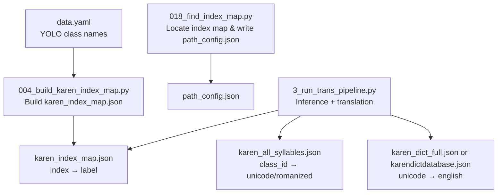
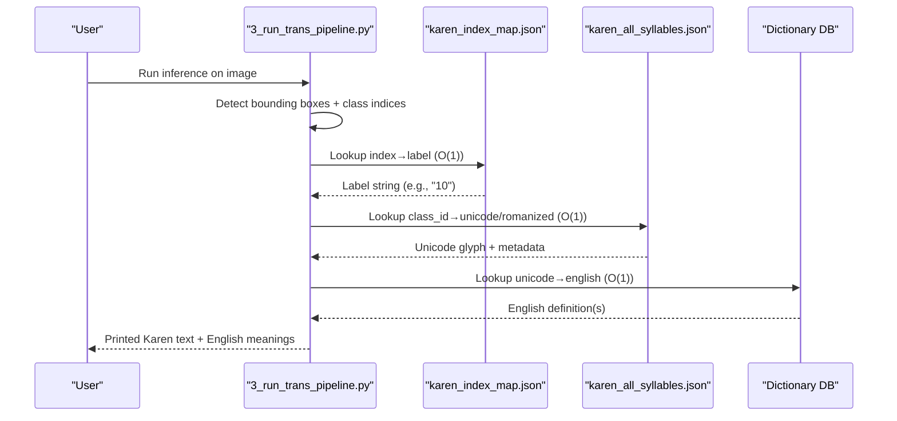
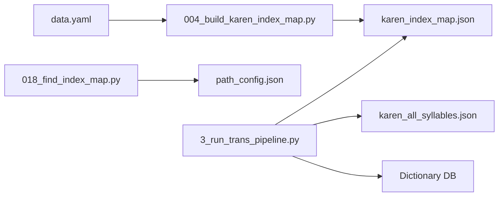

# Index Mapping System

<cite>
**Referenced Files in This Document**
- [karen_index_map.json](file://karen_index_map.json)
- [004_build_karen_index_map.py](file://pipeline/ocr_training/004_build_karen_index_map.py)
- [018_find_index_map.py](file://pipeline/ocr_training/018_find_index_map.py)
- [3_run_trans_pipeline.py](file://pipeline/dictionary_processing/3_run_trans_pipeline.py)
- [data.yaml](file://data.yaml)
- [karen_all_syllables.json](file://karen_all_syllables.json)
- [karen_dict_full.json](file://karen_dict_full.json)
</cite>

## Table of Contents
1. [Introduction](#introduction)
2. [Project Structure](#project-structure)
3. [Core Components](#core-components)
4. [Architecture Overview](#architecture-overview)
5. [Detailed Component Analysis](#detailed-component-analysis)
6. [Dependency Analysis](#dependency-analysis)
7. [Performance Considerations](#performance-considerations)
8. [Troubleshooting Guide](#troubleshooting-guide)
9. [Conclusion](#conclusion)
10. [Appendices](#appendices)

## Introduction
This document explains the index mapping system that powers efficient lookups for the Sgaw Karen dictionary within an OCR-to-translation pipeline. The system bridges YOLO model outputs (numeric class indices) to human-readable Karen syllable labels and then to Unicode characters and English definitions. It focuses on:
- The structure and purpose of karen_index_map.json
- How it maps to other data structures (syllables and dictionary entries)
- Character normalization and lookup algorithms
- Performance optimizations, caching, and memory considerations
- Example queries, update operations, and maintenance procedures

## Project Structure
The index mapping system is composed of a static JSON map and supporting scripts that build, locate, and consume it during inference.

**Diagram sources**
- [004_build_karen_index_map.py:1-54](file://pipeline/ocr_training/004_build_karen_index_map.py#L1-L54)
- [018_find_index_map.py:1-99](file://pipeline/ocr_training/018_find_index_map.py#L1-L99)
- [3_run_trans_pipeline.py:47-86](file://pipeline/dictionary_processing/3_run_trans_pipeline.py#L47-L86)
- [data.yaml:1-10](file://data.yaml#L1-L10)

**Section sources**
- [004_build_karen_index_map.py:1-54](file://pipeline/ocr_training/004_build_karen_index_map.py#L1-L54)
- [018_find_index_map.py:1-99](file://pipeline/ocr_training/018_find_index_map.py#L1-L99)
- [3_run_trans_pipeline.py:19-40](file://pipeline/dictionary_processing/3_run_trans_pipeline.py#L19-L40)
- [data.yaml:1-10](file://data.yaml#L1-L10)

## Core Components
- karen_index_map.json: A JSON object mapping stringified YOLO class indices to their corresponding label strings. Keys are strings; values are numeric-like strings representing class identifiers used downstream.
- 004_build_karen_index_map.py: Builds karen_index_map.json from data.yaml by enumerating the ordered class names list.
- 018_find_index_map.py: Scans the filesystem to find karen_index_map.json, validates it, and writes a canonical path configuration file for downstream scripts.
- 3_run_trans_pipeline.py: Consumes karen_index_map.json along with karen_all_syllables.json and a dictionary database to translate detected classes into Unicode text and English meanings.

Key responsibilities:
- Build: Convert YOLO’s ordered class list into a persistent index map.
- Locate: Find the correct index map on different environments and centralize paths.
- Consume: Provide O(1) lookups from YOLO indices to Unicode and English.

**Section sources**
- [karen_index_map.json:1-20](file://karen_index_map.json#L1-L20)
- [004_build_karen_index_map.py:12-41](file://pipeline/ocr_training/004_build_karen_index_map.py#L12-L41)
- [018_find_index_map.py:21-99](file://pipeline/ocr_training/018_find_index_map.py#L21-L99)
- [3_run_trans_pipeline.py:47-86](file://pipeline/dictionary_processing/3_run_trans_pipeline.py#L47-L86)

## Architecture Overview
The end-to-end flow connects model outputs to readable output via layered mappings:

**Diagram sources**
- [3_run_trans_pipeline.py:93-141](file://pipeline/dictionary_processing/3_run_trans_pipeline.py#L93-L141)
- [3_run_trans_pipeline.py:47-86](file://pipeline/dictionary_processing/3_run_trans_pipeline.py#L47-L86)

## Detailed Component Analysis

### karen_index_map.json: Structure and Semantics
- Format: JSON object where keys are string representations of YOLO class indices and values are string labels that correspond to class identifiers used in subsequent steps.
- Purpose: Provides a stable bridge between raw model outputs and higher-level semantic information stored elsewhere (syllables and dictionary).
- Example behavior:
  - Key "0" maps to value "0"
  - Key "2" maps to value "10"
  - Key "3" maps to value "100"
  These illustrate how indices are remapped to canonical identifiers consumed by downstream logic.

Use cases:
- Translate a YOLO class index to its canonical label before further processing.
- Validate that the model’s class space matches expected training configuration.

**Section sources**
- [karen_index_map.json:1-20](file://karen_index_map.json#L1-L20)

### Builder: 004_build_karen_index_map.py
- Reads data.yaml and enumerates the ordered names list to create an index→name mapping.
- Writes karen_index_map.json with UTF-8 encoding and pretty-printing for readability.
- Ensures keys are strings for consistent JSON lookups.

Operational notes:
- Requires data.yaml to be present and correctly ordered.
- Produces a deterministic map based on the order of names in data.yaml.

**Section sources**
- [004_build_karen_index_map.py:12-41](file://pipeline/ocr_training/004_build_karen_index_map.py#L12-L41)
- [data.yaml:1-10](file://data.yaml#L1-L10)

### Locator: 018_find_index_map.py
- Recursively scans the filesystem for karen_index_map.json while skipping noisy directories.
- Validates the found file as JSON and counts entries.
- Writes path_config.json with canonical paths for all downstream scripts, including the index map location.

Operational notes:
- Handles multiple matches by selecting the shortest path.
- Centralizes environment-specific paths to avoid hardcoding.

**Section sources**
- [018_find_index_map.py:21-99](file://pipeline/ocr_training/018_find_index_map.py#L21-L99)

### Consumer: 3_run_trans_pipeline.py
- Loads karen_index_map.json, karen_all_syllables.json, and a dictionary database into memory as fast lookup tables.
- Converts each detection’s class index to Unicode and English via a two-step lookup:
  1) index→label using karen_index_map.json
  2) class_id→unicode/romanized using karen_all_syllables.json
  3) unicode→english using dictionary database
- Sorts detections into reading order (left-to-right, top-to-bottom) before translating.

Lookup algorithm highlights:
- String conversion for index map keys ensures compatibility.
- Robust error handling returns safe defaults when mappings are missing or malformed.
- Dictionary lookup uses stripped Unicode keys for consistency.

**Section sources**
- [3_run_trans_pipeline.py:47-86](file://pipeline/dictionary_processing/3_run_trans_pipeline.py#L47-L86)
- [3_run_trans_pipeline.py:93-141](file://pipeline/dictionary_processing/3_run_trans_pipeline.py#L93-L141)
- [3_run_trans_pipeline.py:148-183](file://pipeline/dictionary_processing/3_run_trans_pipeline.py#L148-L183)

### Supporting Data: karen_all_syllables.json and karen_dict_full.json
- karen_all_syllables.json: Array of objects keyed by class_id containing full_unicode, romanized, and label fields. Used to resolve Unicode glyphs and phonetic forms from class identifiers.
- karen_dict_full.json: Array of dictionary entries with Karen text and definitions. In the pipeline, a dictionary database (e.g., karendictdatabase.json) is used for Unicode→English lookup; this file illustrates the broader dictionary resource available.

Normalization and matching:
- Unicode keys are stripped before dictionary lookup to handle whitespace variations.
- Romanization and label fields provide auxiliary information for debugging and display.

**Section sources**
- [karen_all_syllables.json:1-20](file://karen_all_syllables.json#L1-L20)
- [karen_dict_full.json:1-20](file://karen_dict_full.json#L1-L20)
- [3_run_trans_pipeline.py:71-86](file://pipeline/dictionary_processing/3_run_trans_pipeline.py#L71-L86)

## Dependency Analysis
The index mapping system depends on several files and has clear coupling points:

Coupling and cohesion:
- The builder is tightly coupled to data.yaml ordering; changes there require rebuilding the index map.
- The consumer is decoupled from the builder but depends on the presence and correctness of karen_index_map.json and related resources.
- The locator abstracts environment differences, improving portability.

Potential circular dependencies:
- None observed; the pipeline is linear: build → locate → consume.

External integrations:
- YOLO model weights and inference engine are external to the index mapping but integrated at the consumer stage.

**Diagram sources**
- [004_build_karen_index_map.py:12-41](file://pipeline/ocr_training/004_build_karen_index_map.py#L12-L41)
- [018_find_index_map.py:74-99](file://pipeline/ocr_training/018_find_index_map.py#L74-L99)
- [3_run_trans_pipeline.py:47-86](file://pipeline/dictionary_processing/3_run_trans_pipeline.py#L47-L86)

**Section sources**
- [data.yaml:1-10](file://data.yaml#L1-L10)
- [004_build_karen_index_map.py:12-41](file://pipeline/ocr_training/004_build_karen_index_map.py#L12-L41)
- [018_find_index_map.py:74-99](file://pipeline/ocr_training/018_find_index_map.py#L74-L99)
- [3_run_trans_pipeline.py:47-86](file://pipeline/dictionary_processing/3_run_trans_pipeline.py#L47-L86)

## Performance Considerations
- Lookup complexity:
  - karen_index_map.json: O(1) average-time dict lookup by string key.
  - karen_all_syllables.json: Prebuilt dict by integer class_id provides O(1) access.
  - Dictionary DB: Prebuilt dict by Unicode string provides O(1) access.
- Memory management:
  - All lookup tables are loaded into memory once at startup and reused across images, minimizing repeated I/O.
  - For very large datasets, consider lazy loading or chunked processing if memory constraints arise.
- I/O optimization:
  - Use UTF-8 encoding consistently to avoid re-encoding overhead.
  - Keep JSON files compact yet readable; indentation aids debugging without significant performance impact.
- Sorting cost:
  - Reading-order sorting groups detections by line proximity and sorts per line left-to-right; complexity is roughly O(n log n) due to sorting.

[No sources needed since this section provides general guidance]

## Troubleshooting Guide
Common issues and resolutions:
- Index not in map:
  - Symptom: Translation returns unknown label and “index not in map”.
  - Cause: YOLO class index does not exist in karen_index_map.json.
  - Resolution: Rebuild karen_index_map.json from updated data.yaml or verify model class space.
- Non-numeric class name:
  - Symptom: Error path triggered with non-numeric class name.
  - Cause: Mismatch between index map values and expected numeric identifiers.
  - Resolution: Ensure data.yaml names produce numeric-like labels after enumeration.
- Class ID not in syllable list:
  - Symptom: Returns placeholder Unicode and “class_id not in syllable list”.
  - Cause: Gap between index map and syllable dataset.
  - Resolution: Align karen_all_syllables.json with index map; rebuild if necessary.
- Missing model weights:
  - Symptom: Pipeline reports best.pt not found.
  - Resolution: Copy or link the correct model weights to the expected path.
- File not found:
  - Symptom: Index map not found on server.
  - Resolution: Run 018_find_index_map.py to locate and configure paths; ensure karen_index_map.json exists.

**Section sources**
- [3_run_trans_pipeline.py:93-141](file://pipeline/dictionary_processing/3_run_trans_pipeline.py#L93-L141)
- [3_run_trans_pipeline.py:322-332](file://pipeline/dictionary_processing/3_run_trans_pipeline.py#L322-L332)
- [018_find_index_map.py:40-58](file://pipeline/ocr_training/018_find_index_map.py#L40-L58)

## Conclusion
The index mapping system provides a robust, efficient bridge between YOLO model outputs and meaningful Karen text plus English definitions. By constructing a stable index map from data.yaml, locating it reliably across environments, and consuming it with prebuilt in-memory dictionaries, the pipeline achieves fast, scalable lookups suitable for large-scale OCR-to-translation tasks. Proper maintenance—rebuilding the index map when class lists change and keeping syllable and dictionary resources aligned—ensures accuracy and performance.

[No sources needed since this section summarizes without analyzing specific files]

## Appendices

### Example Queries
- Self-test mode:
  - Run the pipeline without arguments to test lookups for indices 0–9 against karen_index_map.json and associated resources.
- Image inference:
  - Provide one or more image paths to run detection, sort into reading order, and print Unicode text with English translations.

Reference:
- [3_run_trans_pipeline.py:283-346](file://pipeline/dictionary_processing/3_run_trans_pipeline.py#L283-L346)

**Section sources**
- [3_run_trans_pipeline.py:283-346](file://pipeline/dictionary_processing/3_run_trans_pipeline.py#L283-L346)

### Update Operations
- Rebuild index map:
  - Execute the builder script to regenerate karen_index_map.json from data.yaml whenever class definitions change.
- Update paths:
  - Run the locator script to discover karen_index_map.json and write path_config.json for downstream scripts.

References:
- [004_build_karen_index_map.py:12-41](file://pipeline/ocr_training/004_build_karen_index_map.py#L12-L41)
- [018_find_index_map.py:74-99](file://pipeline/ocr_training/018_find_index_map.py#L74-L99)

**Section sources**
- [004_build_karen_index_map.py:12-41](file://pipeline/ocr_training/004_build_karen_index_map.py#L12-L41)
- [018_find_index_map.py:74-99](file://pipeline/ocr_training/018_find_index_map.py#L74-L99)

### Maintenance Procedures
- Keep data.yaml synchronized with actual training classes to ensure index map correctness.
- Periodically validate karen_index_map.json by spot-checking sample entries and total count.
- Ensure syllable and dictionary resources remain aligned with the index map to prevent gaps in translation.

**Section sources**
- [data.yaml:1-10](file://data.yaml#L1-L10)
- [018_find_index_map.py:60-72](file://pipeline/ocr_training/018_find_index_map.py#L60-L72)