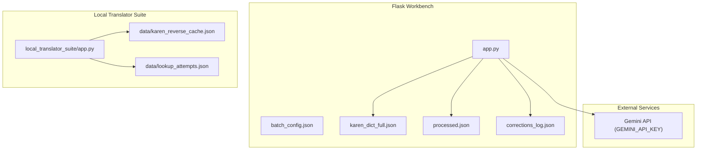
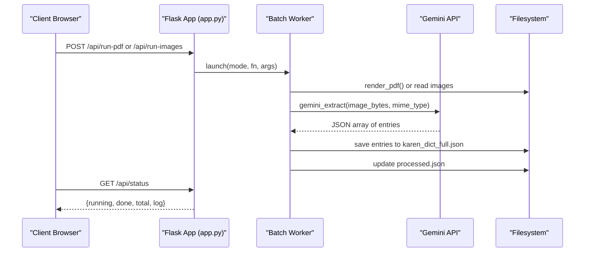
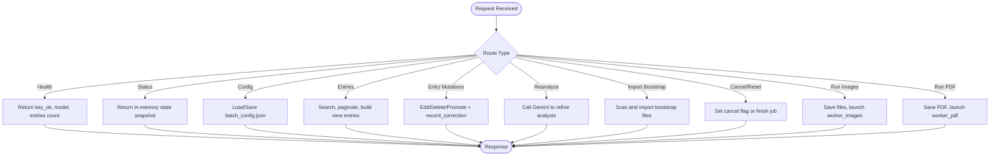
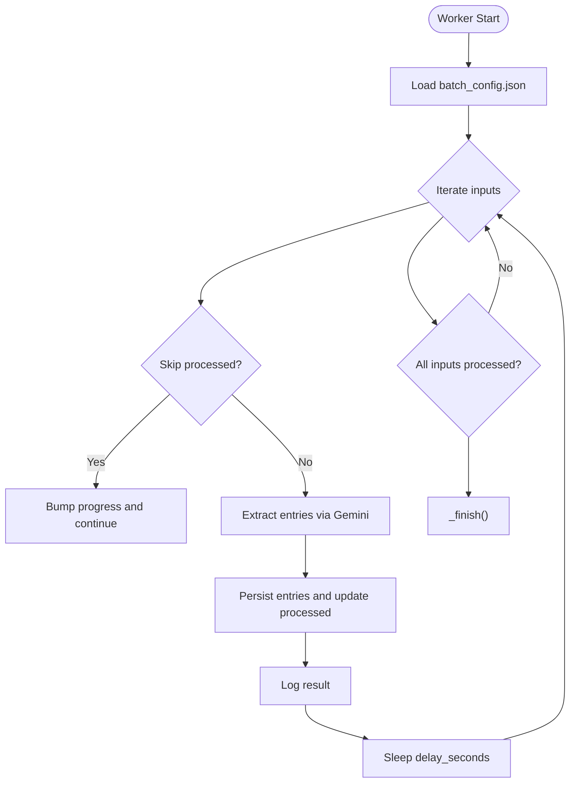
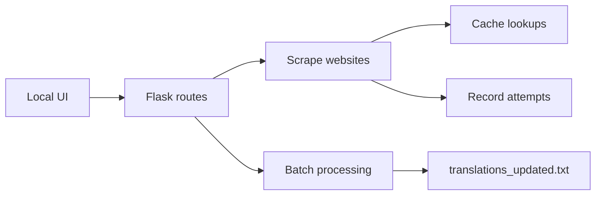
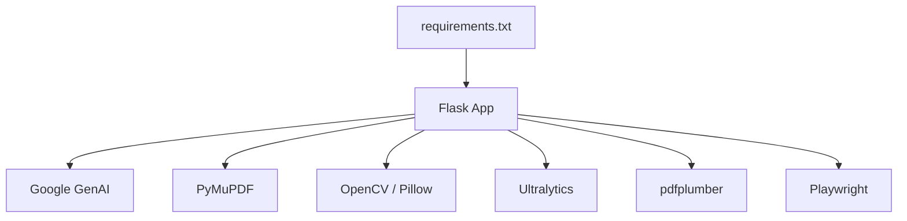

# Deployment and Production

<cite>
**Referenced Files in This Document**
- [app.py](file://app.py)
- [requirements.txt](file://requirements.txt)
- [batch_config.json](file://batch_config.json)
- [README.md](file://README.md)
- [SECURITY.md](file://docs/SECURITY.md)
- [ARCHITECTURE.md](file://docs/ARCHITECTURE.md)
- [local_translator_suite/app.py](file://pipeline/dictionary_processing/local_translator_suite/app.py)
</cite>

## Table of Contents
1. [Introduction](#introduction)
2. [Project Structure](#project-structure)
3. [Core Components](#core-components)
4. [Architecture Overview](#architecture-overview)
5. [Detailed Component Analysis](#detailed-component-analysis)
6. [Dependency Analysis](#dependency-analysis)
7. [Performance Considerations](#performance-considerations)
8. [Troubleshooting Guide](#troubleshooting-guide)
9. [Conclusion](#conclusion)
10. [Appendices](#appendices)

## Introduction
This document provides production-grade deployment guidance for the Sgaw Karen OCR and Dictionary Pipeline. It covers environment setup, API key management, security, performance tuning, scaling strategies, containerization, monitoring, logging, and disaster recovery. The system is a Flask-based workbench that orchestrates PDF rendering, image processing, dictionary entry extraction using an external Gemini model, and a review interface for curating structured dictionary entries. A secondary local translator suite supports web scraping, caching, and batch translation workflows.

## Project Structure
The repository centers around a single Flask application that exposes REST endpoints and a web UI for batch OCR and dictionary curation. Supporting assets include configuration files, dataset definitions, and a separate local translator suite.

**Diagram sources**
- [app.py:1510-1664](file://app.py#L1510-L1664)
- [batch_config.json:1-9](file://batch_config.json#L1-L9)
- [local_translator_suite/app.py:20-29](file://pipeline/dictionary_processing/local_translator_suite/app.py#L20-L29)

**Section sources**
- [README.md:1-63](file://README.md#L1-L63)
- [ARCHITECTURE.md:1-38](file://docs/ARCHITECTURE.md#L1-L38)

## Core Components
- Flask workbench app with health, status, config, entries, and batch run endpoints.
- Batch workers for images and PDFs that render pages, call Gemini for extraction, persist results, and track progress.
- Configuration management via JSON file with defaults and runtime overrides.
- Local translator suite with scraping, caching, and batch processing capabilities.

Key responsibilities:
- Ingestion: Accept uploaded PDFs and images; render PDFs to images at configurable DPI.
- Extraction: Call Gemini with strict prompts to extract structured dictionary entries from images.
- Persistence: Save entries to a JSON dictionary file; track processed items to avoid reprocessing.
- Review: Provide search, edit, promote, merge, delete, and re-analyze operations through REST APIs and UI.
- Monitoring: Expose health and status endpoints; maintain logs and correction records.

**Section sources**
- [app.py:1510-1664](file://app.py#L1510-L1664)
- [app.py:619-729](file://app.py#L619-L729)
- [batch_config.json:1-9](file://batch_config.json#L1-L9)

## Architecture Overview
The pipeline ingests PDFs or images, renders pages when necessary, extracts dictionary entries using Gemini, and stores normalized entries for review. The UI polls status and log endpoints to provide live feedback. The local translator suite operates independently but shares similar patterns for rate limiting, caching, and error tracking.

**Diagram sources**
- [app.py:619-729](file://app.py#L619-L729)
- [app.py:1631-1658](file://app.py#L1631-L1658)
- [app.py:1528-1530](file://app.py#L1528-L1530)

## Detailed Component Analysis

### Flask Workbench Endpoints and State Management
- Health endpoint reports whether the Gemini API key is present and returns model name and dictionary size.
- Status endpoint exposes in-memory state including running flag, mode, current file/page, progress counters, timestamps, errors, and recent log lines.
- Config endpoint allows reading and updating batch processing parameters such as page/image batch sizes, delay between requests, render DPI, skip-processed behavior, and auto-import bootstrap behavior.
- Entries endpoints support searching by query, page number, flagged-only filter, and return view-ready entries with linked headwords and analysis.
- Entry mutation endpoints allow editing, deleting, promoting entries, and recording corrections.
- Reanalyze endpoint triggers Gemini to refine analysis without altering original definitions.
- Import-bootstrap endpoint scans for bootstrap JSON files and imports entries if enabled.
- Cancel and force-reset endpoints manage long-running batch jobs.
- Run endpoints accept uploads, persist them under safe names, and launch background workers.

**Diagram sources**
- [app.py:1515-1664](file://app.py#L1515-L1664)

**Section sources**
- [app.py:1515-1664](file://app.py#L1515-L1664)

### Batch Workers and Processing Logic
- Image worker iterates over uploaded images, optionally skips already processed files, extracts entries via Gemini, persists new entries, updates processed tracking, and logs progress.
- PDF worker renders specified page ranges to images at configured DPI, then processes each page similarly to images.
- Both workers respect cancellation flags and enforce delays between requests to avoid rate limits.
- Progress and logs are exposed via status endpoint for real-time monitoring.

**Diagram sources**
- [app.py:638-729](file://app.py#L638-L729)

**Section sources**
- [app.py:638-729](file://app.py#L638-L729)

### Local Translator Suite
- Provides independent Flask service for English-to-Karen and Karen-to-English lookup, scraping, caching, and batch processing.
- Uses environment variables for scrape delay and request timeouts.
- Tracks attempts and maintains reverse cache for performance and auditability.

**Diagram sources**
- [local_translator_suite/app.py:20-29](file://pipeline/dictionary_processing/local_translator_suite/app.py#L20-L29)
- [local_translator_suite/app.py:38-39](file://pipeline/dictionary_processing/local_translator_suite/app.py#L38-L39)
- [local_translator_suite/app.py:577-608](file://pipeline/dictionary_processing/local_translator_suite/app.py#L577-L608)

**Section sources**
- [local_translator_suite/app.py:20-29](file://pipeline/dictionary_processing/local_translator_suite/app.py#L20-L29)
- [local_translator_suite/app.py:38-39](file://pipeline/dictionary_processing/local_translator_suite/app.py#L38-L39)
- [local_translator_suite/app.py:577-608](file://pipeline/dictionary_processing/local_translator_suite/app.py#L577-L608)

## Dependency Analysis
Runtime dependencies are declared in requirements.txt and include Flask, Google GenAI client, PDF rendering libraries, image processing tools, and optional utilities for OCR and PDF parsing.

**Diagram sources**
- [requirements.txt:1-10](file://requirements.txt#L1-L10)

**Section sources**
- [requirements.txt:1-10](file://requirements.txt#L1-L10)

## Performance Considerations
- Batch sizing: Adjust pdf_pages_per_batch and images_per_batch to balance throughput and memory usage. Larger batches increase memory pressure during rendering and processing.
- Request throttling: Use delay_seconds to control rate of Gemini calls and avoid API throttling or quota exhaustion.
- Rendering quality: Tune render_dpi to balance OCR accuracy against memory and disk usage. Higher DPI increases image size and processing time.
- Skip processed: Enable skip_processed to avoid redundant work on repeated runs.
- Concurrency: The current implementation uses a single background thread per batch job. For higher concurrency, consider a task queue (e.g., Celery) and multiple workers.
- Memory management: Limit concurrent PDF renders and process images in smaller chunks. Monitor disk space for rendered images and dictionary growth.
- External service limits: Respect Gemini model token limits and response constraints; adjust max_output_tokens and temperature as needed.
- Local translator suite: Configure KAREN_SCRAPE_DELAY_SECONDS and KAREN_REQUEST_TIMEOUT_SECONDS to control scraping behavior and resilience.

[No sources needed since this section provides general guidance]

## Troubleshooting Guide
- Missing API key: Health endpoint indicates key presence; ensure GEMINI_API_KEY is set in the environment before starting the service.
- Stuck batch jobs: Use cancel and force-reset endpoints to reset state if a job hangs.
- No entries extracted: Verify input images/PDFs are readable and that Gemini prompt and model settings produce valid JSON arrays.
- Large dictionary growth: Periodically archive or compress karen_dict_full.json and monitor disk usage.
- Scraping failures: Check network connectivity, timeouts, and rate limits; inspect attempts log for detailed error context.

**Section sources**
- [app.py:1515-1530](file://app.py#L1515-L1530)
- [app.py:1618-1628](file://app.py#L1618-L1628)
- [local_translator_suite/app.py:577-608](file://pipeline/dictionary_processing/local_translator_suite/app.py#L577-L608)

## Conclusion
The Sgaw Karen OCR and Dictionary Pipeline provides a robust foundation for batch processing dictionary PDFs and images, extracting structured entries with Gemini, and reviewing results through a web interface. Production deployments should focus on secure API key management, careful configuration of batch sizes and delays, monitoring of status and logs, and planning for scaling beyond single-threaded batch execution. The local translator suite complements the main pipeline with scraping, caching, and batch translation capabilities.

[No sources needed since this section summarizes without analyzing specific files]

## Appendices

### Environment Variables and Configuration
- GEMINI_API_KEY: Required for batch OCR and re-analysis.
- GEMINI_MODEL: Model identifier used for content generation.
- PORT: Server port (default 5000).
- PADAUK_FONT: Optional path to Padauk font for rendering.
- KAREN_SCRAPE_DELAY_SECONDS: Rate-limit delay for website scraping.
- KAREN_REQUEST_TIMEOUT_SECONDS: Timeout for HTTP requests in the local translator suite.
- batch_config.json keys:
  - pdf_pages_per_batch: Number of PDF pages to process per batch.
  - images_per_batch: Number of images to process per batch.
  - delay_seconds: Sleep interval between requests.
  - page_offset: Offset applied to page numbers.
  - render_dpi: DPI for PDF rendering.
  - skip_processed: Whether to skip already processed inputs.
  - auto_import_bootstrap: Whether to automatically import bootstrap JSON files.

**Section sources**
- [app.py:36-37](file://app.py#L36-L37)
- [app.py:91-91](file://app.py#L91-L91)
- [app.py:1661-1664](file://app.py#L1661-L1664)
- [batch_config.json:1-9](file://batch_config.json#L1-L9)
- [local_translator_suite/app.py:38-39](file://pipeline/dictionary_processing/local_translator_suite/app.py#L38-L39)

### Security Considerations
- Never commit secrets or large artifacts; use environment variables for API keys.
- Rotate any previously exposed keys found in archived prototypes.
- Validate and sanitize user inputs; the app sanitizes filenames and escapes HTML output.
- Restrict access to administrative endpoints behind authentication in production.
- Store sensitive data outside version control and limit filesystem permissions.

**Section sources**
- [SECURITY.md:1-31](file://docs/SECURITY.md#L1-L31)

### Containerization Options
- Base image: Python with required system dependencies for PyMuPDF and OpenCV.
- Mount persistent volumes for app_data, dictionaries, and logs.
- Inject environment variables via orchestration platforms (Kubernetes Secrets, Docker secrets).
- Set resource limits for CPU and memory to prevent runaway rendering jobs.
- Use health checks against /api/health and readiness probes based on status.

[No sources needed since this section provides general guidance]

### Monitoring and Logging
- Expose /api/health and /api/status for liveness and readiness checks.
- Poll status endpoint to display running state, progress, and logs in the UI.
- Record corrections and attempts for audit trails.
- Integrate with centralized logging (e.g., stdout/stderr capture) and metrics collection.

**Section sources**
- [app.py:1515-1530](file://app.py#L1515-L1530)
- [app.py:1540-1567](file://app.py#L1540-L1567)
- [local_translator_suite/app.py:577-608](file://pipeline/dictionary_processing/local_translator_suite/app.py#L577-L608)

### Disaster Recovery Procedures
- Back up karen_dict_full.json, processed.json, and corrections_log.json regularly.
- Version control configuration files; keep batch_config.json changes tracked.
- Maintain offsite backups of large datasets and model artifacts separately from code repositories.
- Test restore procedures to ensure quick recovery after failures.

[No sources needed since this section provides general guidance]