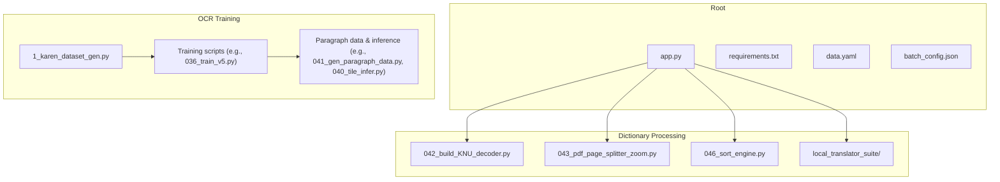
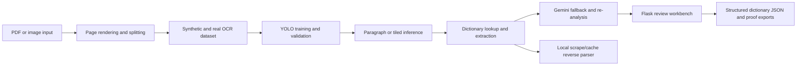
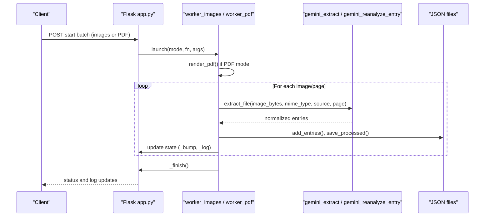
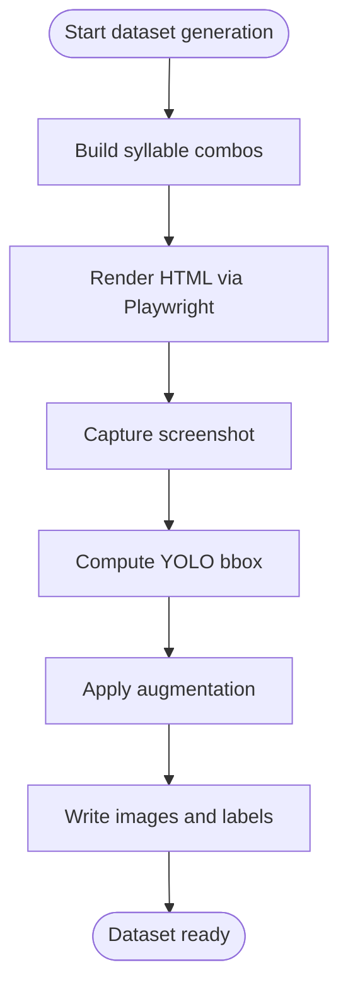
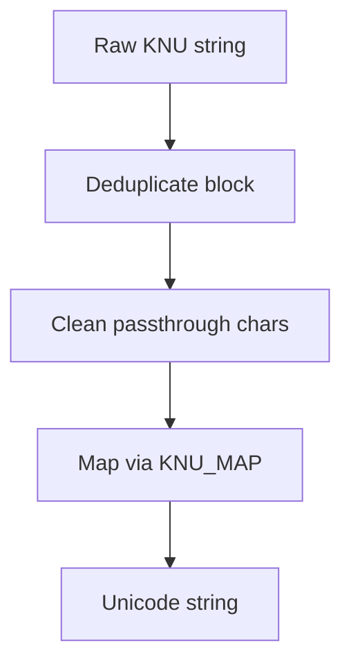
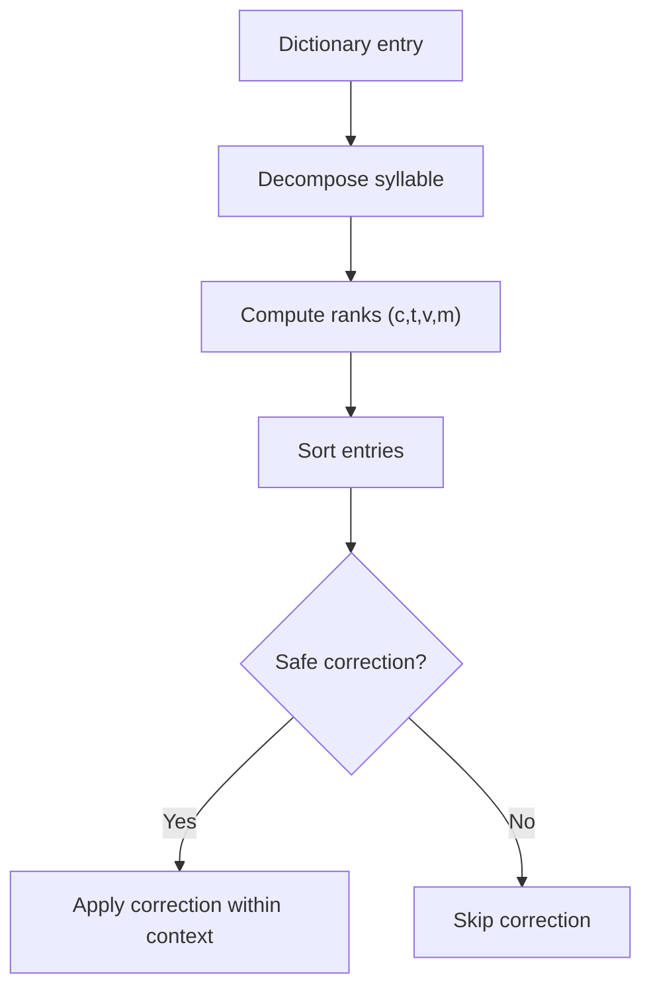
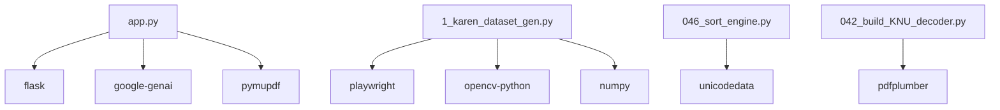

# Developer Guide

<cite>
**Referenced Files in This Document**
- [README.md](file://README.md)
- [ARCHITECTURE.md](file://docs/ARCHITECTURE.md)
- [SOURCE_REPOS.md](file://docs/SOURCE_REPOS.md)
- [FILE_AUDIT.md](file://docs/FILE_AUDIT.md)
- [PORTFOLIO_MEDIA_PLAN.md](file://docs/PORTFOLIO_MEDIA_PLAN.md)
- [app.py](file://app.py)
- [requirements.txt](file://requirements.txt)
- [data.yaml](file://data.yaml)
- [batch_config.json](file://batch_config.json)
- [1_karen_dataset_gen.py](file://pipeline/ocr_training/1_karen_dataset_gen.py)
- [042_build_KNU_decoder.py](file://pipeline/dictionary_processing/042_build_KNU_decoder.py)
- [046_sort_engine.py](file://pipeline/dictionary_processing/046_sort_engine.py)
</cite>

## Table of Contents
1. Introduction
2. Project Structure
3. Core Components
4. Architecture Overview
5. Detailed Component Analysis
6. Dependency Analysis
7. Performance Considerations
8. Troubleshooting Guide
9. Conclusion
10. Appendices

## Introduction
This developer guide explains how to contribute to the Sgaw Karen OCR and Dictionary Pipeline. It covers code organization principles, file structure conventions, naming standards, testing procedures for OCR models and dictionary processing functions, documentation standards, and the pull request process. It also documents the project’s evolution from scattered repositories into a consolidated codebase and provides guidance on debugging, performance profiling, memory leak detection, extending functionality, adding new OCR models or language support, and presenting portfolio evidence.

The repository is designed as a portfolio-ready consolidation that keeps only the strongest implementation artifacts while excluding large generated datasets, model weights, source PDFs, and experimental drafts. The public cornerstone demonstrates synthetic dataset generation, YOLO training/inference, legacy dictionary decoding, and a Flask review workbench for turning OCR output into structured dictionary entries.

**Section sources**
- [README.md:1-63](file://README.md#L1-L63)
- [SOURCE_REPOS.md:1-33](file://docs/SOURCE_REPOS.md#L1-L33)

## Project Structure
The repository is organized around three primary areas:
- Root-level application and configuration files define the Flask workbench, dependencies, dataset configuration, and batch processing settings.
- pipeline/ocr_training/ contains scripts for synthetic dataset generation, training, validation, gap analysis, booster generation, and paragraph inference.
- pipeline/dictionary_processing/ contains scripts for legacy KNU decoding, PDF page splitting, row extraction, cleanup helpers, relation extraction, and Sgaw Karen-aware sorting and correction logic. A separate local translator suite demonstrates local lookup, caching, reverse parsing, and batch text processing.

**Diagram sources**
- [app.py:1-120](file://app.py#L1-L120)
- [1_karen_dataset_gen.py:1-40](file://pipeline/ocr_training/1_karen_dataset_gen.py#L1-L40)
- [042_build_KNU_decoder.py:1-20](file://pipeline/dictionary_processing/042_build_KNU_decoder.py#L1-L20)
- [046_sort_engine.py:1-20](file://pipeline/dictionary_processing/046_sort_engine.py#L1-L20)

**Section sources**
- [ARCHITECTURE.md:1-38](file://docs/ARCHITECTURE.md#L1-L38)
- [FILE_AUDIT.md:1-50](file://docs/FILE_AUDIT.md#L1-L50)

## Core Components
- Flask workbench (app.py): Provides routes for searching dictionary entries, launching batch image/PDF jobs, recording corrections, re-analyzing entries with Gemini, and serving fonts and UI assets. It manages state, configuration, and persistent JSON files for dictionary entries, processed items, and corrections.
- OCR dataset generator (1_karen_dataset_gen.py): Generates Roboflow/YOLO-format datasets by rendering Sgaw Karen syllable combinations using Playwright + Chromium, computing bounding boxes, applying augmentation, and writing labels and images.
- Legacy decoder (042_build_KNU_decoder.py): Converts KNU-encoded ASCII to Myanmar Unicode, deduplicates repeated blocks, cleans passthrough characters, and prepares text for downstream processing.
- Sort engine (046_sort_engine.py): Implements authentic Sgaw Karen dictionary sort order (consonant → tone → vowel → medial), decomposes syllables, and provides safe auto-correction propagation guards.

Key responsibilities and interactions:
- app.py orchestrates PDF rendering, image extraction, Gemini-based extraction/re-analysis, and dictionary entry normalization and persistence.
- OCR training scripts generate and train models on synthetic and real data; paragraph inference scripts extend isolated syllable recognition to line/paragraph reading.
- Dictionary processing scripts prepare inputs, decode legacy encodings, and ensure correct ordering and correction behavior.

**Section sources**
- [app.py:1-120](file://app.py#L1-L120)
- [1_karen_dataset_gen.py:1-40](file://pipeline/ocr_training/1_karen_dataset_gen.py#L1-L40)
- [042_build_KNU_decoder.py:1-20](file://pipeline/dictionary_processing/042_build_KNU_decoder.py#L1-L20)
- [046_sort_engine.py:1-20](file://pipeline/dictionary_processing/046_sort_engine.py#L1-L20)

## Architecture Overview
The pipeline transforms PDF or image inputs into structured dictionary entries through OCR, fallback AI assistance, and review workflows.

**Diagram sources**
- [ARCHITECTURE.md:5-16](file://docs/ARCHITECTURE.md#L5-L16)

**Section sources**
- [ARCHITECTURE.md:1-38](file://docs/ARCHITECTURE.md#L1-L38)

## Detailed Component Analysis

### Flask Workbench (app.py)
Responsibilities:
- Manages batch jobs for images and PDF pages with progress tracking and cancellation.
- Renders PDF pages to images at configurable DPI and processes them via Gemini extraction.
- Normalizes extracted entries, merges analysis fields, deduplicates values, and persists results to JSON.
- Provides search, promotion, correction logging, and re-analysis endpoints.
- Serves fonts and HTML templates for the review interface.

Key patterns:
- Thread-safe state management using locks for running jobs and logs.
- Atomic JSON writes via temporary files and replace to avoid corruption.
- Robust error handling returning structured JSON errors with truncated traces.

**Diagram sources**
- [app.py:619-729](file://app.py#L619-L729)
- [app.py:536-614](file://app.py#L536-L614)

**Section sources**
- [app.py:1-120](file://app.py#L1-L120)
- [app.py:619-729](file://app.py#L619-L729)
- [app.py:536-614](file://app.py#L536-L614)

### OCR Dataset Generator (1_karen_dataset_gen.py)
Responsibilities:
- Builds Sgaw Karen syllable combinations across consonants, vowels, tones, medials, and asat contractions.
- Renders HTML pages with Padauk font via Playwright + Chromium and captures screenshots.
- Computes YOLO-format bounding boxes and applies augmentation (rotation, blur, noise).
- Outputs Roboflow-ready dataset structure with class lists and YAML configuration.

Complexity considerations:
- Rendering per combination scales with number of classes; consider limiting MAX_CLASSES for quick tests.
- Augmentation adds variability but increases runtime; tune parameters for desired robustness.

**Diagram sources**
- [1_karen_dataset_gen.py:104-181](file://pipeline/ocr_training/1_karen_dataset_gen.py#L104-L181)
- [1_karen_dataset_gen.py:187-200](file://pipeline/ocr_training/1_karen_dataset_gen.py#L187-L200)

**Section sources**
- [1_karen_dataset_gen.py:1-200](file://pipeline/ocr_training/1_karen_dataset_gen.py#L1-L200)

### Legacy Decoder (042_build_KNU_decoder.py)
Responsibilities:
- Maps KNU-encoded ASCII characters to Myanmar Unicode codepoints.
- Deduplicates repeated blocks (commonly 4x or 8x artifacts).
- Cleans passthrough characters and converts raw KNU strings to Unicode.

Algorithm highlights:
- Fast path checks whole-string repetition; slow path walks position-by-position to find maximal repeating blocks.
- Passthrough set excludes non-mapped characters silently during conversion.

**Diagram sources**
- [042_build_KNU_decoder.py:93-178](file://pipeline/dictionary_processing/042_build_KNU_decoder.py#L93-L178)
- [042_build_KNU_decoder.py:185-200](file://pipeline/dictionary_processing/042_build_KNU_decoder.py#L185-L200)

**Section sources**
- [042_build_KNU_decoder.py:1-200](file://pipeline/dictionary_processing/042_build_KNU_decoder.py#L1-L200)

### Sort Engine (046_sort_engine.py)
Responsibilities:
- Decomposes Unicode syllables into consonant, medials, vowel, and tone components.
- Produces sort keys matching authentic Sgaw Karen dictionary order.
- Provides safe auto-correction propagation guards to prevent false positives across different contexts.

Key logic:
- Consonant → tone → vowel → medial ranking ensures correct ordering even when -ah vowel appears with tones.
- ASAT contractions are treated as special cases after their base consonant.

**Diagram sources**
- [046_sort_engine.py:93-160](file://pipeline/dictionary_processing/046_sort_engine.py#L93-L160)
- [046_sort_engine.py:168-200](file://pipeline/dictionary_processing/046_sort_engine.py#L168-L200)

**Section sources**
- [046_sort_engine.py:1-200](file://pipeline/dictionary_processing/046_sort_engine.py#L1-L200)

## Dependency Analysis
External dependencies are declared in requirements.txt and include Flask, Google GenAI, PyMuPDF, Pillow, OpenCV, NumPy, Playwright, Ultralytics, and pdfplumber. These enable:
- Web server and API endpoints (Flask)
- LLM-assisted extraction and re-analysis (Google GenAI)
- PDF rendering and manipulation (PyMuPDF)
- Image processing and augmentation (OpenCV, Pillow, NumPy)
- Browser automation for dataset generation (Playwright)
- Object detection and training (Ultralytics)
- PDF text extraction and inspection (pdfplumber)

**Diagram sources**
- [requirements.txt:1-10](file://requirements.txt#L1-L10)
- [app.py:1-20](file://app.py#L1-L20)
- [1_karen_dataset_gen.py:1-20](file://pipeline/ocr_training/1_karen_dataset_gen.py#L1-L20)
- [046_sort_engine.py:1-5](file://pipeline/dictionary_processing/046_sort_engine.py#L1-L5)
- [042_build_KNU_decoder.py:1-5](file://pipeline/dictionary_processing/042_build_KNU_decoder.py#L1-L5)

**Section sources**
- [requirements.txt:1-10](file://requirements.txt#L1-L10)

## Performance Considerations
- Batch sizing: Adjust pdf_pages_per_batch and images_per_batch in batch_config.json to balance throughput and resource usage. Larger batches increase memory pressure and risk of timeouts.
- Delay between requests: Configure delay_seconds to respect API rate limits and reduce contention.
- Rendering DPI: Increase render_dpi for higher-quality OCR but expect longer render times and larger images.
- Dataset size: Limit MAX_CLASSES in dataset generation for faster iteration; full runs can be very large.
- Model training: Use targeted booster generation and validation exports to focus retraining on gaps rather than retraining from scratch.
- JSON persistence: Atomic writes via temp files minimize corruption risk under concurrent access.

[No sources needed since this section provides general guidance]

## Troubleshooting Guide
Common issues and remedies:
- Missing API key: Ensure GEMINI_API_KEY is set before starting the workbench; otherwise, Gemini routes will raise an error.
- Font not found: Verify Padauk font availability; app.py serves it via a dedicated route and falls back to multiple candidate paths.
- Batch stuck: Check state via status endpoint; use force reset if a previous run left the system in a running state.
- PDF render failures: Inspect logs for PyMuPDF errors; adjust DPI or page ranges.
- No entries extracted: Validate image quality and content; check Gemini response parsing and JSON array extraction logic.
- Duplicate entries: Review normalization and deduplication functions; ensure analysis fields are properly merged and deduplicated.

Debugging techniques:
- Enable detailed logging in workers; inspect _state["log"] for step-by-step progress and errors.
- Use small test sets and lower delays to isolate issues quickly.
- Export intermediate outputs (rendered images, parsed JSON) to disk for inspection.

Memory leak detection approaches:
- Monitor process memory during long batch runs; look for steady growth indicating unreleased resources.
- Close PDF documents explicitly (already handled in render_pdf); ensure no lingering handles to images or buffers.
- Profile with built-in tools or third-party profilers to identify hotspots in rendering or augmentation loops.

**Section sources**
- [app.py:22-31](file://app.py#L22-L31)
- [app.py:356-359](file://app.py#L356-L359)
- [app.py:518-530](file://app.py#L518-L530)
- [app.py:619-632](file://app.py#L619-L632)
- [app.py:638-729](file://app.py#L638-L729)

## Conclusion
This guide consolidates best practices for contributing to the Sgaw Karen OCR and Dictionary Pipeline. Follow the established file organization, naming conventions, and testing procedures to maintain clarity and reliability. Use the provided diagrams and references to understand component interactions, troubleshoot issues, and extend functionality responsibly. Present portfolio evidence using the recommended media plan and keep generated artifacts out of Git to maintain a clean, credible public repository.

[No sources needed since this section summarizes without analyzing specific files]

## Appendices

### Code Organization Principles and Naming Standards
- Scripts are numbered sequentially to reflect development stages (e.g., 001_diagnose_model.py, 036_train_v5.py).
- Feature-specific folders separate OCR training from dictionary processing.
- Configuration files (data.yaml, batch_config.json) centralize dataset paths, class names, and batch parameters.
- Documentation lives under docs/ with clear separation of architecture, audit, security, and portfolio planning.

**Section sources**
- [FILE_AUDIT.md:1-50](file://docs/FILE_AUDIT.md#L1-L50)
- [data.yaml:1-10](file://data.yaml#L1-L10)
- [batch_config.json:1-9](file://batch_config.json#L1-L9)

### Testing Procedures
- OCR models:
  - Generate synthetic datasets using 1_karen_dataset_gen.py and validate label/image consistency.
  - Run training scripts (e.g., 036_train_v5.py) and export validation metrics; compare improvements using proof assets.
  - Perform paragraph inference with 041_gen_paragraph_data.py and 040_tile_infer.py to assess real-world performance.
- Dictionary processing:
  - Test KNU decoding with known samples; verify deduplication and Unicode mapping.
  - Validate sort order using 046_sort_engine.py against reference materials.
  - Use the Flask workbench to import bootstrap files, run batch jobs, and review entries.

**Section sources**
- [1_karen_dataset_gen.py:1-200](file://pipeline/ocr_training/1_karen_dataset_gen.py#L1-L200)
- [042_build_KNU_decoder.py:1-200](file://pipeline/dictionary_processing/042_build_KNU_decoder.py#L1-L200)
- [046_sort_engine.py:1-200](file://pipeline/dictionary_processing/046_sort_engine.py#L1-L200)
- [README.md:17-31](file://README.md#L17-L31)

### Documentation Standards
- Code comments should explain purpose, parameters, return values, and rationale for complex logic.
- README should summarize goals, highlights, setup instructions, and proof assets.
- Architecture docs describe pipeline flow and main components.
- File audit clarifies which versions to keep public and why.
- Portfolio media plan provides recommended video sequences and captions.

**Section sources**
- [README.md:1-63](file://README.md#L1-L63)
- [ARCHITECTURE.md:1-38](file://docs/ARCHITECTURE.md#L1-L38)
- [FILE_AUDIT.md:1-50](file://docs/FILE_AUDIT.md#L1-L50)
- [PORTFOLIO_MEDIA_PLAN.md:1-63](file://docs/PORTFOLIO_MEDIA_PLAN.md#L1-L63)

### Pull Request Process Guidelines
- Keep changes focused and minimal; prefer small PRs for clarity.
- Update relevant docs when modifying pipelines or interfaces.
- Avoid committing large generated artifacts, model weights, or secrets.
- Include evidence of testing (metrics, screenshots, logs) in PR descriptions when applicable.
- Reference related files and sections in commit messages for traceability.

[No sources needed since this section provides general guidance]

### Extending Functionality
- Adding new OCR models:
  - Create a new training script following existing numbering and structure.
  - Update data.yaml if new classes are introduced.
  - Add validation and gap analysis steps to measure impact.
- Integrating additional language support:
  - Extend sort engine with new character sets and ordering rules.
  - Update KNU decoder or create a new decoder module for legacy encodings.
  - Adapt dataset generator to produce language-specific combinations.
- Enhancing dictionary processing:
  - Add preprocessing steps for new input formats.
  - Implement new extraction or relation extraction scripts.
  - Integrate with local translator suite for lookup and reverse parsing.

**Section sources**
- [046_sort_engine.py:1-200](file://pipeline/dictionary_processing/046_sort_engine.py#L1-L200)
- [042_build_KNU_decoder.py:1-200](file://pipeline/dictionary_processing/042_build_KNU_decoder.py#L1-L200)
- [1_karen_dataset_gen.py:1-200](file://pipeline/ocr_training/1_karen_dataset_gen.py#L1-L200)

### Portfolio Presentation
- Demonstrate end-to-end transformation from scan to structured dictionary entry.
- Show dataset creation, training metrics, and inference results.
- Highlight legacy decoding and sorting as unique value propositions.
- Use recommended video sequences and captions to communicate impact clearly.

**Section sources**
- [PORTFOLIO_MEDIA_PLAN.md:1-63](file://docs/PORTFOLIO_MEDIA_PLAN.md#L1-L63)
- [README.md:17-31](file://README.md#L17-L31)