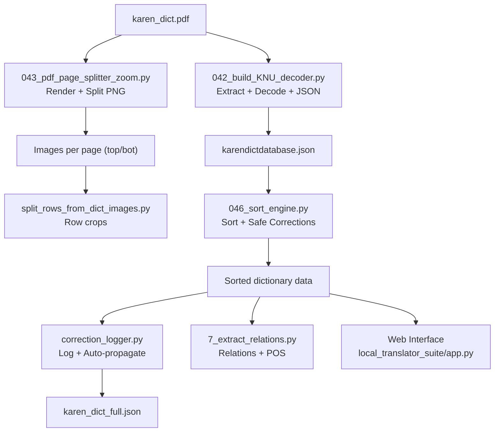
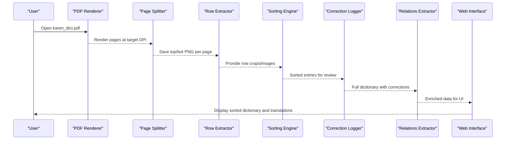
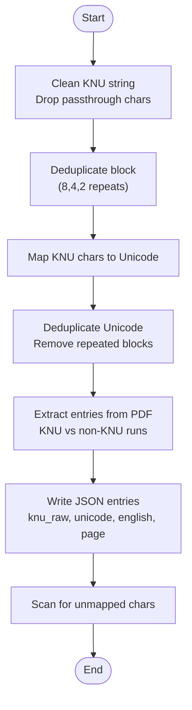
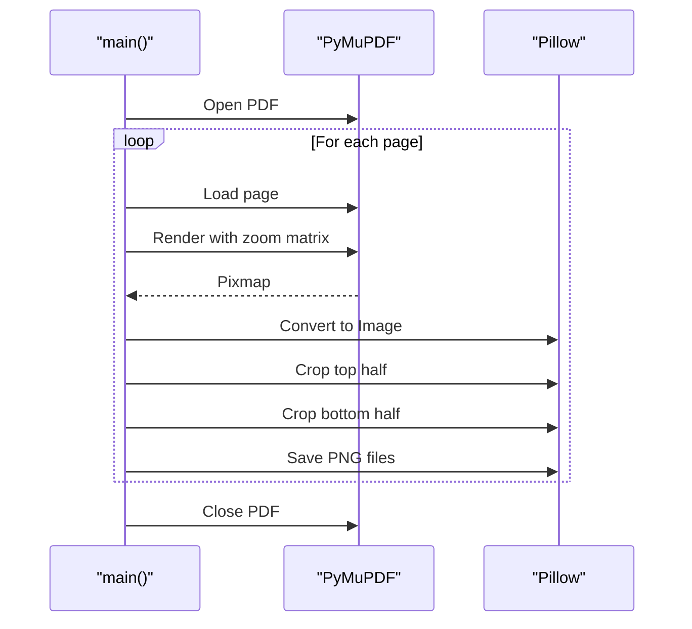
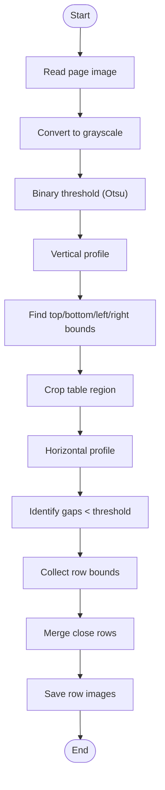
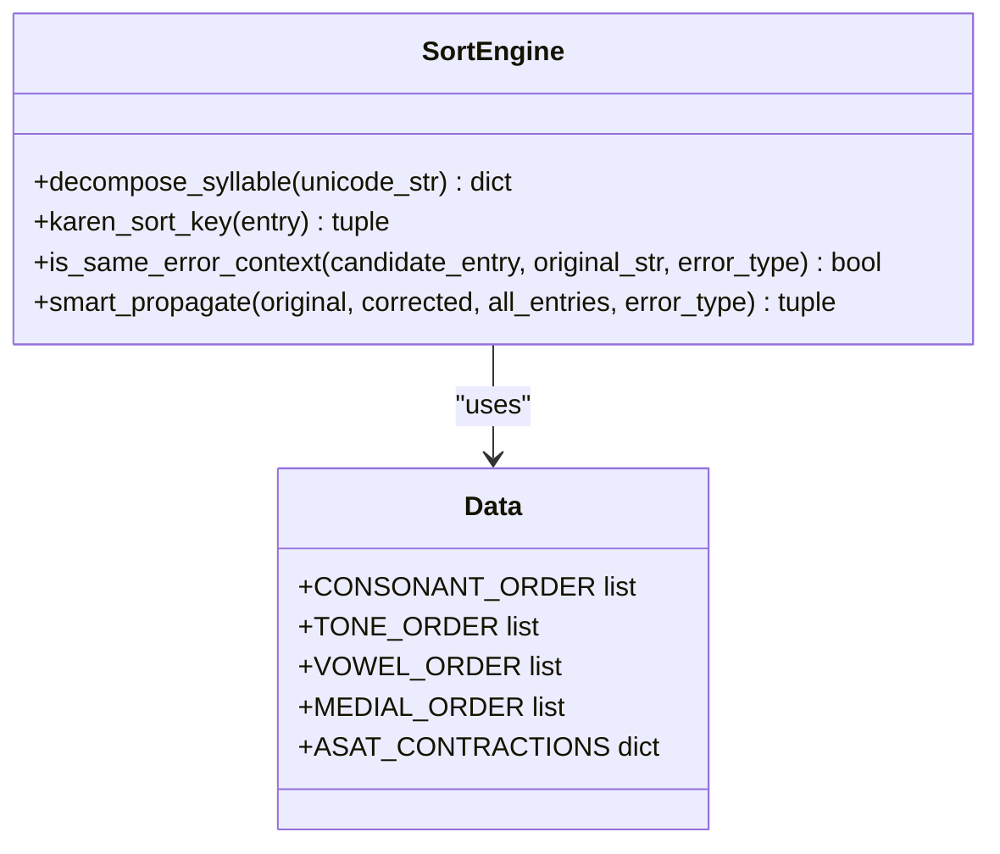
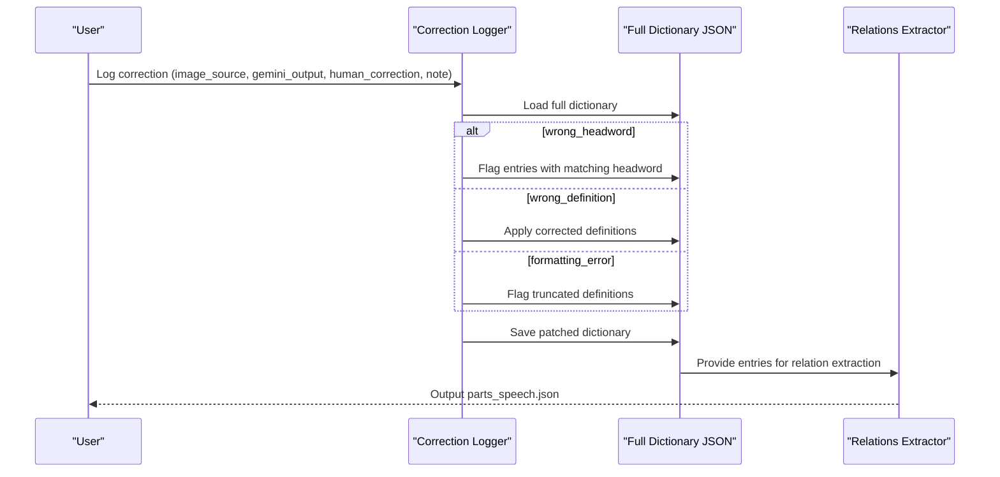
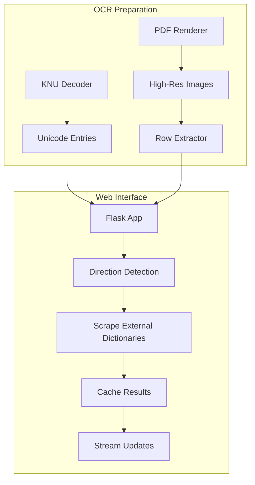
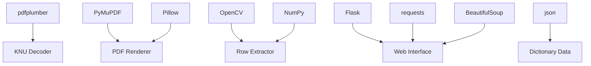

# Dictionary Processing

<cite>
**Referenced Files in This Document**
- [042_build_KNU_decoder.py](file://pipeline/dictionary_processing/042_build_KNU_decoder.py)
- [043_pdf_page_splitter_zoom.py](file://pipeline/dictionary_processing/043_pdf_page_splitter_zoom.py)
- [046_sort_engine.py](file://pipeline/dictionary_processing/046_sort_engine.py)
- [split_rows_from_dict_images.py](file://pipeline/dictionary_processing/split_rows_from_dict_images.py)
- [correction_logger.py](file://pipeline/dictionary_processing/correction_logger.py)
- [2_build_dict_data.py](file://pipeline/dictionary_processing/2_build_dict_data.py)
- [find_bad_chars.py](file://pipeline/dictionary_processing/find_bad_chars.py)
- [cleanup_pages.py](file://pipeline/dictionary_processing/cleanup_pages.py)
- [7_extract_relations.py](file://pipeline/dictionary_processing/7_extract_relations.py)
- [check_setup.py](file://pipeline/dictionary_processing/check_setup.py)
- [app.py](file://pipeline/dictionary_processing/local_translator_suite/app.py)
</cite>

## Table of Contents
1. [Introduction](#introduction)
2. [Project Structure](#project-structure)
3. [Core Components](#core-components)
4. [Architecture Overview](#architecture-overview)
5. [Detailed Component Analysis](#detailed-component-analysis)
6. [Dependency Analysis](#dependency-analysis)
7. [Performance Considerations](#performance-considerations)
8. [Troubleshooting Guide](#troubleshooting-guide)
9. [Conclusion](#conclusion)
10. [Appendices](#appendices)

## Introduction
This document explains the dictionary processing sub-feature that converts legacy KNU-encoded dictionary PDFs into clean Unicode Karen, prepares high-resolution images for OCR and review, extracts rows from dictionary pages, sorts entries according to Sgaw Karen conventions with safe correction propagation, and integrates with a web interface for translation lookup and review workflows. It covers decoding, deduplication, text cleaning, PDF rendering and splitting, row extraction, sorting, cross-reference extraction, configuration, I/O formats, error handling, and relationships with the OCR pipeline and web tools.

## Project Structure
The dictionary processing pipeline is implemented as a set of focused scripts under the dictionary_processing directory:
- Legacy font decoding and JSON assembly: 042_build_KNU_decoder.py
- High-resolution page rendering and splitting: 043_pdf_page_splitter_zoom.py
- Row extraction from dictionary images: split_rows_from_dict_images.py
- Sgaw Karen sorting engine and safe correction propagation: 046_sort_engine.py
- Correction logging and auto-propagation across the full dictionary: correction_logger.py
- Additional utilities: 2_build_dict_data.py (legacy key database), find_bad_chars.py (illegal character scanner), cleanup_pages.py (page range curation), 7_extract_relations.py (cross-references and relations), check_setup.py (environment validation), and app.py (local translator suite used by the web interface).

**Diagram sources**
- [042_build_KNU_decoder.py:215-295](file://pipeline/dictionary_processing/042_build_KNU_decoder.py#L215-L295)
- [043_pdf_page_splitter_zoom.py:134-183](file://pipeline/dictionary_processing/043_pdf_page_splitter_zoom.py#L134-L183)
- [split_rows_from_dict_images.py:80-113](file://pipeline/dictionary_processing/split_rows_from_dict_images.py#L80-L113)
- [046_sort_engine.py:93-160](file://pipeline/dictionary_processing/046_sort_engine.py#L93-L160)
- [correction_logger.py:70-123](file://pipeline/dictionary_processing/correction_logger.py#L70-L123)
- [7_extract_relations.py:62-141](file://pipeline/dictionary_processing/7_extract_relations.py#L62-L141)
- [app.py:666-686](file://pipeline/dictionary_processing/local_translator_suite/app.py#L666-L686)

**Section sources**
- [042_build_KNU_decoder.py:1-423](file://pipeline/dictionary_processing/042_build_KNU_decoder.py#L1-L423)
- [043_pdf_page_splitter_zoom.py:1-190](file://pipeline/dictionary_processing/043_pdf_page_splitter_zoom.py#L1-L190)
- [split_rows_from_dict_images.py:1-114](file://pipeline/dictionary_processing/split_rows_from_dict_images.py#L1-L114)
- [046_sort_engine.py:1-313](file://pipeline/dictionary_processing/046_sort_engine.py#L1-L313)
- [correction_logger.py:1-181](file://pipeline/dictionary_processing/correction_logger.py#L1-L181)
- [2_build_dict_data.py:1-206](file://pipeline/dictionary_processing/2_build_dict_data.py#L1-L206)
- [find_bad_chars.py:1-23](file://pipeline/dictionary_processing/find_bad_chars.py#L1-L23)
- [cleanup_pages.py:1-45](file://pipeline/dictionary_processing/cleanup_pages.py#L1-L45)
- [7_extract_relations.py:1-145](file://pipeline/dictionary_processing/7_extract_relations.py#L1-L145)
- [check_setup.py:1-62](file://pipeline/dictionary_processing/check_setup.py#L1-L62)
- [app.py:1-800](file://pipeline/dictionary_processing/local_translator_suite/app.py#L1-L800)

## Core Components
- KNU decoder and deduplication: Converts legacy KNU characters to Myanmar Unicode, removes 4x repetition artifacts, cleans passthrough characters, and builds structured JSON entries with raw KNU, Unicode, English, and page metadata. Also supports repairing existing JSON by re-deduplicating Unicode fields.
- PDF renderer and splitter: Renders each PDF page at high DPI using PyMuPDF, splits each page into top and bottom halves for higher effective zoom, and saves numbered PNG files for OCR or human review.
- Row extraction: Detects table regions in dictionary images, computes horizontal projections to identify rows, merges close rows, and outputs individual row images for downstream OCR or inspection.
- Sorting engine: Implements Sgaw Karen canonical sort order across consonant, tone, vowel, and medial levels; decomposes syllables; provides safe correction propagation that avoids over-correcting real words sharing substrings.
- Correction logger: Logs human corrections, classifies errors, auto-propagates fixes across the full dictionary, flags entries needing review, and builds smart prompts for improved future extractions.
- Relations extractor: Scans definitions for markers like “co.”, “see”, “cf.”, “from”, “do.”, “analogous” to extract etymology, compounds, cross-references, ditto references, analogous terms, and part-of-speech tags.
- Utilities: Build legacy key database, scan for illegal characters, curate page ranges, validate setup, and provide a local translator suite integrated with the web interface.

**Section sources**
- [042_build_KNU_decoder.py:86-206](file://pipeline/dictionary_processing/042_build_KNU_decoder.py#L86-L206)
- [042_build_KNU_decoder.py:215-295](file://pipeline/dictionary_processing/042_build_KNU_decoder.py#L215-L295)
- [043_pdf_page_splitter_zoom.py:36-183](file://pipeline/dictionary_processing/043_pdf_page_splitter_zoom.py#L36-L183)
- [split_rows_from_dict_images.py:13-113](file://pipeline/dictionary_processing/split_rows_from_dict_images.py#L13-L113)
- [046_sort_engine.py:15-160](file://pipeline/dictionary_processing/046_sort_engine.py#L15-L160)
- [correction_logger.py:17-123](file://pipeline/dictionary_processing/correction_logger.py#L17-L123)
- [7_extract_relations.py:7-141](file://pipeline/dictionary_processing/7_extract_relations.py#L7-L141)
- [2_build_dict_data.py:8-206](file://pipeline/dictionary_processing/2_build_dict_data.py#L8-L206)
- [find_bad_chars.py:1-23](file://pipeline/dictionary_processing/find_bad_chars.py#L1-L23)
- [cleanup_pages.py:1-45](file://pipeline/dictionary_processing/cleanup_pages.py#L1-L45)
- [check_setup.py:1-62](file://pipeline/dictionary_processing/check_setup.py#L1-L62)
- [app.py:666-686](file://pipeline/dictionary_processing/local_translator_suite/app.py#L666-L686)

## Architecture Overview
The dictionary processing architecture follows a staged pipeline:
1. Input PDF ingestion and optional legacy decoding.
2. High-resolution rendering and page splitting for OCR readiness.
3. Row extraction to isolate dictionary entries.
4. Sorting and correction propagation to ensure canonical order and quality.
5. Relation extraction to enrich entries with semantic links.
6. Web integration for lookup, translation, and review.

**Diagram sources**
- [043_pdf_page_splitter_zoom.py:134-183](file://pipeline/dictionary_processing/043_pdf_page_splitter_zoom.py#L134-L183)
- [split_rows_from_dict_images.py:80-113](file://pipeline/dictionary_processing/split_rows_from_dict_images.py#L80-L113)
- [046_sort_engine.py:93-160](file://pipeline/dictionary_processing/046_sort_engine.py#L93-L160)
- [correction_logger.py:70-123](file://pipeline/dictionary_processing/correction_logger.py#L70-L123)
- [7_extract_relations.py:62-141](file://pipeline/dictionary_processing/7_extract_relations.py#L62-L141)
- [app.py:666-686](file://pipeline/dictionary_processing/local_translator_suite/app.py#L666-L686)

## Detailed Component Analysis

### KNU Legacy Font Decoding and Deduplication
- Character mapping: The script defines a comprehensive mapping from legacy KNU ASCII characters to Myanmar Unicode codepoints, including base consonants, vowels, diacritics, tones, and scanner-identified unmapped characters. Passthrough characters are silently dropped during cleaning.
- Deduplication algorithms:
  - Block-level deduplication detects exact Nx repeats (8, 4, 2) and returns one copy.
  - Unicode-level deduplication walks through strings to remove repeated blocks within joined groups, handling cases like stacked tone marks and repeated syllables.
- Text cleaning: Removes passthrough characters and ensures only mapped or allowed characters remain; unmapped ASCII characters are retained for detection and later analysis.
- PDF extraction: Parses the dictionary PDF page by page, identifies runs of KNU vs non-KNU fonts, and builds JSON entries capturing raw KNU, converted Unicode, English text, and page numbers. It also scans for remaining unmapped characters.
- Repair utility: Loads an existing JSON file, re-applies Unicode deduplication across all entries, and writes back in place with a summary of changes.

**Diagram sources**
- [042_build_KNU_decoder.py:86-206](file://pipeline/dictionary_processing/042_build_KNU_decoder.py#L86-L206)
- [042_build_KNU_decoder.py:215-295](file://pipeline/dictionary_processing/042_build_KNU_decoder.py#L215-L295)

**Section sources**
- [042_build_KNU_decoder.py:11-80](file://pipeline/dictionary_processing/042_build_KNU_decoder.py#L11-L80)
- [042_build_KNU_decoder.py:86-206](file://pipeline/dictionary_processing/042_build_KNU_decoder.py#L86-L206)
- [042_build_KNU_decoder.py:215-295](file://pipeline/dictionary_processing/042_build_KNU_decoder.py#L215-L295)
- [042_build_KNU_decoder.py:304-330](file://pipeline/dictionary_processing/042_build_KNU_decoder.py#L304-L330)

### PDF Processing Pipeline for High-Resolution Rendering and Page Splitting
- Rendering: Uses PyMuPDF to render each page to a pixmap at a configurable DPI (default 300), applying a zoom matrix to enlarge glyphs for clarity.
- Splitting: Crops each rendered page into top and bottom halves to double effective zoom when processed further, saving as numbered PNG files.
- Progress reporting: Prints progress every 10 pages and finalizes with a summary of total images produced.

**Diagram sources**
- [043_pdf_page_splitter_zoom.py:76-93](file://pipeline/dictionary_processing/043_pdf_page_splitter_zoom.py#L76-L93)
- [043_pdf_page_splitter_zoom.py:104-127](file://pipeline/dictionary_processing/043_pdf_page_splitter_zoom.py#L104-L127)
- [043_pdf_page_splitter_zoom.py:134-183](file://pipeline/dictionary_processing/043_pdf_page_splitter_zoom.py#L134-L183)

**Section sources**
- [043_pdf_page_splitter_zoom.py:36-183](file://pipeline/dictionary_processing/043_pdf_page_splitter_zoom.py#L36-L183)

### Row Extraction from Dictionary Pages
- Table region detection: Thresholds the image to binary, computes vertical and horizontal profiles to locate the bounding box of printed content, and crops to the table area.
- Row segmentation: Computes horizontal projection on the cropped table, identifies gaps below a threshold, collects row bounds, and merges nearby rows based on a minimum gap pixel threshold.
- Output: Saves each detected row as a separate PNG file under a page-specific directory.

**Diagram sources**
- [split_rows_from_dict_images.py:13-37](file://pipeline/dictionary_processing/split_rows_from_dict_images.py#L13-L37)
- [split_rows_from_dict_images.py:39-78](file://pipeline/dictionary_processing/split_rows_from_dict_images.py#L39-L78)
- [split_rows_from_dict_images.py:80-113](file://pipeline/dictionary_processing/split_rows_from_dict_images.py#L80-L113)

**Section sources**
- [split_rows_from_dict_images.py:13-113](file://pipeline/dictionary_processing/split_rows_from_dict_images.py#L13-L113)

### Sgaw Karen Sorting Engine with Safe Correction Handling
- Canonical sort order: Implements four-level sorting: consonant → tone → vowel → medial, reflecting the actual dictionary layout where the bare -ah vowel opens the tone group.
- Syllable decomposition: Breaks a Karen Unicode string into consonant, medials, vowel, and tone components, handling ASAT contractions specially.
- Sort key generation: Produces a tuple of ranks for each component to enable Python’s sort() to produce authentic dictionary order.
- Smart correction propagation: Classifies errors (tone, medial, consonant), then applies corrections only to entries that match the same linguistic context (e.g., same consonant+vowel for tone errors), preventing false positives where identical substrings occur in different real words.

**Diagram sources**
- [046_sort_engine.py:15-77](file://pipeline/dictionary_processing/046_sort_engine.py#L15-L77)
- [046_sort_engine.py:93-160](file://pipeline/dictionary_processing/046_sort_engine.py#L93-L160)
- [046_sort_engine.py:168-252](file://pipeline/dictionary_processing/046_sort_engine.py#L168-L252)

**Section sources**
- [046_sort_engine.py:15-77](file://pipeline/dictionary_processing/046_sort_engine.py#L15-L77)
- [046_sort_engine.py:93-160](file://pipeline/dictionary_processing/046_sort_engine.py#L93-L160)
- [046_sort_engine.py:168-252](file://pipeline/dictionary_processing/046_sort_engine.py#L168-L252)

### Correction Logging and Cross-Reference Management
- Error classification: Determines whether a correction involves wrong headword, wrong definition, or formatting issues.
- Auto-propagation: Scans the full dictionary JSON to apply or flag corrections based on error type:
  - Wrong headword: Flags matching entries for review rather than auto-changing headwords.
  - Wrong definition: Applies verified correct definitions directly.
  - Formatting errors: Flags truncated definitions missing proper punctuation.
- Smart prompt building: Generates a system prompt incorporating recent corrections to improve future extractions.
- Cross-reference extraction: Scans definitions for markers to extract etymology, compounds, cross-references, ditto references, analogous terms, and part-of-speech tags, producing a structured relations file.

**Diagram sources**
- [correction_logger.py:17-123](file://pipeline/dictionary_processing/correction_logger.py#L17-L123)
- [7_extract_relations.py:62-141](file://pipeline/dictionary_processing/7_extract_relations.py#L62-L141)

**Section sources**
- [correction_logger.py:17-123](file://pipeline/dictionary_processing/correction_logger.py#L17-L123)
- [7_extract_relations.py:7-141](file://pipeline/dictionary_processing/7_extract_relations.py#L7-L141)

### Configuration Options, Input/Output Formats, and Error Handling
- Configuration options:
  - DPI and zoom for PDF rendering (default 300 DPI, zoom factor derived from 300/72).
  - Output directories for split pages and row images.
  - Environment variables for scrape delays and timeouts in the web interface.
- Input formats:
  - PDF dictionary (karen_dict.pdf).
  - Existing JSON dictionaries (karendictdatabase.json, karen_dict_full.json).
  - Images for row extraction (dict_images/*.jpg or *.png).
- Output formats:
  - JSON entries with knu_raw, unicode, english, page.
  - PNG images per page half and per row.
  - parts_speech.json with extracted relations and POS tags.
  - groundtruth_corrections.json with logged corrections.
- Error handling strategies:
  - Missing dependencies: Exits with clear messages if PyMuPDF or Pillow not installed.
  - Missing input files: Checks existence of PDF and JSON paths before processing.
  - Atomic writes: Uses temporary files and os.replace to prevent corruption on crash.
  - Safe JSON loading: Handles corrupt JSON by backing up bad files and returning defaults.
  - Graceful degradation: Skips entries without definitions or with missing fields.

**Section sources**
- [043_pdf_page_splitter_zoom.py:36-67](file://pipeline/dictionary_processing/043_pdf_page_splitter_zoom.py#L36-L67)
- [043_pdf_page_splitter_zoom.py:134-183](file://pipeline/dictionary_processing/043_pdf_page_splitter_zoom.py#L134-L183)
- [correction_logger.py:70-123](file://pipeline/dictionary_processing/correction_logger.py#L70-L123)
- [cleanup_pages.py:38-45](file://pipeline/dictionary_processing/cleanup_pages.py#L38-L45)
- [app.py:511-525](file://pipeline/dictionary_processing/local_translator_suite/app.py#L511-L525)

### Relationships with OCR Pipeline and Web Interface
- OCR pipeline integration:
  - High-resolution page splits and row crops prepare images for vision models or human review.
  - KNU decoding produces clean Unicode suitable for OCR training data generation and paragraph assembly.
- Web interface integration:
  - The local translator suite detects direction (Karen-to-English or English-to-Karen), scrapes external dictionaries, caches results, and streams live updates via Flask.
  - It uses regex patterns to identify Karen Unicode and English text, normalizes queries, and filters out bad results.
  - It records attempts and maintains a reverse cache for faster lookups.

**Diagram sources**
- [042_build_KNU_decoder.py:215-295](file://pipeline/dictionary_processing/042_build_KNU_decoder.py#L215-L295)
- [043_pdf_page_splitter_zoom.py:134-183](file://pipeline/dictionary_processing/043_pdf_page_splitter_zoom.py#L134-L183)
- [split_rows_from_dict_images.py:80-113](file://pipeline/dictionary_processing/split_rows_from_dict_images.py#L80-L113)
- [app.py:666-686](file://pipeline/dictionary_processing/local_translator_suite/app.py#L666-L686)
- [app.py:511-525](file://pipeline/dictionary_processing/local_translator_suite/app.py#L511-L525)

**Section sources**
- [app.py:666-686](file://pipeline/dictionary_processing/local_translator_suite/app.py#L666-L686)
- [app.py:511-525](file://pipeline/dictionary_processing/local_translator_suite/app.py#L511-L525)

## Dependency Analysis
Key dependencies and their roles:
- pdfplumber: Extracts text and character metadata from PDFs for KNU decoding.
- PyMuPDF (fitz): Renders PDF pages to high-resolution images for splitting and OCR preparation.
- Pillow: Handles image cropping and saving.
- OpenCV and NumPy: Used in row extraction for thresholding, projection analysis, and merging row segments.
- Flask, requests, BeautifulSoup: Power the web interface for scraping, caching, and streaming updates.
- json: Central format for dictionary entries, corrections, and relations.

**Diagram sources**
- [042_build_KNU_decoder.py:1-5](file://pipeline/dictionary_processing/042_build_KNU_decoder.py#L1-L5)
- [043_pdf_page_splitter_zoom.py:18-34](file://pipeline/dictionary_processing/043_pdf_page_splitter_zoom.py#L18-L34)
- [split_rows_from_dict_images.py:1-5](file://pipeline/dictionary_processing/split_rows_from_dict_images.py#L1-L5)
- [app.py:15-17](file://pipeline/dictionary_processing/local_translator_suite/app.py#L15-L17)

**Section sources**
- [042_build_KNU_decoder.py:1-5](file://pipeline/dictionary_processing/042_build_KNU_decoder.py#L1-L5)
- [043_pdf_page_splitter_zoom.py:18-34](file://pipeline/dictionary_processing/043_pdf_page_splitter_zoom.py#L18-L34)
- [split_rows_from_dict_images.py:1-5](file://pipeline/dictionary_processing/split_rows_from_dict_images.py#L1-L5)
- [app.py:15-17](file://pipeline/dictionary_processing/local_translator_suite/app.py#L15-L17)

## Performance Considerations
- Rendering resolution: 300 DPI balances glyph clarity and file size; higher DPI increases memory and disk usage.
- Deduplication efficiency: Block-level checks first, then position-by-position scanning for repeated blocks; minimizes unnecessary work.
- Row extraction thresholds: Otsu thresholding and projection-based gap detection are robust but may require tuning for noisy scans.
- Sorting complexity: Decomposition and rank lookup are linear in syllable length; overall sort is dominated by dataset size.
- Web interface caching: Reverse cache reduces redundant lookups; atomic writes prevent corruption during concurrent access.

[No sources needed since this section provides general guidance]

## Troubleshooting Guide
Common issues and resolutions:
- Missing dependencies: Install PyMuPDF and Pillow for PDF rendering; install OpenCV and NumPy for row extraction.
- Missing input files: Ensure karen_dict.pdf exists in the expected location; verify JSON paths for repair operations.
- Corrupt JSON: Use safe JSON loaders that backup bad files; delete progress.json if it contains corrupt integer entries.
- Unmapped characters: Run unmapped character scanner to identify gaps in KNU_MAP; update mapping accordingly.
- Over-correction: Use smart propagation to avoid changing real words; rely on context guards for tone, medial, and consonant errors.
- API keys: Set GEMINI_API_KEY environment variable for OCR and translation workflows.

**Section sources**
- [043_pdf_page_splitter_zoom.py:20-31](file://pipeline/dictionary_processing/043_pdf_page_splitter_zoom.py#L20-L31)
- [check_setup.py:13-60](file://pipeline/dictionary_processing/check_setup.py#L13-L60)
- [find_bad_chars.py:1-23](file://pipeline/dictionary_processing/find_bad_chars.py#L1-L23)
- [cleanup_pages.py:32-45](file://pipeline/dictionary_processing/cleanup_pages.py#L32-L45)
- [046_sort_engine.py:168-252](file://pipeline/dictionary_processing/046_sort_engine.py#L168-L252)

## Conclusion
The dictionary processing sub-feature provides a robust pipeline for converting legacy KNU-encoded dictionary PDFs into clean Unicode, preparing high-resolution images for OCR, extracting rows, sorting entries according to Sgaw Karen conventions, and integrating with a web interface for lookup and review. It emphasizes safety in correction propagation, performance in rendering and processing, and extensibility through modular scripts. The combination of decoding, deduplication, sorting, and relation extraction ensures accurate, searchable, and maintainable dictionary data.

[No sources needed since this section summarizes without analyzing specific files]

## Appendices
- Example workflow:
  - Decode legacy KNU: Run 042_build_KNU_decoder.py to extract and convert entries to Unicode JSON.
  - Prepare images: Run 043_pdf_page_splitter_zoom.py to render and split pages into high-resolution PNGs.
  - Extract rows: Run split_rows_from_dict_images.py to crop dictionary rows for OCR.
  - Sort and correct: Use 046_sort_engine.py to sort entries and propagate safe corrections.
  - Log corrections: Use correction_logger.py to log and auto-propagate fixes across the full dictionary.
  - Extract relations: Run 7_extract_relations.py to build parts_speech.json with semantic links.
  - Review in web interface: Use local_translator_suite/app.py for lookup, translation, and streaming updates.

**Section sources**
- [042_build_KNU_decoder.py:400-423](file://pipeline/dictionary_processing/042_build_KNU_decoder.py#L400-L423)
- [043_pdf_page_splitter_zoom.py:186-190](file://pipeline/dictionary_processing/043_pdf_page_splitter_zoom.py#L186-L190)
- [split_rows_from_dict_images.py:101-114](file://pipeline/dictionary_processing/split_rows_from_dict_images.py#L101-L114)
- [046_sort_engine.py:294-313](file://pipeline/dictionary_processing/046_sort_engine.py#L294-L313)
- [correction_logger.py:166-181](file://pipeline/dictionary_processing/correction_logger.py#L166-L181)
- [7_extract_relations.py:144-145](file://pipeline/dictionary_processing/7_extract_relations.py#L144-L145)