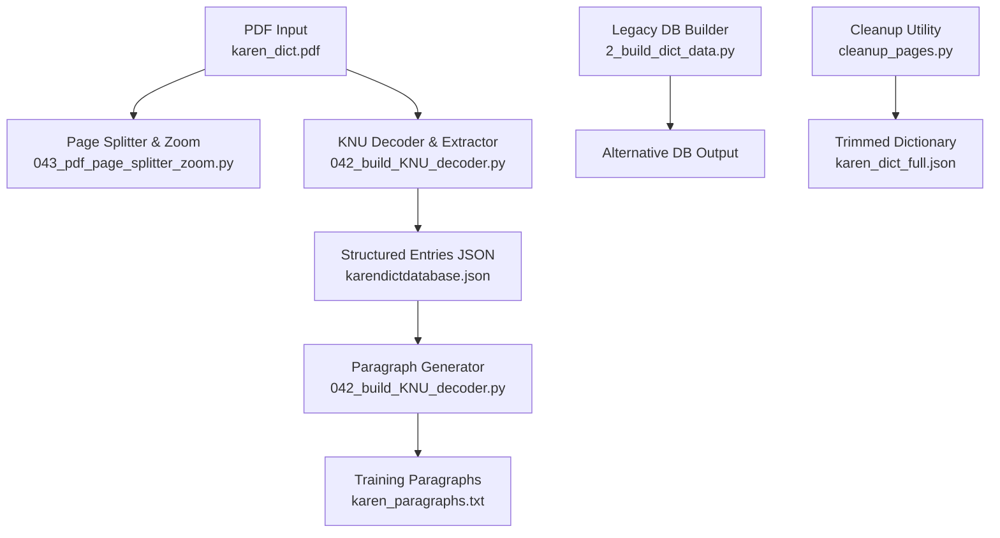
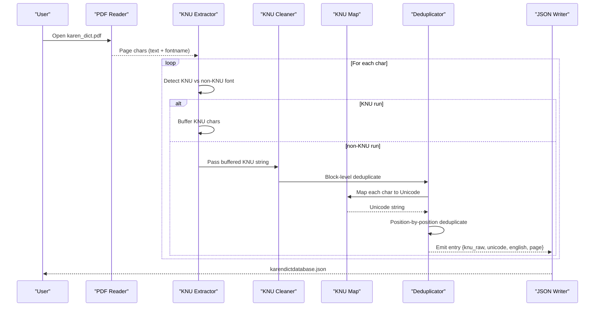
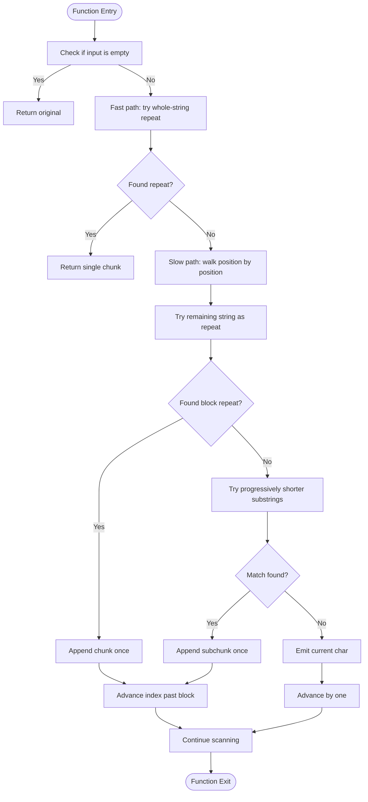
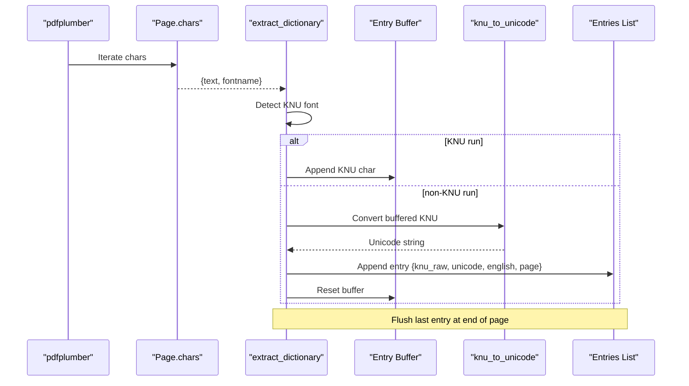
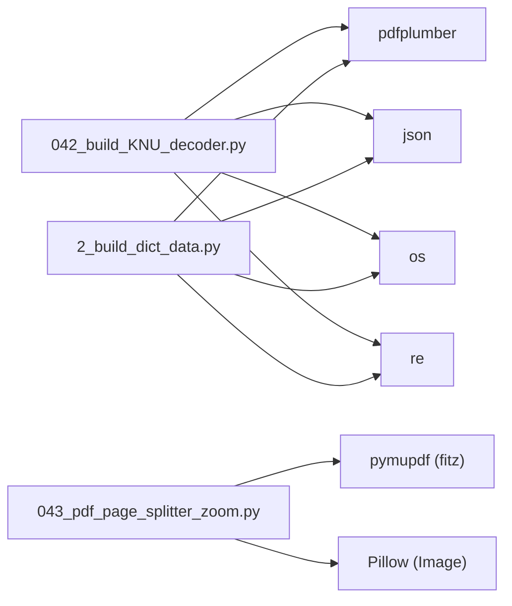

# KNU Font Decoding

<cite>
**Referenced Files in This Document**
- [042_build_KNU_decoder.py](file://pipeline/dictionary_processing/042_build_KNU_decoder.py)
- [043_pdf_page_splitter_zoom.py](file://pipeline/dictionary_processing/043_pdf_page_splitter_zoom.py)
- [2_build_dict_data.py](file://pipeline/dictionary_processing/2_build_dict_data.py)
- [karen_index_map.json](file://karen_index_map.json)
- [karen_dict_full.json](file://karen_dict_full.json)
- [cleanup_pages.py](file://pipeline/dictionary_processing/cleanup_pages.py)
</cite>

## Table of Contents
1. Introduction
2. Project Structure
3. Core Components
4. Architecture Overview
5. Detailed Component Analysis
6. Dependency Analysis
7. Performance Considerations
8. Troubleshooting Guide
9. Conclusion
10. Appendices

## Introduction
This document explains the KNU legacy font decoding system used to convert scanned Karen dictionary pages from a legacy KNU encoding into clean Myanmar Unicode. It covers:
- The complete KNU character mapping (base consonants, vowels, diacritics, tone markers, and scanner artifacts).
- Deduplication algorithms that remove 4x repetition artifacts common in KNU-encoded text, including block-level and position-by-position strategies.
- Text cleaning that removes passthrough characters and handles unmapped scanner artifacts.
- The PDF extraction pipeline that detects KNU vs non-KNU font runs and builds structured entries with raw KNU, Unicode, English glosses, and page numbers.
- Configuration options, error handling strategies, and integration points with the broader dictionary processing workflow.

## Project Structure
The KNU decoding system is implemented as part of the dictionary processing pipeline. Key files:
- 042_build_KNU_decoder.py: Defines the KNU map, deduplication, conversion, PDF extraction, JSON repair, and paragraph generation.
- 043_pdf_page_splitter_zoom.py: Renders PDF pages at high resolution and splits them into top/bottom halves for OCR or inspection.
- 2_build_dict_data.py: Alternative legacy-to-Unicode decoder and database builder using a different internal encoding scheme.
- karen_index_map.json: Index mapping used elsewhere in the project (not directly used by the KNU decoder).
- karen_dict_full.json: Final cleaned dictionary output produced by earlier stages.
- cleanup_pages.py: Utility to trim the final dictionary to specific page ranges.

**Diagram sources**
- [042_build_KNU_decoder.py:215-295](file://pipeline/dictionary_processing/042_build_KNU_decoder.py#L215-L295)
- [043_pdf_page_splitter_zoom.py:134-183](file://pipeline/dictionary_processing/043_pdf_page_splitter_zoom.py#L134-L183)
- [2_build_dict_data.py:135-201](file://pipeline/dictionary_processing/2_build_dict_data.py#L135-L201)
- [cleanup_pages.py:19-44](file://pipeline/dictionary_processing/cleanup_pages.py#L19-L44)

**Section sources**
- [042_build_KNU_decoder.py:1-423](file://pipeline/dictionary_processing/042_build_KNU_decoder.py#L1-L423)
- [043_pdf_page_splitter_zoom.py:1-190](file://pipeline/dictionary_processing/043_pdf_page_splitter_zoom.py#L1-L190)
- [2_build_dict_data.py:1-206](file://pipeline/dictionary_processing/2_build_dict_data.py#L1-L206)
- [cleanup_pages.py:1-45](file://pipeline/dictionary_processing/cleanup_pages.py#L1-L45)

## Core Components
- KNU_MAP: Character-level mapping from legacy KNU ASCII symbols to Myanmar Unicode codepoints, covering base consonants, vowels, diacritics, tone markers, and scanner-identified unmapped characters.
- Passthrough filter: Removes whitespace, tabs, newlines, hyphens, braces, and asterisks during cleaning.
- Deduplication: Two-stage removal of Nx repetitions (commonly 4x), first at the block level on raw KNU strings, then position-by-position on Unicode strings.
- Conversion: Clean KNU → Unicode via mapping after deduplication and passthrough filtering.
- PDF Extraction: Detects font runs; when a run uses a KNU font, it buffers characters until a non-KNU run appears, then emits an entry with raw KNU, converted Unicode, English gloss, and page number.
- JSON Repair: Re-applies full Unicode deduplication to existing JSON outputs without re-running PDF extraction.
- Paragraph Generation: Assembles cleaned Unicode syllables into paragraphs suitable for training image rendering, breaking at tone marker boundaries.

**Section sources**
- [042_build_KNU_decoder.py:11-80](file://pipeline/dictionary_processing/042_build_KNU_decoder.py#L11-L80)
- [042_build_KNU_decoder.py:82-84](file://pipeline/dictionary_processing/042_build_KNU_decoder.py#L82-L84)
- [042_build_KNU_decoder.py:93-178](file://pipeline/dictionary_processing/042_build_KNU_decoder.py#L93-L178)
- [042_build_KNU_decoder.py:185-206](file://pipeline/dictionary_processing/042_build_KNU_decoder.py#L185-L206)
- [042_build_KNU_decoder.py:215-295](file://pipeline/dictionary_processing/042_build_KNU_decoder.py#L215-L295)
- [042_build_KNU_decoder.py:304-330](file://pipeline/dictionary_processing/042_build_KNU_decoder.py#L304-L330)
- [042_build_KNU_decoder.py:339-393](file://pipeline/dictionary_processing/042_build_KNU_decoder.py#L339-L393)

## Architecture Overview
The system processes a scanned dictionary PDF through two complementary paths:
- Image path: Render pages at 300 DPI and split each page into top/bottom halves for OCR or visual inspection.
- Text path: Extract character-level data per page, detect KNU font runs, build structured entries, convert to Unicode, and generate paragraphs.

**Diagram sources**
- [042_build_KNU_decoder.py:215-295](file://pipeline/dictionary_processing/042_build_KNU_decoder.py#L215-L295)
- [042_build_KNU_decoder.py:93-178](file://pipeline/dictionary_processing/042_build_KNU_decoder.py#L93-L178)
- [042_build_KNU_decoder.py:185-206](file://pipeline/dictionary_processing/042_build_KNU_decoder.py#L185-L206)

## Detailed Component Analysis

### KNU Character Mapping (KNU_MAP)
KNU_MAP defines how legacy KNU ASCII symbols map to Myanmar Unicode codepoints. Categories include:
- Base consonants: e.g., 'u' maps to က, 'c' to ခ, 'g' to ဂ, etc.
- Vowels and diacritics: e.g., '>' to ိ, 'G' to ီ, 'H' to ွ, 'J' to ြ, 'X' to ာ, "'" to ်, '.' to ့, ',' to ံ, ';' to း, '<' to ္, 'R' to ျ, 'M' to ံ alt, '[' to ေ, ']' to ဲ, 'z' to ဿ, 'd' to ာ.
- Tone markers: ';' maps to း, '%' and '_' also mapped to tone variants.
- Scanner artifacts: '%', '+', '/', '=', '_' are treated as alternate mappings for tone, medial, stacker, and vowel glyphs.
- Uppercase phonetic values: 'S', 'V', 'K', 'A', 'B', 'F', 'N', 'T', 'W', 'I', 'O', 'U' provide alternate mappings for various Myanmar glyphs.

Notes:
- Some keys are aliases for the same Unicode codepoint (e.g., 'E' and '&' both map to အ).
- The mapping includes Karen-specific vowels and medials where applicable.

**Section sources**
- [042_build_KNU_decoder.py:11-80](file://pipeline/dictionary_processing/042_build_KNU_decoder.py#L11-L80)

### Deduplication Algorithms
Two strategies handle 4x repetition artifacts:
- Block-level deduplication (deduplicate_block): Checks if the entire string is an exact repeat of a smaller chunk, trying divisors 8, 4, 2 in order. If found, returns one copy.
- Position-by-position deduplication (deduplicate_unicode): Walks the Unicode string to find maximal repeating blocks independently, emitting one copy per block. Handles joined groups like ပါပါပါပါးးးး → ပါး.

Algorithm flow:

**Diagram sources**
- [042_build_KNU_decoder.py:93-178](file://pipeline/dictionary_processing/042_build_KNU_decoder.py#L93-L178)

**Section sources**
- [042_build_KNU_decoder.py:93-178](file://pipeline/dictionary_processing/042_build_KNU_decoder.py#L93-L178)

### Text Cleaning Process
- Passthrough characters: Spaces, tabs, newlines, hyphens, braces, and asterisks are silently dropped during cleaning.
- Unmapped scanner artifacts: Characters not present in KNU_MAP are kept as-is to allow downstream detection of unmapped glyphs.
- Conversion steps:
  1. Strip 4x repetition artifact from raw KNU string.
  2. Remove passthrough characters.
  3. Map each character through KNU_MAP; keep unmapped characters for later analysis.

Example transformations (described):
- Raw KNU: "ကကကက" → After block dedup: "က" → After mapping: "က"
- Raw KNU: "ပါပါပါပါးးးး" → After Unicode dedup: "ပါး"
- Raw KNU with passthrough: " -က- " → After cleaning: "က"

**Section sources**
- [042_build_KNU_decoder.py:82-84](file://pipeline/dictionary_processing/042_build_KNU_decoder.py#L82-L84)
- [042_build_KNU_decoder.py:185-206](file://pipeline/dictionary_processing/042_build_KNU_decoder.py#L185-L206)

### PDF Extraction Pipeline
The extractor reads character-level data from PDF pages using pdfplumber:
- Detects KNU vs non-KNU font runs by checking if 'KNU' is in the font name.
- Buffers KNU characters until a non-KNU run begins or ends, then emits a structured entry:
  - knu_raw: Raw KNU string before conversion.
  - unicode: Converted Unicode string after deduplication and mapping.
  - english: Accumulated non-KNU text (English gloss) associated with the KNU word cluster.
  - page: Page number (1-based).
- After processing all pages, writes entries to JSON and prints sample output.
- Scans for remaining unmapped characters in the Unicode field and reports any issues.

**Diagram sources**
- [042_build_KNU_decoder.py:215-295](file://pipeline/dictionary_processing/042_build_KNU_decoder.py#L215-L295)

**Section sources**
- [042_build_KNU_decoder.py:215-295](file://pipeline/dictionary_processing/042_build_KNU_decoder.py#L215-L295)

### JSON Repair and Paragraph Generation
- JSON repair: Loads existing JSON, re-deduplicates every Unicode field using the full position-by-position algorithm, and saves changes in place. Useful when only Unicode needs fixing without re-extracting from PDF.
- Paragraph generation: Builds Karen Unicode paragraphs from dictionary JSON:
  - Applies final deduplication pass at assembly time.
  - Skips entries with ASCII artifacts after dedup.
  - Joins syllables without spaces (authentic layout).
  - Breaks paragraphs at tone marker boundaries once minimum length reached.
  - Outputs numbered paragraphs to a text file for training image rendering.

**Section sources**
- [042_build_KNU_decoder.py:304-330](file://pipeline/dictionary_processing/042_build_KNU_decoder.py#L304-L330)
- [042_build_KNU_decoder.py:339-393](file://pipeline/dictionary_processing/042_build_KNU_decoder.py#L339-L393)

### Legacy Decoder Alternative (2_build_dict_data.py)
An alternative decoder uses a different internal encoding scheme with separate maps for consonants, vowels, tones, medials, and asat contractions. It parses PDF text line-by-line, decodes legacy keys to Unicode, and builds a database with indices for quick lookup. While distinct from the KNU decoder, it demonstrates similar patterns of mapping and indexing used across the pipeline.

**Section sources**
- [2_build_dict_data.py:8-78](file://pipeline/dictionary_processing/2_build_dict_data.py#L8-L78)
- [2_build_dict_data.py:81-132](file://pipeline/dictionary_processing/2_build_dict_data.py#L81-L132)
- [2_build_dict_data.py:135-201](file://pipeline/dictionary_processing/2_build_dict_data.py#L135-L201)

## Dependency Analysis
Key dependencies and relationships:
- pdfplumber: Used for character-level PDF extraction in the KNU decoder.
- json: Used for reading/writing structured entries and configuration.
- os/re: Used for path handling and regex operations in related scripts.
- pymupdf/Pillow: Used in the page splitter for high-resolution rendering and cropping.

**Diagram sources**
- [042_build_KNU_decoder.py:1-5](file://pipeline/dictionary_processing/042_build_KNU_decoder.py#L1-L5)
- [043_pdf_page_splitter_zoom.py:18-34](file://pipeline/dictionary_processing/043_pdf_page_splitter_zoom.py#L18-L34)
- [2_build_dict_data.py:1-6](file://pipeline/dictionary_processing/2_build_dict_data.py#L1-L6)

**Section sources**
- [042_build_KNU_decoder.py:1-5](file://pipeline/dictionary_processing/042_build_KNU_decoder.py#L1-L5)
- [043_pdf_page_splitter_zoom.py:18-34](file://pipeline/dictionary_processing/043_pdf_page_splitter_zoom.py#L18-L34)
- [2_build_dict_data.py:1-6](file://pipeline/dictionary_processing/2_build_dict_data.py#L1-L6)

## Performance Considerations
- Block-level deduplication provides a fast path for exact repeats, reducing overhead for common 4x artifacts.
- Position-by-position deduplication ensures correctness for mixed or partial repeats but has higher complexity due to substring checks.
- PDF extraction processes characters sequentially; large PDFs may benefit from batching or parallelization if needed.
- Rendering at 300 DPI balances quality and file size; higher DPI increases memory usage and processing time.

[No sources needed since this section provides general guidance]

## Troubleshooting Guide
Common issues and resolutions:
- Missing PDF: Ensure karen_dict.pdf exists in the expected location; the script will print an error and exit if not found.
- Unmapped characters: The extractor scans Unicode fields for remaining ASCII artifacts below 128 not in allowed set; report and update KNU_MAP accordingly.
- Incomplete deduplication: Use JSON repair to re-apply full Unicode deduplication without re-extraction.
- Paragraph breaks: Adjust minimum character threshold and tone marker boundary logic if paragraph segmentation is too aggressive or too conservative.

**Section sources**
- [042_build_KNU_decoder.py:282-293](file://pipeline/dictionary_processing/042_build_KNU_decoder.py#L282-L293)
- [042_build_KNU_decoder.py:304-330](file://pipeline/dictionary_processing/042_build_KNU_decoder.py#L304-L330)
- [043_pdf_page_splitter_zoom.py:136-141](file://pipeline/dictionary_processing/043_pdf_page_splitter_zoom.py#L136-L141)

## Conclusion
The KNU legacy font decoding system provides a robust pipeline for converting scanned Karen dictionary pages from KNU encoding to clean Myanmar Unicode. It combines precise character mapping, multi-stage deduplication, and careful PDF extraction to produce structured entries suitable for downstream processing. The system includes utilities for repairing existing outputs and generating training paragraphs, integrating seamlessly with the broader dictionary processing workflow.

[No sources needed since this section summarizes without analyzing specific files]

## Appendices

### Configuration Options
- PDF path: Set to karen_dict.pdf in the same folder as the script.
- Output directory: karen_dict_pages for rendered images.
- DPI and zoom: 300 DPI with zoom factor derived from 300/72 for crisp glyph rendering.
- Paragraph thresholds: Minimum characters and tone marker boundaries control paragraph segmentation.

**Section sources**
- [043_pdf_page_splitter_zoom.py:40-54](file://pipeline/dictionary_processing/043_pdf_page_splitter_zoom.py#L40-L54)
- [042_build_KNU_decoder.py:339-393](file://pipeline/dictionary_processing/042_build_KNU_decoder.py#L339-L393)

### Integration Points
- Dictionary JSON: Structured entries feed into translation pipelines and training data generation.
- Cleanup utility: Trims final dictionary to specific page ranges for focused processing.
- Index mapping: Supports broader project workflows beyond KNU decoding.

**Section sources**
- [cleanup_pages.py:19-44](file://pipeline/dictionary_processing/cleanup_pages.py#L19-L44)
- [karen_index_map.json:1-200](file://karen_index_map.json#L1-L200)
- [karen_dict_full.json:1-200](file://karen_dict_full.json#L1-L200)