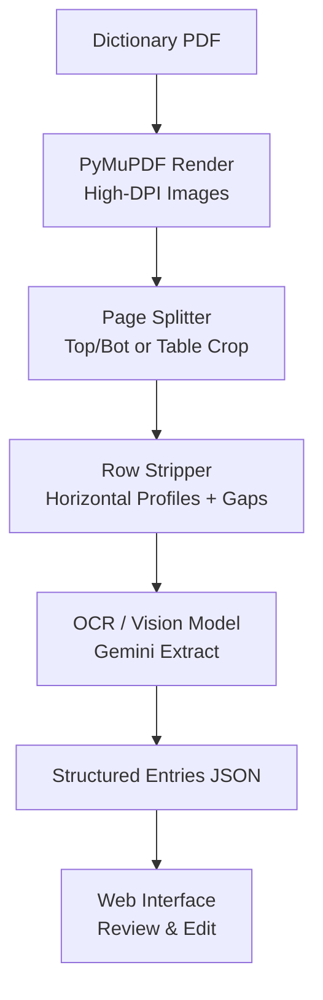
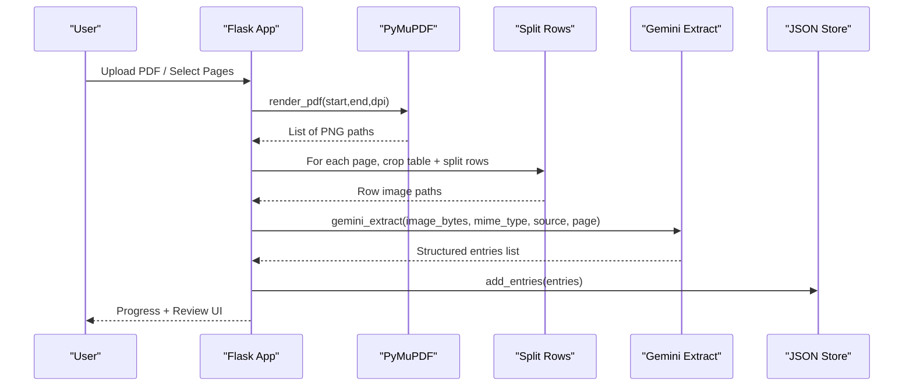
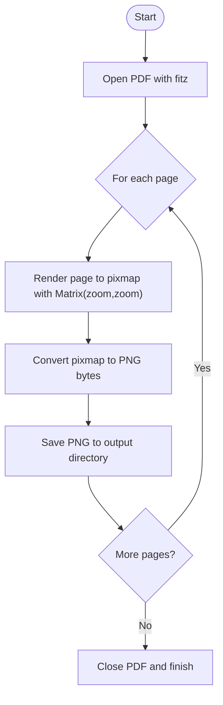
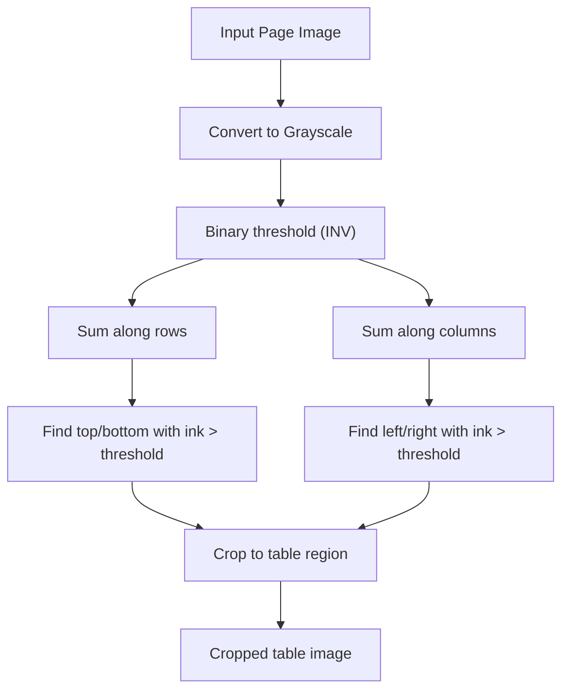
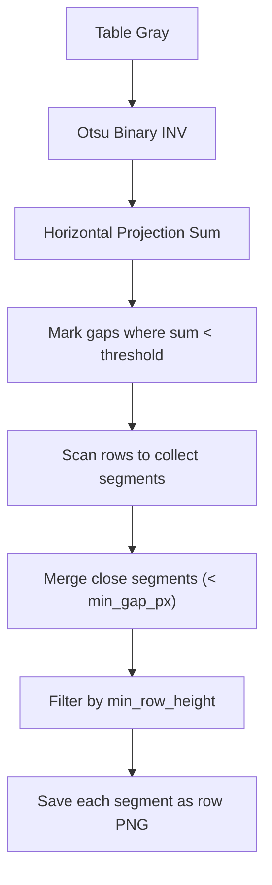
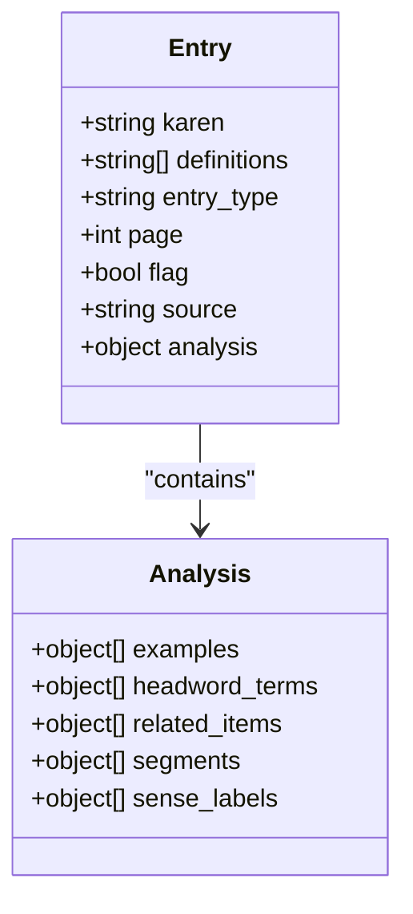
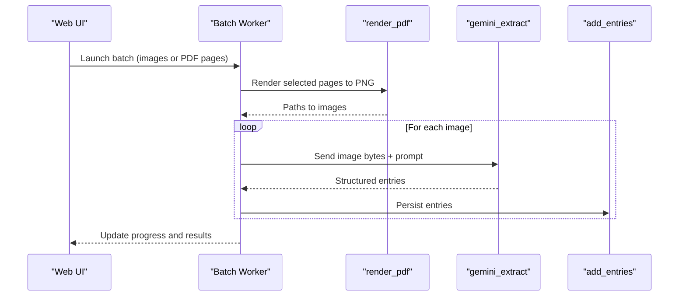
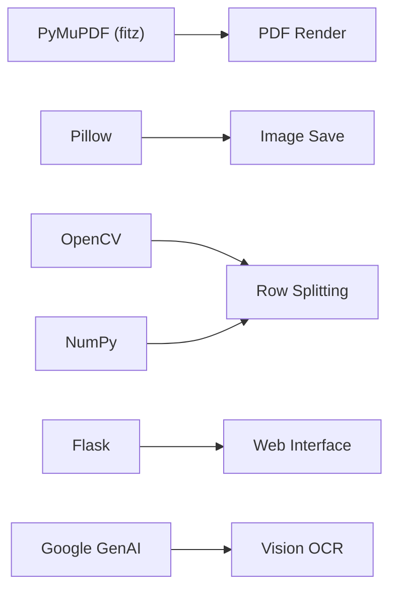

# PDF Processing and Page Splitting

<cite>
**Referenced Files in This Document**
- [043_pdf_page_splitter_zoom.py](file://pipeline/dictionary_processing/043_pdf_page_splitter_zoom.py)
- [split_dict_pages.py](file://pipeline/dictionary_processing/split_dict_pages.py)
- [split_rows_from_dict_images.py](file://pipeline/dictionary_processing/split_rows_from_dict_images.py)
- [cleanup_pages.py](file://pipeline/dictionary_processing/cleanup_pages.py)
- [app.py](file://app.py)
- [local_translator_suite/app.py](file://pipeline/dictionary_processing/local_translator_suite/app.py)
- [2_build_dict_data.py](file://pipeline/dictionary_processing/2_build_dict_data.py)
- [3_run_trans_pipeline.py](file://pipeline/dictionary_processing/3_run_trans_pipeline.py)
</cite>

## Table of Contents
1. [Introduction](#introduction)
2. [Project Structure](#project-structure)
3. [Core Components](#core-components)
4. [Architecture Overview](#architecture-overview)
5. [Detailed Component Analysis](#detailed-component-analysis)
6. [Dependency Analysis](#dependency-analysis)
7. [Performance Considerations](#performance-considerations)
8. [Troubleshooting Guide](#troubleshooting-guide)
9. [Conclusion](#conclusion)

## Introduction
This document explains the end-to-end pipeline that converts a printed Karen dictionary PDF into structured, OCR-ready images and then integrates with an OCR/translation workflow for text recognition and review. It covers:
- High-resolution rendering using PyMuPDF (fitz), including zoom levels and DPI selection for OCR accuracy.
- Page splitting algorithms that isolate table regions and separate dense dictionary rows.
- Row extraction logic that identifies word clusters, separates headwords from definitions, and preserves spatial relationships.
- Integration points with the OCR pipeline and web interface for visual review and editing.
- Performance considerations for large dictionaries and memory management strategies.

## Project Structure
The repository organizes PDF processing under pipeline/dictionary_processing and integrates with the main web application at app.py. Supporting scripts handle dataset generation and translation inference.

**Diagram sources**
- [043_pdf_page_splitter_zoom.py:40-55](file://pipeline/dictionary_processing/043_pdf_page_splitter_zoom.py#L40-L55)
- [split_rows_from_dict_images.py:13-78](file://pipeline/dictionary_processing/split_rows_from_dict_images.py#L13-L78)
- [app.py:536-572](file://app.py#L536-L572)

**Section sources**
- [043_pdf_page_splitter_zoom.py:1-190](file://pipeline/dictionary_processing/043_pdf_page_splitter_zoom.py#L1-L190)
- [split_dict_pages.py:1-37](file://pipeline/dictionary_processing/split_dict_pages.py#L1-L37)
- [split_rows_from_dict_images.py:1-114](file://pipeline/dictionary_processing/split_rows_from_dict_images.py#L1-L114)
- [app.py:1-800](file://app.py#L1-L800)

## Core Components
- High-resolution PDF rendering: Converts each page to high-quality PNGs at target DPI using PyMuPDF matrices.
- Page splitting: Splits pages into halves or crops table regions to remove margins.
- Row extraction: Uses horizontal projection profiles and gap detection to split dense dictionary entries into individual rows.
- OCR integration: Sends cropped row images to a vision model for structured extraction.
- Web interface: Provides batch processing, progress tracking, and entry review/editing.

**Section sources**
- [043_pdf_page_splitter_zoom.py:76-93](file://pipeline/dictionary_processing/043_pdf_page_splitter_zoom.py#L76-L93)
- [split_rows_from_dict_images.py:39-78](file://pipeline/dictionary_processing/split_rows_from_dict_images.py#L39-L78)
- [app.py:619-632](file://app.py#L619-L632)
- [app.py:536-572](file://app.py#L536-L572)

## Architecture Overview
The pipeline is modular:
- Rendering: fitz renders vector PDFs to raster images at configurable DPI.
- Splitting: either halve pages or detect table bounds via thresholding and projections.
- Row segmentation: project ink vertically, find gaps, merge close segments, and crop per row.
- OCR: send row images to Gemini for structured JSON output; normalize and persist entries.
- Review: Flask UI serves rendered entries, links headwords, and supports corrections.

**Diagram sources**
- [app.py:619-632](file://app.py#L619-L632)
- [split_rows_from_dict_images.py:80-99](file://pipeline/dictionary_processing/split_rows_from_dict_images.py#L80-L99)
- [app.py:536-572](file://app.py#L536-L572)

## Detailed Component Analysis

### High-Resolution PDF Rendering with PyMuPDF
- Zoom and DPI: The script sets a target DPI (e.g., 300) and computes a zoom factor relative to 72 DPI base. Each page is rendered via get_pixmap with a matrix scaling both axes by the zoom factor. Alpha channel is disabled to produce clean RGB images suitable for OCR.
- Output: Renders are saved as PNGs with zero-padded filenames for consistent sorting.

**Diagram sources**
- [043_pdf_page_splitter_zoom.py:40-55](file://pipeline/dictionary_processing/043_pdf_page_splitter_zoom.py#L40-L55)
- [043_pdf_page_splitter_zoom.py:76-93](file://pipeline/dictionary_processing/043_pdf_page_splitter_zoom.py#L76-L93)
- [043_pdf_page_splitter_zoom.py:134-183](file://pipeline/dictionary_processing/043_pdf_page_splitter_zoom.py#L134-L183)

**Section sources**
- [043_pdf_page_splitter_zoom.py:40-55](file://pipeline/dictionary_processing/043_pdf_page_splitter_zoom.py#L40-L55)
- [043_pdf_page_splitter_zoom.py:76-93](file://pipeline/dictionary_processing/043_pdf_page_splitter_zoom.py#L76-L93)
- [043_pdf_page_splitter_zoom.py:134-183](file://pipeline/dictionary_processing/043_pdf_page_splitter_zoom.py#L134-L183)

### Page Splitting Algorithms
Two complementary approaches exist:
- Halving: Splits each rendered page into top and bottom halves to effectively double zoom for OCR.
- Table cropping: Thresholds the grayscale image, sums ink along rows/columns, and finds outermost content boundaries to remove white margins before further processing.

**Diagram sources**
- [split_dict_pages.py:18-37](file://pipeline/dictionary_processing/split_dict_pages.py#L18-L37)

**Section sources**
- [043_pdf_page_splitter_zoom.py:104-127](file://pipeline/dictionary_processing/043_pdf_page_splitter_zoom.py#L104-L127)
- [split_dict_pages.py:18-37](file://pipeline/dictionary_processing/split_dict_pages.py#L18-L37)

### Row Extraction Logic
The row stripper isolates individual dictionary entries from dense pages:
- Table region detection: Uses Otsu thresholding and vertical/horizontal profiles to crop the active table area.
- Horizontal projection profile: Computes pixel sums per row to identify gaps between entries.
- Gap detection and merging: Marks low-projection rows as gaps; groups non-gap rows into candidate strips; merges nearby strips if the gap is smaller than a minimum gap threshold; filters out short strips below a minimum height.
- Output: Saves each row as a separate PNG for downstream OCR.

**Diagram sources**
- [split_rows_from_dict_images.py:13-37](file://pipeline/dictionary_processing/split_rows_from_dict_images.py#L13-L37)
- [split_rows_from_dict_images.py:39-78](file://pipeline/dictionary_processing/split_rows_from_dict_images.py#L39-L78)
- [split_rows_from_dict_images.py:80-99](file://pipeline/dictionary_processing/split_rows_from_dict_images.py#L80-L99)

**Section sources**
- [split_rows_from_dict_images.py:13-37](file://pipeline/dictionary_processing/split_rows_from_dict_images.py#L13-L37)
- [split_rows_from_dict_images.py:39-78](file://pipeline/dictionary_processing/split_rows_from_dict_images.py#L39-L78)
- [split_rows_from_dict_images.py:80-99](file://pipeline/dictionary_processing/split_rows_from_dict_images.py#L80-L99)

### Headword vs Definition Separation and Spatial Relationships
- Headword separation: The OCR step uses a vision model prompt to extract structured entries, preserving original definition text while identifying headwords, examples, cross-references, and related items within analysis fields.
- Spatial relationships: The pipeline maintains reading order through spatial sorting of detections (left-to-right, top-to-bottom) when needed, and preserves positional metadata (page numbers) for traceability.

**Diagram sources**
- [app.py:303-327](file://app.py#L303-L327)
- [app.py:536-572](file://app.py#L536-L572)

**Section sources**
- [app.py:303-327](file://app.py#L303-L327)
- [app.py:536-572](file://app.py#L536-L572)

### OCR Pipeline Integration
- Rendering: The web app can render PDF pages on demand to PNGs at configured DPI.
- Extraction: Each image is sent to the vision model with a strict prompt to return valid JSON arrays of entries, normalized and persisted.
- Batch processing: Workers process batches of images or PDF pages with skip logic and delay controls to manage rate limits and resource usage.

**Diagram sources**
- [app.py:619-632](file://app.py#L619-L632)
- [app.py:638-720](file://app.py#L638-L720)
- [app.py:536-572](file://app.py#L536-L572)

**Section sources**
- [app.py:619-632](file://app.py#L619-L632)
- [app.py:638-720](file://app.py#L638-L720)
- [app.py:536-572](file://app.py#L536-L572)

### Web Interface for Visual Review and Editing
- The Flask app provides routes to serve fonts, render pages, and display entries with linked headwords and highlighted segments.
- State management tracks running jobs, progress, logs, and errors.
- Corrections are recorded and persisted atomically to avoid data loss.

**Section sources**
- [app.py:1-800](file://app.py#L1-L800)

### Input Formats, Parameters, and Outputs
- Inputs:
  - Dictionary PDF files (e.g., karen_dict.pdf).
  - Pre-rendered page images (PNG/JPG) for row splitting.
- Parameters:
  - DPI and zoom factors for rendering (e.g., 300 DPI, zoom = DPI/72).
  - Minimum row height and gap thresholds for row splitting.
  - Skip processed flag and delays for rate limiting.
- Outputs:
  - Split page halves or cropped table images.
  - Row-level PNGs per page.
  - Structured JSON entries with Karen text, definitions, and analysis metadata.

**Section sources**
- [043_pdf_page_splitter_zoom.py:40-55](file://pipeline/dictionary_processing/043_pdf_page_splitter_zoom.py#L40-L55)
- [split_rows_from_dict_images.py:39-78](file://pipeline/dictionary_processing/split_rows_from_dict_images.py#L39-L78)
- [app.py:57-65](file://app.py#L57-L65)

## Dependency Analysis
Key dependencies and their roles:
- PyMuPDF (fitz): Opens PDFs and renders pages to high-resolution images.
- Pillow: Handles image conversion and saving.
- OpenCV and NumPy: Perform thresholding, projection profiles, and morphological operations for row splitting.
- Flask: Serves the web interface and manages batch jobs.
- Google GenAI: Powers OCR extraction via vision model prompts.

**Diagram sources**
- [043_pdf_page_splitter_zoom.py:18-31](file://pipeline/dictionary_processing/043_pdf_page_splitter_zoom.py#L18-L31)
- [split_rows_from_dict_images.py:1-5](file://pipeline/dictionary_processing/split_rows_from_dict_images.py#L1-L5)
- [app.py:12-16](file://app.py#L12-L16)

**Section sources**
- [043_pdf_page_splitter_zoom.py:18-31](file://pipeline/dictionary_processing/043_pdf_page_splitter_zoom.py#L18-L31)
- [split_rows_from_dict_images.py:1-5](file://pipeline/dictionary_processing/split_rows_from_dict_images.py#L1-L5)
- [app.py:12-16](file://app.py#L12-L16)

## Performance Considerations
- DPI and zoom trade-offs: Higher DPI improves glyph clarity but increases memory and I/O costs. Use 300 DPI as a balanced default for OCR quality.
- Memory management:
  - Close PDF documents after rendering to release handles.
  - Process pages one-by-one and avoid loading entire PDFs into memory.
  - Use atomic file writes (.tmp then replace) to prevent corruption during crashes.
- Rate limiting: Introduce delays between OCR requests to respect API limits and reduce contention.
- Skip logic: Track processed images/pages to avoid reprocessing.
- Large dictionaries:
  - Prefer table cropping over full-page splits to reduce noise.
  - Tune min_row_height and gap thresholds based on page density.
  - Consider batching and parallel workers carefully to balance throughput and resource usage.

[No sources needed since this section provides general guidance]

## Troubleshooting Guide
Common issues and resolutions:
- Missing dependencies: Ensure PyMuPDF and Pillow are installed before running the splitter.
- PDF not found: Place the dictionary PDF next to the script or adjust the path variable.
- No rows detected: Adjust threshold parameters or verify table cropping; ensure sufficient contrast and minimal noise.
- OCR failures: Check API key configuration and model availability; validate image quality and resolution.
- Data integrity: Always backup before destructive operations; use atomic saves to avoid partial writes.

**Section sources**
- [043_pdf_page_splitter_zoom.py:20-31](file://pipeline/dictionary_processing/043_pdf_page_splitter_zoom.py#L20-L31)
- [043_pdf_page_splitter_zoom.py:136-141](file://pipeline/dictionary_processing/043_pdf_page_splitter_zoom.py#L136-L141)
- [cleanup_pages.py:14-17](file://pipeline/dictionary_processing/cleanup_pages.py#L14-L17)
- [cleanup_pages.py:38-42](file://pipeline/dictionary_processing/cleanup_pages.py#L38-L42)

## Conclusion
The pipeline combines high-resolution rendering, robust page and row splitting, and vision-based OCR to transform dense dictionary PDFs into structured, editable entries. By tuning DPI, zoom, and row-splitting thresholds, it achieves reliable OCR accuracy even for complex layouts. The integrated web interface enables efficient review and correction workflows, while careful memory and rate-limit management support processing large dictionaries reliably.

[No sources needed since this section summarizes without analyzing specific files]