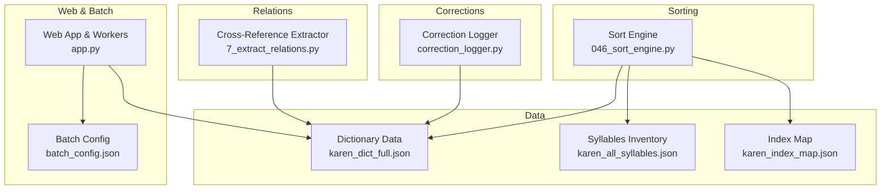
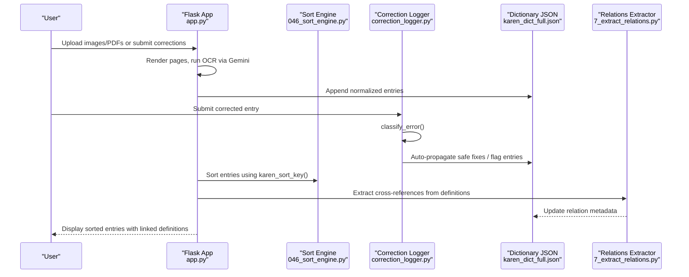
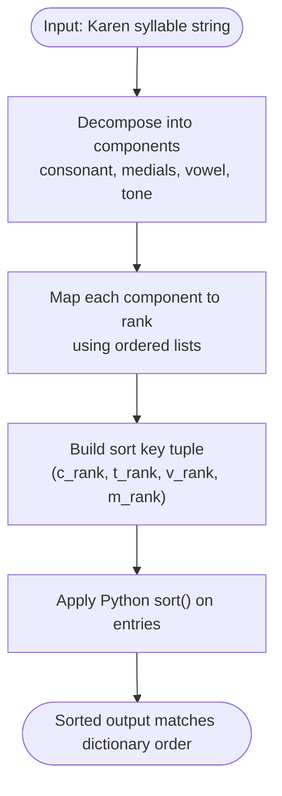
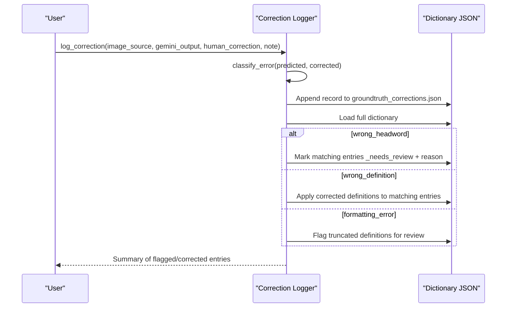
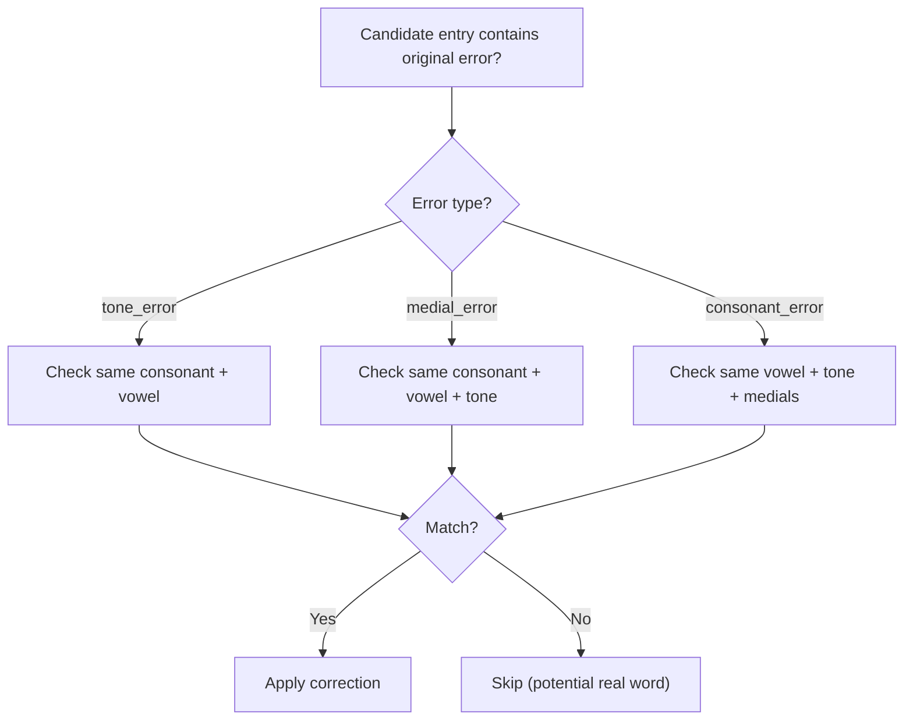
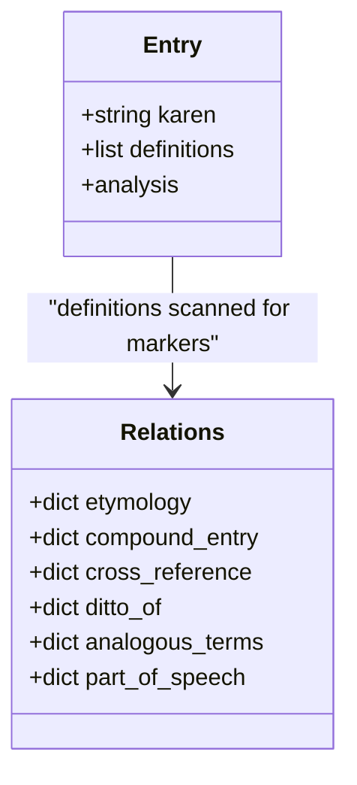
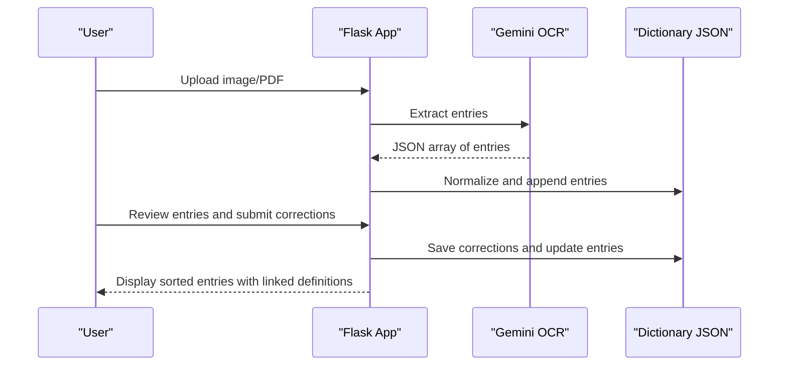
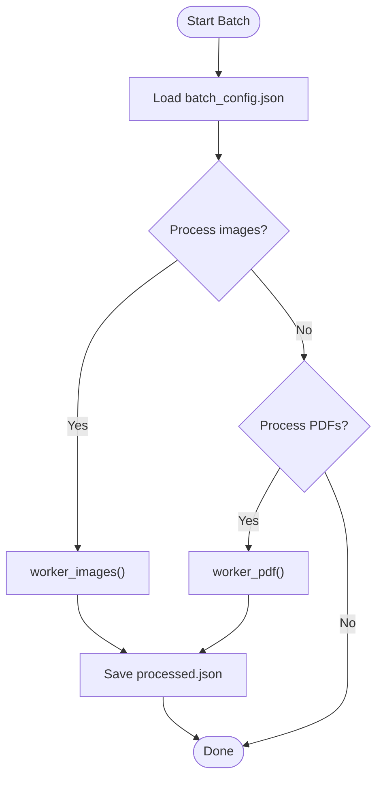
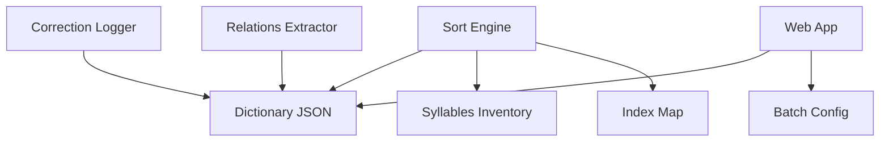

# Sorting Engine and Correction Logic

<cite>
**Referenced Files in This Document**
- [046_sort_engine.py](file://pipeline/dictionary_processing/046_sort_engine.py)
- [correction_logger.py](file://pipeline/dictionary_processing/correction_logger.py)
- [karen_dict_full.json](file://karen_dict_full.json)
- [karen_all_syllables.json](file://karen_all_syllables.json)
- [karen_index_map.json](file://karen_index_map.json)
- [2_build_dict_data.py](file://pipeline/dictionary_processing/2_build_dict_data.py)
- [7_extract_relations.py](file://pipeline/dictionary_processing/7_extract_relations.py)
- [app.py](file://app.py)
- [batch_config.json](file://batch_config.json)
</cite>

## Table of Contents
1. [Introduction](#introduction)
2. [Project Structure](#project-structure)
3. [Core Components](#core-components)
4. [Architecture Overview](#architecture-overview)
5. [Detailed Component Analysis](#detailed-component-analysis)
6. [Dependency Analysis](#dependency-analysis)
7. [Performance Considerations](#performance-considerations)
8. [Troubleshooting Guide](#troubleshooting-guide)
9. [Conclusion](#conclusion)
10. [Appendices](#appendices)

## Introduction
This document explains the Sgaw Karen-specific sorting engine and correction logic used to organize and maintain a large dictionary dataset. It covers:
- The custom sorting algorithm that orders entries by consonant, tone, vowel, and medial according to Karen linguistic rules.
- The safe correction handling system that preserves original text while applying corrections, with audit trails and version tracking.
- Cross-reference management that links related dictionary entries and maintains consistency across the database.
- Examples of sorting rules, correction workflows, and validation processes.
- Integration with the web interface for manual correction review and the batch processing system for automated correction application.
- Error handling, rollback capabilities, and data integrity verification mechanisms.

## Project Structure
The project organizes sorting, correction logging, cross-referencing, and web/batch processing into focused modules and datasets:
- Sorting engine: defines canonical order for consonants, tones, vowels, medials, and ASAT contractions; decomposes syllables and generates sort keys.
- Correction logger: logs human-verified corrections, classifies error types, auto-propagates fixes safely, and flags entries needing review.
- Dictionary data: JSON files store entries, syllable inventories, and index mappings.
- Relations extraction: scans definitions to extract cross-references, compounds, etymology, and part-of-speech tags.
- Web app and batch processing: Flask-based UI for manual review and batch workers for OCR extraction and processing.

**Diagram sources**
- [046_sort_engine.py:15-91](file://pipeline/dictionary_processing/046_sort_engine.py#L15-L91)
- [correction_logger.py:11-123](file://pipeline/dictionary_processing/correction_logger.py#L11-L123)
- [7_extract_relations.py:8-136](file://pipeline/dictionary_processing/7_extract_relations.py#L8-L136)
- [app.py:42-52](file://app.py#L42-L52)
- [batch_config.json:1-9](file://batch_config.json#L1-L9)

**Section sources**
- [046_sort_engine.py:15-91](file://pipeline/dictionary_processing/046_sort_engine.py#L15-L91)
- [correction_logger.py:11-123](file://pipeline/dictionary_processing/correction_logger.py#L11-L123)
- [7_extract_relations.py:8-136](file://pipeline/dictionary_processing/7_extract_relations.py#L8-L136)
- [app.py:42-52](file://app.py#L42-L52)
- [batch_config.json:1-9](file://batch_config.json#L1-L9)

## Core Components
- Sort Engine: Implements a four-level sort (consonant → tone → vowel → medial), handles ASAT contractions, and provides decomposition and smart propagation guards.
- Correction Logger: Classifies errors, logs corrections with metadata, auto-propagates safe fixes, and flags entries requiring human review.
- Cross-Reference Extractor: Scans definitions for markers like “see”, “cf.”, “co.”, “from”, “do.”, and extracts relations and part-of-speech labels.
- Web App and Batch Processing: Provides a Flask UI for manual review, batch workers for image/PDF processing, and persistent state/logs/config.

**Section sources**
- [046_sort_engine.py:93-160](file://pipeline/dictionary_processing/046_sort_engine.py#L93-L160)
- [correction_logger.py:21-123](file://pipeline/dictionary_processing/correction_logger.py#L21-L123)
- [7_extract_relations.py:8-136](file://pipeline/dictionary_processing/7_extract_relations.py#L8-L136)
- [app.py:171-233](file://app.py#L171-L233)

## Architecture Overview
The system integrates sorting, correction logging, cross-referencing, and web/batch processing around a central dictionary dataset.

**Diagram sources**
- [app.py:536-571](file://app.py#L536-L571)
- [correction_logger.py:21-123](file://pipeline/dictionary_processing/correction_logger.py#L21-L123)
- [046_sort_engine.py:139-160](file://pipeline/dictionary_processing/046_sort_engine.py#L139-L160)
- [7_extract_relations.py:62-136](file://pipeline/dictionary_processing/7_extract_relations.py#L62-L136)

## Detailed Component Analysis

### Sorting Engine: Consonant-Tone-Vowel-Medial Order
The sorting engine enforces the canonical Sgaw Karen dictionary order:
- Level 1: Consonants (ordered list of 25 characters).
- Level 2: Tones (including the bare -ah vowel U+102B as the default tone shape within each consonant section).
- Level 3: Vowels (excluding -ah which is grouped with tones).
- Level 4: Medials (innermost modifiers).

Key behaviors:
- Decomposition: Breaks a Unicode string into consonant, medials, vowel, tone, and raw fields.
- Sort key generation: Produces a tuple (consonant_rank, tone_rank, vowel_rank, medial_rank) for deterministic ordering.
- ASAT contractions: Two-character sequences are recognized and treated specially, sorting after their base consonant.

**Diagram sources**
- [046_sort_engine.py:93-160](file://pipeline/dictionary_processing/046_sort_engine.py#L93-L160)

**Section sources**
- [046_sort_engine.py:15-91](file://pipeline/dictionary_processing/046_sort_engine.py#L15-L91)
- [046_sort_engine.py:93-160](file://pipeline/dictionary_processing/046_sort_engine.py#L93-L160)

### Safe Correction Handling: Audit Trails and Version Tracking
The correction logger records every human-verified correction with metadata and applies safe auto-propagation:
- Classification: Determines whether an error is wrong headword, wrong definition, or formatting issue.
- Logging: Persists timestamp, image source, predicted vs. corrected entry, type, and note.
- Auto-propagation: Scans the full dictionary for matching patterns; for headword mismatches, it flags entries instead of blindly changing them; for definition issues, it applies verified fixes directly.
- Review workflow: Flags entries with `_needs_review` and `_review_reason`, enabling manual inspection.

**Diagram sources**
- [correction_logger.py:21-123](file://pipeline/dictionary_processing/correction_logger.py#L21-L123)

**Section sources**
- [correction_logger.py:21-123](file://pipeline/dictionary_processing/correction_logger.py#L21-L123)

### Smart Propagation Guard: Context-Aware Fixes
To avoid corrupting real words that coincidentally share characters with an error pattern, the engine uses context-aware checks:
- Tone errors: Only propagate if consonant and vowel match between original and candidate.
- Medial errors: Require consonant, vowel, and tone to match.
- Consonant errors: Require vowel, tone, and medials to match.

**Diagram sources**
- [046_sort_engine.py:168-216](file://pipeline/dictionary_processing/046_sort_engine.py#L168-L216)

**Section sources**
- [046_sort_engine.py:168-216](file://pipeline/dictionary_processing/046_sort_engine.py#L168-L216)

### Cross-Reference Management: Linking Related Entries
The relations extractor scans definitions for markers to build structured relationships:
- Markers: “from” (etymology), “co.”/“comp.” (compound), “see”/“cf.” (cross-reference), “do.” (ditto), “analogous” (analogous terms).
- Output: Maps headwords to extracted targets and captures part-of-speech labels.
- Integration: Enhances dictionary entries with analysis fields for UI linking and display.

**Diagram sources**
- [7_extract_relations.py:8-136](file://pipeline/dictionary_processing/7_extract_relations.py#L8-L136)

**Section sources**
- [7_extract_relations.py:8-136](file://pipeline/dictionary_processing/7_extract_relations.py#L8-L136)

### Web Interface Integration: Manual Correction Review
The Flask app provides:
- Routes for serving fonts, rendering PDFs, and processing images.
- State management for batch runs, progress, logs, and cancellation.
- Normalization and merging of analysis fields for consistent UI display.
- Headword term linking to create clickable cross-references in definitions.

**Diagram sources**
- [app.py:536-571](file://app.py#L536-L571)
- [app.py:426-471](file://app.py#L426-L471)

**Section sources**
- [app.py:42-52](file://app.py#L42-L52)
- [app.py:171-233](file://app.py#L171-L233)
- [app.py:426-471](file://app.py#L426-L471)

### Batch Processing System: Automated Application
Batch configuration controls:
- Pages per batch, images per batch, delay between tasks, page offset, render DPI, skip processed, and auto-import bootstrap files.
- Workers process images and PDFs, track progress, and persist results atomically.

**Diagram sources**
- [batch_config.json:1-9](file://batch_config.json#L1-L9)
- [app.py:638-720](file://app.py#L638-L720)

**Section sources**
- [batch_config.json:1-9](file://batch_config.json#L1-L9)
- [app.py:638-720](file://app.py#L638-L720)

## Dependency Analysis
Components interact through shared data files and APIs:
- Sort Engine depends on ordered lists and sets for fast lookup and decomposition.
- Correction Logger reads/writes dictionary JSON and logs corrections.
- Relations Extractor scans definitions and updates relation metadata.
- Web App orchestrates OCR, normalization, linking, and batch processing.

**Diagram sources**
- [046_sort_engine.py:15-91](file://pipeline/dictionary_processing/046_sort_engine.py#L15-L91)
- [correction_logger.py:11-123](file://pipeline/dictionary_processing/correction_logger.py#L11-L123)
- [7_extract_relations.py:8-136](file://pipeline/dictionary_processing/7_extract_relations.py#L8-L136)
- [app.py:42-52](file://app.py#L42-L52)
- [batch_config.json:1-9](file://batch_config.json#L1-L9)

**Section sources**
- [046_sort_engine.py:15-91](file://pipeline/dictionary_processing/046_sort_engine.py#L15-L91)
- [correction_logger.py:11-123](file://pipeline/dictionary_processing/correction_logger.py#L11-L123)
- [7_extract_relations.py:8-136](file://pipeline/dictionary_processing/7_extract_relations.py#L8-L136)
- [app.py:42-52](file://app.py#L42-L52)
- [batch_config.json:1-9](file://batch_config.json#L1-L9)

## Performance Considerations
- Sorting uses precomputed rank maps for O(1) lookups per character; decomposition is linear in string length.
- Correction propagation scans all entries once per correction; consider batching corrections to reduce repeated scans.
- Relations extraction performs regex scans over definitions; ensure definitions are normalized to minimize false positives.
- Web app uses atomic writes (tmp + replace) to prevent corruption during concurrent operations.

[No sources needed since this section provides general guidance]

## Troubleshooting Guide
Common issues and resolutions:
- Sorting mismatch: Verify consonant/tone/vowel/medial ranks and ensure ASAT contractions are handled correctly.
- Over-correction: Use smart propagation guard to limit auto-fixes to matching contexts; flag ambiguous cases for review.
- Missing cross-references: Check definition markers and ensure extraction regex matches Karen Unicode ranges.
- Batch failures: Inspect logs for exceptions; adjust batch config delays and DPI settings; verify file paths and permissions.

**Section sources**
- [046_sort_engine.py:168-216](file://pipeline/dictionary_processing/046_sort_engine.py#L168-L216)
- [correction_logger.py:21-123](file://pipeline/dictionary_processing/correction_logger.py#L21-L123)
- [7_extract_relations.py:8-136](file://pipeline/dictionary_processing/7_extract_relations.py#L8-L136)
- [app.py:22-30](file://app.py#L22-L30)

## Conclusion
The Sgaw Karen sorting engine and correction logic provide a robust foundation for organizing and maintaining a large dictionary dataset. By enforcing linguistic ordering, applying safe corrections with audit trails, extracting cross-references, and integrating with a web interface and batch processing system, the project ensures accuracy, traceability, and scalability. Continuous validation and user-driven reviews further enhance data integrity.

[No sources needed since this section summarizes without analyzing specific files]

## Appendices

### Sorting Rules Examples
- Consonant-first grouping: All entries under a consonant are grouped together before moving to the next consonant.
- Tone grouping: Within each consonant, the bare -ah vowel opens the tone group, followed by explicit tone marks.
- Vowel ordering: After tones are exhausted, vowels follow in the defined order.
- Medial ordering: Medials are last, with the first medial determining the sort rank when multiple are present.

**Section sources**
- [046_sort_engine.py:15-91](file://pipeline/dictionary_processing/046_sort_engine.py#L15-L91)

### Correction Workflow Example
- User corrects a headword or definition.
- Logger classifies the error and persists the correction record.
- Auto-propagation applies safe fixes or flags entries for review.
- Web UI displays flagged entries for manual resolution.

**Section sources**
- [correction_logger.py:21-123](file://pipeline/dictionary_processing/correction_logger.py#L21-L123)

### Validation Processes
- Atomic writes prevent partial saves.
- Normalization ensures consistent entry structure.
- Relations extraction validates marker presence and extracts structured metadata.

**Section sources**
- [7_extract_relations.py:21-37](file://pipeline/dictionary_processing/7_extract_relations.py#L21-L37)
- [app.py:171-233](file://app.py#L171-L233)