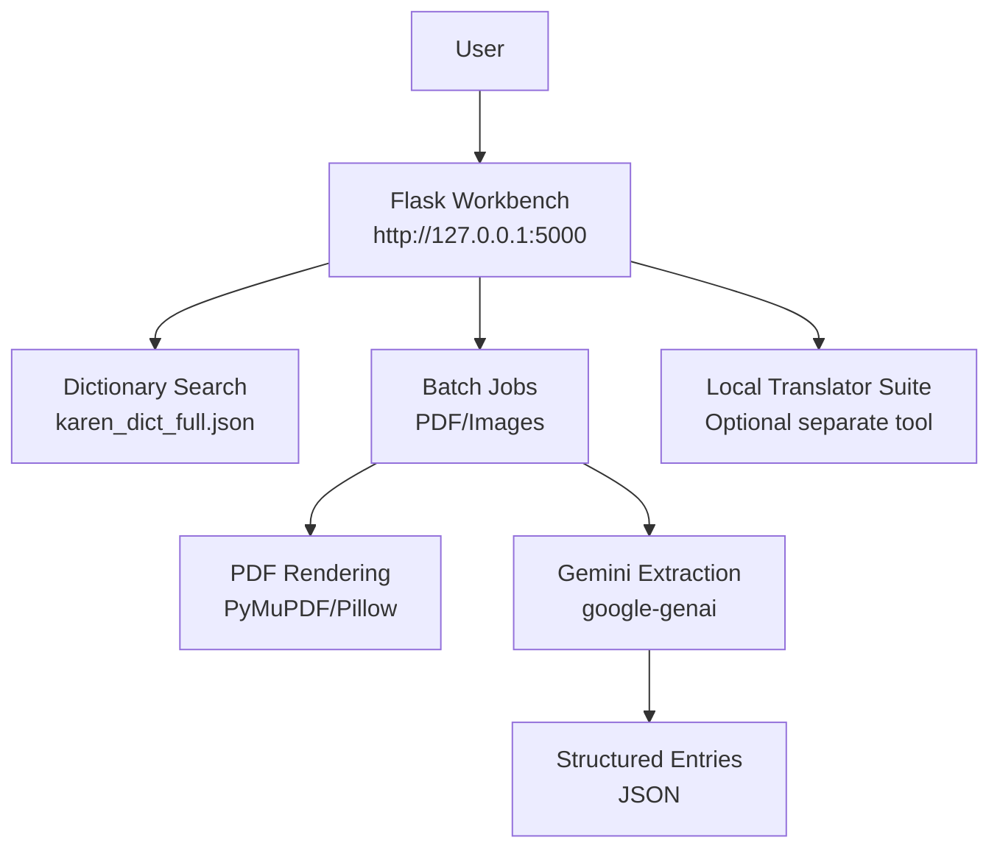
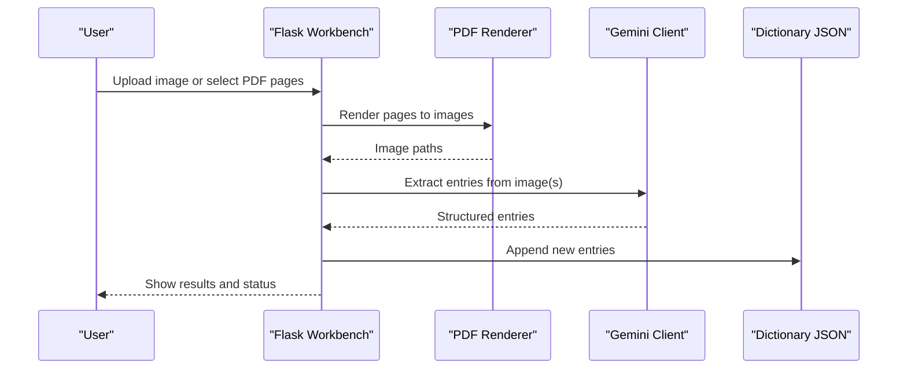
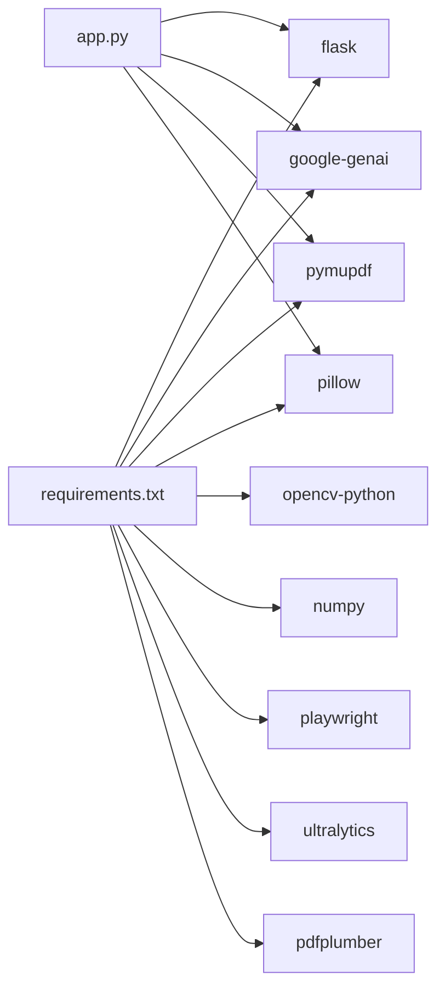

# Getting Started

<cite>
**Referenced Files in This Document**
- [README.md](file://README.md)
- [requirements.txt](file://requirements.txt)
- [app.py](file://app.py)
- [ARCHITECTURE.md](file://docs/ARCHITECTURE.md)
- [SECURITY.md](file://docs/SECURITY.md)
- [batch_config.json](file://batch_config.json)
</cite>

## Table of Contents
1. [Introduction](#introduction)
2. [Project Structure](#project-structure)
3. [Core Components](#core-components)
4. [Architecture Overview](#architecture-overview)
5. [Detailed Component Analysis](#detailed-component-analysis)
6. [Dependency Analysis](#dependency-analysis)
7. [Performance Considerations](#performance-considerations)
8. [Troubleshooting Guide](#troubleshooting-guide)
9. [Conclusion](#conclusion)
10. [Appendices](#appendices)

## Introduction
This guide helps you set up and run the Sgaw Karen OCR and Dictionary Pipeline for the first time. You will install dependencies, configure the required environment variable, start the Flask workbench, and learn what features require an API key versus what works without it. The workbench lets you search existing dictionary entries, review OCR results, and perform batch processing when enabled.

## Project Structure
At a high level:
- app.py is the main Flask application that serves the web interface and exposes routes for searching, running batch jobs, and reviewing entries.
- requirements.txt lists Python dependencies used by the workbench and supporting tools.
- docs/ARCHITECTURE.md describes the end-to-end pipeline from input to structured dictionary output.
- batch_config.json holds default settings for batch operations such as page rendering DPI and delays.

**Diagram sources**
- [app.py:12-17](file://app.py#L12-L17)
- [app.py:518-530](file://app.py#L518-L530)
- [app.py:536-571](file://app.py#L536-L571)
- [app.py:619-632](file://app.py#L619-L632)
- [requirements.txt:1-10](file://requirements.txt#L1-L10)
- [ARCHITECTURE.md:5-16](file://docs/ARCHITECTURE.md#L5-L16)

**Section sources**
- [README.md:19-45](file://README.md#L19-L45)
- [ARCHITECTURE.md:18-28](file://docs/ARCHITECTURE.md#L18-L28)

## Core Components
- Flask workbench (app.py): Provides the web UI, search, batch job control, and API endpoints. It reads configuration from environment variables and JSON files, and writes runtime state under app_data.
- Dependencies (requirements.txt): Flask, Google GenAI client, PDF/image libraries, OpenCV, NumPy, Playwright, Ultralytics YOLO, and PDF parsing utilities.
- Configuration:
  - Environment variables:
    - GEMINI_API_KEY: Required for Gemini-based extraction and re-analysis.
    - GEMINI_MODEL: Optional model name override; defaults are applied if not set.
    - PADAUK_FONT: Optional path to a Padauk font file for correct Karen text rendering.
  - Local config: batch_config.json controls batch behavior like render DPI, delay between requests, and whether to skip already processed items.

What requires the API key:
- Batch OCR and re-analysis that call Gemini to extract or refine dictionary entries from images or PDF pages.

What works without the API key:
- Searching existing entries stored in karen_dict_full.json.
- Viewing rendered pages and basic UI interactions that do not call Gemini.

**Section sources**
- [app.py:33-38](file://app.py#L33-L38)
- [app.py:42-67](file://app.py#L42-L67)
- [app.py:356-359](file://app.py#L356-L359)
- [app.py:518-530](file://app.py#L518-L530)
- [requirements.txt:1-10](file://requirements.txt#L1-L10)
- [batch_config.json:1-9](file://batch_config.json#L1-L9)
- [README.md:33-45](file://README.md#L33-L45)

## Architecture Overview
The workbench integrates several stages:
- Input: PDFs or images.
- Rendering: Pages are rendered to images at a configurable DPI.
- Extraction: Gemini extracts structured dictionary entries with analysis metadata.
- Storage: Entries are appended to the dictionary JSON and tracked in processed state.
- Review: The web UI displays entries, supports search, and allows corrections and batch operations.

**Diagram sources**
- [app.py:619-632](file://app.py#L619-L632)
- [app.py:536-571](file://app.py#L536-L571)
- [app.py:329-333](file://app.py#L329-L333)

## Detailed Component Analysis

### Installation and Setup
Follow these steps to get the workbench running locally:

1. Ensure Python is installed on your system. Use a recent Python 3 version compatible with the listed dependencies.
2. Create a virtual environment:
   - Windows PowerShell example: python -m venv .venv
   - Activate the environment using the provided activation script for your OS.
3. Install dependencies:
   - pip install -r requirements.txt
4. Configure the API key:
   - Set the GEMINI_API_KEY environment variable to your Gemini API key before starting the server.
   - Optionally set GEMINI_MODEL to choose a specific model.
   - Optionally set PADAUK_FONT to point to a valid Padauk font file if you want custom font rendering.
5. Start the workbench:
   - Run python app.py
   - Open http://127.0.0.1:5000 in your browser.

Notes:
- Without GEMINI_API_KEY, you can still search existing dictionary entries.
- Batch OCR and re-analysis require GEMINI_API_KEY.

**Section sources**
- [README.md:33-45](file://README.md#L33-L45)
- [requirements.txt:1-10](file://requirements.txt#L1-L10)
- [app.py:33-38](file://app.py#L33-L38)
- [app.py:518-530](file://app.py#L518-L530)

### First-Time User Walkthrough
Once the workbench is running at http://127.0.0.1:5000:

- Explore the home page to see the current dictionary size and status badges.
- Search existing entries:
  - Use the search box to find Karen terms, definitions, or related metadata.
  - Results are pulled from karen_dict_full.json and displayed with linked headwords and examples where available.
- View entry details:
  - Clicking a headword or definition link navigates to the corresponding entry.
  - Definitions may include highlighted segments and part-of-speech labels inferred during analysis.
- Start a batch job (requires API key):
  - Choose either images or PDF pages.
  - Select files and configure batch options (e.g., pages per batch, delay seconds, render DPI).
  - Launch the job and monitor progress via the status panel.
  - When complete, new entries appear in the dictionary and can be reviewed immediately.

Tips:
- If you have many pages, adjust render_dpi and delay_seconds in batch_config.json to balance quality and speed.
- Enable skip_processed to avoid reprocessing files already handled in previous runs.

**Section sources**
- [app.py:57-67](file://app.py#L57-L67)
- [app.py:638-720](file://app.py#L638-L720)
- [batch_config.json:1-9](file://batch_config.json#L1-L9)
- [README.md:33-45](file://README.md#L33-L45)

### What Requires the API Key vs What Works Without It
- Without GEMINI_API_KEY:
  - Search and browse existing dictionary entries.
  - View rendered pages and UI elements that do not call external APIs.
- With GEMINI_API_KEY:
  - Batch OCR extraction from images and PDF pages.
  - Re-analysis of existing entries to enrich analysis metadata.

**Section sources**
- [README.md:33-45](file://README.md#L33-L45)
- [app.py:356-359](file://app.py#L356-L359)
- [app.py:536-571](file://app.py#L536-L571)

## Dependency Analysis
The workbench depends on:
- Web framework: Flask
- AI client: google-genai
- PDF handling: pymupdf
- Image processing: pillow, opencv-python, numpy
- Browser automation: playwright
- OCR training utilities: ultralytics

These are declared in requirements.txt and imported within app.py and other pipeline scripts.

**Diagram sources**
- [requirements.txt:1-10](file://requirements.txt#L1-L10)
- [app.py:12-17](file://app.py#L12-L17)

**Section sources**
- [requirements.txt:1-10](file://requirements.txt#L1-L10)
- [app.py:12-17](file://app.py#L12-L17)

## Performance Considerations
- Adjust render_dpi in batch_config.json to balance image quality and processing time.
- Increase delay_seconds to reduce rate-limit pressure on the Gemini API during batch jobs.
- Use skip_processed to avoid reprocessing previously handled files.
- For large PDFs, consider splitting into smaller batches to keep memory usage manageable.

[No sources needed since this section provides general guidance]

## Troubleshooting Guide

Common setup issues and resolutions:

- Missing dependencies:
  - Symptom: Import errors when starting the workbench.
  - Resolution: Ensure you activated the virtual environment and ran pip install -r requirements.txt.
  - Verify each dependency is present: flask, google-genai, pymupdf, pillow, opencv-python, numpy, playwright, ultralytics, pdfplumber.

- Port conflict:
  - Symptom: Error indicating port 5000 is already in use.
  - Resolution: Stop the process using port 5000 or change the Flask host/port configuration before starting the app.

- Missing GEMINI_API_KEY:
  - Symptom: Errors when attempting batch OCR or re-analysis.
  - Resolution: Set the GEMINI_API_KEY environment variable before launching the server. Confirm it is visible in your shell session.

- Incorrect or missing Padauk font:
  - Symptom: Karen text does not render correctly in the UI.
  - Resolution: Provide a valid Padauk font file via the PADAUK_FONT environment variable or ensure the default font path resolves to a valid file.

- PDF rendering failures:
  - Symptom: Errors during PDF page rendering.
  - Resolution: Check that PyMuPDF and Pillow are installed and functional. Reduce render_dpi if memory or performance issues occur.

- Batch jobs stuck or cancelled:
  - Symptom: Status shows running but no progress.
  - Resolution: Cancel the job from the UI if possible, then restart. Verify network connectivity to the Gemini API and check logs for errors.

Security note:
- Do not commit secrets or local run-state files to version control. The project ignores sensitive files and local environments.

**Section sources**
- [app.py:22-30](file://app.py#L22-L30)
- [app.py:356-359](file://app.py#L356-L359)
- [app.py:518-530](file://app.py#L518-L530)
- [SECURITY.md:26-26](file://docs/SECURITY.md#L26-L26)

## Conclusion
You now have everything needed to install, configure, and run the Sgaw Karen OCR and Dictionary Pipeline. Start by setting up the virtual environment, installing dependencies, configuring GEMINI_API_KEY, and launching the Flask workbench. Use the built-in search to explore existing entries, and enable batch processing when you have an API key to extract and enrich dictionary content from images and PDFs.

[No sources needed since this section summarizes without analyzing specific files]

## Appendices

### Quick Commands Reference
- Create and activate a virtual environment:
  - Windows PowerShell: python -m venv .venv and activate the provided script.
- Install dependencies:
  - pip install -r requirements.txt
- Set environment variables:
  - GEMINI_API_KEY="your_key_here"
  - GEMINI_MODEL="gemini-2.5-flash" (optional)
  - PADAUK_FONT="/path/to/padauk_reg.ttf" (optional)
- Start the workbench:
  - python app.py
  - Open http://127.0.0.1:5000

**Section sources**
- [README.md:33-45](file://README.md#L33-L45)
- [requirements.txt:1-10](file://requirements.txt#L1-L10)
- [app.py:33-38](file://app.py#L33-L38)
- [app.py:518-530](file://app.py#L518-L530)