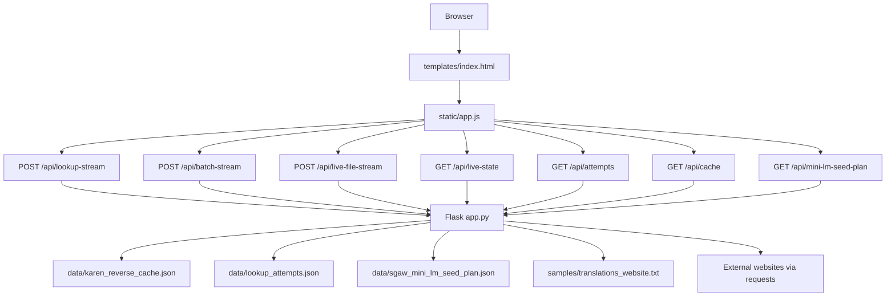
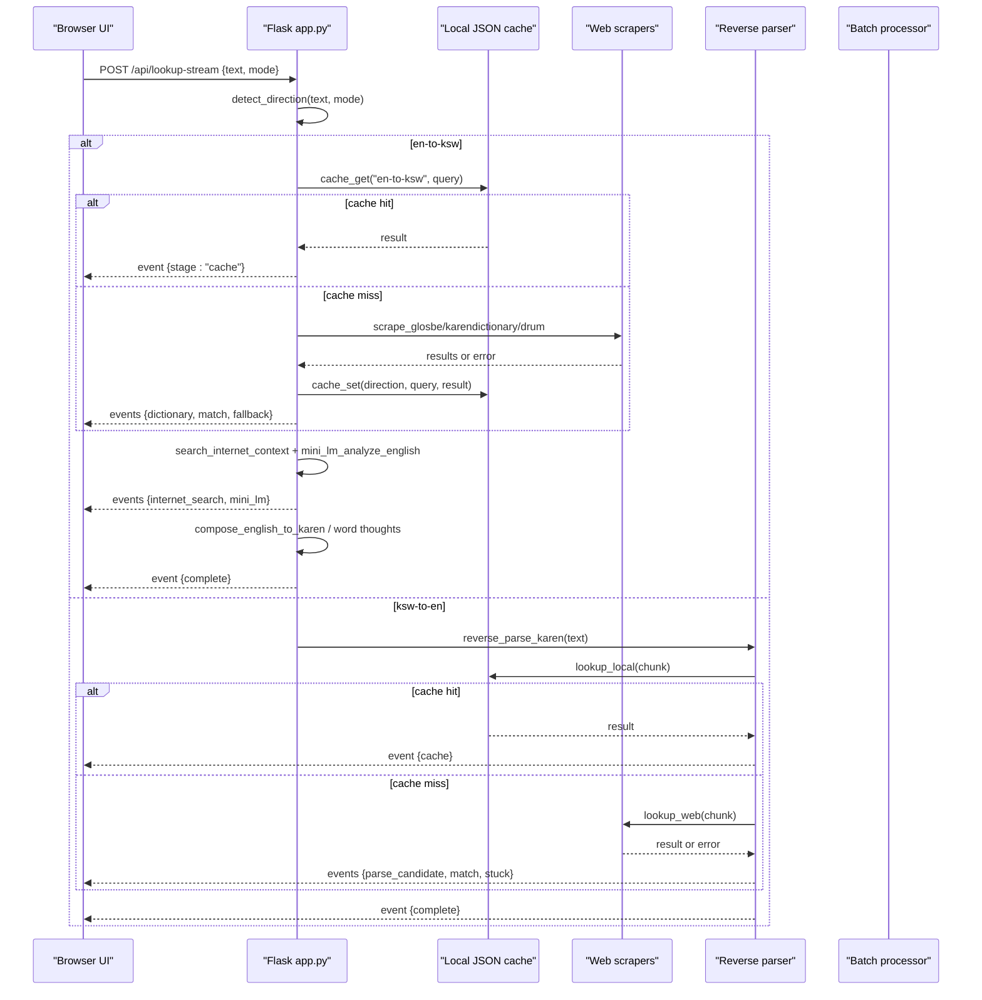
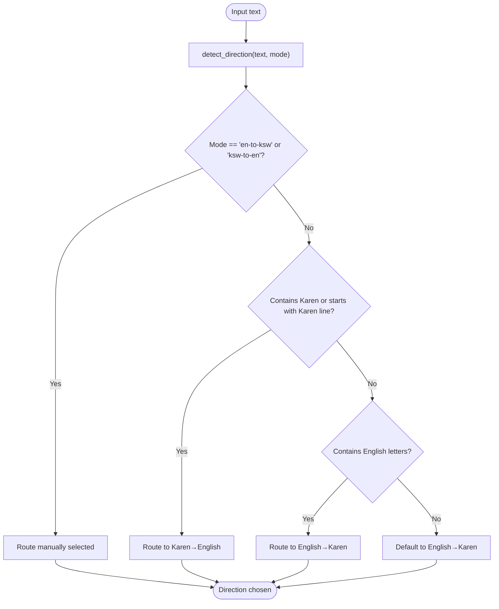
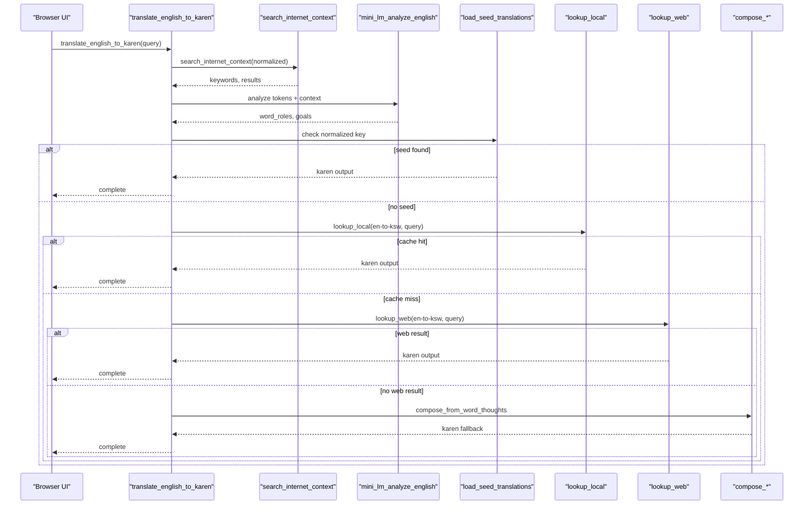
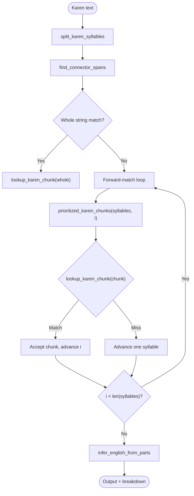
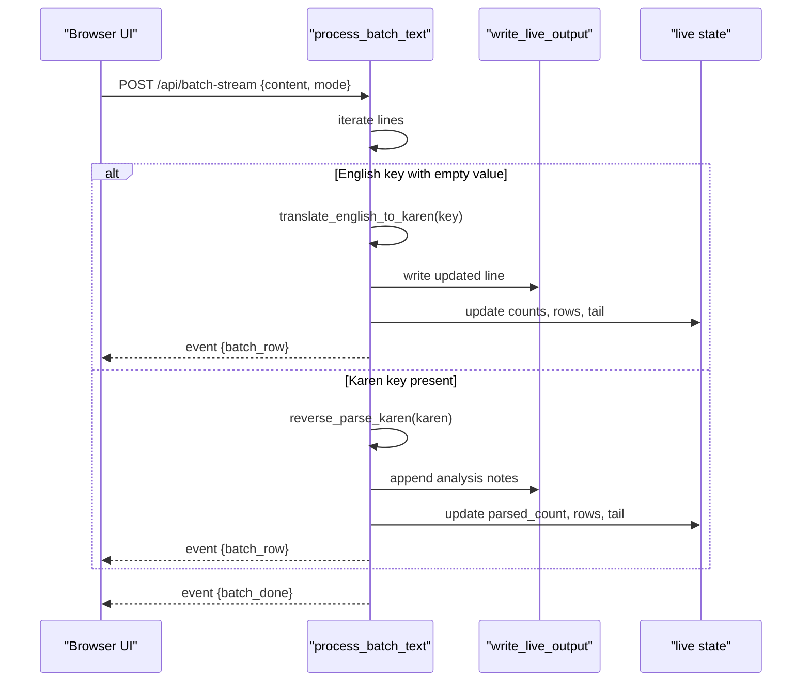
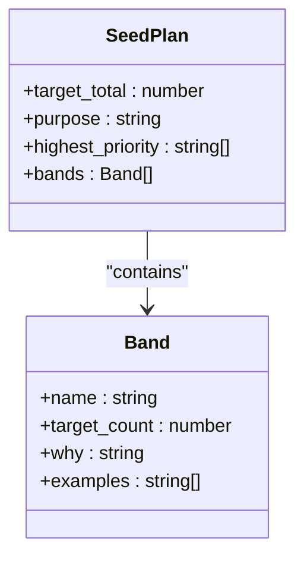
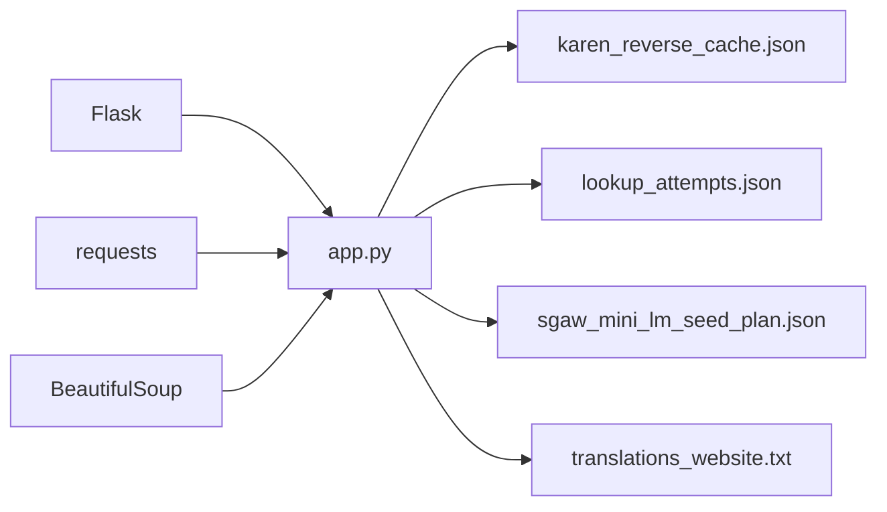

# Local Translator Suite

<cite>
**Referenced Files in This Document**
- [app.py](file://pipeline/dictionary_processing/local_translator_suite/app.py)
- [index.html](file://pipeline/dictionary_processing/local_translator_suite/templates/index.html)
- [app.js](file://pipeline/dictionary_processing/local_translator_suite/static/app.js)
- [sgaw_mini_lm_seed_plan.json](file://pipeline/dictionary_processing/local_translator_suite/data/sgaw_mini_lm_seed_plan.json)
- [translations_website.txt](file://pipeline/dictionary_processing/local_translator_suite/samples/translations_website.txt)
- [requirements.txt](file://pipeline/dictionary_processing/local_translator_suite/requirements.txt)
- [README.md](file://pipeline/dictionary_processing/local_translator_suite/README.md)
- [SOURCE.md](file://pipeline/dictionary_processing/local_translator_suite/SOURCE.md)
</cite>

## Table of Contents
1. [Introduction](#introduction)
2. [Project Structure](#project-structure)
3. [Core Components](#core-components)
4. [Architecture Overview](#architecture-overview)
5. [Detailed Component Analysis](#detailed-component-analysis)
6. [Dependency Analysis](#dependency-analysis)
7. [Performance Considerations](#performance-considerations)
8. [Troubleshooting Guide](#troubleshooting-guide)
9. [Conclusion](#conclusion)
10. [Appendices](#appendices)

## Introduction
The local translator suite is a standalone, web-based translation interface for S'gaw Karen used to build and audit translations for the Karen music website. It runs entirely offline except for optional website scraping and internet context search. The system supports:
- Manual lookup with automatic or forced direction detection (English to Karen, Karen to English).
- Reverse parsing of Karen text into an English explanation by splitting syllables, detecting connectors, and attempting dictionary lookups.
- Batch processing of key-value files to fill missing Karen values and parse existing Karen keys.
- A seed plan that defines a 2,000-word lexicon target for a mini language model, organized into priority bands.
- Persistent cache and attempt logs for transparency and reproducibility.

It integrates with the broader OCR pipeline by providing offline translation capabilities and a “beyond OCR” proof path where OCR output can be audited against dictionary sources and phrase-level parsing logic.

**Section sources**
- [README.md:1-40](file://pipeline/dictionary_processing/local_translator_suite/README.md#L1-L40)
- [SOURCE.md:1-32](file://pipeline/dictionary_processing/local_translator_suite/SOURCE.md#L1-L32)

## Project Structure
The local translator suite is a Flask application with a simple UI and streaming APIs. Key directories and files:
- app.py: Core server, translation logic, reverse parser, batch processor, caching, and API endpoints.
- templates/index.html: Web UI layout with panels for search, live runner, batch processing, and audit trail.
- static/app.js: Client-side logic for SSE streaming, mode selection, batch upload/download, and live state polling.
- data/: Seed plan JSON and runtime cache/attempts files.
- samples/: Sample input file for live runner and seed translations.
- requirements.txt: Minimal dependencies (Flask, requests, BeautifulSoup).

**Diagram sources**
- [app.py:1919-2006](file://pipeline/dictionary_processing/local_translator_suite/app.py#L1919-L2006)
- [index.html:1-193](file://pipeline/dictionary_processing/local_translator_suite/templates/index.html#L1-L193)
- [app.js:243-477](file://pipeline/dictionary_processing/local_translator_suite/static/app.js#L243-L477)

**Section sources**
- [app.py:1919-2006](file://pipeline/dictionary_processing/local_translator_suite/app.py#L1919-L2006)
- [index.html:1-193](file://pipeline/dictionary_processing/local_translator_suite/templates/index.html#L1-L193)
- [app.js:243-477](file://pipeline/dictionary_processing/local_translator_suite/static/app.js#L243-L477)
- [requirements.txt:1-4](file://pipeline/dictionary_processing/local_translator_suite/requirements.txt#L1-L4)

## Core Components
- Direction detection and routing: Auto-detects script presence and allows manual override to route to English-to-Karen or Karen-to-English pipelines.
- English-to-Karen translation: Uses seed translations, local cache, web dictionaries (Glosbe, KarenDictionary.org, Drum Publications), internet context search, and composition rules to produce a Karen definition.
- Karen-to-English reverse parsing: Splits Karen text into syllables, detects connector spans, attempts whole-string and chunked matches, and infers an English explanation.
- Batch processing: Iterates lines, fills empty Karen values, parses Karen keys, writes updated output, and appends analysis notes.
- Live runner: Streams progress and per-line status while writing updates to a live output file and maintaining a shared state object for UI polling.
- Caching and attempts: Persistent JSON cache for quick reuse; append-only attempt log records every stage with metadata.
- Mini LM seed plan: Defines target lexicon bands and examples to guide future mini language model training.

**Section sources**
- [app.py:666-686](file://pipeline/dictionary_processing/local_translator_suite/app.py#L666-L686)
- [app.py:1222-1302](file://pipeline/dictionary_processing/local_translator_suite/app.py#L1222-L1302)
- [app.py:1429-1516](file://pipeline/dictionary_processing/local_translator_suite/app.py#L1429-L1516)
- [app.py:1654-1884](file://pipeline/dictionary_processing/local_translator_suite/app.py#L1654-L1884)
- [app.py:1540-1583](file://pipeline/dictionary_processing/local_translator_suite/app.py#L1540-L1583)
- [app.py:610-647](file://pipeline/dictionary_processing/local_translator_suite/app.py#L610-L647)
- [app.py:577-607](file://pipeline/dictionary_processing/local_translator_suite/app.py#L577-L607)
- [sgaw_mini_lm_seed_plan.json:1-73](file://pipeline/dictionary_processing/local_translator_suite/data/sgaw_mini_lm_seed_plan.json#L1-L73)

## Architecture Overview
The architecture centers on a Flask server exposing REST and Server-Sent Events (SSE) endpoints. The UI sends requests and consumes streams to update the interface in real time. Translation logic composes multiple strategies:
- Seed translations from sample files.
- Local cache hits.
- Web dictionary scraping with fallback order.
- Internet context search to extract keywords.
- Composition using known terms and grammarized goals.
- Reverse parsing for Karen inputs.

**Diagram sources**
- [app.py:1940-1945](file://pipeline/dictionary_processing/local_translator_suite/app.py#L1940-L1945)
- [app.py:666-686](file://pipeline/dictionary_processing/local_translator_suite/app.py#L666-L686)
- [app.py:759-876](file://pipeline/dictionary_processing/local_translator_suite/app.py#L759-L876)
- [app.py:896-954](file://pipeline/dictionary_processing/local_translator_suite/app.py#L896-L954)
- [app.py:1222-1302](file://pipeline/dictionary_processing/local_translator_suite/app.py#L1222-L1302)
- [app.py:1429-1516](file://pipeline/dictionary_processing/local_translator_suite/app.py#L1429-L1516)

## Detailed Component Analysis

### Direction Detection and Routing
- Auto mode inspects Unicode ranges and leading line patterns to choose direction.
- Manual modes force routing to either English-to-Karen or Karen-to-English.
- Emits events for visibility and logging.

**Diagram sources**
- [app.py:666-686](file://pipeline/dictionary_processing/local_translator_suite/app.py#L666-L686)

**Section sources**
- [app.py:666-686](file://pipeline/dictionary_processing/local_translator_suite/app.py#L666-L686)

### English-to-Karen Translation Pipeline
- Normalizes input and searches internet context to extract keywords.
- Builds a mini grammar model plan analyzing tokens, roles, and suggested particles.
- Tries seed translations first, then local cache, then web dictionaries.
- If no direct match, composes a Karen definition from known terms and internet context; falls back to a generic UI definition if needed.
- Records attempts and emits detailed events for each stage.

**Diagram sources**
- [app.py:1222-1302](file://pipeline/dictionary_processing/local_translator_suite/app.py#L1222-L1302)
- [app.py:896-954](file://pipeline/dictionary_processing/local_translator_suite/app.py#L896-L954)
- [app.py:1039-1076](file://pipeline/dictionary_processing/local_translator_suite/app.py#L1039-L1076)
- [app.py:1130-1188](file://pipeline/dictionary_processing/local_translator_suite/app.py#L1130-L1188)
- [app.py:1191-1219](file://pipeline/dictionary_processing/local_translator_suite/app.py#L1191-L1219)

**Section sources**
- [app.py:1222-1302](file://pipeline/dictionary_processing/local_translator_suite/app.py#L1222-L1302)
- [app.py:896-954](file://pipeline/dictionary_processing/local_translator_suite/app.py#L896-L954)
- [app.py:1039-1076](file://pipeline/dictionary_processing/local_translator_suite/app.py#L1039-L1076)
- [app.py:1130-1188](file://pipeline/dictionary_processing/local_translator_suite/app.py#L1130-L1188)
- [app.py:1191-1219](file://pipeline/dictionary_processing/local_translator_suite/app.py#L1191-L1219)

### Karen-to-English Reverse Parsing
- Splits Karen text into syllables anchored by consonants and numerals.
- Finds connector spans and tries whole-string match first.
- Generates prioritized candidate chunks around connectors and contiguous combinations.
- Looks up each candidate in local cache and web dictionaries; advances forward on match or single syllable when stuck.
- Infers English from matched meanings and formats breakdown.

**Diagram sources**
- [app.py:1305-1331](file://pipeline/dictionary_processing/local_translator_suite/app.py#L1305-L1331)
- [app.py:1334-1416](file://pipeline/dictionary_processing/local_translator_suite/app.py#L1334-L1416)
- [app.py:1419-1426](file://pipeline/dictionary_processing/local_translator_suite/app.py#L1419-L1426)
- [app.py:1429-1516](file://pipeline/dictionary_processing/local_translator_suite/app.py#L1429-L1516)
- [app.py:1519-1530](file://pipeline/dictionary_processing/local_translator_suite/app.py#L1519-L1530)

**Section sources**
- [app.py:1305-1331](file://pipeline/dictionary_processing/local_translator_suite/app.py#L1305-L1331)
- [app.py:1334-1416](file://pipeline/dictionary_processing/local_translator_suite/app.py#L1334-L1416)
- [app.py:1419-1426](file://pipeline/dictionary_processing/local_translator_suite/app.py#L1419-L1426)
- [app.py:1429-1516](file://pipeline/dictionary_processing/local_translator_suite/app.py#L1429-L1516)
- [app.py:1519-1530](file://pipeline/dictionary_processing/local_translator_suite/app.py#L1519-L1530)

### Batch Processing and Live Runner
- Parses lines with equals signs to detect direction based on side scripts.
- Fills empty Karen values for English keys; parses Karen keys to English explanations.
- Writes updated content to a batch output file and optionally a sample updated file.
- Maintains live state with per-row snapshots, progress, and tail output; supports stop signal.
- Streams events to the UI for real-time monitoring.

**Diagram sources**
- [app.py:1654-1884](file://pipeline/dictionary_processing/local_translator_suite/app.py#L1654-L1884)
- [app.py:1638-1646](file://pipeline/dictionary_processing/local_translator_suite/app.py#L1638-L1646)
- [app.py:1540-1583](file://pipeline/dictionary_processing/local_translator_suite/app.py#L1540-L1583)

**Section sources**
- [app.py:1654-1884](file://pipeline/dictionary_processing/local_translator_suite/app.py#L1654-L1884)
- [app.py:1638-1646](file://pipeline/dictionary_processing/local_translator_suite/app.py#L1638-L1646)
- [app.py:1540-1583](file://pipeline/dictionary_processing/local_translator_suite/app.py#L1540-L1583)

### Seed Plan Generation for Mini Language Model Integration
- The seed plan JSON defines a target total of 2,000 concepts grouped into priority bands such as grammar particles, pronouns, verbs, nouns, properties, time/place/quantity words, domain-specific vocabulary, and phrase frames.
- Each band includes a target count, rationale, and example seeds to guide collection and training.
- The API exposes this plan for consumption by other tools or documentation.

**Diagram sources**
- [sgaw_mini_lm_seed_plan.json:1-73](file://pipeline/dictionary_processing/local_translator_suite/data/sgaw_mini_lm_seed_plan.json#L1-L73)

**Section sources**
- [sgaw_mini_lm_seed_plan.json:1-73](file://pipeline/dictionary_processing/local_translator_suite/data/sgaw_mini_lm_seed_plan.json#L1-L73)
- [app.py:2004-2006](file://pipeline/dictionary_processing/local_translator_suite/app.py#L2004-L2006)

### Data Processing Utilities
- Safe JSON load/write with backup handling for corrupted files.
- Unicode-aware helpers to detect Karen and English text, normalize English tokens, and clean visible text.
- Utility functions for emitting events, recording attempts, and managing locks for thread safety.

**Section sources**
- [app.py:511-525](file://pipeline/dictionary_processing/local_translator_suite/app.py#L511-L525)
- [app.py:528-557](file://pipeline/dictionary_processing/local_translator_suite/app.py#L528-L557)
- [app.py:560-607](file://pipeline/dictionary_processing/local_translator_suite/app.py#L560-L607)

### Integration with Main Dictionary Database
- The suite does not call external Supabase/API endpoints; it scrapes HTML from Glosbe and KarenDictionary.org and uses Drum Publications as a fallback.
- Results are cached locally and recorded in attempt logs for auditing.
- The integration point is the web scraping layer which extracts candidates from HTML and filters useful results.

**Section sources**
- [app.py:759-876](file://pipeline/dictionary_processing/local_translator_suite/app.py#L759-L876)
- [README.md:37-40](file://pipeline/dictionary_processing/local_translator_suite/README.md#L37-L40)

## Dependency Analysis
- External libraries: Flask for HTTP serving, requests for HTTP calls, BeautifulSoup for HTML parsing.
- Internal modules: All logic resides in app.py; UI assets in templates and static folders; data files under data and samples.
- No circular dependencies observed; clear separation between server logic, UI, and data.

**Diagram sources**
- [requirements.txt:1-4](file://pipeline/dictionary_processing/local_translator_suite/requirements.txt#L1-L4)
- [app.py:1919-2006](file://pipeline/dictionary_processing/local_translator_suite/app.py#L1919-L2006)

**Section sources**
- [requirements.txt:1-4](file://pipeline/dictionary_processing/local_translator_suite/requirements.txt#L1-L4)
- [app.py:1919-2006](file://pipeline/dictionary_processing/local_translator_suite/app.py#L1919-L2006)

## Performance Considerations
- Rate limiting: A configurable delay before each website scrape reduces load and avoids throttling.
- Concurrency: Streaming workers run in background threads; queue-based event emission ensures safe delivery to clients.
- Cache management: Local JSON cache speeds up repeated queries; atomic writes prevent corruption.
- Attempt logging: Append-only JSON with locking prevents race conditions during concurrent requests.
- Live state: Shared state protected by locks; periodic writes to output file avoid excessive I/O.
- Network timeouts: Configurable request timeout limits long-running network calls.

Recommendations:
- Tune scrape delay and timeout based on network reliability and rate limits.
- Monitor cache size and rotate or prune entries if necessary.
- Use batch mode for large datasets to amortize network costs and leverage caching.
- Limit attempt log growth by capping stored entries or archiving older logs.

**Section sources**
- [app.py:38-39](file://pipeline/dictionary_processing/local_translator_suite/app.py#L38-L39)
- [app.py:1891-1916](file://pipeline/dictionary_processing/local_translator_suite/app.py#L1891-L1916)
- [app.py:511-525](file://pipeline/dictionary_processing/local_translator_suite/app.py#L511-L525)
- [app.py:577-607](file://pipeline/dictionary_processing/local_translator_suite/app.py#L577-L607)
- [app.py:1540-1583](file://pipeline/dictionary_processing/local_translator_suite/app.py#L1540-L1583)

## Troubleshooting Guide
Common issues and diagnostics:
- No web results: Check HTTP status codes and scraped HTML; verify site availability and selectors.
- Slow performance: Increase scrape delay or reduce concurrent requests; ensure cache is populated.
- Corrupted cache or attempts: Safe load/write backs up bad files; inspect backups and reinitialize if needed.
- Live runner stalls: Verify stop signal and check live state; ensure output file is writable.
- UI not updating: Confirm SSE stream is active and browser supports streaming; check console errors.

Useful endpoints:
- GET /api/attempts: Retrieve recent attempts with status and metadata.
- GET /api/cache: Inspect current cache contents and size.
- GET /api/live-state: View running status, progress, and last row details.
- POST /api/live-stop: Stop a live file run gracefully.

**Section sources**
- [app.py:1991-2001](file://pipeline/dictionary_processing/local_translator_suite/app.py#L1991-L2001)
- [app.py:1979-1988](file://pipeline/dictionary_processing/local_translator_suite/app.py#L1979-L1988)
- [app.py:511-525](file://pipeline/dictionary_processing/local_translator_suite/app.py#L511-L525)

## Conclusion
The local translator suite provides a robust, offline-first translation workflow with transparent caching, comprehensive attempt logging, and powerful reverse parsing. It bridges OCR outputs with dictionary-backed verification and offers a practical path toward building a mini language model through structured seed plans. The streaming UI and batch tools make it suitable for both interactive use and large-scale processing.

[No sources needed since this section summarizes without analyzing specific files]

## Appendices

### API Usage Examples
- Manual lookup:
  - POST /api/lookup-stream with JSON body { "text": "new song wizard", "mode": "auto" }.
  - Consume SSE stream to receive events like normalize, internet_search, mini_lm, cache, dictionary, match, and complete.
- Batch processing:
  - POST /api/batch-stream with form fields { "content": "...", "mode": "auto" } or upload a file.
  - Stream events include batch_line, batch_row, and batch_done; download the generated translations_updated.txt.
- Live runner:
  - POST /api/live-file-stream with JSON body { "mode": "auto" }.
  - Poll GET /api/live-state to observe progress and per-line details.
- Seed plan:
  - GET /api/mini-lm-seed-plan returns the JSON structure defining lexicon targets and bands.

**Section sources**
- [app.py:1940-1945](file://pipeline/dictionary_processing/local_translator_suite/app.py#L1940-L1945)
- [app.py:1948-1956](file://pipeline/dictionary_processing/local_translator_suite/app.py#L1948-L1956)
- [app.py:1959-1976](file://pipeline/dictionary_processing/local_translator_suite/app.py#L1959-L1976)
- [app.py:1986-1988](file://pipeline/dictionary_processing/local_translator_suite/app.py#L1986-L1988)
- [app.py:2004-2006](file://pipeline/dictionary_processing/local_translator_suite/app.py#L2004-L2006)

### Configuration Options
- KAREN_SCRAPE_DELAY_SECONDS: Delay before each website scrape (default 1 second).
- KAREN_REQUEST_TIMEOUT_SECONDS: Timeout for HTTP requests (default 15 seconds).
- FLASK_DEBUG: Enable debug mode when set to "1".

**Section sources**
- [app.py:38-39](file://pipeline/dictionary_processing/local_translator_suite/app.py#L38-L39)
- [app.py:2009-2010](file://pipeline/dictionary_processing/local_translator_suite/app.py#L2009-L2010)