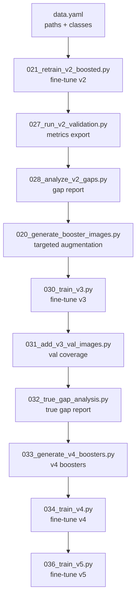
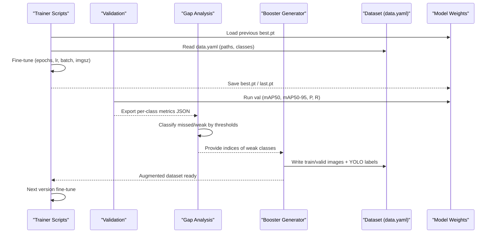

# Model Training Pipeline

<cite>
**Referenced Files in This Document**
- [021_retrain_v2_boosted.py](file://pipeline/ocr_training/021_retrain_v2_boosted.py)
- [025_resume_v2_training.py](file://pipeline/ocr_training/025_resume_v2_training.py)
- [026_smart_resume_v2.py](file://pipeline/ocr_training/026_smart_resume_v2.py)
- [027_run_v2_validation.py](file://pipeline/ocr_training/027_run_v2_validation.py)
- [028_analyze_v2_gaps.py](file://pipeline/ocr_training/028_analyze_v2_gaps.py)
- [030_train_v3.py](file://pipeline/ocr_training/030_train_v3.py)
- [031_add_v3_val_images.py](file://pipeline/ocr_training/031_add_v3_val_images.py)
- [032_true_gap_analysis.py](file://pipeline/ocr_training/032_true_gap_analysis.py)
- [033_generate_v4_boosters.py](file://pipeline/ocr_training/033_generate_v4_boosters.py)
- [034_train_v4.py](file://pipeline/ocr_training/034_train_v4.py)
- [035_check_problem_glyphs.py](file://pipeline/ocr_training/035_check_problem_glyphs.py)
- [036_train_v5.py](file://pipeline/ocr_training/036_train_v5.py)
- [020_generate_booster_images.py](file://pipeline/ocr_training/020_generate_booster_images.py)
- [016_run_full_validation_export.py](file://pipeline/ocr_training/016_run_full_validation_export.py)
- [data.yaml](file://data.yaml)
</cite>

## Table of Contents
1. [Introduction](#introduction)
2. [Project Structure](#project-structure)
3. [Core Components](#core-components)
4. [Architecture Overview](#architecture-overview)
5. [Detailed Component Analysis](#detailed-component-analysis)
6. [Dependency Analysis](#dependency-analysis)
7. [Performance Considerations](#performance-considerations)
8. [Troubleshooting Guide](#troubleshooting-guide)
9. [Conclusion](#conclusion)

## Introduction
This document explains the model training pipeline for Karen OCR, focusing on the multi-version training approach (v1–v5), booster image generation to address model weaknesses, resume and checkpoint management, validation metrics, and dataset relationships. It provides concrete references to scripts that configure training parameters, manage checkpoints, and analyze performance metrics.

## Project Structure
The training pipeline is implemented as a sequence of focused scripts under the OCR training directory. Each version builds on the previous one by fine-tuning from prior best weights and augmenting data where gaps are identified. The dataset configuration is centralized in a YAML file that defines paths, class count, and class names.

**Diagram sources**
- [data.yaml:1-800](file://data.yaml#L1-L800)
- [021_retrain_v2_boosted.py:1-251](file://pipeline/ocr_training/021_retrain_v2_boosted.py#L1-L251)
- [027_run_v2_validation.py:1-29](file://pipeline/ocr_training/027_run_v2_validation.py#L1-L29)
- [028_analyze_v2_gaps.py:1-49](file://pipeline/ocr_training/028_analyze_v2_gaps.py#L1-L49)
- [020_generate_booster_images.py:1-211](file://pipeline/ocr_training/020_generate_booster_images.py#L1-L211)
- [030_train_v3.py:1-35](file://pipeline/ocr_training/030_train_v3.py#L1-L35)
- [031_add_v3_val_images.py:1-55](file://pipeline/ocr_training/031_add_v3_val_images.py#L1-L55)
- [032_true_gap_analysis.py:1-87](file://pipeline/ocr_training/032_true_gap_analysis.py#L1-L87)
- [033_generate_v4_boosters.py:1-63](file://pipeline/ocr_training/033_generate_v4_boosters.py#L1-L63)
- [034_train_v4.py:1-35](file://pipeline/ocr_training/034_train_v4.py#L1-L35)
- [036_train_v5.py:1-33](file://pipeline/ocr_training/036_train_v5.py#L1-L33)

**Section sources**
- [data.yaml:1-800](file://data.yaml#L1-L800)

## Core Components
- Multi-version training: v2, v3, v4, v5 are produced by fine-tuning from the previous version’s best weights with progressively lower learning rates and targeted data augmentation.
- Booster image generation: Creates synthetic images for weak or missed syllable classes using font rendering and simple augmentations, producing YOLO-format labels.
- Resume and checkpoint management: Detects interrupted runs and resumes from last.pt; falls back to best.pt or v1 if needed.
- Validation and metrics: Runs validation to compute mAP50, mAP50-95, precision, recall per class and overall; exports JSON reports and CSV logs.
- Dataset relationship: All scripts reference the centralized data.yaml for train/valid/test paths and class definitions.

**Section sources**
- [021_retrain_v2_boosted.py:1-251](file://pipeline/ocr_training/021_retrain_v2_boosted.py#L1-L251)
- [020_generate_booster_images.py:1-211](file://pipeline/ocr_training/020_generate_booster_images.py#L1-L211)
- [025_resume_v2_training.py:1-33](file://pipeline/ocr_training/025_resume_v2_training.py#L1-L33)
- [026_smart_resume_v2.py:1-307](file://pipeline/ocr_training/026_smart_resume_v2.py#L1-L307)
- [027_run_v2_validation.py:1-29](file://pipeline/ocr_training/027_run_v2_validation.py#L1-L29)
- [028_analyze_v2_gaps.py:1-49](file://pipeline/ocr_training/028_analyze_v2_gaps.py#L1-L49)
- [030_train_v3.py:1-35](file://pipeline/ocr_training/030_train_v3.py#L1-L35)
- [031_add_v3_val_images.py:1-55](file://pipeline/ocr_training/031_add_v3_val_images.py#L1-L55)
- [032_true_gap_analysis.py:1-87](file://pipeline/ocr_training/032_true_gap_analysis.py#L1-L87)
- [033_generate_v4_boosters.py:1-63](file://pipeline/ocr_training/033_generate_v4_boosters.py#L1-L63)
- [034_train_v4.py:1-35](file://pipeline/ocr_training/034_train_v4.py#L1-L35)
- [036_train_v5.py:1-33](file://pipeline/ocr_training/036_train_v5.py#L1-L33)
- [016_run_full_validation_export.py:1-206](file://pipeline/ocr_training/016_run_full_validation_export.py#L1-L206)
- [data.yaml:1-800](file://data.yaml#L1-L800)

## Architecture Overview
The pipeline follows an iterative improvement loop:
- Train/fine-tune a new version from the previous best weights.
- Validate and measure per-class metrics.
- Identify missed/weak classes.
- Generate targeted booster images for those classes.
- Retrain with augmented data and repeat until targets are met.

**Diagram sources**
- [021_retrain_v2_boosted.py:1-251](file://pipeline/ocr_training/021_retrain_v2_boosted.py#L1-L251)
- [027_run_v2_validation.py:1-29](file://pipeline/ocr_training/027_run_v2_validation.py#L1-L29)
- [028_analyze_v2_gaps.py:1-49](file://pipeline/ocr_training/028_analyze_v2_gaps.py#L1-L49)
- [020_generate_booster_images.py:1-211](file://pipeline/ocr_training/020_generate_booster_images.py#L1-L211)
- [030_train_v3.py:1-35](file://pipeline/ocr_training/030_train_v3.py#L1-L35)
- [033_generate_v4_boosters.py:1-63](file://pipeline/ocr_training/033_generate_v4_boosters.py#L1-L63)
- [034_train_v4.py:1-35](file://pipeline/ocr_training/034_train_v4.py#L1-L35)
- [036_train_v5.py:1-33](file://pipeline/ocr_training/036_train_v5.py#L1-L33)
- [data.yaml:1-800](file://data.yaml#L1-L800)

## Detailed Component Analysis

### Multi-Version Training (v2–v5)
Each version fine-tunes from the previous best weights with adjusted hyperparameters:
- v2: Fine-tunes from v1 best weights with moderate epochs and conservative learning rate.
- v3: Further fine-tune with reduced learning rate and fewer epochs.
- v4: Additional fine-tune targeting remaining gaps after adding more robust validation coverage.
- v5: Final refinement with even lower learning rate.

Key configuration patterns across versions:
- Input size fixed at 320.
- Batch sizes tuned for GPU memory stability.
- Learning rate decay via final LR fraction.
- Early stopping via patience to avoid overfitting.
- Mixed precision enabled for efficiency.

Example parameter references:
- v2 fine-tune configuration and rationale: [021_retrain_v2_boosted.py:131-208](file://pipeline/ocr_training/021_retrain_v2_boosted.py#L131-L208)
- v3 training parameters: [030_train_v3.py:13-31](file://pipeline/ocr_training/030_train_v3.py#L13-L31)
- v4 training parameters: [034_train_v4.py:13-31](file://pipeline/ocr_training/034_train_v4.py#L13-L31)
- v5 training parameters: [036_train_v5.py:12-30](file://pipeline/ocr_training/036_train_v5.py#L12-L30)

**Section sources**
- [021_retrain_v2_boosted.py:131-208](file://pipeline/ocr_training/021_retrain_v2_boosted.py#L131-L208)
- [030_train_v3.py:13-31](file://pipeline/ocr_training/030_train_v3.py#L13-L31)
- [034_train_v4.py:13-31](file://pipeline/ocr_training/034_train_v4.py#L13-L31)
- [036_train_v5.py:12-30](file://pipeline/ocr_training/036_train_v5.py#L12-L30)

### Booster Image Generation
Targeted augmentation creates synthetic images for weak or missed syllables:
- Reads index map and data.yaml to resolve class indices and Unicode strings.
- Renders text with Padauk font at varied sizes and positions.
- Applies random blur, noise, and rotation for diversity.
- Writes YOLO-format labels alongside images into train and optionally valid directories.
- Produces a report summarizing generated counts and skipped classes.

References:
- v2 booster generation workflow: [020_generate_booster_images.py:18-211](file://pipeline/ocr_training/020_generate_booster_images.py#L18-L211)
- v3 validation augmentation for missed classes: [031_add_v3_val_images.py:1-55](file://pipeline/ocr_training/031_add_v3_val_images.py#L1-L55)
- v4 booster generation with larger counts: [033_generate_v4_boosters.py:1-63](file://pipeline/ocr_training/033_generate_v4_boosters.py#L1-L63)

**Section sources**
- [020_generate_booster_images.py:18-211](file://pipeline/ocr_training/020_generate_booster_images.py#L18-L211)
- [031_add_v3_val_images.py:1-55](file://pipeline/ocr_training/031_add_v3_val_images.py#L1-L55)
- [033_generate_v4_boosters.py:1-63](file://pipeline/ocr_training/033_generate_v4_boosters.py#L1-L63)

### Resume and Checkpoint Management
Robust recovery handles interrupted training sessions:
- Smart detection checks results.csv to determine completed epochs.
- Priority order: resume from last.pt (full state), fallback to best.pt (weights only), fallback to v1 best.pt (baseline).
- If already complete, skips retraining and directs to evaluation.
- Simple resume script demonstrates direct continuation from last.pt.

References:
- Smart resume logic and fallbacks: [026_smart_resume_v2.py:114-290](file://pipeline/ocr_training/026_smart_resume_v2.py#L114-L290)
- Direct resume usage: [025_resume_v2_training.py:12-32](file://pipeline/ocr_training/025_resume_v2_training.py#L12-L32)

**Section sources**
- [026_smart_resume_v2.py:114-290](file://pipeline/ocr_training/026_smart_resume_v2.py#L114-L290)
- [025_resume_v2_training.py:12-32](file://pipeline/ocr_training/025_resume_v2_training.py#L12-L32)

### Validation Pipeline and Metrics
Validation measures accuracy proxies and per-class performance:
- Runs YOLO validation with specified confidence and IoU thresholds.
- Exports per-class precision, recall, mAP50, and mAP50-95 to JSON.
- Gap analysis categorizes classes as missed or weak based on thresholds.
- Full validation export logs detections across all validation images to CSV for detailed review.

References:
- Validation execution and metric export: [027_run_v2_validation.py:11-23](file://pipeline/ocr_training/027_run_v2_validation.py#L11-L23)
- Gap classification and reporting: [028_analyze_v2_gaps.py:20-49](file://pipeline/ocr_training/028_analyze_v2_gaps.py#L20-L49)
- True gap analysis with instance counts: [032_true_gap_analysis.py:9-87](file://pipeline/ocr_training/032_true_gap_analysis.py#L9-L87)
- Full validation export to CSV: [016_run_full_validation_export.py:32-206](file://pipeline/ocr_training/016_run_full_validation_export.py#L32-L206)

**Section sources**
- [027_run_v2_validation.py:11-23](file://pipeline/ocr_training/027_run_v2_validation.py#L11-L23)
- [028_analyze_v2_gaps.py:20-49](file://pipeline/ocr_training/028_analyze_v2_gaps.py#L20-L49)
- [032_true_gap_analysis.py:9-87](file://pipeline/ocr_training/032_true_gap_analysis.py#L9-L87)
- [016_run_full_validation_export.py:32-206](file://pipeline/ocr_training/016_run_full_validation_export.py#L32-L206)

### Relationship Between Training Scripts and Dataset Structure
All training and validation scripts rely on a centralized dataset configuration:
- data.yaml defines base path, train/valid/test subfolders, number of classes, and class names.
- Scripts read this file to locate images and labels consistently across environments.
- Booster generators write YOLO-format labels aligned with the class indices defined in data.yaml.

Reference:
- Dataset configuration structure: [data.yaml:1-800](file://data.yaml#L1-L800)

**Section sources**
- [data.yaml:1-800](file://data.yaml#L1-L800)

## Dependency Analysis
The pipeline exhibits clear sequential dependencies with feedback loops driven by validation outcomes:

```mermaid
graph LR
V2["v2 training<br/>021_retrain_v2_boosted.py"] --> VAL["validation<br/>027_run_v2_validation.py"]
VAL --> GAP["gap analysis<br/>028_analyze_v2_gaps.py"]
GAP --> BOOST["booster gen<br/>020_generate_booster_images.py"]
BOOST --> V3["v3 training<br/>030_train_v3.py"]
V3 --> VALV3["val augmentation<br/>031_add_v3_val_images.py"]
VALV3 --> TRUEGAP["true gap analysis<br/>032_true_gap_analysis.py"]
TRUEGAP --> V4BOOST["v4 boosters<br/>033_generate_v4_boosters.py"]
V4BOOST --> V4["v4 training<br/>034_train_v4.py"]
V4 --> V5["v5 training<br/>036_train_v5.py"]
```

**Diagram sources**
- [021_retrain_v2_boosted.py:1-251](file://pipeline/ocr_training/021_retrain_v2_boosted.py#L1-L251)
- [027_run_v2_validation.py:1-29](file://pipeline/ocr_training/027_run_v2_validation.py#L1-L29)
- [028_analyze_v2_gaps.py:1-49](file://pipeline/ocr_training/028_analyze_v2_gaps.py#L1-L49)
- [020_generate_booster_images.py:1-211](file://pipeline/ocr_training/020_generate_booster_images.py#L1-L211)
- [030_train_v3.py:1-35](file://pipeline/ocr_training/030_train_v3.py#L1-L35)
- [031_add_v3_val_images.py:1-55](file://pipeline/ocr_training/031_add_v3_val_images.py#L1-L55)
- [032_true_gap_analysis.py:1-87](file://pipeline/ocr_training/032_true_gap_analysis.py#L1-L87)
- [033_generate_v4_boosters.py:1-63](file://pipeline/ocr_training/033_generate_v4_boosters.py#L1-L63)
- [034_train_v4.py:1-35](file://pipeline/ocr_training/034_train_v4.py#L1-L35)
- [036_train_v5.py:1-33](file://pipeline/ocr_training/036_train_v5.py#L1-L33)

**Section sources**
- [021_retrain_v2_boosted.py:1-251](file://pipeline/ocr_training/021_retrain_v2_boosted.py#L1-L251)
- [027_run_v2_validation.py:1-29](file://pipeline/ocr_training/027_run_v2_validation.py#L1-L29)
- [028_analyze_v2_gaps.py:1-49](file://pipeline/ocr_training/028_analyze_v2_gaps.py#L1-L49)
- [020_generate_booster_images.py:1-211](file://pipeline/ocr_training/020_generate_booster_images.py#L1-L211)
- [030_train_v3.py:1-35](file://pipeline/ocr_training/030_train_v3.py#L1-L35)
- [031_add_v3_val_images.py:1-55](file://pipeline/ocr_training/031_add_v3_val_images.py#L1-L55)
- [032_true_gap_analysis.py:1-87](file://pipeline/ocr_training/032_true_gap_analysis.py#L1-L87)
- [033_generate_v4_boosters.py:1-63](file://pipeline/ocr_training/033_generate_v4_boosters.py#L1-L63)
- [034_train_v4.py:1-35](file://pipeline/ocr_training/034_train_v4.py#L1-L35)
- [036_train_v5.py:1-33](file://pipeline/ocr_training/036_train_v5.py#L1-L33)

## Performance Considerations
- Mixed precision (half=True) reduces memory usage without sacrificing accuracy on supported GPUs.
- Patience-based early stopping prevents overfitting during fine-tuning.
- Fixed input size (imgsz=320) ensures consistency across versions and avoids feature map mismatches.
- Batch sizes are chosen to fit GPU memory while maintaining throughput.
- Lower learning rates in later versions reduce risk of catastrophic forgetting when fine-tuning on small booster sets.

[No sources needed since this section provides general guidance]

## Troubleshooting Guide
Common issues and resolutions grounded in the codebase:
- Missing data.yaml or weights: Scripts perform pre-flight checks and print explicit instructions to run prerequisite steps or upload missing files.
  - Reference: [021_retrain_v2_boosted.py:97-117](file://pipeline/ocr_training/021_retrain_v2_boosted.py#L97-L117)
- CUDA out-of-memory during training: Reduce batch size and set environment variable for expandable segments.
  - Reference: [021_retrain_v2_boosted.py:241-251](file://pipeline/ocr_training/021_retrain_v2_boosted.py#L241-L251)
- Interrupted training: Use smart resume to detect completion and choose appropriate checkpoint; fallback paths ensure progress is preserved when possible.
  - Reference: [026_smart_resume_v2.py:114-290](file://pipeline/ocr_training/026_smart_resume_v2.py#L114-L290)
- Overfitting on booster images: Use patience and lower learning rates; validate frequently to monitor plateauing metrics.
  - Reference: [021_retrain_v2_boosted.py:185-207](file://pipeline/ocr_training/021_retrain_v2_boosted.py#L185-L207)
- Underfitting or persistent gaps: Increase booster image counts and add validation coverage for missed classes; verify true gaps with instance-aware analysis.
  - Reference: [033_generate_v4_boosters.py:1-63](file://pipeline/ocr_training/033_generate_v4_boosters.py#L1-L63)
  - Reference: [032_true_gap_analysis.py:9-87](file://pipeline/ocr_training/032_true_gap_analysis.py#L9-L87)
- Convergence problems: Ensure consistent imgsz and optimizer settings across versions; use warmup and cosine decay as configured in scripts.
  - Reference: [030_train_v3.py:13-31](file://pipeline/ocr_training/030_train_v3.py#L13-L31)
  - Reference: [034_train_v4.py:13-31](file://pipeline/ocr_training/034_train_v4.py#L13-L31)
  - Reference: [036_train_v5.py:12-30](file://pipeline/ocr_training/036_train_v5.py#L12-L30)

**Section sources**
- [021_retrain_v2_boosted.py:97-117](file://pipeline/ocr_training/021_retrain_v2_boosted.py#L97-L117)
- [021_retrain_v2_boosted.py:185-207](file://pipeline/ocr_training/021_retrain_v2_boosted.py#L185-L207)
- [021_retrain_v2_boosted.py:241-251](file://pipeline/ocr_training/021_retrain_v2_boosted.py#L241-L251)
- [026_smart_resume_v2.py:114-290](file://pipeline/ocr_training/026_smart_resume_v2.py#L114-L290)
- [033_generate_v4_boosters.py:1-63](file://pipeline/ocr_training/033_generate_v4_boosters.py#L1-L63)
- [032_true_gap_analysis.py:9-87](file://pipeline/ocr_training/032_true_gap_analysis.py#L9-L87)
- [030_train_v3.py:13-31](file://pipeline/ocr_training/030_train_v3.py#L13-L31)
- [034_train_v4.py:13-31](file://pipeline/ocr_training/034_train_v4.py#L13-L31)
- [036_train_v5.py:12-30](file://pipeline/ocr_training/036_train_v5.py#L12-L30)

## Conclusion
The training pipeline implements a disciplined, iterative improvement strategy for Karen OCR. By fine-tuning successive versions, generating targeted booster images for weak classes, and rigorously validating with per-class metrics, the system converges toward robust detection. Robust resume mechanisms protect against interruptions, and centralized dataset configuration ensures reproducibility. Following the referenced scripts and configurations enables reliable training, checkpoint management, and performance analysis.

[No sources needed since this section summarizes without analyzing specific files]