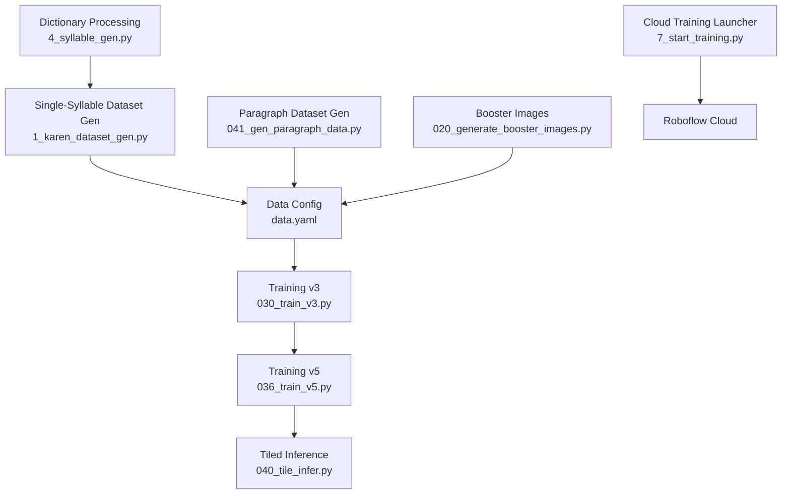
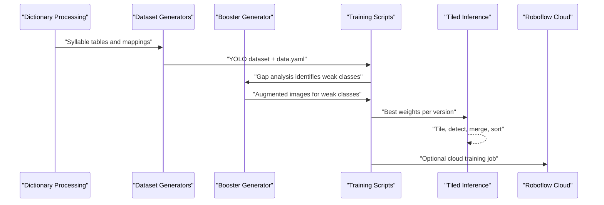
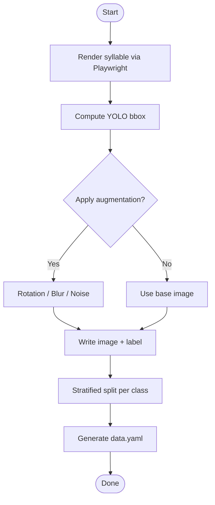
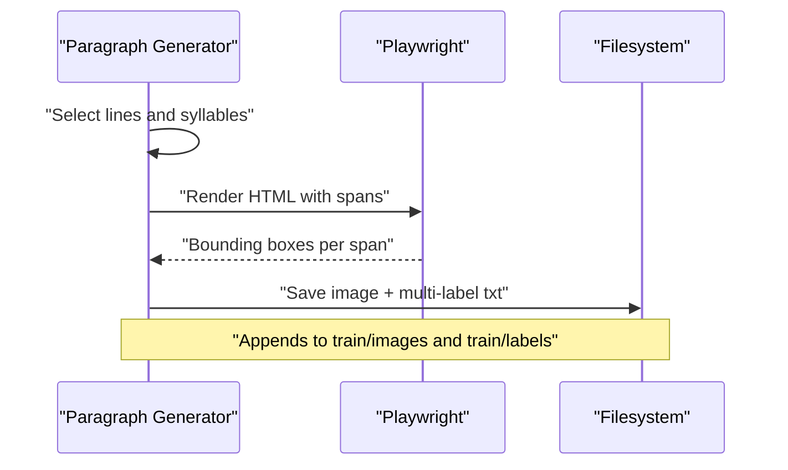
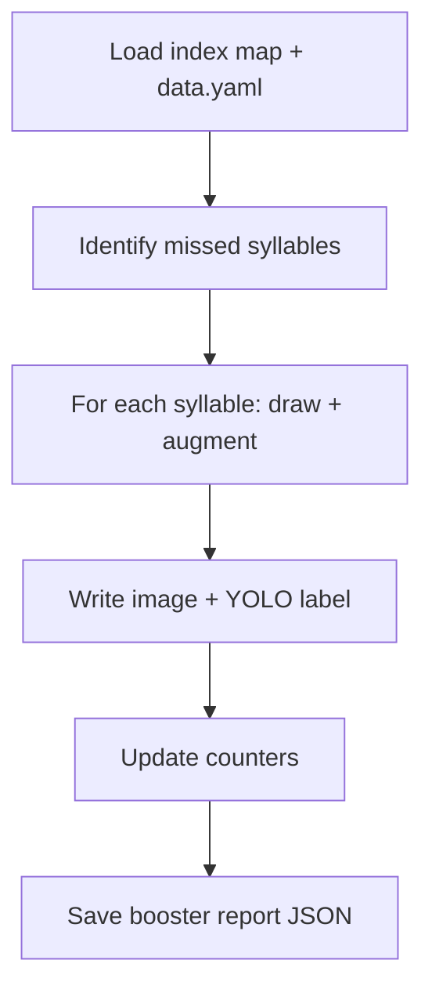
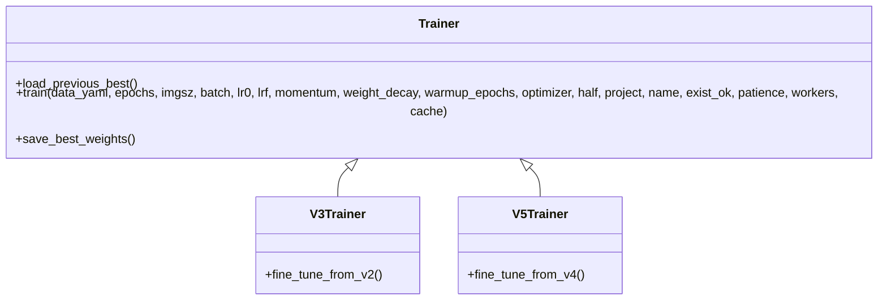
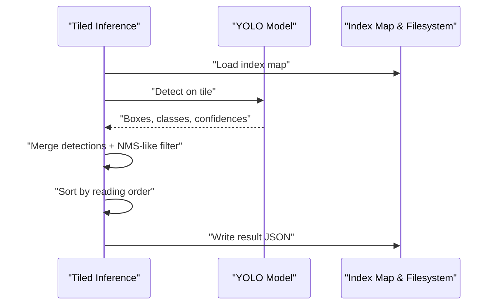
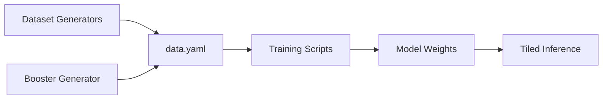

# OCR Training Pipeline

<cite>
**Referenced Files in This Document**
- [1_karen_dataset_gen.py](file://pipeline/ocr_training/1_karen_dataset_gen.py)
- [data.yaml](file://data.yaml)
- [041_gen_paragraph_data.py](file://pipeline/ocr_training/041_gen_paragraph_data.py)
- [020_generate_booster_images.py](file://pipeline/ocr_training/020_generate_booster_images.py)
- [030_train_v3.py](file://pipeline/ocr_training/030_train_v3.py)
- [036_train_v5.py](file://pipeline/ocr_training/036_train_v5.py)
- [040_tile_infer.py](file://pipeline/ocr_training/040_tile_infer.py)
- [7_start_training.py](file://pipeline/ocr_training/7_start_training.py)
- [4_syllable_gen.py](file://pipeline/dictionary_processing/4_syllable_gen.py)
</cite>

## Table of Contents
1. Introduction
2. Project Structure
3. Core Components
4. Architecture Overview
5. Detailed Component Analysis
6. Dependency Analysis
7. Performance Considerations
8. Troubleshooting Guide
9. Conclusion

## Introduction
This document explains the OCR training pipeline for Sgaw Karen syllables, focusing on synthetic dataset generation, multi-version model training with performance tracking and booster images, paragraph-level dataset creation, and tiled inference for large documents. It also documents configuration options, training parameters, and how this pipeline integrates with dictionary processing and the web interface.

## Project Structure
The OCR training pipeline is implemented as a set of focused scripts under the OCR training directory, plus supporting data files:
- Synthetic single-syllable dataset generator using Playwright rendering and YOLO annotations
- Paragraph-level dataset generator that composes multiple syllables per image
- Booster image generator to target weak classes identified by gap analysis
- Versioned training scripts (v3, v5) that fine-tune from previous best weights
- Tiled inference script for large documents
- Data configuration file defining classes and dataset paths
- Dictionary processing script that enumerates all valid Sgaw Karen syllables used across the pipeline

**Diagram sources**
- [4_syllable_gen.py:1-172](file://pipeline/dictionary_processing/4_syllable_gen.py#L1-L172)
- [1_karen_dataset_gen.py:1-334](file://pipeline/ocr_training/1_karen_dataset_gen.py#L1-L334)
- [data.yaml:1-800](file://data.yaml#L1-L800)
- [041_gen_paragraph_data.py:1-230](file://pipeline/ocr_training/041_gen_paragraph_data.py#L1-L230)
- [020_generate_booster_images.py:1-211](file://pipeline/ocr_training/020_generate_booster_images.py#L1-L211)
- [030_train_v3.py:1-35](file://pipeline/ocr_training/030_train_v3.py#L1-L35)
- [036_train_v5.py:1-33](file://pipeline/ocr_training/036_train_v5.py#L1-L33)
- [040_tile_infer.py:1-68](file://pipeline/ocr_training/040_tile_infer.py#L1-L68)
- [7_start_training.py:1-28](file://pipeline/ocr_training/7_start_training.py#L1-L28)

**Section sources**
- [1_karen_dataset_gen.py:1-334](file://pipeline/ocr_training/1_karen_dataset_gen.py#L1-L334)
- [data.yaml:1-800](file://data.yaml#L1-L800)
- [041_gen_paragraph_data.py:1-230](file://pipeline/ocr_training/041_gen_paragraph_data.py#L1-L230)
- [020_generate_booster_images.py:1-211](file://pipeline/ocr_training/020_generate_booster_images.py#L1-L211)
- [030_train_v3.py:1-35](file://pipeline/ocr_training/030_train_v3.py#L1-L35)
- [036_train_v5.py:1-33](file://pipeline/ocr_training/036_train_v5.py#L1-L33)
- [040_tile_infer.py:1-68](file://pipeline/ocr_training/040_tile_infer.py#L1-L68)
- [7_start_training.py:1-28](file://pipeline/ocr_training/7_start_training.py#L1-L28)
- [4_syllable_gen.py:1-172](file://pipeline/dictionary_processing/4_syllable_gen.py#L1-L172)

## Core Components
- Synthetic single-syllable dataset generator: Renders thousands of Sgaw Karen syllable combinations via Playwright, computes YOLO bounding boxes, applies augmentation, and splits into train/valid/test sets.
- Paragraph-level dataset generator: Composes realistic text lines with multiple syllables per line, renders them, and writes multi-syllable YOLO labels.
- Booster image generator: Produces targeted augmented images for under-performing classes based on gap analysis.
- Multi-version training: Fine-tunes models iteratively (v3, v5) from prior best weights with tuned hyperparameters.
- Tiled inference: Performs detection on large images by tiling, merging detections, and outputting reading order.
- Data configuration: Central YAML file describing dataset paths, number of classes, and class names.
- Dictionary processing: Enumerates valid Sgaw Karen syllables and produces canonical mappings used by other components.

**Section sources**
- [1_karen_dataset_gen.py:1-334](file://pipeline/ocr_training/1_karen_dataset_gen.py#L1-L334)
- [041_gen_paragraph_data.py:1-230](file://pipeline/ocr_training/041_gen_paragraph_data.py#L1-L230)
- [020_generate_booster_images.py:1-211](file://pipeline/ocr_training/020_generate_booster_images.py#L1-L211)
- [030_train_v3.py:1-35](file://pipeline/ocr_training/030_train_v3.py#L1-L35)
- [036_train_v5.py:1-33](file://pipeline/ocr_training/036_train_v5.py#L1-L33)
- [040_tile_infer.py:1-68](file://pipeline/ocr_training/040_tile_infer.py#L1-L68)
- [data.yaml:1-800](file://data.yaml#L1-L800)
- [4_syllable_gen.py:1-172](file://pipeline/dictionary_processing/4_syllable_gen.py#L1-L172)

## Architecture Overview
The pipeline follows a clear progression from data synthesis to model iteration and inference:
- Dictionary processing defines the universe of valid Sgaw Karen syllables.
- Single-syllable and paragraph-level generators produce labeled datasets.
- Booster images augment weak classes identified during validation.
- Training scripts fine-tune models incrementally, producing versioned checkpoints.
- Tiled inference detects syllables in large documents and outputs structured results.

**Diagram sources**
- [4_syllable_gen.py:1-172](file://pipeline/dictionary_processing/4_syllable_gen.py#L1-L172)
- [1_karen_dataset_gen.py:1-334](file://pipeline/ocr_training/1_karen_dataset_gen.py#L1-L334)
- [041_gen_paragraph_data.py:1-230](file://pipeline/ocr_training/041_gen_paragraph_data.py#L1-L230)
- [020_generate_booster_images.py:1-211](file://pipeline/ocr_training/020_generate_booster_images.py#L1-L211)
- [030_train_v3.py:1-35](file://pipeline/ocr_training/030_train_v3.py#L1-L35)
- [036_train_v5.py:1-33](file://pipeline/ocr_training/036_train_v5.py#L1-L33)
- [040_tile_infer.py:1-68](file://pipeline/ocr_training/040_tile_infer.py#L1-L68)
- [7_start_training.py:1-28](file://pipeline/ocr_training/7_start_training.py#L1-L28)

## Detailed Component Analysis

### Synthetic Single-Syllable Dataset Generation
- Rendering: Uses Playwright to render HTML with Padauk font; captures screenshots at fixed resolution.
- Bounding boxes: Computes pixel bounding boxes from rendered images and converts to normalized YOLO format.
- Augmentation: Applies rotation, Gaussian blur, and noise addition to increase robustness.
- Splitting: Stratified split into train/valid/test sets per class.
- Output: Writes images and labels to a Roboflow-ready structure and generates data.yaml with class list.

**Diagram sources**
- [1_karen_dataset_gen.py:104-181](file://pipeline/ocr_training/1_karen_dataset_gen.py#L104-L181)
- [1_karen_dataset_gen.py:208-219](file://pipeline/ocr_training/1_karen_dataset_gen.py#L208-L219)
- [1_karen_dataset_gen.py:225-334](file://pipeline/ocr_training/1_karen_dataset_gen.py#L225-L334)

**Section sources**
- [1_karen_dataset_gen.py:104-181](file://pipeline/ocr_training/1_karen_dataset_gen.py#L104-L181)
- [1_karen_dataset_gen.py:208-219](file://pipeline/ocr_training/1_karen_dataset_gen.py#L208-L219)
- [1_karen_dataset_gen.py:225-334](file://pipeline/ocr_training/1_karen_dataset_gen.py#L225-L334)

### Paragraph-Level Dataset Generation
- Composition: Randomly selects syllables to build realistic lines and paragraphs.
- Rendering: Builds HTML with spans per syllable; uses Playwright to measure per-syllable bounding boxes.
- Labeling: Writes multi-syllable YOLO labels per paragraph image.
- Output: Appends paragraph images and labels to existing training directories for retraining.

**Diagram sources**
- [041_gen_paragraph_data.py:67-110](file://pipeline/ocr_training/041_gen_paragraph_data.py#L67-L110)
- [041_gen_paragraph_data.py:137-230](file://pipeline/ocr_training/041_gen_paragraph_data.py#L137-L230)

**Section sources**
- [041_gen_paragraph_data.py:67-110](file://pipeline/ocr_training/041_gen_paragraph_data.py#L67-L110)
- [041_gen_paragraph_data.py:137-230](file://pipeline/ocr_training/041_gen_paragraph_data.py#L137-L230)

### Booster Image Generation for Weak Classes
- Gap analysis input: Identifies missed or low-confidence syllables.
- Generation: Creates augmented images per weak class using PIL drawing and OpenCV transforms.
- Labeling: Writes YOLO labels with normalized coordinates.
- Reporting: Saves a JSON report summarizing generated images and skipped classes.

**Diagram sources**
- [020_generate_booster_images.py:30-68](file://pipeline/ocr_training/020_generate_booster_images.py#L30-L68)
- [020_generate_booster_images.py:77-186](file://pipeline/ocr_training/020_generate_booster_images.py#L77-L186)
- [020_generate_booster_images.py:188-211](file://pipeline/ocr_training/020_generate_booster_images.py#L188-L211)

**Section sources**
- [020_generate_booster_images.py:30-68](file://pipeline/ocr_training/020_generate_booster_images.py#L30-L68)
- [020_generate_booster_images.py:77-186](file://pipeline/ocr_training/020_generate_booster_images.py#L77-L186)
- [020_generate_booster_images.py:188-211](file://pipeline/ocr_training/020_generate_booster_images.py#L188-L211)

### Multi-Version Training Approach (v1–v5)
- Iterative fine-tuning: Each version loads the previous best weights and trains with adjusted hyperparameters.
- Parameters: Epochs, image size, batch size, learning rate schedule, optimizer settings, patience, workers, and caching behavior are explicitly configured per version.
- Outputs: Best weights per version are saved for subsequent steps and evaluation.

**Diagram sources**
- [030_train_v3.py:1-35](file://pipeline/ocr_training/030_train_v3.py#L1-L35)
- [036_train_v5.py:1-33](file://pipeline/ocr_training/036_train_v5.py#L1-L33)

**Section sources**
- [030_train_v3.py:1-35](file://pipeline/ocr_training/030_train_v3.py#L1-L35)
- [036_train_v5.py:1-33](file://pipeline/ocr_training/036_train_v5.py#L1-L33)

### Tiled Inference for Large Documents
- Tiling: Splits large images into overlapping tiles.
- Detection: Runs model inference per tile with confidence and IoU thresholds.
- Merging: Aggregates detections, applies non-max suppression-like filtering, and sorts by reading order.
- Output: Returns JSON with total count and per-detection details including class mapping and coordinates.

**Diagram sources**
- [040_tile_infer.py:15-68](file://pipeline/ocr_training/040_tile_infer.py#L15-L68)

**Section sources**
- [040_tile_infer.py:15-68](file://pipeline/ocr_training/040_tile_infer.py#L15-L68)

### Configuration Options in data.yaml
- path: Root directory of the dataset.
- train/val/test: Relative paths to image folders for each split.
- nc: Number of classes (total unique syllable labels).
- names: Ordered list of class names corresponding to indices.

These fields define the dataset schema consumed by training and inference scripts.

**Section sources**
- [data.yaml:1-800](file://data.yaml#L1-L800)

### Parameters for Training Scripts
- v3 training: Loads previous best weights, configures epochs, image size, batch size, learning rate and schedule, optimizer, half precision, project/name for runs, patience, workers, and cache behavior.
- v5 training: Similar configuration with adjusted learning rate and fewer epochs, continuing from v4 best weights.

These parameters control model convergence and resource usage.

**Section sources**
- [030_train_v3.py:1-35](file://pipeline/ocr_training/030_train_v3.py#L1-L35)
- [036_train_v5.py:1-33](file://pipeline/ocr_training/036_train_v5.py#L1-L33)

### Return Values from Inference Operations
- Tiled inference returns a JSON object containing:
  - total: Count of kept detections after filtering.
  - detections: List of objects with syllable name, class index, confidence, and bounding box coordinates.

This structured output supports downstream processing and reporting.

**Section sources**
- [040_tile_infer.py:15-68](file://pipeline/ocr_training/040_tile_infer.py#L15-L68)

### Relationships with Other Components
- Dictionary processing pipeline: Generates canonical syllable tables and mappings used by dataset generators and boosters.
- Web interface integration: The dictionary processing suite includes a local translator suite with templates and static assets; while not directly invoked by OCR scripts, it shares the same language resources and can be used alongside OCR outputs for translation workflows.

**Section sources**
- [4_syllable_gen.py:1-172](file://pipeline/dictionary_processing/4_syllable_gen.py#L1-L172)

## Dependency Analysis
- Data dependencies:
  - data.yaml provides dataset paths and class definitions consumed by training scripts.
  - Index maps and font files are required by dataset generators and inference.
- Script dependencies:
  - Dataset generators depend on Playwright and OpenCV for rendering and augmentation.
  - Training scripts depend on Ultralytics YOLO and optionally Roboflow for cloud training.
  - Booster generator depends on PIL and OpenCV for drawing and transforms.
  - Tiled inference depends on Ultralytics YOLO and JSON for output.

**Diagram sources**
- [data.yaml:1-800](file://data.yaml#L1-L800)
- [030_train_v3.py:1-35](file://pipeline/ocr_training/030_train_v3.py#L1-L35)
- [036_train_v5.py:1-33](file://pipeline/ocr_training/036_train_v5.py#L1-L33)
- [040_tile_infer.py:15-68](file://pipeline/ocr_training/040_tile_infer.py#L15-L68)

**Section sources**
- [data.yaml:1-800](file://data.yaml#L1-L800)
- [030_train_v3.py:1-35](file://pipeline/ocr_training/030_train_v3.py#L1-L35)
- [036_train_v5.py:1-33](file://pipeline/ocr_training/036_train_v5.py#L1-L33)
- [040_tile_infer.py:15-68](file://pipeline/ocr_training/040_tile_infer.py#L15-L68)

## Performance Considerations
- Rendering throughput: Playwright-based rendering scales with CPU and browser startup overhead; batching and minimizing page reloads improves efficiency.
- Augmentation cost: Rotation, blur, and noise add computational overhead; tune probabilities and kernel sizes to balance quality and speed.
- Training scale: Larger datasets and higher image sizes increase memory and time requirements; adjust batch size and workers accordingly.
- Inference tiling: Tile size and overlap affect accuracy and speed; larger tiles reduce boundary artifacts but increase memory usage.

[No sources needed since this section provides general guidance]

## Troubleshooting Guide
- Missing font: Ensure the specified font file exists before running dataset generators; otherwise, rendering will fail.
- Invalid paths: Verify dataset paths in data.yaml and any path configuration files referenced by scripts.
- API key requirement: Cloud training launcher requires an environment variable for authentication; set it before execution.
- Gap analysis inputs: Booster generation depends on accurate identification of weak classes; ensure upstream analysis outputs are present and correctly mapped.

**Section sources**
- [1_karen_dataset_gen.py:225-236](file://pipeline/ocr_training/1_karen_dataset_gen.py#L225-L236)
- [7_start_training.py:1-28](file://pipeline/ocr_training/7_start_training.py#L1-L28)
- [020_generate_booster_images.py:30-68](file://pipeline/ocr_training/020_generate_booster_images.py#L30-L68)

## Conclusion
The OCR training pipeline combines synthetic data generation, targeted augmentation, iterative model training, and robust inference to support Sgaw Karen syllable recognition. By leveraging Playwright for accurate glyph rendering, YOLO-format annotations, and versioned fine-tuning, the system builds progressively stronger models. Paragraph-level data and tiled inference extend capabilities beyond isolated syllables to real-world documents. Integration with dictionary processing ensures linguistic validity and consistency across the pipeline.