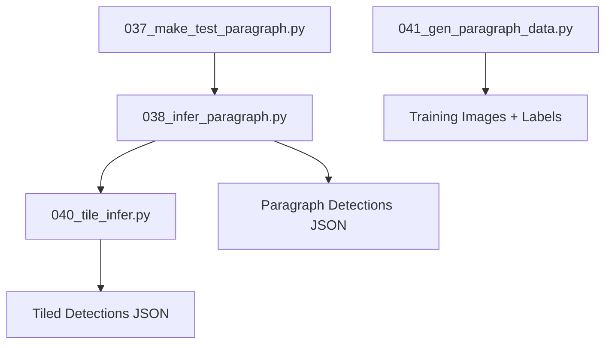
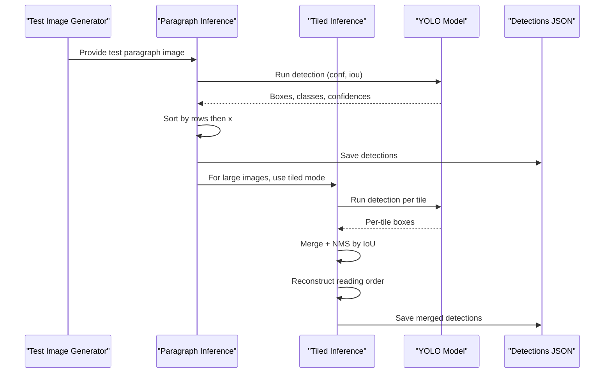
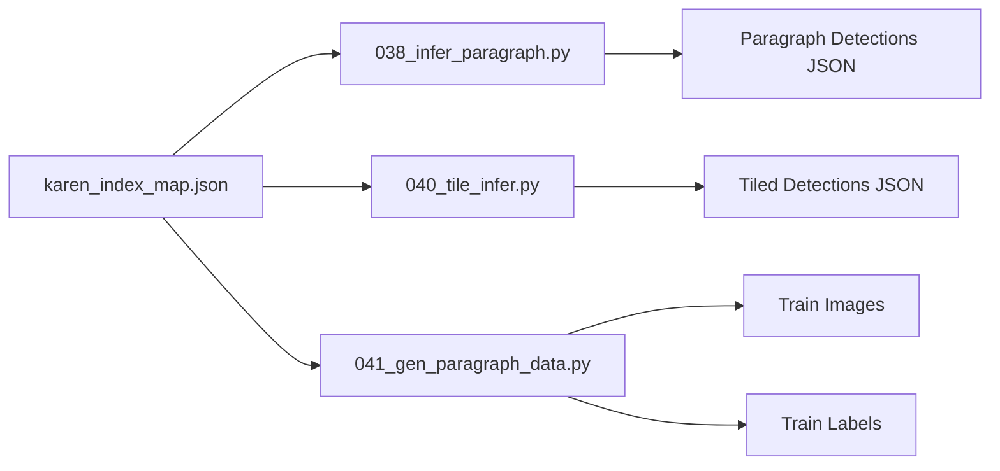

# Paragraph-Level Inference

<cite>
**Referenced Files in This Document**
- [037_make_test_paragraph.py](file://pipeline/ocr_training/037_make_test_paragraph.py)
- [038_infer_paragraph.py](file://pipeline/ocr_training/038_infer_paragraph.py)
- [040_tile_infer.py](file://pipeline/ocr_training/040_tile_infer.py)
- [041_gen_paragraph_data.py](file://pipeline/ocr_training/041_gen_paragraph_data.py)
- [karen_index_map.json](file://karen_index_map.json)
- [batch_config.json](file://batch_config.json)
</cite>

## Table of Contents
1. [Introduction](#introduction)
2. [Project Structure](#project-structure)
3. [Core Components](#core-components)
4. [Architecture Overview](#architecture-overview)
5. [Detailed Component Analysis](#detailed-component-analysis)
6. [Dependency Analysis](#dependency-analysis)
7. [Performance Considerations](#performance-considerations)
8. [Troubleshooting Guide](#troubleshooting-guide)
9. [Conclusion](#conclusion)
10. [Appendices](#appendices)

## Introduction
This document explains the paragraph-level inference component that moves beyond isolated syllable detection to process full text lines and paragraphs from images. It covers:
- Tiled inference for large documents, processing images in overlapping tiles while preserving context across tile boundaries
- Paragraph dataset generation that creates realistic training samples from actual Karen characters
- The end-to-end inference pipeline for variable-length text and complex character sequences
- Configuration options for tile size, overlap, confidence thresholds, and related parameters
- Practical examples, edge-case handling (orientation, spacing, mixed content), and performance optimization strategies

## Project Structure
The paragraph-level workflow is implemented as a sequence of scripts under the OCR training pipeline:
- Test image creation for paragraphs
- Single-image paragraph inference
- Tiled inference with overlap and non-maximum suppression
- Paragraph dataset generator using a headless browser to render realistic multi-syllable lines and produce YOLO labels

**Diagram sources**
- [037_make_test_paragraph.py:1-36](file://pipeline/ocr_training/037_make_test_paragraph.py#L1-L36)
- [038_infer_paragraph.py:1-59](file://pipeline/ocr_training/038_infer_paragraph.py#L1-L59)
- [040_tile_infer.py:1-68](file://pipeline/ocr_training/040_tile_infer.py#L1-L68)
- [041_gen_paragraph_data.py:1-230](file://pipeline/ocr_training/041_gen_paragraph_data.py#L1-L230)

**Section sources**
- [037_make_test_paragraph.py:1-36](file://pipeline/ocr_training/037_make_test_paragraph.py#L1-L36)
- [038_infer_paragraph.py:1-59](file://pipeline/ocr_training/038_infer_paragraph.py#L1-L59)
- [040_tile_infer.py:1-68](file://pipeline/ocr_training/040_tile_infer.py#L1-L68)
- [041_gen_paragraph_data.py:1-230](file://pipeline/ocr_training/041_gen_paragraph_data.py#L1-L230)

## Core Components
- Test paragraph generator: Creates a synthetic paragraph image with multiple lines of Karen text for testing inference.
- Paragraph inference: Loads a trained model, runs detection on a single image, sorts detections into reading order, and outputs structured results.
- Tiled inference: Splits large images into overlapping tiles, runs detection per tile, merges detections with IoU-based suppression, and reconstructs reading order.
- Paragraph dataset generator: Uses a headless browser to render realistic multi-line Karen text and automatically generates YOLO-format bounding box labels for each syllable.

Key configuration points:
- Tile size and overlap are defined in the tiled inference script.
- Confidence and IoU thresholds are set per inference call.
- Reading order grouping uses row heuristics based on y-coordinates.

**Section sources**
- [037_make_test_paragraph.py:1-36](file://pipeline/ocr_training/037_make_test_paragraph.py#L1-L36)
- [038_infer_paragraph.py:1-59](file://pipeline/ocr_training/038_infer_paragraph.py#L1-L59)
- [040_tile_infer.py:1-68](file://pipeline/ocr_training/040_tile_infer.py#L1-L68)
- [041_gen_paragraph_data.py:1-230](file://pipeline/ocr_training/041_gen_paragraph_data.py#L1-L230)

## Architecture Overview
The system composes several stages to go from raw images to paragraph-level text:

**Diagram sources**
- [037_make_test_paragraph.py:1-36](file://pipeline/ocr_training/037_make_test_paragraph.py#L1-L36)
- [038_infer_paragraph.py:1-59](file://pipeline/ocr_training/038_infer_paragraph.py#L1-L59)
- [040_tile_infer.py:1-68](file://pipeline/ocr_training/040_tile_infer.py#L1-L68)

## Detailed Component Analysis

### Test Paragraph Generation
Purpose:
- Create a realistic multi-line paragraph image for testing inference pipelines.
- Use a known font and index map to ensure consistent rendering of Karen glyphs.

Behavior:
- Randomly selects syllables from the index map and arranges them into lines.
- Draws text onto an image canvas with line spacing suitable for OCR.
- Saves the result for subsequent inference steps.

Practical notes:
- Adjust font size and line spacing if your model expects different scales or densities.
- Ensure the font path exists; otherwise, fallback behavior may affect glyph rendering.

**Section sources**
- [037_make_test_paragraph.py:1-36](file://pipeline/ocr_training/037_make_test_paragraph.py#L1-L36)

### Paragraph Inference (Single Image)
Purpose:
- Detect syllables in a single paragraph image and output them in reading order.

Pipeline:
- Load model and index map.
- Run detection with configured confidence and IoU thresholds.
- Convert class indices to syllable names via the index map.
- Sort detections into rows and left-to-right order using y-coordinate grouping and x-coordinate ordering.
- Save structured detections to JSON.

Reading order heuristic:
- Rows are grouped by dividing the top-left y-coordinate by a fixed pixel height threshold.
- Within each row, detections are ordered by increasing x-coordinate.

Configuration highlights:
- Confidence threshold controls detection sensitivity.
- IoU threshold influences post-processing behavior when used with other components.

Output:
- JSON containing total detections and per-detection fields including syllable, class index, confidence, and bounding box coordinates.

**Section sources**
- [038_infer_paragraph.py:1-59](file://pipeline/ocr_training/038_infer_paragraph.py#L1-L59)
- [karen_index_map.json:1-200](file://karen_index_map.json#L1-L200)

### Tiled Inference (Large Documents)
Purpose:
- Process large images by splitting into manageable tiles with overlap to maintain context at boundaries.

Tile traversal:
- Slide a window of fixed size across width and height with a step equal to tile size minus overlap.
- Crop each tile, run detection, and collect all detections with global coordinates.

Merging and suppression:
- Sort detections by confidence descending.
- Apply IoU-based suppression to remove overlapping detections above a threshold.
- Reconstruct reading order using row grouping and left-to-right sorting.

Configuration options:
- Tile size: Controls how much of the image is processed at once.
- Overlap: Ensures boundary continuity; larger overlap reduces missed detections near edges but increases computation.
- Confidence threshold: Filters low-confidence detections.
- IoU threshold: Controls merging aggressiveness during suppression.

Performance considerations:
- Larger tiles reduce the number of inference calls but increase memory usage per tile.
- Overlap should be sufficient to cover glyph extents and avoid cutting characters in half.
- IoU suppression prevents duplicate detections across adjacent tiles.

Output:
- JSON with total count and merged detections in reading order.

**Section sources**
- [040_tile_infer.py:1-68](file://pipeline/ocr_training/040_tile_infer.py#L1-L68)

### Paragraph Dataset Generation
Purpose:
- Generate realistic training samples of multi-syllable paragraphs with accurate bounding box labels for supervised learning.

Rendering approach:
- Uses a headless browser to render HTML with Karen text using a specific font.
- Each syllable is wrapped in a span so its individual bounding box can be measured precisely.
- Captures screenshots at a fixed canvas size to ensure consistent scale.

Label generation:
- For each rendered syllable, measures pixel bounding box and converts to normalized YOLO format (class, center-x, center-y, width, height).
- Writes one label line per syllable to a corresponding label file alongside the image.

Dataset parameters:
- Number of paragraph images generated per run.
- Range of syllables per line and lines per paragraph to simulate realistic variability.
- Canvas dimensions and font size tuned for multi-syllable layouts.

Robustness:
- Skips spans that did not render properly or fall off-canvas.
- Falls back to Latin placeholders if Unicode mapping is unavailable, enabling layout testing before real glyphs are integrated.

Integration:
- Outputs images and labels into standard train directories compatible with YOLO training workflows.

**Section sources**
- [041_gen_paragraph_data.py:1-230](file://pipeline/ocr_training/041_gen_paragraph_data.py#L1-L230)

## Dependency Analysis
Key dependencies and relationships:
- Index map provides class-to-syllable mapping used across inference and dataset generation.
- Headless browser dependency enables precise measurement of rendered glyphs for dataset generation.
- YOLO model integration is central to both single-image and tiled inference.

**Diagram sources**
- [karen_index_map.json:1-200](file://karen_index_map.json#L1-L200)
- [038_infer_paragraph.py:1-59](file://pipeline/ocr_training/038_infer_paragraph.py#L1-L59)
- [040_tile_infer.py:1-68](file://pipeline/ocr_training/040_tile_infer.py#L1-L68)
- [041_gen_paragraph_data.py:1-230](file://pipeline/ocr_training/041_gen_paragraph_data.py#L1-L230)

**Section sources**
- [karen_index_map.json:1-200](file://karen_index_map.json#L1-L200)
- [038_infer_paragraph.py:1-59](file://pipeline/ocr_training/038_infer_paragraph.py#L1-L59)
- [040_tile_infer.py:1-68](file://pipeline/ocr_training/040_tile_infer.py#L1-L68)
- [041_gen_paragraph_data.py:1-230](file://pipeline/ocr_training/041_gen_paragraph_data.py#L1-L230)

## Performance Considerations
- Tile size vs. overlap: Increase tile size to reduce inference calls; increase overlap to minimize boundary misses at the cost of more computations.
- Confidence threshold tuning: Raise to reduce false positives; lower to improve recall for small or faint glyphs.
- IoU suppression threshold: Adjust to balance duplicate removal versus retaining legitimate nearby detections.
- Row grouping thresholds: Tune the divisor used to group detections into rows based on typical line heights in your dataset.
- Rendering scale: Ensure dataset generation uses font sizes and canvas dimensions representative of production images to improve generalization.
- Batch processing: Use batch configuration settings to control throughput and resource usage when processing many pages or images.

[No sources needed since this section provides general guidance]

## Troubleshooting Guide
Common issues and resolutions:
- Missing model or paths: Ensure model weights and index map paths exist before running inference.
- No detections: Lower confidence threshold or adjust preprocessing (e.g., contrast, scaling).
- Duplicate detections across tiles: Verify overlap and IoU suppression settings; consider increasing overlap or adjusting IoU threshold.
- Incorrect reading order: Adjust row grouping divisor to match line spacing; verify y-coordinate consistency.
- Glyph rendering problems in dataset generation: Confirm font availability and Unicode mapping; check viewport and clipping to ensure spans render within bounds.
- Mixed content scenarios: If images contain non-Karen elements, consider cropping to text regions or adding negative samples to improve robustness.

**Section sources**
- [038_infer_paragraph.py:1-59](file://pipeline/ocr_training/038_infer_paragraph.py#L1-L59)
- [040_tile_infer.py:1-68](file://pipeline/ocr_training/040_tile_infer.py#L1-L68)
- [041_gen_paragraph_data.py:1-230](file://pipeline/ocr_training/041_gen_paragraph_data.py#L1-L230)

## Conclusion
The paragraph-level inference system extends syllable detection to full text lines and paragraphs through:
- Robust single-image inference with reading-order reconstruction
- Tiled inference with overlap and IoU-based merging for large documents
- Realistic paragraph dataset generation using precise glyph measurements
Careful tuning of tile size, overlap, confidence thresholds, and row grouping ensures high-quality transcription across varied documents.

[No sources needed since this section summarizes without analyzing specific files]

## Appendices

### Configuration Options Summary
- Tile size: Fixed window dimension for tiled inference.
- Overlap: Horizontal and vertical overlap between adjacent tiles.
- Confidence threshold: Minimum detection confidence to retain.
- IoU threshold: Overlap ratio used for suppressing duplicates.
- Row grouping divisor: Pixel height used to group detections into lines.
- Batch settings: Control throughput and resource allocation for large-scale processing.

**Section sources**
- [040_tile_infer.py:1-68](file://pipeline/ocr_training/040_tile_infer.py#L1-L68)
- [batch_config.json:1-9](file://batch_config.json#L1-L9)

### Example Workflows
- End-to-end paragraph inference:
  - Generate a test paragraph image
  - Run single-image inference
  - Inspect reading order and saved detections
- Large document tiled inference:
  - Configure tile size and overlap
  - Run tiled inference with confidence and IoU thresholds
  - Review merged detections and reading order

**Section sources**
- [037_make_test_paragraph.py:1-36](file://pipeline/ocr_training/037_make_test_paragraph.py#L1-L36)
- [038_infer_paragraph.py:1-59](file://pipeline/ocr_training/038_infer_paragraph.py#L1-L59)
- [040_tile_infer.py:1-68](file://pipeline/ocr_training/040_tile_infer.py#L1-L68)