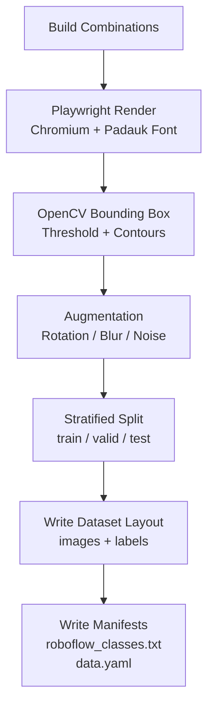
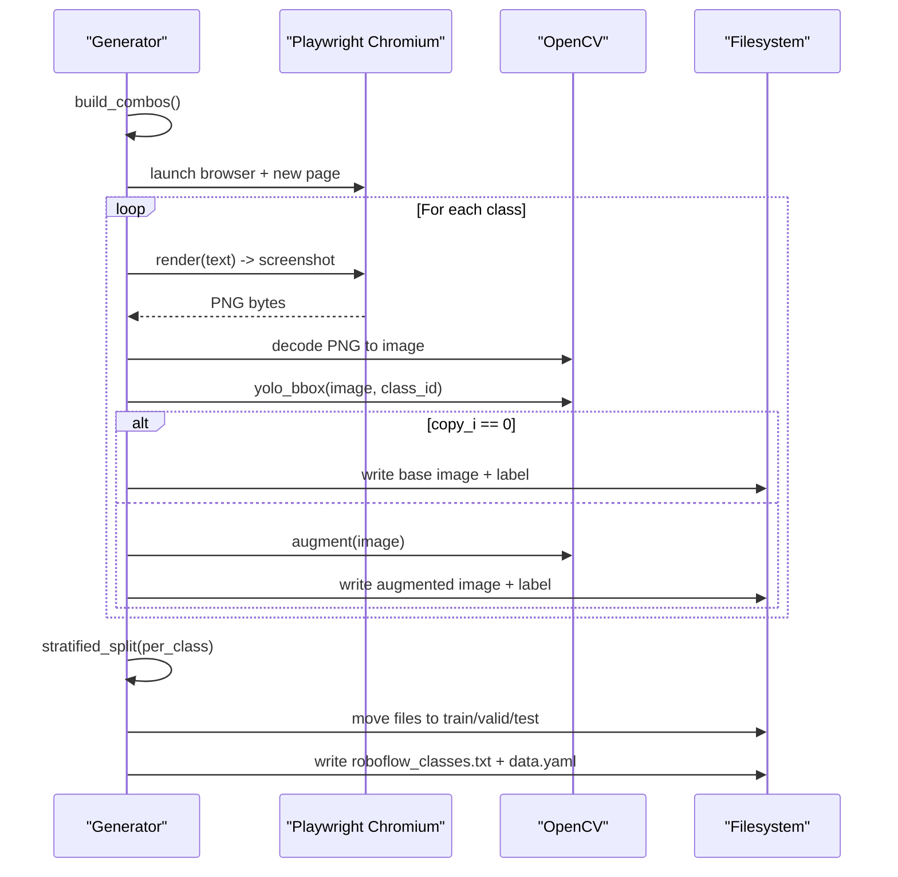
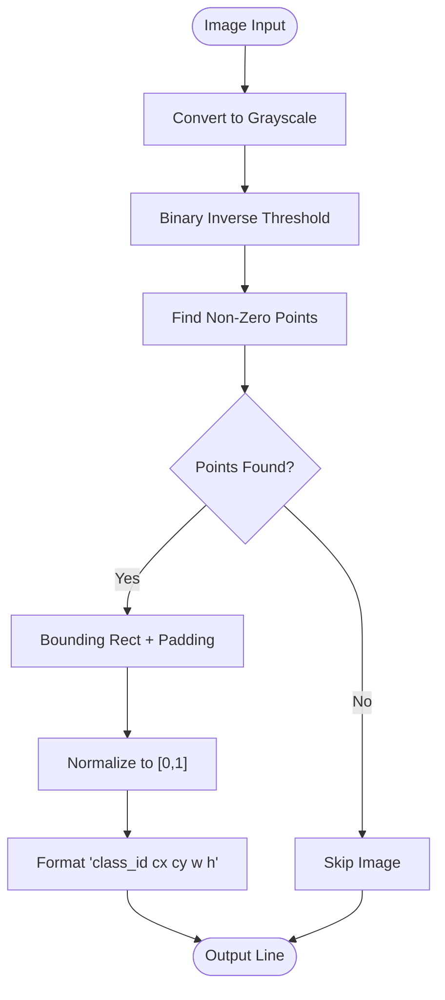
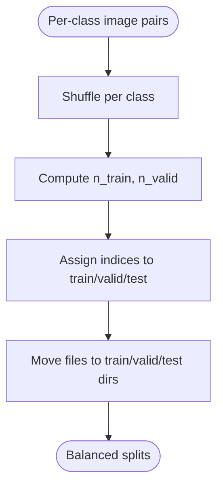
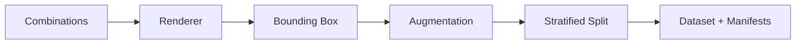

# Synthetic Dataset Generation

<cite>
**Referenced Files in This Document**
- [1_karen_dataset_gen.py](file://pipeline/ocr_training/1_karen_dataset_gen.py)
- [4_syllable_gen.py](file://pipeline/dictionary_processing/4_syllable_gen.py)
- [014_syllable_gen.py](file://pipeline/ocr_training/014_syllable_gen.py)
- [karen_all_syllables.json](file://karen_all_syllables.json)
- [roboflow_classes.txt](file://roboflow_classes.txt)
- [data.yaml](file://data.yaml)
</cite>

## Table of Contents
1. [Introduction](#introduction)
2. [Project Structure](#project-structure)
3. [Core Components](#core-components)
4. [Architecture Overview](#architecture-overview)
5. [Detailed Component Analysis](#detailed-component-analysis)
6. [Dependency Analysis](#dependency-analysis)
7. [Performance Considerations](#performance-considerations)
8. [Troubleshooting Guide](#troubleshooting-guide)
9. [Conclusion](#conclusion)
10. [Appendices](#appendices)

## Introduction
This document explains the synthetic dataset generation component that produces thousands of Sgaw Karen syllable images for OCR training. It uses Playwright to drive a headless Chromium browser, renders text with the Padauk font into high-quality images, computes YOLO-format bounding boxes via OpenCV thresholding and contour detection, applies data augmentation (rotation, Gaussian blur, noise), and splits the dataset stratified by class into train/valid/test sets. The output is a Roboflow-ready dataset with a YAML manifest and a class list file.

## Project Structure
The generator lives under pipeline/ocr_training and is orchestrated by a single script that:
- Builds all valid Sgaw Karen syllable combinations (base + medial + vowel + tone; plus ASAT contractions).
- Renders each combination as an image using Playwright + Chromium with the Padauk font.
- Computes normalized YOLO bounding boxes per image.
- Augments copies of each base image to increase diversity.
- Splits images per class into train/valid/test with balanced distribution.
- Writes a Roboflow-compatible directory layout and a data.yaml manifest.

**Diagram sources**
- [1_karen_dataset_gen.py:187-202](file://pipeline/ocr_training/1_karen_dataset_gen.py#L187-L202)
- [1_karen_dataset_gen.py:104-140](file://pipeline/ocr_training/1_karen_dataset_gen.py#L104-L140)
- [1_karen_dataset_gen.py:146-162](file://pipeline/ocr_training/1_karen_dataset_gen.py#L146-L162)
- [1_karen_dataset_gen.py:168-181](file://pipeline/ocr_training/1_karen_dataset_gen.py#L168-L181)
- [1_karen_dataset_gen.py:208-219](file://pipeline/ocr_training/1_karen_dataset_gen.py#L208-L219)
- [1_karen_dataset_gen.py:296-318](file://pipeline/ocr_training/1_karen_dataset_gen.py#L296-L318)

**Section sources**
- [1_karen_dataset_gen.py:22-39](file://pipeline/ocr_training/1_karen_dataset_gen.py#L22-L39)
- [1_karen_dataset_gen.py:44-98](file://pipeline/ocr_training/1_karen_dataset_gen.py#L44-L98)
- [1_karen_dataset_gen.py:104-140](file://pipeline/ocr_training/1_karen_dataset_gen.py#L104-L140)
- [1_karen_dataset_gen.py:146-181](file://pipeline/ocr_training/1_karen_dataset_gen.py#L146-L181)
- [1_karen_dataset_gen.py:187-219](file://pipeline/ocr_training/1_karen_dataset_gen.py#L187-L219)
- [1_karen_dataset_gen.py:225-334](file://pipeline/ocr_training/1_karen_dataset_gen.py#L225-L334)

## Core Components
- Combination builder: Generates all valid Sgaw Karen syllables by combining consonants, vowels, tones, and medials, plus special ASAT contractions.
- Renderer: Uses Playwright to create HTML with the Padauk font and captures screenshots at fixed dimensions.
- Bounding box generator: Converts rendered images to grayscale, thresholds to isolate text, finds contours, and outputs normalized YOLO boxes.
- Augmenter: Applies small random rotation, occasional Gaussian blur, and additive Gaussian noise to augment samples.
- Splitter: Performs stratified splitting per class to ensure balanced train/valid/test distributions.
- Output writer: Produces Roboflow-ready directories and manifests (class list and YAML).

**Section sources**
- [1_karen_dataset_gen.py:187-202](file://pipeline/ocr_training/1_karen_dataset_gen.py#L187-L202)
- [1_karen_dataset_gen.py:104-140](file://pipeline/ocr_training/1_karen_dataset_gen.py#L104-L140)
- [1_karen_dataset_gen.py:146-162](file://pipeline/ocr_training/1_karen_dataset_gen.py#L146-L162)
- [1_karen_dataset_gen.py:168-181](file://pipeline/ocr_training/1_karen_dataset_gen.py#L168-L181)
- [1_karen_dataset_gen.py:208-219](file://pipeline/ocr_training/1_karen_dataset_gen.py#L208-L219)
- [1_karen_dataset_gen.py:296-318](file://pipeline/ocr_training/1_karen_dataset_gen.py#L296-L318)

## Architecture Overview
The end-to-end flow orchestrates rendering and annotation in a loop over classes, then splits and writes outputs.

**Diagram sources**
- [1_karen_dataset_gen.py:187-202](file://pipeline/ocr_training/1_karen_dataset_gen.py#L187-L202)
- [1_karen_dataset_gen.py:104-140](file://pipeline/ocr_training/1_karen_dataset_gen.py#L104-L140)
- [1_karen_dataset_gen.py:146-162](file://pipeline/ocr_training/1_karen_dataset_gen.py#L146-L162)
- [1_karen_dataset_gen.py:168-181](file://pipeline/ocr_training/1_karen_dataset_gen.py#L168-L181)
- [1_karen_dataset_gen.py:208-219](file://pipeline/ocr_training/1_karen_dataset_gen.py#L208-L219)
- [1_karen_dataset_gen.py:225-334](file://pipeline/ocr_training/1_karen_dataset_gen.py#L225-L334)

## Detailed Component Analysis

### Syllable Combination Logic
- Base combinations: Consonant × Vowel × Tone.
- Medial combinations: Consonant × Medial × Vowel × Tone (limited set of medials and top vowels/tone subset).
- ASAT contractions: Special ligatures appended as separate classes.
- Outputs include both Unicode strings and human-readable romanized labels used as class names.

Alternative generators exist for different scope or legacy formats:
- A compact generator enumerates all combinations using itertools and writes CSV/JSON.
- A dictionary-processing generator builds base/medial/asat tables and writes CSVs and a combined JSON.

These components collectively define the universe of classes used by the renderer.

**Section sources**
- [1_karen_dataset_gen.py:44-98](file://pipeline/ocr_training/1_karen_dataset_gen.py#L44-L98)
- [1_karen_dataset_gen.py:187-202](file://pipeline/ocr_training/1_karen_dataset_gen.py#L187-L202)
- [014_syllable_gen.py:27-66](file://pipeline/ocr_training/014_syllable_gen.py#L27-L66)
- [014_syllable_gen.py:77-118](file://pipeline/ocr_training/014_syllable_gen.py#L77-L118)
- [4_syllable_gen.py:5-66](file://pipeline/dictionary_processing/4_syllable_gen.py#L5-L66)
- [4_syllable_gen.py:69-118](file://pipeline/dictionary_processing/4_syllable_gen.py#L69-L118)
- [karen_all_syllables.json:1-800](file://karen_all_syllables.json#L1-L800)

### Rendering with Playwright and Chromium
- HTML template embeds the Padauk font via @font-face using a file URL resolved from the script’s working directory.
- Page content is set with wait_until="load", and a short font readiness check is attempted before screenshot.
- Screenshots are captured as PNG bytes, decoded to OpenCV images, and processed further.

Key configuration:
- Image dimensions: 320x320 pixels.
- Font size: 110px.
- Quality: JPEG quality 95 when saving final images.

**Section sources**
- [1_karen_dataset_gen.py:25-36](file://pipeline/ocr_training/1_karen_dataset_gen.py#L25-L36)
- [1_karen_dataset_gen.py:104-140](file://pipeline/ocr_training/1_karen_dataset_gen.py#L104-L140)
- [1_karen_dataset_gen.py:264-294](file://pipeline/ocr_training/1_karen_dataset_gen.py#L264-L294)

### Bounding Box Generation in YOLO Format
- Convert image to grayscale and threshold near-white background to isolate dark text.
- Find non-zero points (contours) and compute bounding rectangle.
- Apply a small padding around the box to ensure full glyph coverage.
- Normalize coordinates to [0,1] relative to image width/height and format as YOLO line: class_id cx cy w h.

**Diagram sources**
- [1_karen_dataset_gen.py:146-162](file://pipeline/ocr_training/1_karen_dataset_gen.py#L146-L162)

**Section sources**
- [1_karen_dataset_gen.py:146-162](file://pipeline/ocr_training/1_karen_dataset_gen.py#L146-L162)

### Data Augmentation Techniques
- Rotation: Random angle within ±7 degrees around image center.
- Gaussian blur: Applied with probability ~35%, kernel size randomly chosen from small odd sizes.
- Noise: Additive Gaussian noise with zero mean and small standard deviation, clipped to valid range.

These augmentations improve robustness to minor variations while preserving legibility.

**Section sources**
- [1_karen_dataset_gen.py:168-181](file://pipeline/ocr_training/1_karen_dataset_gen.py#L168-L181)

### Stratified Splitting Algorithm
- Groups images by class.
- Shuffles each group deterministically with a fixed seed.
- Splits into train/valid/test ensuring at least one sample per split where possible.
- Moves files into corresponding directories under the output root.

**Diagram sources**
- [1_karen_dataset_gen.py:208-219](file://pipeline/ocr_training/1_karen_dataset_gen.py#L208-L219)
- [1_karen_dataset_gen.py:296-307](file://pipeline/ocr_training/1_karen_dataset_gen.py#L296-L307)

**Section sources**
- [1_karen_dataset_gen.py:208-219](file://pipeline/ocr_training/1_karen_dataset_gen.py#L208-L219)
- [1_karen_dataset_gen.py:296-307](file://pipeline/ocr_training/1_karen_dataset_gen.py#L296-L307)

### Configuration Options
- Image dimensions: 320x320 pixels.
- Font size: 110px.
- Images per combo: multiple copies per class for augmentation.
- Splits: 70% train, 15% valid, remainder test.
- Random seed: deterministic reproducibility.
- Max classes: optional cap for quick tests.
- Output directory: configurable path for dataset root.
- Class list and YAML: generated automatically.

**Section sources**
- [1_karen_dataset_gen.py:25-39](file://pipeline/ocr_training/1_karen_dataset_gen.py#L25-L39)
- [1_karen_dataset_gen.py:296-318](file://pipeline/ocr_training/1_karen_dataset_gen.py#L296-L318)

### Output Structure and Examples
- Directory layout:
  - karendataset/train/images, karendataset/valid/images, karendataset/test/images
  - Corresponding labels directories with .txt files containing YOLO lines.
- Files:
  - roboflow_classes.txt: one class name per line.
  - data.yaml: dataset path, split paths, number of classes, and class names list.

Example usage:
- Place padauk_reg.ttf next to the script.
- Run the generator script from the repository root or appropriate directory.
- Inspect karendataset/* for images and labels; open data.yaml to verify structure.

Interpretation:
- Each image filename encodes its class label and a unique ID.
- Each label file contains a single YOLO line with class index and normalized bbox.

**Section sources**
- [1_karen_dataset_gen.py:225-334](file://pipeline/ocr_training/1_karen_dataset_gen.py#L225-L334)
- [roboflow_classes.txt:1-800](file://roboflow_classes.txt#L1-L800)
- [data.yaml:1-800](file://data.yaml#L1-L800)

## Dependency Analysis
High-level dependencies:
- Playwright sync API for headless Chromium automation.
- OpenCV for image processing (thresholding, contours, transforms).
- NumPy for array operations.
- Standard library modules for filesystem, UUID, random, shutil.

Class and data relationships:
- Combination builder defines the class vocabulary used by the renderer and splitter.
- Renderer depends on font availability and viewport settings.
- Bounding box generator depends on consistent contrast between text and background.
- Splitter depends on per-class grouping and deterministic shuffling.

**Diagram sources**
- [1_karen_dataset_gen.py:187-202](file://pipeline/ocr_training/1_karen_dataset_gen.py#L187-L202)
- [1_karen_dataset_gen.py:104-140](file://pipeline/ocr_training/1_karen_dataset_gen.py#L104-L140)
- [1_karen_dataset_gen.py:146-162](file://pipeline/ocr_training/1_karen_dataset_gen.py#L146-L162)
- [1_karen_dataset_gen.py:168-181](file://pipeline/ocr_training/1_karen_dataset_gen.py#L168-L181)
- [1_karen_dataset_gen.py:208-219](file://pipeline/ocr_training/1_karen_dataset_gen.py#L208-L219)
- [1_karen_dataset_gen.py:296-318](file://pipeline/ocr_training/1_karen_dataset_gen.py#L296-L318)

**Section sources**
- [1_karen_dataset_gen.py:13-20](file://pipeline/ocr_training/1_karen_dataset_gen.py#L13-L20)
- [1_karen_dataset_gen.py:187-318](file://pipeline/ocr_training/1_karen_dataset_gen.py#L187-L318)

## Performance Considerations
- Browser reuse: A single Chromium instance and page are reused across all classes to minimize startup overhead.
- Image sizing: Fixed 320x320 resolution balances detail and memory footprint.
- File I/O: Temporary staging directory reduces disk churn during generation; moved to final splits after completion.
- Deterministic randomness: Fixed seeds ensure reproducible results and stable splits.
- Optional class cap: Use MAX_CLASSES to limit generation for rapid iteration.

[No sources needed since this section provides general guidance]

## Troubleshooting Guide
Common issues and resolutions:
- Font not found: Ensure padauk_reg.ttf exists in the same folder as the script; the generator checks for it and raises a clear error if missing.
- Font loading delay: The renderer attempts to wait for fonts to load; if timing out, rerun or adjust environment to ensure font accessibility.
- Memory pressure: For very large datasets, consider reducing IMAGES_PER_COMBO or setting MAX_CLASSES; monitor disk space for temporary stage directory.
- Low contrast or empty boxes: If thresholding fails to detect text, verify white background and black text rendering; adjust threshold or font size if necessary.
- Slow generation: Running on CPU-bound systems may be slower; ensure sufficient RAM and avoid running other heavy processes concurrently.

**Section sources**
- [1_karen_dataset_gen.py:225-232](file://pipeline/ocr_training/1_karen_dataset_gen.py#L225-L232)
- [1_karen_dataset_gen.py:124-140](file://pipeline/ocr_training/1_karen_dataset_gen.py#L124-L140)
- [1_karen_dataset_gen.py:146-162](file://pipeline/ocr_training/1_karen_dataset_gen.py#L146-L162)
- [1_karen_dataset_gen.py:242-247](file://pipeline/ocr_training/1_karen_dataset_gen.py#L242-L247)

## Conclusion
The synthetic dataset generator creates a comprehensive, high-quality training corpus for Sgaw Karen OCR by systematically composing syllables, rendering them with Playwright and Chromium using the Padauk font, annotating with YOLO-format bounding boxes via OpenCV, augmenting for robustness, and splitting stratified by class. The resulting dataset is immediately usable with common training pipelines through the generated manifests and directory structure.

[No sources needed since this section summarizes without analyzing specific files]

## Appendices

### Appendix A: Running the Generator
- Prerequisites: Install required packages and browsers as indicated in the script header.
- Place the Padauk font file adjacent to the script.
- Execute the script; inspect console output for counts and paths.
- Verify outputs:
  - karendataset/train|valid|test/images and labels
  - roboflow_classes.txt
  - data.yaml

**Section sources**
- [1_karen_dataset_gen.py:1-11](file://pipeline/ocr_training/1_karen_dataset_gen.py#L1-L11)
- [1_karen_dataset_gen.py:225-334](file://pipeline/ocr_training/1_karen_dataset_gen.py#L225-L334)

### Appendix B: Customization Examples
- Change image size: Adjust IMG_W and IMG_H constants.
- Change font size: Modify FONT_SIZE_PX.
- Limit dataset size: Set MAX_CLASSES to a small integer for testing.
- Adjust augmentation: Tune rotation range, blur probability, and noise parameters in the augmentation function.
- Modify splits: Update SPLIT_TRAIN and SPLIT_VALID ratios.

**Section sources**
- [1_karen_dataset_gen.py:25-39](file://pipeline/ocr_training/1_karen_dataset_gen.py#L25-L39)
- [1_karen_dataset_gen.py:168-181](file://pipeline/ocr_training/1_karen_dataset_gen.py#L168-L181)
- [1_karen_dataset_gen.py:208-219](file://pipeline/ocr_training/1_karen_dataset_gen.py#L208-L219)