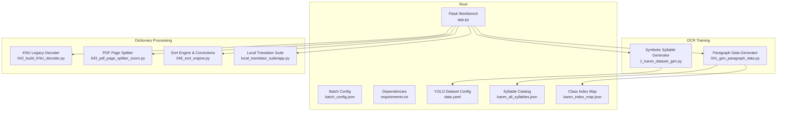
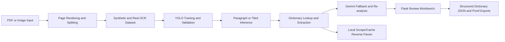
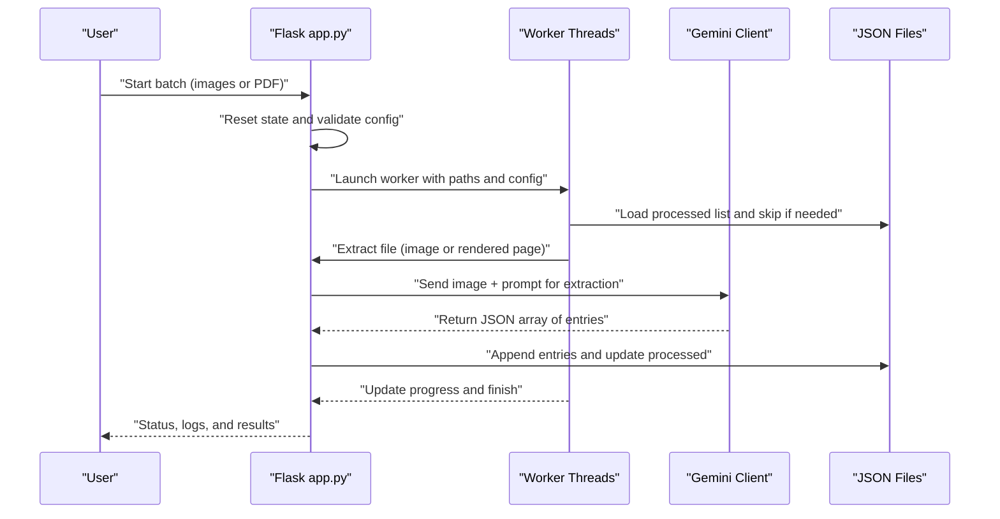
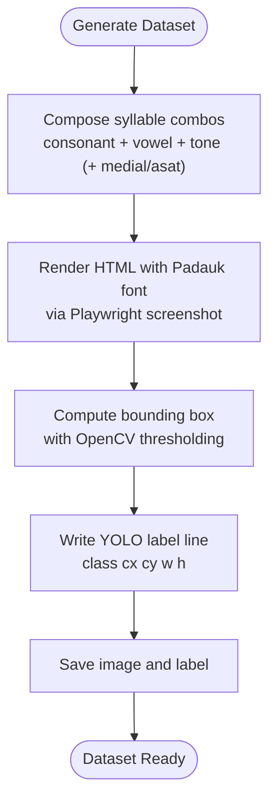
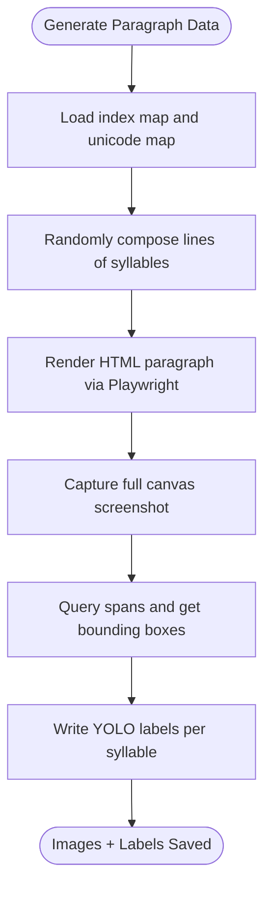
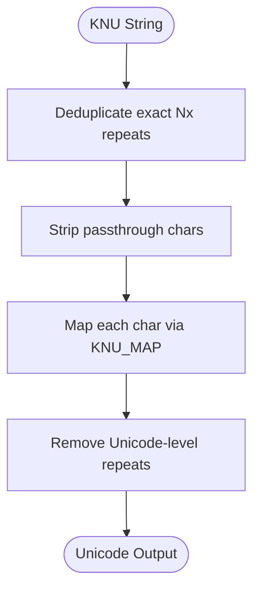
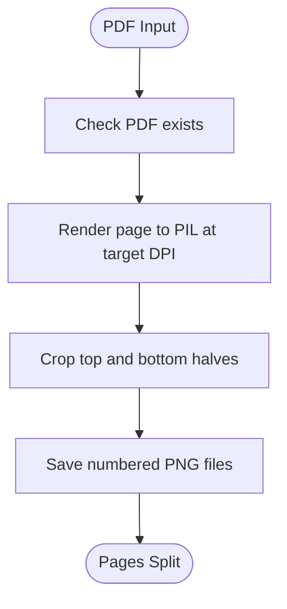
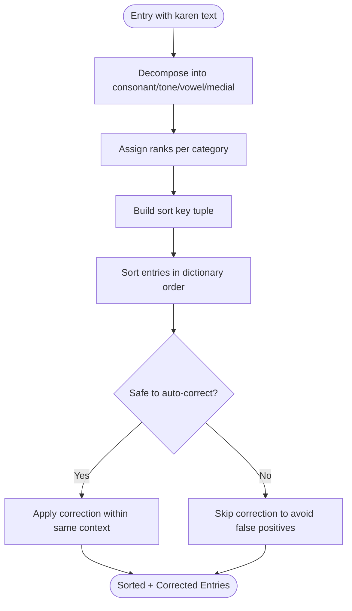
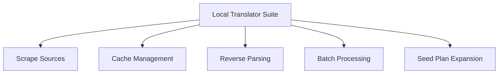
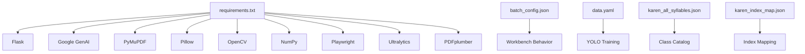

# Project Overview

<cite>
**Referenced Files in This Document**
- [README.md](file://README.md)
- [app.py](file://app.py)
- [data.yaml](file://data.yaml)
- [requirements.txt](file://requirements.txt)
- [karen_all_syllables.json](file://karen_all_syllables.json)
- [karen_index_map.json](file://karen_index_map.json)
- [batch_config.json](file://batch_config.json)
- [ARCHITECTURE.md](file://docs/ARCHITECTURE.md)
- [1_karen_dataset_gen.py](file://pipeline/ocr_training/1_karen_dataset_gen.py)
- [041_gen_paragraph_data.py](file://pipeline/ocr_training/041_gen_paragraph_data.py)
- [042_build_KNU_decoder.py](file://pipeline/dictionary_processing/042_build_KNU_decoder.py)
- [043_pdf_page_splitter_zoom.py](file://pipeline/dictionary_processing/043_pdf_page_splitter_zoom.py)
- [046_sort_engine.py](file://pipeline/dictionary_processing/046_sort_engine.py)
- [local_translator_suite/app.py](file://pipeline/dictionary_processing/local_translator_suite/app.py)
</cite>

## Table of Contents
1. Introduction
2. Project Structure
3. Core Components
4. Architecture Overview
5. Detailed Component Analysis
6. Dependency Analysis
7. Performance Considerations
8. Troubleshooting Guide
9. Conclusion

## Introduction
This project is a portfolio-ready system that builds an end-to-end Sgaw Karen OCR and dictionary pipeline. It addresses a real gap: Sgaw Karen is an underrepresented language with limited off-the-shelf OCR support, so the system combines synthetic dataset generation, YOLO training and inference, legacy KNU font decoding, Gemini-assisted extraction, and a Flask review workbench to turn source images into structured dictionary entries.

At a high level, the pipeline starts from PDFs or images, renders pages at high resolution, detects syllable regions using a trained YOLO model, and then converts raw OCR output into normalized dictionary entries. A local translator suite provides additional dictionary intelligence through scraping, caching, reverse parsing, and batch processing. The result is a searchable, editable, and exportable dictionary JSON that can be reviewed and corrected by humans.

For beginners new to OCR and dictionary processing, think of this as a bridge between scanned dictionary pages and a modern digital dictionary. For experienced developers, it is a modular system with clear separation between data generation, model training, inference, legacy text decoding, and human-in-the-loop review.

**Section sources**
- [README.md:1-63](file://README.md#L1-L63)
- [ARCHITECTURE.md:1-38](file://docs/ARCHITECTURE.md#L1-L38)

## Project Structure
The repository is organized around three main areas:
- Root-level application and configuration files for the Flask workbench and OCR dataset definitions.
- `pipeline/ocr_training/` scripts for synthetic dataset generation, training, validation, and paragraph inference.
- `pipeline/dictionary_processing/` scripts for legacy KNU decoding, PDF page splitting, sorting, correction logic, and a local translator suite.

**Diagram sources**
- [app.py:1-120](file://app.py#L1-L120)
- [1_karen_dataset_gen.py:1-40](file://pipeline/ocr_training/1_karen_dataset_gen.py#L1-L40)
- [041_gen_paragraph_data.py:1-60](file://pipeline/ocr_training/041_gen_paragraph_data.py#L1-L60)
- [042_build_KNU_decoder.py:1-80](file://pipeline/dictionary_processing/042_build_KNU_decoder.py#L1-L80)
- [043_pdf_page_splitter_zoom.py:1-55](file://pipeline/dictionary_processing/043_pdf_page_splitter_zoom.py#L1-L55)
- [046_sort_engine.py:1-70](file://pipeline/dictionary_processing/046_sort_engine.py#L1-L70)
- [local_translator_suite/app.py:1-40](file://pipeline/dictionary_processing/local_translator_suite/app.py#L1-L40)
- [data.yaml:1-10](file://data.yaml#L1-L10)
- [karen_all_syllables.json:1-20](file://karen_all_syllables.json#L1-L20)
- [karen_index_map.json:1-30](file://karen_index_map.json#L1-L30)
- [batch_config.json:1-9](file://batch_config.json#L1-L9)

**Section sources**
- [README.md:17-31](file://README.md#L17-L31)
- [ARCHITECTURE.md:18-38](file://docs/ARCHITECTURE.md#L18-L38)

## Core Components
- Flask review workbench (`app.py`): Provides health/status/search/edit/batch routes, batch image/PDF extraction, correction logging, and integration with Gemini for extraction and re-analysis. It also manages state, paths, and safe file operations.
- Synthetic dataset generator (`1_karen_dataset_gen.py`): Generates Roboflow/YOLO-style datasets by rendering thousands of Sgaw Karen syllable patterns with Playwright and OpenCV, producing bounding boxes and labels.
- Paragraph-level dataset generator (`041_gen_paragraph_data.py`): Extends isolated syllable detection to multi-syllable lines and paragraphs, generating realistic training images and YOLO labels.
- KNU legacy-font decoder (`042_build_KNU_decoder.py`): Converts KNU-encoded ASCII strings to Myanmar Unicode, deduplicates repeated artifacts, and cleans passthrough characters.
- PDF page splitter (`043_pdf_page_splitter_zoom.py`): Renders dictionary PDFs at high DPI and splits each page into top and bottom halves to improve OCR readability.
- Sort engine and corrections (`046_sort_engine.py`): Implements authentic Sgaw Karen sort order (consonant → tone → vowel → medial), decomposes syllables, and includes smart auto-correction guards to avoid overgeneralizing fixes across unrelated words.
- Local translator suite (`local_translator_suite/app.py`): Demonstrates local web lookup, cache review, reverse parsing, batch processing, and a seed plan for expanding Sgaw Karen language data.

Practical example of the complete pipeline:
- Start with a dictionary PDF or image.
- Use the PDF splitter to render high-resolution pages and split them into halves.
- Run OCR via the workbench’s batch mode or paragraph inference to detect syllables and extract text.
- Decode any KNU legacy-font content into Unicode.
- Normalize outputs into dictionary entries with definitions, examples, headword terms, related items, segments, and sense labels.
- Review and correct entries in the Flask workbench; corrections are logged and can propagate safely within context.
- Export structured dictionary JSON for downstream use.

**Section sources**
- [app.py:17-120](file://app.py#L17-L120)
- [1_karen_dataset_gen.py:1-40](file://pipeline/ocr_training/1_karen_dataset_gen.py#L1-L40)
- [041_gen_paragraph_data.py:1-60](file://pipeline/ocr_training/041_gen_paragraph_data.py#L1-L60)
- [042_build_KNU_decoder.py:1-80](file://pipeline/dictionary_processing/042_build_KNU_decoder.py#L1-L80)
- [043_pdf_page_splitter_zoom.py:1-55](file://pipeline/dictionary_processing/043_pdf_page_splitter_zoom.py#L1-L55)
- [046_sort_engine.py:1-70](file://pipeline/dictionary_processing/046_sort_engine.py#L1-L70)
- [local_translator_suite/app.py:1-40](file://pipeline/dictionary_processing/local_translator_suite/app.py#L1-L40)

## Architecture Overview
The architecture connects input sources to OCR models, legacy decoding, AI-assisted extraction, and a human review interface.

**Diagram sources**
- [ARCHITECTURE.md:5-16](file://docs/ARCHITECTURE.md#L5-L16)

**Section sources**
- [ARCHITECTURE.md:1-38](file://docs/ARCHITECTURE.md#L1-L38)

## Detailed Component Analysis

### Flask Review Workbench (`app.py`)
The workbench orchestrates batch jobs, maintains thread-safe state, normalizes dictionary entries, integrates Gemini for extraction and re-analysis, and exposes API endpoints for search, edit, and batch processing. It also handles PDF rendering, image MIME detection, safe file writes, and correction logging.

Key responsibilities:
- State management with locks for concurrent batch runs.
- Configuration loading/saving and bootstrap auto-import.
- Entry normalization and analysis merging.
- Gemini client creation and structured prompt-based extraction.
- PDF rendering and worker threads for images and PDF pages.
- HTML template serving for the review UI.

**Diagram sources**
- [app.py:96-170](file://app.py#L96-L170)
- [app.py:536-614](file://app.py#L536-L614)
- [app.py:638-729](file://app.py#L638-L729)

**Section sources**
- [app.py:17-120](file://app.py#L17-L120)
- [app.py:536-614](file://app.py#L536-L614)
- [app.py:638-729](file://app.py#L638-L729)

### Synthetic Syllable Dataset Generator (`1_karen_dataset_gen.py`)
Generates a Roboflow/YOLO-style dataset by composing consonants, vowels, tones, medials, and asat contractions into thousands of syllable combinations. It renders each combination using Playwright and computes bounding boxes with OpenCV to produce YOLO labels.

Highlights:
- Consonant/vowel/tonal composition creates diverse syllable patterns.
- Headless Chromium ensures accurate glyph shaping.
- Augmentation adds rotation, blur, and noise for robustness.
- Outputs images and label files ready for YOLO training.

**Diagram sources**
- [1_karen_dataset_gen.py:44-99](file://pipeline/ocr_training/1_karen_dataset_gen.py#L44-L99)
- [1_karen_dataset_gen.py:104-163](file://pipeline/ocr_training/1_karen_dataset_gen.py#L104-L163)
- [1_karen_dataset_gen.py:168-200](file://pipeline/ocr_training/1_karen_dataset_gen.py#L168-L200)

**Section sources**
- [1_karen_dataset_gen.py:1-200](file://pipeline/ocr_training/1_karen_dataset_gen.py#L1-L200)

### Paragraph-Level Dataset Generator (`041_gen_paragraph_data.py`)
Extends isolated syllable detection to realistic paragraph images. It randomly composes lines of syllables, renders them with Playwright, captures screenshots, and extracts per-syllable bounding boxes to generate multi-syllable YOLO labels.

Highlights:
- Uses an index map to resolve class indices to Unicode strings.
- Produces wider canvases and smaller fonts to fit multiple syllables per line.
- Writes both images and label files for training paragraph-level detection.

**Diagram sources**
- [041_gen_paragraph_data.py:18-60](file://pipeline/ocr_training/041_gen_paragraph_data.py#L18-L60)
- [041_gen_paragraph_data.py:67-110](file://pipeline/ocr_training/041_gen_paragraph_data.py#L67-L110)
- [041_gen_paragraph_data.py:137-200](file://pipeline/ocr_training/041_gen_paragraph_data.py#L137-L200)

**Section sources**
- [041_gen_paragraph_data.py:1-200](file://pipeline/ocr_training/041_gen_paragraph_data.py#L1-L200)

### KNU Legacy-Font Decoder (`042_build_KNU_decoder.py`)
Converts KNU-encoded ASCII strings to Myanmar Unicode, handling character mapping, deduplication of repeated artifacts, and cleaning of passthrough characters.

Highlights:
- Comprehensive KNU character map to Unicode codepoints.
- Deduplicate block and Unicode-level repetition removal.
- Clean passthrough characters before conversion.

**Diagram sources**
- [042_build_KNU_decoder.py:11-80](file://pipeline/dictionary_processing/042_build_KNU_decoder.py#L11-L80)
- [042_build_KNU_decoder.py:93-179](file://pipeline/dictionary_processing/042_build_KNU_decoder.py#L93-L179)
- [042_build_KNU_decoder.py:185-200](file://pipeline/dictionary_processing/042_build_KNU_decoder.py#L185-L200)

**Section sources**
- [042_build_KNU_decoder.py:1-200](file://pipeline/dictionary_processing/042_build_KNU_decoder.py#L1-L200)

### PDF Page Splitter (`043_pdf_page_splitter_zoom.py`)
Renders dictionary PDFs at high DPI and splits each page into top and bottom halves to increase effective zoom and improve OCR readability.

Highlights:
- PyMuPDF rendering with configurable DPI and zoom matrix.
- Pillow cropping and saving of top/bottom PNGs.
- Progress reporting and error handling.

**Diagram sources**
- [043_pdf_page_splitter_zoom.py:40-55](file://pipeline/dictionary_processing/043_pdf_page_splitter_zoom.py#L40-L55)
- [043_pdf_page_splitter_zoom.py:76-127](file://pipeline/dictionary_processing/043_pdf_page_splitter_zoom.py#L76-L127)
- [043_pdf_page_splitter_zoom.py:134-184](file://pipeline/dictionary_processing/043_pdf_page_splitter_zoom.py#L134-L184)

**Section sources**
- [043_pdf_page_splitter_zoom.py:1-190](file://pipeline/dictionary_processing/043_pdf_page_splitter_zoom.py#L1-L190)

### Sort Engine and Smart Corrections (`046_sort_engine.py`)
Implements authentic Sgaw Karen dictionary sort order and decomposition of syllables into consonant, tone, vowel, and medial components. Includes smart auto-correction guards to prevent unsafe propagation of fixes across unrelated contexts.

Highlights:
- Canonical sort order based on linguistic rules.
- Decomposition function to analyze syllable structure.
- Context-aware correction safety checks.

**Diagram sources**
- [046_sort_engine.py:15-77](file://pipeline/dictionary_processing/046_sort_engine.py#L15-L77)
- [046_sort_engine.py:93-160](file://pipeline/dictionary_processing/046_sort_engine.py#L93-L160)
- [046_sort_engine.py:168-200](file://pipeline/dictionary_processing/046_sort_engine.py#L168-L200)

**Section sources**
- [046_sort_engine.py:1-200](file://pipeline/dictionary_processing/046_sort_engine.py#L1-L200)

### Local Translator Suite (`local_translator_suite/app.py`)
A separate Flask application demonstrating dictionary intelligence capabilities: scraping, caching, reverse parsing, batch processing, and a seed plan for expanding Sgaw Karen language data.

Highlights:
- Web scraping with request headers and delays.
- Cache file management and lookup attempts tracking.
- Regex-based detection of Karen and English text.
- Particle rules and grammatical markers for parsing.

**Diagram sources**
- [local_translator_suite/app.py:20-40](file://pipeline/dictionary_processing/local_translator_suite/app.py#L20-L40)
- [local_translator_suite/app.py:48-200](file://pipeline/dictionary_processing/local_translator_suite/app.py#L48-L200)

**Section sources**
- [local_translator_suite/app.py:1-200](file://pipeline/dictionary_processing/local_translator_suite/app.py#L1-L200)

## Dependency Analysis
The system depends on several libraries and configuration files:
- Flask for the web workbench.
- Google GenAI for Gemini-assisted extraction and re-analysis.
- PyMuPDF and Pillow for PDF rendering and image manipulation.
- OpenCV and NumPy for image processing and augmentation.
- Playwright for headless browser rendering of Karen glyphs.
- Ultralytics for YOLO model usage.
- PDFplumber for PDF text extraction where applicable.
- Dataset configuration (`data.yaml`) defines paths and classes for YOLO training.
- Syllable catalog (`karen_all_syllables.json`) and index map (`karen_index_map.json`) provide class mappings and Unicode representations.
- Batch configuration (`batch_config.json`) controls workbench behavior.

**Diagram sources**
- [requirements.txt:1-10](file://requirements.txt#L1-L10)
- [data.yaml:1-10](file://data.yaml#L1-L10)
- [karen_all_syllables.json:1-20](file://karen_all_syllables.json#L1-L20)
- [karen_index_map.json:1-30](file://karen_index_map.json#L1-L30)
- [batch_config.json:1-9](file://batch_config.json#L1-L9)

**Section sources**
- [requirements.txt:1-10](file://requirements.txt#L1-L10)
- [data.yaml:1-10](file://data.yaml#L1-L10)
- [karen_all_syllables.json:1-20](file://karen_all_syllables.json#L1-L20)
- [karen_index_map.json:1-30](file://karen_index_map.json#L1-L30)
- [batch_config.json:1-9](file://batch_config.json#L1-L9)

## Performance Considerations
- Rendering quality: High DPI rendering improves glyph clarity for OCR and human review. Adjust DPI and zoom factors based on input density.
- Batch sizing: Configure batch sizes and delays to balance throughput and API rate limits when using Gemini.
- Dataset diversity: Synthetic generation covers many syllable patterns; augmentations help robustness but should be tuned to avoid unrealistic distortions.
- Sorting correctness: Authentic sort order prevents misordering entries, which improves usability and downstream processing.
- Memory and disk: Large datasets and generated images are intentionally excluded from Git; manage storage separately and prune intermediate artifacts.

[No sources needed since this section provides general guidance]

## Troubleshooting Guide
Common issues and resolutions:
- Missing API key: Gemini-assisted extraction requires `GEMINI_API_KEY`. Without it, batch OCR and re-analysis will fail. Search functionality works without the key.
- Font not found: The workbench serves a fallback font path; ensure Padauk font is available or set the environment variable for font location.
- PDF rendering errors: Verify PyMuPDF installation and PDF accessibility; check DPI settings and page ranges.
- Duplicate entries: Normalization and deduplication functions merge and clean analysis fields; verify inputs for consistent structure.
- Overcorrection: Smart auto-correction guards prevent unsafe propagation; if corrections seem too broad, review context matching and error types.

**Section sources**
- [app.py:36-38](file://app.py#L36-L38)
- [app.py:518-530](file://app.py#L518-L530)
- [app.py:619-633](file://app.py#L619-L633)
- [app.py:278-301](file://app.py#L278-L301)
- [046_sort_engine.py:168-200](file://pipeline/dictionary_processing/046_sort_engine.py#L168-L200)

## Conclusion
This project delivers a comprehensive, portfolio-ready pipeline for Sgaw Karen OCR and dictionary processing. It bridges synthetic data generation, model training, legacy text decoding, AI-assisted extraction, and human review to produce structured dictionary entries. By focusing on underrepresented language needs, it demonstrates practical solutions for OCR challenges and dictionary curation workflows. The modular design allows developers to extend components, refine models, and integrate additional language resources while maintaining clarity and reproducibility.

[No sources needed since this section summarizes without analyzing specific files]