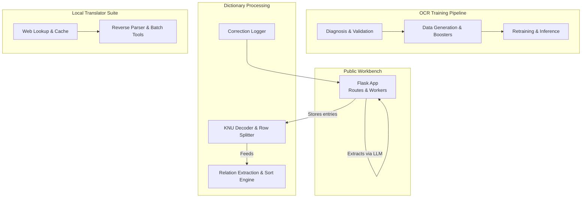
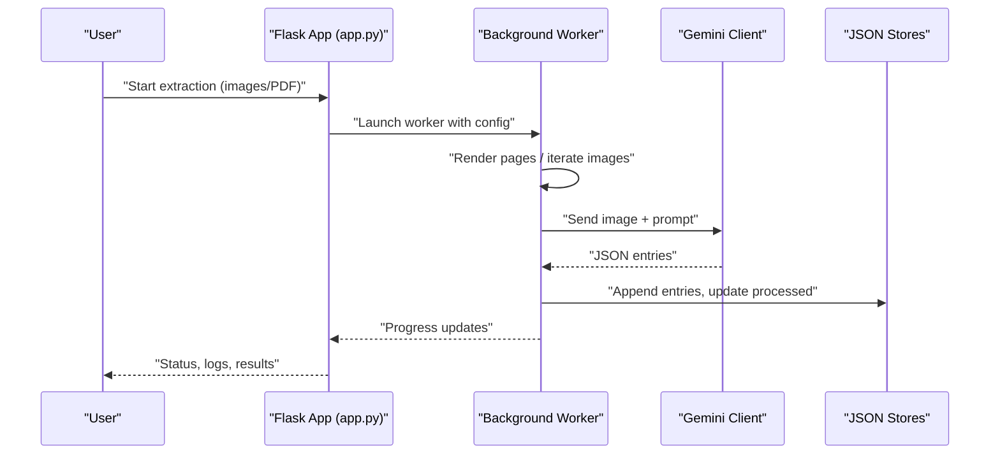
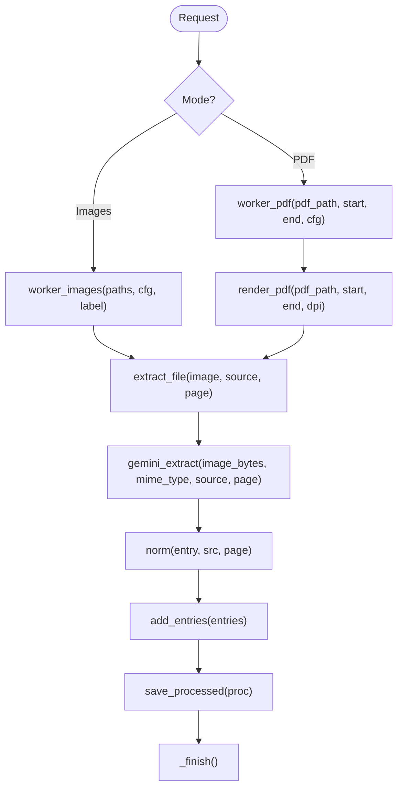
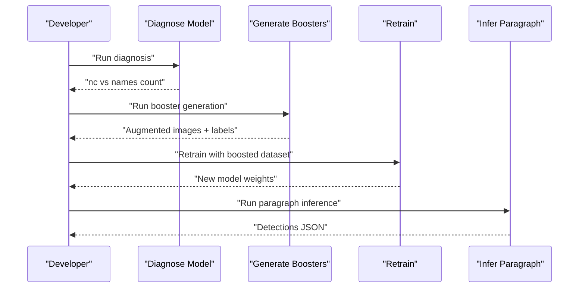
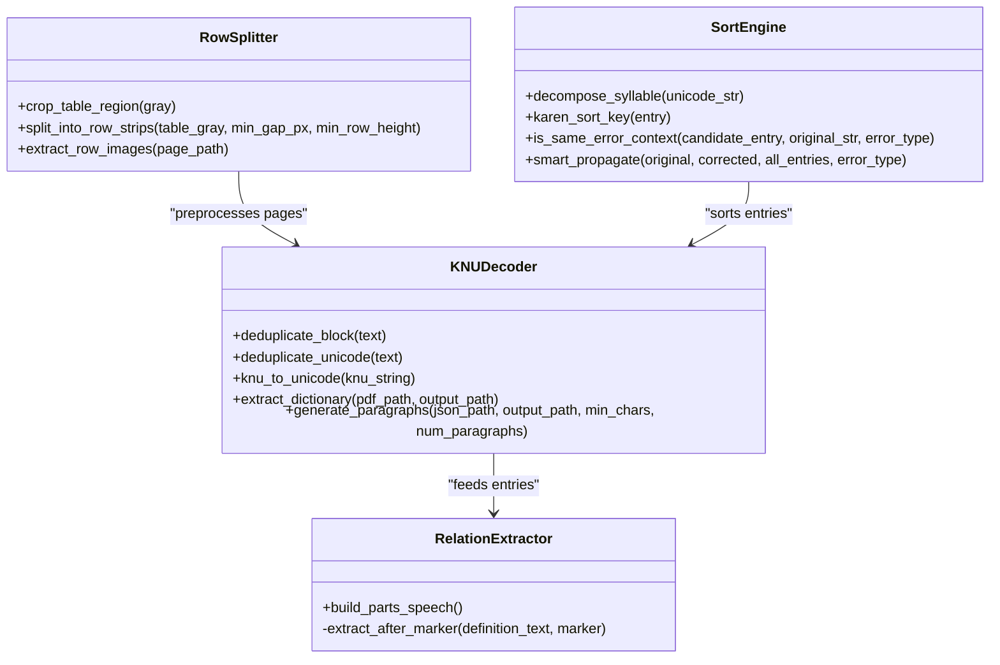
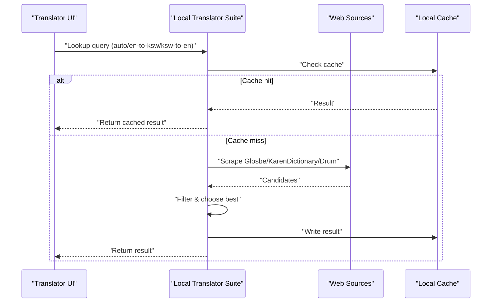
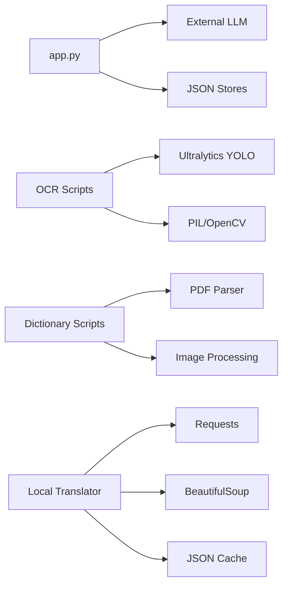

# Core Components and Responsibilities

<cite>
**Referenced Files in This Document**
- [app.py](file://app.py)
- [042_build_KNU_decoder.py](file://pipeline/dictionary_processing/042_build_KNU_decoder.py)
- [split_rows_from_dict_images.py](file://pipeline/dictionary_processing/split_rows_from_dict_images.py)
- [7_extract_relations.py](file://pipeline/dictionary_processing/7_extract_relations.py)
- [correction_logger.py](file://pipeline/dictionary_processing/correction_logger.py)
- [046_sort_engine.py](file://pipeline/dictionary_processing/046_sort_engine.py)
- [local_translator_suite/app.py](file://pipeline/dictionary_processing/local_translator_suite/app.py)
- [001_diagnose_model.py](file://pipeline/ocr_training/001_diagnose_model.py)
- [020_generate_booster_images.py](file://pipeline/ocr_training/020_generate_booster_images.py)
- [038_infer_paragraph.py](file://pipeline/ocr_training/038_infer_paragraph.py)
</cite>

## Table of Contents
1. Introduction
2. Project Structure
3. Core Components
4. Architecture Overview
5. Detailed Component Analysis
6. Dependency Analysis
7. Performance Considerations
8. Troubleshooting Guide
9. Conclusion

## Introduction
This document explains the four main architectural blocks that power the Karen language translation and OCR system:
- Public demo workbench (app.py): a Flask-based interface for search, extraction jobs, corrections, and API endpoints.
- OCR training pipeline: scripts that preserve model development workflow from diagnosis to inference, including data generation, validation, gap analysis, booster generation, fine-tuning, and paragraph inference.
- Dictionary processing: utilities for KNU legacy encoding conversion, PDF page splitting, row extraction, cleanup helpers, relation extraction, and Sgaw Karen sort/correction logic.
- Local translator suite: a dictionary-builder with web lookup, cache review, reverse parsing, batch processing, and seed plan expansion.

The goal is to clarify each component’s responsibilities, interfaces, and integration points within the overall system.

## Project Structure
At a high level:
- app.py exposes a web UI and REST-like endpoints for searching entries, launching extraction jobs over images or PDFs, viewing logs, and managing corrections. It integrates with an external LLM provider for extraction and re-analysis.
- The OCR training folder contains numbered scripts that implement a reproducible pipeline: diagnose model alignment, generate training data, validate datasets, analyze gaps, generate booster images, retrain models, and run inference on paragraphs.
- Dictionary processing includes tools to convert legacy KNU-encoded text to Unicode, split PDF pages into rows, extract relations from definitions, log and propagate corrections, and sort entries according to Sgaw Karen conventions.
- The local translator suite provides a separate dictionary-building tool with web scraping, caching, reverse parsing, batch processing, and seed plan expansion.

**Diagram sources**
- [app.py:17-163](file://app.py#L17-L163)
- [042_build_KNU_decoder.py:215-295](file://pipeline/dictionary_processing/042_build_KNU_decoder.py#L215-L295)
- [001_diagnose_model.py:11-51](file://pipeline/ocr_training/001_diagnose_model.py#L11-L51)
- [020_generate_booster_images.py:30-68](file://pipeline/ocr_training/020_generate_booster_images.py#L30-L68)
- [038_infer_paragraph.py:1-59](file://pipeline/ocr_training/038_infer_paragraph.py#L1-L59)
- [7_extract_relations.py:21-76](file://pipeline/dictionary_processing/7_extract_relations.py#L21-L76)
- [046_sort_engine.py:15-77](file://pipeline/dictionary_processing/046_sort_engine.py#L15-L77)
- [local_translator_suite/app.py:20-47](file://pipeline/dictionary_processing/local_translator_suite/app.py#L20-L47)

**Section sources**
- [app.py:17-163](file://app.py#L17-L163)
- [pipeline/dictionary_processing/042_build_KNU_decoder.py:215-295](file://pipeline/dictionary_processing/042_build_KNU_decoder.py#L215-L295)
- [pipeline/ocr_training/001_diagnose_model.py:11-51](file://pipeline/ocr_training/001_diagnose_model.py#L11-L51)
- [pipeline/ocr_training/020_generate_booster_images.py:30-68](file://pipeline/ocr_training/020_generate_booster_images.py#L30-L68)
- [pipeline/ocr_training/038_infer_paragraph.py:1-59](file://pipeline/ocr_training/038_infer_paragraph.py#L1-L59)
- [pipeline/dictionary_processing/7_extract_relations.py:21-76](file://pipeline/dictionary_processing/7_extract_relations.py#L21-L76)
- [pipeline/dictionary_processing/046_sort_engine.py:15-77](file://pipeline/dictionary_processing/046_sort_engine.py#L15-L77)
- [pipeline/dictionary_processing/local_translator_suite/app.py:20-47](file://pipeline/dictionary_processing/local_translator_suite/app.py#L20-L47)

## Core Components
- Public demo workbench (app.py): Provides routes for serving fonts, initiating extraction jobs over images and PDFs, querying entries, updating configuration, and recording corrections. It manages background workers, state snapshots, and persistent JSON stores for dictionary entries, processed items, and correction logs.
- OCR training pipeline: A sequence of scripts ensuring model integrity and continuous improvement through targeted data augmentation and retraining. Includes diagnosis, dataset verification, gap analysis, booster image generation, and paragraph inference.
- Dictionary processing: Converts legacy KNU-encoded text to Unicode, splits PDF pages into rows for OCR, extracts relational metadata from definitions, applies Sgaw Karen sorting rules, and supports safe auto-propagation of corrections.
- Local translator suite: A standalone dictionary builder offering web lookups across multiple sources, caching, reverse parsing, batch processing, and seed plan expansion to enrich translations.

**Section sources**
- [app.py:17-163](file://app.py#L17-L163)
- [pipeline/dictionary_processing/042_build_KNU_decoder.py:215-295](file://pipeline/dictionary_processing/042_build_KNU_decoder.py#L215-L295)
- [pipeline/dictionary_processing/split_rows_from_dict_images.py:13-99](file://pipeline/dictionary_processing/split_rows_from_dict_images.py#L13-L99)
- [pipeline/dictionary_processing/7_extract_relations.py:21-76](file://pipeline/dictionary_processing/7_extract_relations.py#L21-L76)
- [pipeline/dictionary_processing/046_sort_engine.py:93-160](file://pipeline/dictionary_processing/046_sort_engine.py#L93-L160)
- [pipeline/dictionary_processing/correction_logger.py:21-123](file://pipeline/dictionary_processing/correction_logger.py#L21-L123)
- [pipeline/dictionary_processing/local_translator_suite/app.py:560-876](file://pipeline/dictionary_processing/local_translator_suite/app.py#L560-L876)

## Architecture Overview
The system integrates a user-facing workbench with offline processing pipelines and a specialized translator suite.

**Diagram sources**
- [app.py:638-729](file://app.py#L638-L729)
- [app.py:536-614](file://app.py#L536-L614)
- [app.py:171-233](file://app.py#L171-L233)

## Detailed Component Analysis

### Public Demo Workbench (app.py)
Responsibilities:
- Serve fonts and render HTML templates for the workbench UI.
- Manage background extraction jobs for images and PDFs, with cancellation support and progress tracking.
- Normalize and store dictionary entries; provide search and view rendering with linked headwords and annotated segments.
- Integrate with an external LLM for extraction and re-analysis of entries.
- Persist configuration, processed items, and correction logs.

Key interfaces:
- Routes for font delivery and error handling.
- Functions to build clients, normalize entries, merge analyses, decorate definitions, and link headword terms.
- Workers for image and PDF processing, launching threads safely and updating shared state.

Integration points:
- External LLM client for extraction and re-analysis.
- Filesystem stores for dictionary entries, processed lists, and correction logs.
- PDF rendering to images for OCR-style extraction.

**Diagram sources**
- [app.py:638-729](file://app.py#L638-L729)
- [app.py:536-614](file://app.py#L536-L614)
- [app.py:303-333](file://app.py#L303-L333)
- [app.py:619-632](file://app.py#L619-L632)

**Section sources**
- [app.py:17-163](file://app.py#L17-L163)
- [app.py:518-530](file://app.py#L518-L530)
- [app.py:536-614](file://app.py#L536-L614)
- [app.py:619-729](file://app.py#L619-L729)
- [app.py:303-333](file://app.py#L303-L333)

### OCR Training Pipeline
Responsibilities:
- Diagnose model alignment between YAML config and weights to prevent silent mislabeling.
- Generate training data and validate dataset integrity.
- Analyze detection gaps to identify under-performing syllable classes.
- Generate booster images with augmentations for weak classes and retrain models.
- Run inference on paragraph images and export detections.

Key interfaces:
- Diagnosis script prints class counts and validates consistency.
- Booster generator creates augmented images and YOLO labels for missed syllables.
- Paragraph inference loads a trained model, runs detection, sorts by reading order, and exports results.

Integration points:
- Reads YAML configs and index maps to align classes and syllables.
- Writes reports and outputs for downstream steps.

**Diagram sources**
- [pipeline/ocr_training/001_diagnose_model.py:11-51](file://pipeline/ocr_training/001_diagnose_model.py#L11-L51)
- [pipeline/ocr_training/020_generate_booster_images.py:30-68](file://pipeline/ocr_training/020_generate_booster_images.py#L30-L68)
- [pipeline/ocr_training/038_infer_paragraph.py:1-59](file://pipeline/ocr_training/038_infer_paragraph.py#L1-L59)

**Section sources**
- [pipeline/ocr_training/001_diagnose_model.py:11-51](file://pipeline/ocr_training/001_diagnose_model.py#L11-L51)
- [pipeline/ocr_training/020_generate_booster_images.py:30-68](file://pipeline/ocr_training/020_generate_booster_images.py#L30-L68)
- [pipeline/ocr_training/038_infer_paragraph.py:1-59](file://pipeline/ocr_training/038_infer_paragraph.py#L1-L59)

### Dictionary Processing
Responsibilities:
- Convert KNU-encoded text to Unicode, deduplicate repeated artifacts, and assemble paragraphs for training.
- Split PDF pages into table regions and row strips for OCR preprocessing.
- Extract relations (etymology, compounds, cross-references, ditto, analogous terms) and part-of-speech tags from definitions.
- Apply Sgaw Karen sorting rules and safe auto-propagation of corrections based on linguistic context.

Key interfaces:
- KNU decoder: mapping, deduplication, conversion, and paragraph generation.
- Row splitter: thresholding and profile analysis to isolate rows.
- Relation extractor: marker scanning and regex extraction.
- Sort engine: decomposition and sort keys aligned with historical dictionary order.

Integration points:
- Outputs JSON structures consumed by other components (dictionary entries, parts_speech).
- Supports correction logging and propagation workflows.

**Diagram sources**
- [pipeline/dictionary_processing/042_build_KNU_decoder.py:93-206](file://pipeline/dictionary_processing/042_build_KNU_decoder.py#L93-L206)
- [pipeline/dictionary_processing/split_rows_from_dict_images.py:13-99](file://pipeline/dictionary_processing/split_rows_from_dict_images.py#L13-L99)
- [pipeline/dictionary_processing/7_extract_relations.py:21-76](file://pipeline/dictionary_processing/7_extract_relations.py#L21-L76)
- [pipeline/dictionary_processing/046_sort_engine.py:93-160](file://pipeline/dictionary_processing/046_sort_engine.py#L93-L160)

**Section sources**
- [pipeline/dictionary_processing/042_build_KNU_decoder.py:93-206](file://pipeline/dictionary_processing/042_build_KNU_decoder.py#L93-L206)
- [pipeline/dictionary_processing/split_rows_from_dict_images.py:13-99](file://pipeline/dictionary_processing/split_rows_from_dict_images.py#L13-L99)
- [pipeline/dictionary_processing/7_extract_relations.py:21-76](file://pipeline/dictionary_processing/7_extract_relations.py#L21-L76)
- [pipeline/dictionary_processing/046_sort_engine.py:93-160](file://pipeline/dictionary_processing/046_sort_engine.py#L93-L160)

### Local Translator Suite
Responsibilities:
- Provide a dictionary-builder experience with web lookup across multiple sources (Glosbe, KarenDictionary.org, Drum Publications).
- Maintain a local cache for fast retrieval and record attempts for auditability.
- Perform reverse parsing (Karen-to-English) and English-to-Karen composition using core terms, connectors, and internet context.
- Support batch processing and seed plan expansion to grow the dictionary.

Key interfaces:
- Web scrapers with rate limiting and timeout controls.
- Candidate extraction from HTML and result filtering.
- Local cache read/write with safe atomic writes.
- Mini grammar model to classify tokens and suggest particles.
- Composition functions to assemble Karen phrases from known terms and context.

Integration points:
- Uses environment variables for scrape delays and timeouts.
- Persists attempts and cache to JSON files for review and iteration.

**Diagram sources**
- [pipeline/dictionary_processing/local_translator_suite/app.py:560-876](file://pipeline/dictionary_processing/local_translator_suite/app.py#L560-L876)
- [pipeline/dictionary_processing/local_translator_suite/app.py:957-979](file://pipeline/dictionary_processing/local_translator_suite/app.py#L957-L979)

**Section sources**
- [pipeline/dictionary_processing/local_translator_suite/app.py:560-876](file://pipeline/dictionary_processing/local_translator_suite/app.py#L560-L876)
- [pipeline/dictionary_processing/local_translator_suite/app.py:957-979](file://pipeline/dictionary_processing/local_translator_suite/app.py#L957-L979)

## Dependency Analysis
- app.py depends on external LLM client and filesystem stores; it orchestrates workers and persists state.
- OCR training scripts depend on Ultralytics YOLO, PIL/OpenCV for augmentation, and YAML configs for class alignment.
- Dictionary processing scripts depend on PDF parsers, image processing libraries, and JSON I/O.
- Local translator suite depends on HTTP requests, BeautifulSoup for scraping, and JSON caches.

**Diagram sources**
- [app.py:12-15](file://app.py#L12-L15)
- [pipeline/ocr_training/001_diagnose_model.py:11-15](file://pipeline/ocr_training/001_diagnose_model.py#L11-L15)
- [pipeline/ocr_training/020_generate_booster_images.py:24-28](file://pipeline/ocr_training/020_generate_booster_images.py#L24-L28)
- [pipeline/dictionary_processing/042_build_KNU_decoder.py:1-4](file://pipeline/dictionary_processing/042_build_KNU_decoder.py#L1-L4)
- [pipeline/dictionary_processing/local_translator_suite/app.py:15-17](file://pipeline/dictionary_processing/local_translator_suite/app.py#L15-L17)

**Section sources**
- [app.py:12-15](file://app.py#L12-L15)
- [pipeline/ocr_training/001_diagnose_model.py:11-15](file://pipeline/ocr_training/001_diagnose_model.py#L11-L15)
- [pipeline/ocr_training/020_generate_booster_images.py:24-28](file://pipeline/ocr_training/020_generate_booster_images.py#L24-L28)
- [pipeline/dictionary_processing/042_build_KNU_decoder.py:1-4](file://pipeline/dictionary_processing/042_build_KNU_decoder.py#L1-L4)
- [pipeline/dictionary_processing/local_translator_suite/app.py:15-17](file://pipeline/dictionary_processing/local_translator_suite/app.py#L15-L17)

## Performance Considerations
- Background workers in app.py use threading and locks to avoid race conditions while updating shared state; consider batching and rate-limiting to reduce LLM calls.
- OCR training booster generation applies random augmentations; tune blur, noise, and rotation probabilities to balance diversity and realism.
- Dictionary processing row splitting uses thresholding and profile analysis; adjust gap thresholds for noisy scans.
- Local translator suite enforces scrape delays and timeouts; ensure environment variables are tuned for network stability.

[No sources needed since this section provides general guidance]

## Troubleshooting Guide
Common issues and remedies:
- LLM extraction failures: Ensure API key is set and model name is valid; check error responses and retry with adjusted prompts.
- Mismatched model classes: Run diagnosis to verify nc matches names list; retrain if inconsistent.
- Poor detection on specific syllables: Use gap analysis to identify weak classes and generate booster images; retrain with augmented data.
- Incorrect sorting or corrections: Use sort engine’s context guard to avoid false positives when propagating fixes.
- Web lookup errors: Verify network connectivity and adjust timeouts; inspect attempt logs for status codes and errors.

**Section sources**
- [app.py:22-30](file://app.py#L22-L30)
- [pipeline/ocr_training/001_diagnose_model.py:11-51](file://pipeline/ocr_training/001_diagnose_model.py#L11-L51)
- [pipeline/ocr_training/020_generate_booster_images.py:30-68](file://pipeline/ocr_training/020_generate_booster_images.py#L30-L68)
- [pipeline/dictionary_processing/046_sort_engine.py:168-252](file://pipeline/dictionary_processing/046_sort_engine.py#L168-L252)
- [pipeline/dictionary_processing/local_translator_suite/app.py:689-711](file://pipeline/dictionary_processing/local_translator_suite/app.py#L689-L711)

## Conclusion
The system integrates a public workbench, OCR training pipeline, dictionary processing tools, and a local translator suite to support comprehensive Karen language tasks. Each component has clear responsibilities and well-defined interfaces, enabling modular development and maintenance. By following the documented workflows and leveraging the provided utilities, users can extract dictionary entries, improve OCR models, process legacy encodings, and build robust translations.

[No sources needed since this section summarizes without analyzing specific files]