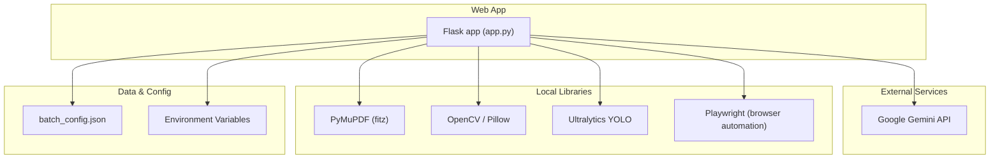
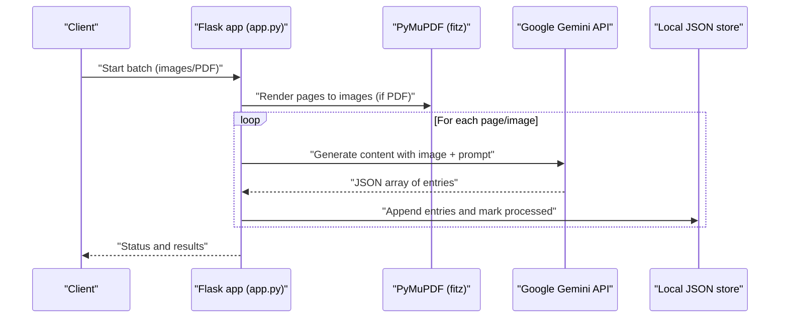
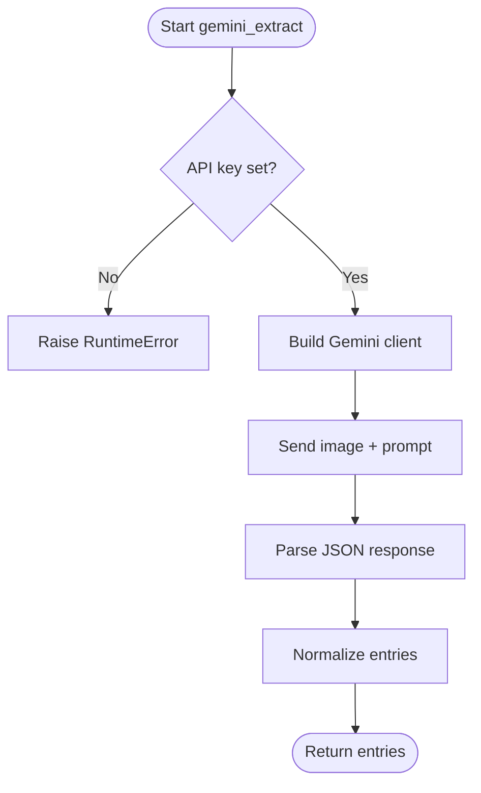
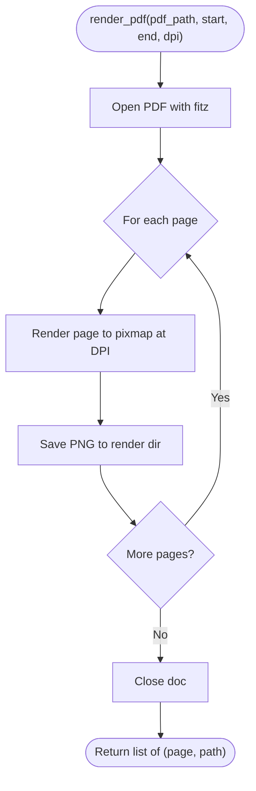
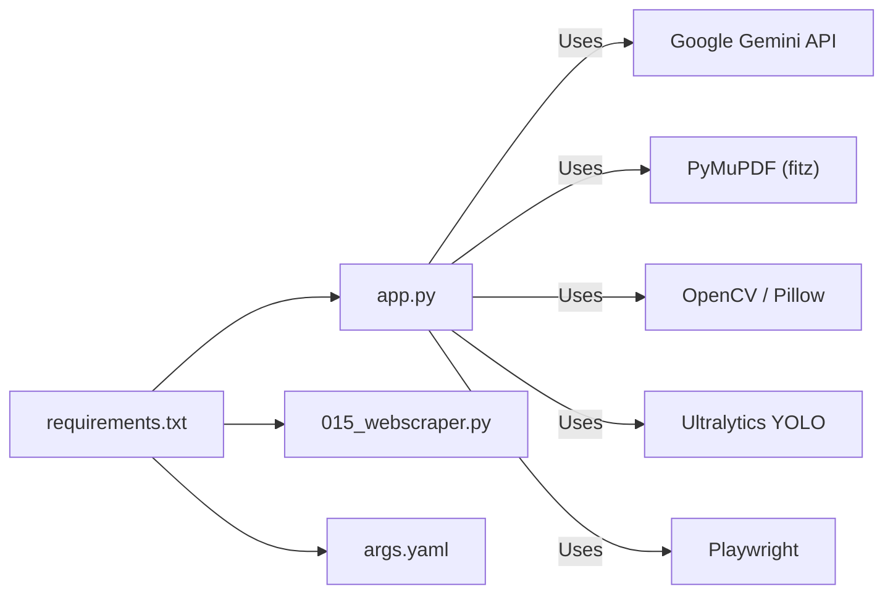

# Integration Patterns and External Services

<cite>
**Referenced Files in This Document**
- [app.py](file://app.py)
- [requirements.txt](file://requirements.txt)
- [batch_config.json](file://batch_config.json)
- [015_webscraper.py](file://pipeline/ocr_training/015_webscraper.py)
- [args.yaml](file://langtrans/karen_ocr_v2_boosted/args.yaml)
- [SECURITY.md](file://docs/SECURITY.md)
- [README.md](file://README.md)
</cite>

## Table of Contents
1. [Introduction](#introduction)
2. [Project Structure](#project-structure)
3. [Core Components](#core-components)
4. [Architecture Overview](#architecture-overview)
5. [Detailed Component Analysis](#detailed-component-analysis)
6. [Dependency Analysis](#dependency-analysis)
7. [Performance Considerations](#performance-considerations)
8. [Troubleshooting Guide](#troubleshooting-guide)
9. [Conclusion](#conclusion)

## Introduction
This document explains how the system integrates with external services and third-party libraries to support AI-powered text extraction, PDF processing, image manipulation, synthetic data generation, and model training. It focuses on:
- Google Gemini API for AI-driven extraction and semantic analysis
- PyMuPDF (fitz) for PDF rendering to images
- OpenCV and Pillow for image handling
- Playwright as a dependency for browser automation workflows
- Ultralytics YOLO for object detection and model training
- Authentication patterns, error handling, retry strategies, rate limiting, configuration management, fallbacks, and security considerations

## Project Structure
The application is a Flask web service that orchestrates batch OCR and dictionary enrichment using external AI and vision libraries. Configuration and runtime state are managed via environment variables and local JSON files. Supporting scripts handle data discovery and training tasks.

**Diagram sources**
- [app.py:12-16](file://app.py#L12-L16)
- [app.py:357-371](file://app.py#L357-L371)
- [app.py:619-632](file://app.py#L619-L632)
- [requirements.txt:1-10](file://requirements.txt#L1-L10)
- [args.yaml:1-111](file://langtrans/karen_ocr_v2_boosted/args.yaml#L1-L111)

**Section sources**
- [app.py:1-100](file://app.py#L1-L100)
- [requirements.txt:1-10](file://requirements.txt#L1-L10)
- [batch_config.json:1-9](file://batch_config.json#L1-L9)

## Core Components
- Google Gemini integration for AI-powered extraction and re-analysis of dictionary entries from images or rendered pages.
- PDF rendering pipeline using PyMuPDF to convert pages to images at configurable DPI.
- Image utilities leveraging Pillow and OpenCV through the broader stack.
- Ultralytics YOLO configuration for detection/training workflows.
- Playwright availability for browser automation scenarios.
- Centralized configuration via environment variables and a JSON config file.

Key responsibilities:
- Build a Gemini client only when an API key is present; otherwise, operations requiring AI will fail fast with a clear error.
- Render PDFs to images and process them in batches with delays to respect rate limits.
- Persist processed items to avoid redundant work and support resuming long-running jobs.
- Provide health/status endpoints to inspect configuration and running state.

**Section sources**
- [app.py:357-371](file://app.py#L357-L371)
- [app.py:536-571](file://app.py#L536-L571)
- [app.py:619-632](file://app.py#L619-L632)
- [app.py:638-720](file://app.py#L638-L720)
- [requirements.txt:1-10](file://requirements.txt#L1-L10)
- [args.yaml:1-111](file://langtrans/karen_ocr_v2_boosted/args.yaml#L1-L111)

## Architecture Overview
The system follows a request-driven architecture where the Flask app coordinates external calls and local processing. Batch jobs run in background threads with cancellable state and progress tracking.

**Diagram sources**
- [app.py:619-632](file://app.py#L619-L632)
- [app.py:536-571](file://app.py#L536-L571)
- [app.py:638-720](file://app.py#L638-L720)

## Detailed Component Analysis

### Google Gemini API Integration
- Authentication: The client is created only when the environment variable for the API key is set; otherwise, a runtime error is raised to fail fast.
- Extraction flow: Images are sent with a structured prompt instructing the model to return a JSON array of normalized entries. Responses are parsed into a strict schema and normalized before storage.
- Re-analysis: Entries can be re-analyzed to enrich UI display metadata without altering original definitions.
- Rate limiting and retries: Batches use a configurable delay between requests to reduce load and mitigate rate limits. No explicit retry logic is implemented; failures are logged and do not abort the entire batch.
- Fallback strategy: If the API key is missing, non-AI features (e.g., searching existing entries) remain available; AI-dependent features will raise an error.

**Diagram sources**
- [app.py:357-371](file://app.py#L357-L371)
- [app.py:536-571](file://app.py#L536-L571)

**Section sources**
- [app.py:357-371](file://app.py#L357-L371)
- [app.py:536-571](file://app.py#L536-L571)
- [app.py:574-608](file://app.py#L574-L608)
- [README.md:39-45](file://README.md#L39-L45)

### PDF Rendering with PyMuPDF
- Renders selected pages to PNG images at a configurable DPI.
- Uses safe naming and persists outputs to a dedicated directory.
- Errors during rendering are caught and reported; the job finishes with an error state if rendering fails.

**Diagram sources**
- [app.py:619-632](file://app.py#L619-L632)

**Section sources**
- [app.py:619-632](file://app.py#L619-L632)

### Image Processing with OpenCV and Pillow
- Dependencies include OpenCV and Pillow for image I/O and manipulation within the broader stack.
- The app uses Pillow via PyMuPDF’s pixmap saving; OpenCV is available for other pipeline components.

**Section sources**
- [requirements.txt:4-5](file://requirements.txt#L4-L5)

### Playwright Browser Automation
- Playwright is listed as a dependency, indicating readiness for browser automation tasks such as scraping or headless interactions.
- A separate scraper script demonstrates HTTP-based data collection with polite delays and error handling; Playwright can be used similarly for dynamic content.

**Section sources**
- [requirements.txt:7-7](file://requirements.txt#L7-L7)
- [015_webscraper.py:1-116](file://pipeline/ocr_training/015_webscraper.py#L1-L116)

### Ultralytics YOLO Object Detection and Training
- Training/inference parameters are stored in a YAML configuration file, including dataset paths, epochs, batch size, device selection, and augmentation settings.
- This enables consistent runs for detection tasks and model iteration.

**Section sources**
- [args.yaml:1-111](file://langtrans/karen_ocr_v2_boosted/args.yaml#L1-L111)

### Data Discovery and Synthetic Data Generation
- A lightweight web scraper collects Karen language text and images from target sites, with timeouts, polite delays, and per-page error handling.
- Outputs are saved for manual review and labeling to expand training datasets beyond synthetic sources.

**Section sources**
- [015_webscraper.py:1-116](file://pipeline/ocr_training/015_webscraper.py#L1-L116)

## Dependency Analysis
The system composes multiple external dependencies to achieve end-to-end OCR and enrichment:

**Diagram sources**
- [requirements.txt:1-10](file://requirements.txt#L1-L10)
- [app.py:12-16](file://app.py#L12-L16)
- [015_webscraper.py:14-30](file://pipeline/ocr_training/015_webscraper.py#L14-L30)
- [args.yaml:1-111](file://langtrans/karen_ocr_v2_boosted/args.yaml#L1-L111)

**Section sources**
- [requirements.txt:1-10](file://requirements.txt#L1-L10)
- [app.py:12-16](file://app.py#L12-L16)
- [015_webscraper.py:14-30](file://pipeline/ocr_training/015_webscraper.py#L14-L30)
- [args.yaml:1-111](file://langtrans/karen_ocr_v2_boosted/args.yaml#L1-L111)

## Performance Considerations
- Rate limiting: Use the configurable delay between requests to avoid throttling by external APIs.
- Batch sizing: Adjust PDF pages per batch and images per batch to balance throughput and memory usage.
- DPI tuning: Higher DPI improves OCR quality but increases processing time and storage; tune based on needs.
- Skip processed: Enable skipping already processed items to resume long jobs efficiently.
- Concurrency: Background threads manage batch execution; ensure adequate resources for concurrent rendering and AI calls.

[No sources needed since this section provides general guidance]

## Troubleshooting Guide
- Missing API key: If the Gemini API key is not set, AI-dependent operations will raise a clear error. Ensure the environment variable is configured before starting batch OCR or re-analysis.
- Network errors: Scrapers and workers catch exceptions per item/page and continue processing; check logs for specific failures.
- Rendering failures: PDF rendering errors are captured and reported; verify input PDF integrity and permissions.
- Health checks: Use status endpoints to confirm whether the API key is recognized and whether a batch is running.

**Section sources**
- [app.py:22-30](file://app.py#L22-L30)
- [app.py:357-371](file://app.py#L357-L371)
- [app.py:678-720](file://app.py#L678-L720)
- [015_webscraper.py:53-106](file://pipeline/ocr_training/015_webscraper.py#L53-L106)

## Conclusion
The system integrates Google Gemini for AI-powered extraction, PyMuPDF for PDF rendering, OpenCV and Pillow for image handling, Playwright for browser automation, and Ultralytics YOLO for detection and training. Robust configuration via environment variables and JSON files supports flexible deployment. Error handling is resilient at the item level, with clear failure reporting and optional skip logic. Security best practices emphasize managing API keys via environment variables and following documented guidance for sensitive credentials.

[No sources needed since this section summarizes without analyzing specific files]