# Processing Pipeline Architecture

<cite>
**Referenced Files in This Document**
- [README.md](file://README.md)
- [app.py](file://app.py)
- [batch_config.json](file://batch_config.json)
- [043_pdf_page_splitter_zoom.py](file://pipeline/dictionary_processing/043_pdf_page_splitter_zoom.py)
- [042_build_KNU_decoder.py](file://pipeline/dictionary_processing/042_build_KNU_decoder.py)
- [046_sort_engine.py](file://pipeline/dictionary_processing/046_sort_engine.py)
- [1_karen_dataset_gen.py](file://pipeline/ocr_training/1_karen_dataset_gen.py)
- [041_gen_paragraph_data.py](file://pipeline/ocr_training/041_gen_paragraph_data.py)
- [040_tile_infer.py](file://pipeline/ocr_training/040_tile_infer.py)
- [036_train_v5.py](file://pipeline/ocr_training/036_train_v5.py)
- [027_run_v2_validation.py](file://pipeline/ocr_training/027_run_v2_validation.py)
</cite>

## Table of Contents
1. Introduction
2. Project Structure
3. Core Components
4. Architecture Overview
5. Detailed Component Analysis
6. Dependency Analysis
7. Performance Considerations
8. Troubleshooting Guide
9. Conclusion

## Introduction
This document describes the end-to-end multi-stage processing pipeline for Sgaw Karen OCR and dictionary extraction. It covers input handling (PDFs and images), page rendering and splitting, synthetic and real dataset generation, YOLO training and validation, paragraph and tiled inference, dictionary lookup and extraction, Gemini fallback and re-analysis, a Flask review workbench, and final structured outputs including dictionary JSON and proof artifacts. It also documents parallel batch processing, error handling at each stage, data transformations between phases, memory management strategies for large files, and coordination between synchronous and asynchronous operations.

## Project Structure
The repository is organized into three main areas:
- Root-level Flask application and configuration that implement the review workbench and orchestrate batch OCR and extraction.
- Dictionary processing scripts for legacy KNU decoding, PDF page splitting, sorting, and correction propagation.
- OCR training scripts for synthetic dataset generation, paragraph dataset generation, model training, validation, and tiled inference.

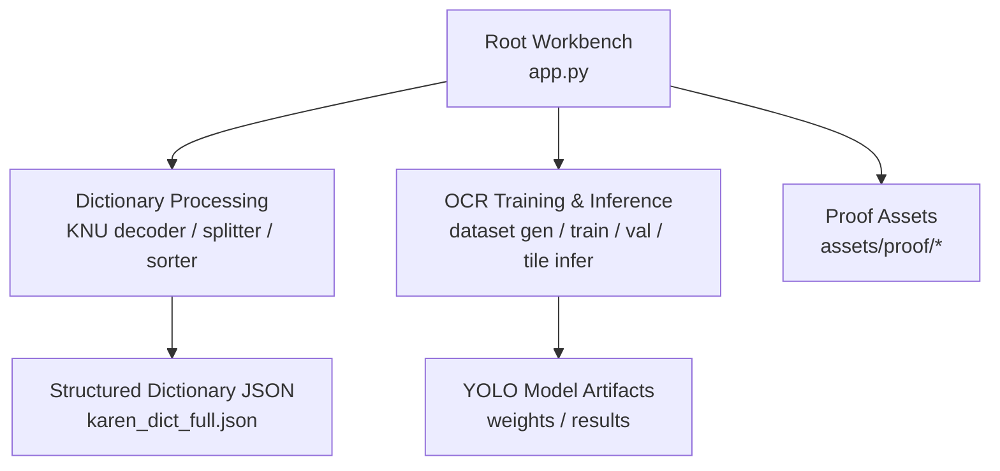

**Diagram sources**
- [README.md:19-29](file://README.md#L19-L29)
- [app.py:42-55](file://app.py#L42-L55)

**Section sources**
- [README.md:1-63](file://README.md#L1-L63)

## Core Components
- Input ingestion and rendering:
  - PDF pages are rendered to high-resolution PNGs using PyMuPDF with configurable DPI and optional page ranges.
  - Images are accepted directly from uploads or generated from PDF pages.
- OCR and extraction:
  - Synthetic syllable datasets are generated via Playwright-rendered HTML and OpenCV-based bounding box detection.
  - Paragraph-level datasets are generated by composing multiple syllables per line and capturing per-syllable bounding boxes.
  - Tiled inference runs a trained YOLO model over sliding tiles with overlap and non-maximum suppression.
- Dictionary processing:
  - Legacy KNU-encoded text is decoded to Unicode with deduplication and paragraph assembly.
  - Entries are normalized, sorted according to Sgaw Karen rules, and corrected with context-aware propagation.
- LLM fallback and re-analysis:
  - If OCR yields insufficient or low-confidence results, Gemini extracts structured entries from image bytes.
  - Existing entries can be re-analyzed to enrich analysis fields without altering definitions.
- Review workbench:
  - Flask app exposes routes for search, edit, batch processing, status polling, and export.
  - State is managed with thread-safe snapshots and background workers for long-running tasks.
- Outputs:
  - Structured dictionary JSON persisted atomically.
  - Proof assets include training metrics, confusion matrices, and exported review artifacts.

**Section sources**
- [app.py:42-55](file://app.py#L42-L55)
- [app.py:536-614](file://app.py#L536-L614)
- [043_pdf_page_splitter_zoom.py:134-190](file://pipeline/dictionary_processing/043_pdf_page_splitter_zoom.py#L134-L190)
- [042_build_KNU_decoder.py:215-295](file://pipeline/dictionary_processing/042_build_KNU_decoder.py#L215-L295)
- [046_sort_engine.py:93-160](file://pipeline/dictionary_processing/046_sort_engine.py#L93-L160)
- [1_karen_dataset_gen.py:225-334](file://pipeline/ocr_training/1_karen_dataset_gen.py#L225-L334)
- [041_gen_paragraph_data.py:131-230](file://pipeline/ocr_training/041_gen_paragraph_data.py#L131-L230)
- [040_tile_infer.py:15-68](file://pipeline/ocr_training/040_tile_infer.py#L15-L68)
- [036_train_v5.py:1-33](file://pipeline/ocr_training/036_train_v5.py#L1-L33)
- [027_run_v2_validation.py:1-29](file://pipeline/ocr_training/027_run_v2_validation.py#L1-L29)

## Architecture Overview
The pipeline coordinates several stages across synchronous and asynchronous execution paths:

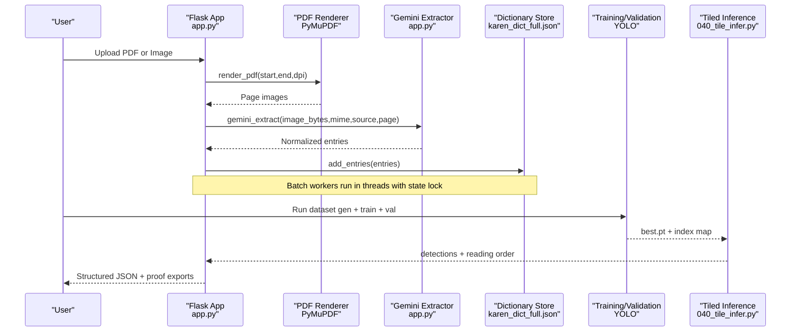

**Diagram sources**
- [app.py:619-720](file://app.py#L619-L720)
- [app.py:536-614](file://app.py#L536-L614)
- [040_tile_infer.py:15-68](file://pipeline/ocr_training/040_tile_infer.py#L15-L68)
- [036_train_v5.py:1-33](file://pipeline/ocr_training/036_train_v5.py#L1-L33)
- [027_run_v2_validation.py:1-29](file://pipeline/ocr_training/027_run_v2_validation.py#L1-L29)

## Detailed Component Analysis

### PDF and Image Ingestion
- PDF rendering:
  - Uses PyMuPDF to open the document, apply a matrix scaling for target DPI, and save each page as PNG.
  - Supports start/end page ranges and configurable DPI; safe file naming avoids collisions.
- Image acceptance:
  - Accepts common image formats and determines MIME types for downstream processing.
  - Skips already processed items based on a persisted processed list to avoid redundant work.

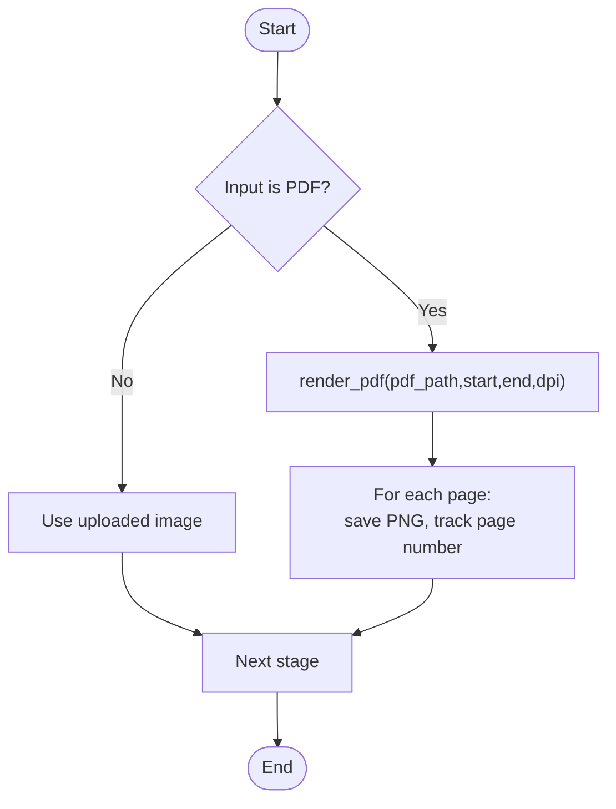

**Diagram sources**
- [app.py:619-632](file://app.py#L619-L632)
- [app.py:251-265](file://app.py#L251-L265)

**Section sources**
- [app.py:619-632](file://app.py#L619-L632)
- [app.py:251-265](file://app.py#L251-L265)

### Synthetic Dataset Generation (Syllables)
- Generates thousands of labeled images for single-syllable classes:
  - Composes consonant, vowel, tone, medial, and asat combinations.
  - Renders HTML with a specific font via Playwright, screenshots, and computes bounding boxes using OpenCV thresholding.
  - Applies augmentation (rotation, blur, noise) and writes YOLO-format labels.
  - Produces a Roboflow-compatible dataset split and YAML manifest.

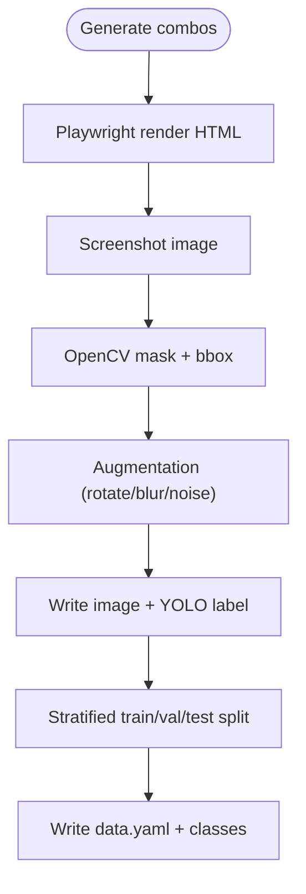

**Diagram sources**
- [1_karen_dataset_gen.py:187-219](file://pipeline/ocr_training/1_karen_dataset_gen.py#L187-L219)
- [1_karen_dataset_gen.py:225-334](file://pipeline/ocr_training/1_karen_dataset_gen.py#L225-L334)

**Section sources**
- [1_karen_dataset_gen.py:187-219](file://pipeline/ocr_training/1_karen_dataset_gen.py#L187-L219)
- [1_karen_dataset_gen.py:225-334](file://pipeline/ocr_training/1_karen_dataset_gen.py#L225-L334)

### Paragraph Dataset Generation
- Builds realistic multi-syllable lines and paragraphs:
  - Randomly selects syllables from an index map and composes HTML with per-syllable spans.
  - Captures screenshots and queries bounding boxes per span to generate multi-label YOLO annotations.
  - Writes images and labels to configured directories for training.

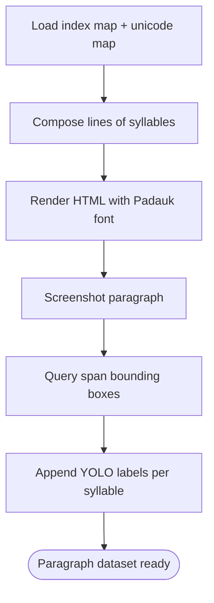

**Diagram sources**
- [041_gen_paragraph_data.py:63-110](file://pipeline/ocr_training/041_gen_paragraph_data.py#L63-L110)
- [041_gen_paragraph_data.py:131-230](file://pipeline/ocr_training/041_gen_paragraph_data.py#L131-L230)

**Section sources**
- [041_gen_paragraph_data.py:63-110](file://pipeline/ocr_training/041_gen_paragraph_data.py#L63-L110)
- [041_gen_paragraph_data.py:131-230](file://pipeline/ocr_training/041_gen_paragraph_data.py#L131-L230)

### YOLO Training and Validation
- Fine-tuning:
  - Loads previous best weights and trains with specified hyperparameters, saving artifacts under a project directory.
- Validation:
  - Runs validation against the dataset YAML, collects per-class metrics, and saves summary JSON.

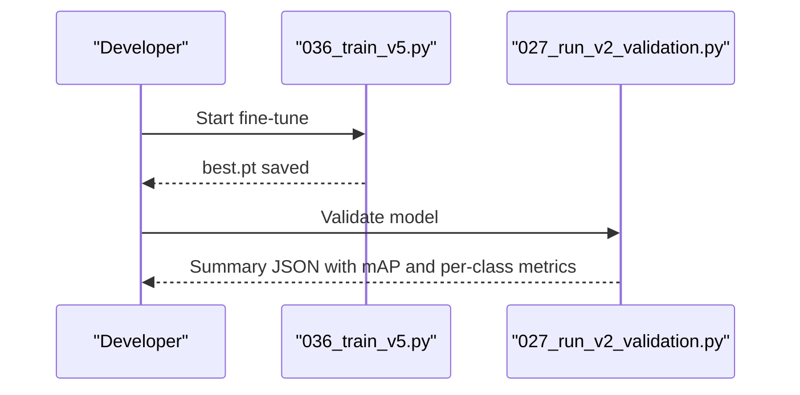

**Diagram sources**
- [036_train_v5.py:1-33](file://pipeline/ocr_training/036_train_v5.py#L1-L33)
- [027_run_v2_validation.py:1-29](file://pipeline/ocr_training/027_run_v2_validation.py#L1-L29)

**Section sources**
- [036_train_v5.py:1-33](file://pipeline/ocr_training/036_train_v5.py#L1-L33)
- [027_run_v2_validation.py:1-29](file://pipeline/ocr_training/027_run_v2_validation.py#L1-L29)

### Paragraph and Tiled Inference
- Tiled inference:
  - Loads the trained model and index map, opens test image, and iterates over tiles with step size reduced by overlap.
  - Runs detection per tile, aggregates detections, applies NMS, sorts by reading order, and writes result JSON.

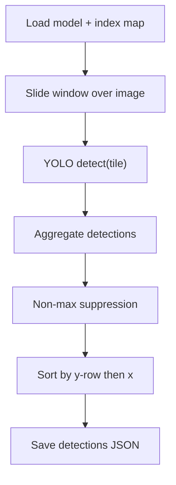

**Diagram sources**
- [040_tile_infer.py:15-68](file://pipeline/ocr_training/040_tile_infer.py#L15-L68)

**Section sources**
- [040_tile_infer.py:15-68](file://pipeline/ocr_training/040_tile_infer.py#L15-L68)

### Dictionary Processing: KNU Decoding and Sorting
- KNU decoding:
  - Parses PDF character runs, identifies KNU vs non-KNU fonts, builds raw KNU strings, converts to Unicode with deduplication, and captures English text segments.
  - Provides repair functions to fix existing JSON and generate paragraph texts for training.
- Sorting and corrections:
  - Implements canonical sort order by decomposing syllables into consonant, tone, vowel, and medial ranks.
  - Provides smart auto-correction propagation guarded by contextual matching to avoid false positives.

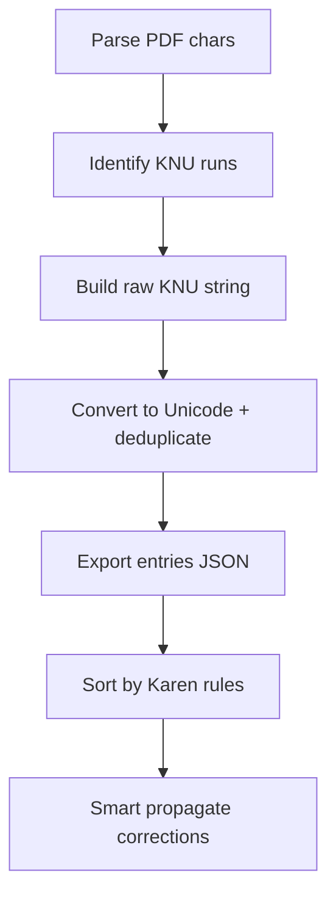

**Diagram sources**
- [042_build_KNU_decoder.py:215-295](file://pipeline/dictionary_processing/042_build_KNU_decoder.py#L215-L295)
- [046_sort_engine.py:93-160](file://pipeline/dictionary_processing/046_sort_engine.py#L93-L160)
- [046_sort_engine.py:168-252](file://pipeline/dictionary_processing/046_sort_engine.py#L168-L252)

**Section sources**
- [042_build_KNU_decoder.py:215-295](file://pipeline/dictionary_processing/042_build_KNU_decoder.py#L215-L295)
- [046_sort_engine.py:93-160](file://pipeline/dictionary_processing/046_sort_engine.py#L93-L160)
- [046_sort_engine.py:168-252](file://pipeline/dictionary_processing/046_sort_engine.py#L168-L252)

### Gemini Fallback and Re-analysis
- Extraction:
  - Sends image bytes and a strict prompt to Gemini to extract structured entries preserving original definition text and enriching analysis fields.
  - Parses flexible JSON arrays from model output and normalizes entries before adding to the dictionary store.
- Re-analysis:
  - Re-analyzes existing entries to improve UI display metadata without changing definitions.

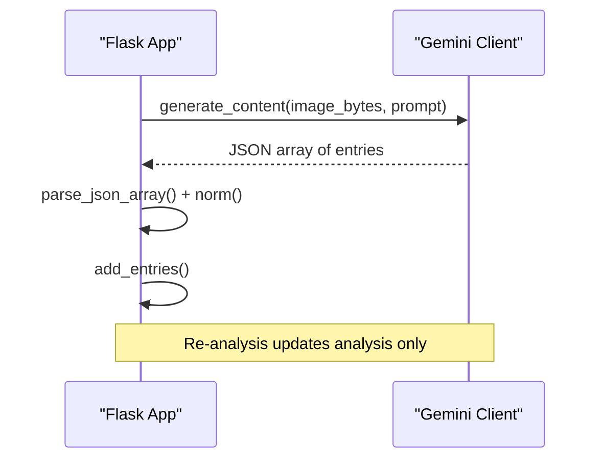

**Diagram sources**
- [app.py:536-614](file://app.py#L536-L614)

**Section sources**
- [app.py:536-614](file://app.py#L536-L614)

### Flask Review Workbench Processing
- Routes and state:
  - Error handlers return structured JSON with traces.
  - Global state tracks running mode, progress, logs, and cancellation flags, protected by a threading lock.
  - Background workers process batches of images or PDF pages asynchronously while updating shared state.
- Batch configuration:
  - Configurable batch sizes, delays, DPI, offsets, and skip behavior stored in a JSON file.
- Data persistence:
  - Dictionary, processed lists, and corrections are loaded/saved with atomic replace semantics to prevent corruption.

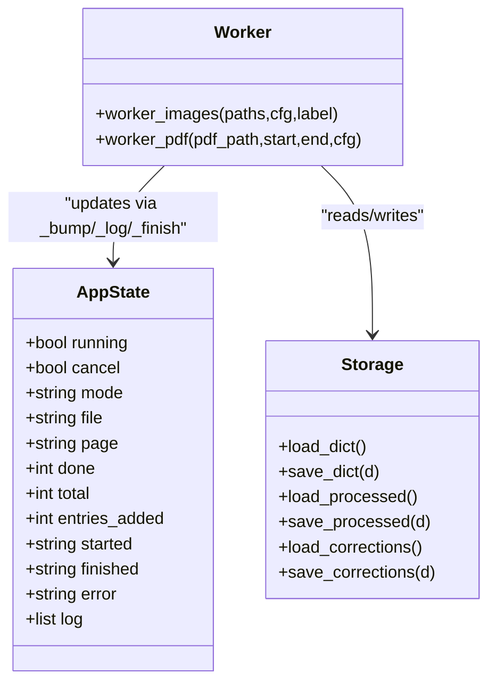

**Diagram sources**
- [app.py:96-170](file://app.py#L96-L170)
- [app.py:638-720](file://app.py#L638-L720)
- [app.py:171-233](file://app.py#L171-L233)

**Section sources**
- [app.py:22-30](file://app.py#L22-L30)
- [app.py:96-170](file://app.py#L96-L170)
- [app.py:638-720](file://app.py#L638-L720)
- [app.py:171-233](file://app.py#L171-L233)
- [batch_config.json:1-9](file://batch_config.json#L1-L9)

## Dependency Analysis
Key dependencies and their roles:
- PyMuPDF (fitz): PDF rendering to high-resolution images.
- Playwright + Chromium: Headless browser rendering for synthetic dataset generation and precise glyph layout.
- OpenCV: Bounding box detection via thresholding and morphological operations.
- Ultralytics YOLO: Model training, validation, and inference.
- Google GenAI: LLM-powered extraction and re-analysis.
- Flask: Web server for the review workbench and API endpoints.
- JSON storage: Atomic writes for dictionary, processed lists, and corrections.

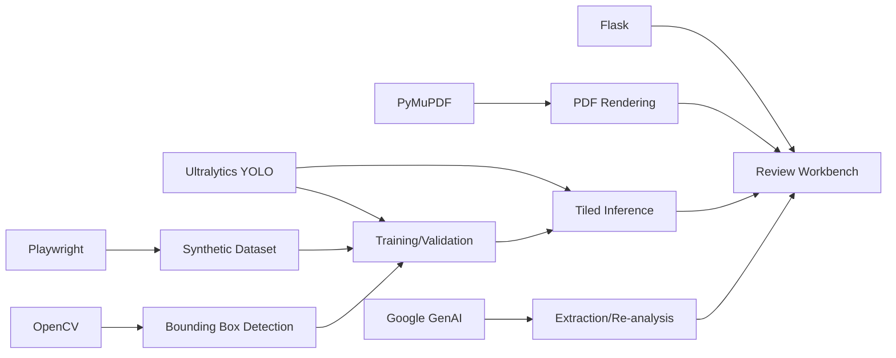

**Diagram sources**
- [app.py:619-632](file://app.py#L619-L632)
- [1_karen_dataset_gen.py:225-334](file://pipeline/ocr_training/1_karen_dataset_gen.py#L225-L334)
- [040_tile_infer.py:15-68](file://pipeline/ocr_training/040_tile_infer.py#L15-L68)
- [036_train_v5.py:1-33](file://pipeline/ocr_training/036_train_v5.py#L1-L33)
- [027_run_v2_validation.py:1-29](file://pipeline/ocr_training/027_run_v2_validation.py#L1-L29)

**Section sources**
- [app.py:619-632](file://app.py#L619-L632)
- [1_karen_dataset_gen.py:225-334](file://pipeline/ocr_training/1_karen_dataset_gen.py#L225-L334)
- [040_tile_infer.py:15-68](file://pipeline/ocr_training/040_tile_infer.py#L15-L68)
- [036_train_v5.py:1-33](file://pipeline/ocr_training/036_train_v5.py#L1-L33)
- [027_run_v2_validation.py:1-29](file://pipeline/ocr_training/027_run_v2_validation.py#L1-L29)

## Performance Considerations
- Memory management:
  - PDF rendering opens the document once per batch range and closes it promptly to release handles and memory.
  - Large images are processed tile-by-tile during inference to limit peak memory usage.
  - Synthetic dataset generation uses a temporary staging directory and cleans up after completion.
- Throughput tuning:
  - Batch sizes for PDF pages and images are configurable to balance throughput and resource constraints.
  - Delay between requests reduces API rate limits and network contention when calling external services.
- I/O safety:
  - All JSON writes use atomic tmp+replace to prevent partial writes during crashes or interruptions.
- Parallelism:
  - Background threads execute batch workers while the main Flask process remains responsive for status and control endpoints.
  - Shared state is protected by a lock to ensure consistency across concurrent updates.

[No sources needed since this section provides general guidance]

## Troubleshooting Guide
Common issues and resolutions:
- Missing API key:
  - Ensure environment variables for Gemini are set; otherwise, extraction will raise a runtime error.
- PDF not found or invalid:
  - Verify the PDF path exists and is readable; renderer logs errors and finishes gracefully.
- No entries extracted:
  - Check image quality and DPI; adjust render_dpi and page_offset in configuration.
  - Inspect logs for zero-entry warnings and consider re-running with different parameters.
- Duplicate or repeated entries:
  - Use KNU deduplication tools to clean legacy data; verify Unicode conversion and paragraph generation.
- Sorting anomalies:
  - Confirm decomposition logic matches expected Karen structure; use sort reference prints to validate ordering.
- Long-running jobs:
  - Use cancel flag to stop batch processing; check state snapshot for current progress and logs.

**Section sources**
- [app.py:22-30](file://app.py#L22-L30)
- [app.py:356-359](file://app.py#L356-L359)
- [app.py:678-720](file://app.py#L678-L720)
- [042_build_KNU_decoder.py:304-330](file://pipeline/dictionary_processing/042_build_KNU_decoder.py#L304-L330)
- [046_sort_engine.py:258-295](file://pipeline/dictionary_processing/046_sort_engine.py#L258-L295)

## Conclusion
The pipeline integrates robust preprocessing, synthetic and real dataset generation, model training and validation, and both paragraph and tiled inference to produce structured dictionary entries. The Flask workbench provides interactive review capabilities with batch processing, error handling, and persistent state. By combining deterministic OCR pipelines with LLM fallbacks and careful data normalization, the system delivers reliable outputs suitable for documentation, research, and production use.

[No sources needed since this section summarizes without analyzing specific files]