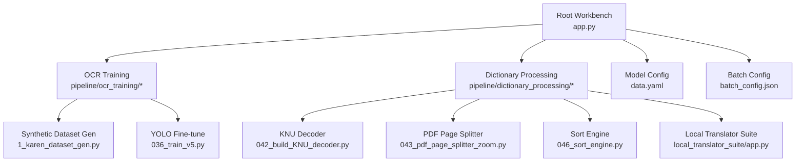
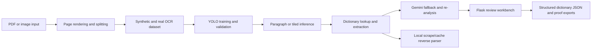
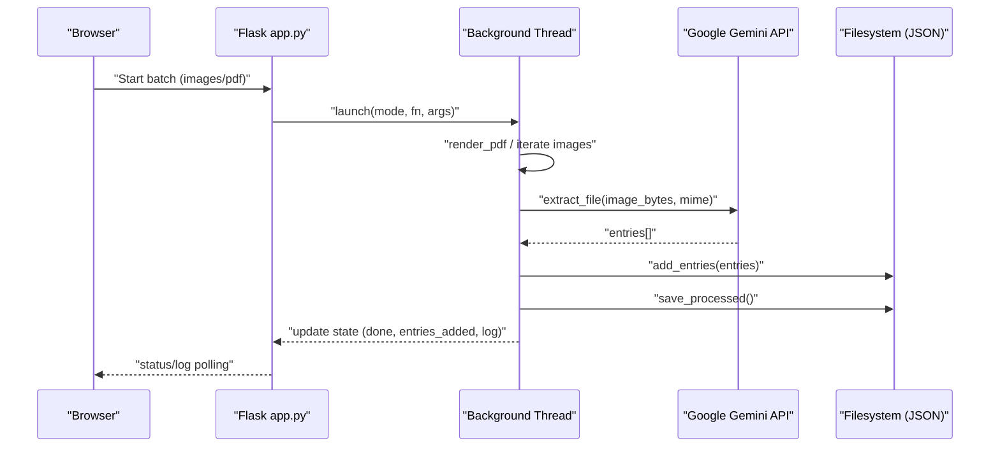
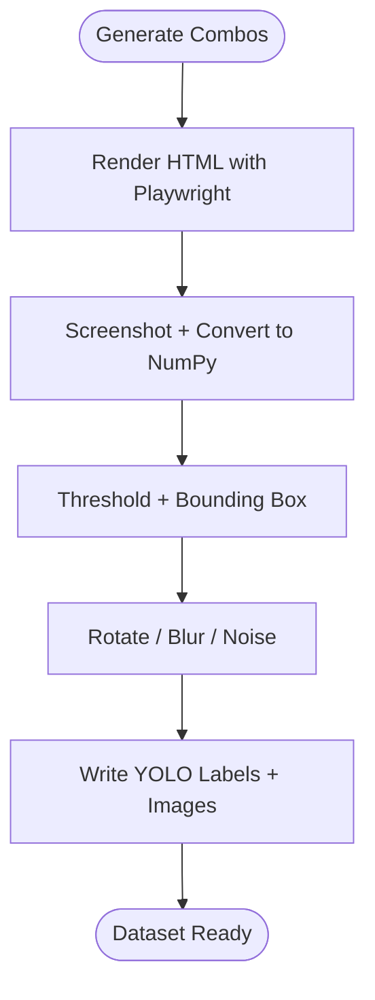
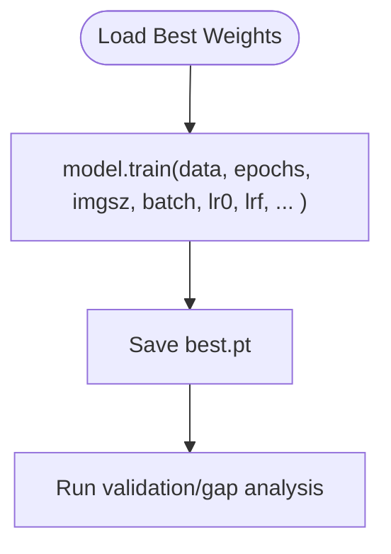
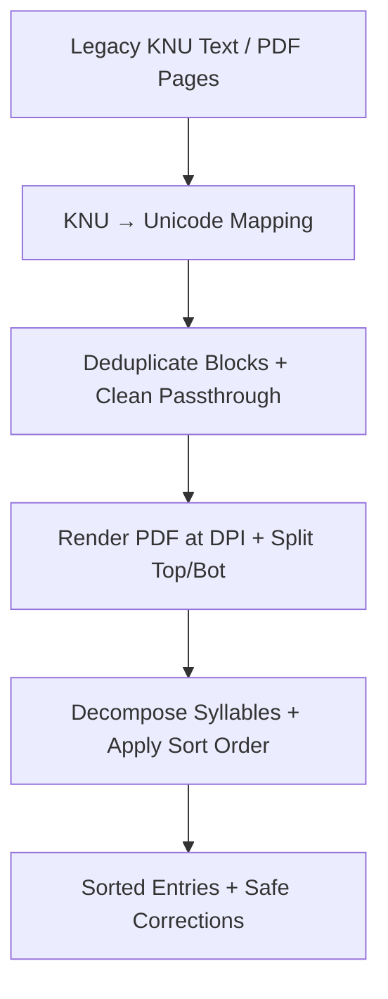
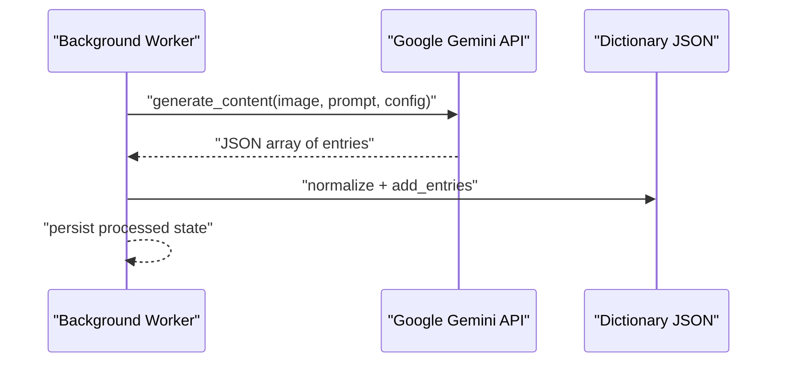
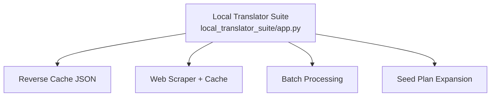
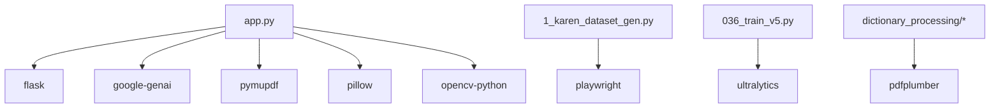

# System Architecture

<cite>
**Referenced Files in This Document**
- [README.md](file://README.md)
- [app.py](file://app.py)
- [requirements.txt](file://requirements.txt)
- [batch_config.json](file://batch_config.json)
- [data.yaml](file://data.yaml)
- [docs/ARCHITECTURE.md](file://docs/ARCHITECTURE.md)
- [pipeline/ocr_training/1_karen_dataset_gen.py](file://pipeline/ocr_training/1_karen_dataset_gen.py)
- [pipeline/ocr_training/036_train_v5.py](file://pipeline/ocr_training/036_train_v5.py)
- [pipeline/dictionary_processing/042_build_KNU_decoder.py](file://pipeline/dictionary_processing/042_build_KNU_decoder.py)
- [pipeline/dictionary_processing/043_pdf_page_splitter_zoom.py](file://pipeline/dictionary_processing/043_pdf_page_splitter_zoom.py)
- [pipeline/dictionary_processing/046_sort_engine.py](file://pipeline/dictionary_processing/046_sort_engine.py)
- [pipeline/dictionary_processing/local_translator_suite/app.py](file://pipeline/dictionary_processing/local_translator_suite/app.py)
</cite>

## Table of Contents
1. [Introduction](#introduction)
2. [Project Structure](#project-structure)
3. [Core Components](#core-components)
4. [Architecture Overview](#architecture-overview)
5. [Detailed Component Analysis](#detailed-component-analysis)
6. [Dependency Analysis](#dependency-analysis)
7. [Performance Considerations](#performance-considerations)
8. [Troubleshooting Guide](#troubleshooting-guide)
9. [Conclusion](#conclusion)
10. [Appendices](#appendices)

## Introduction
This document describes the architecture of the Sgaw Karen OCR and Dictionary Pipeline system. It explains how source images or PDFs flow through synthetic data generation, YOLO-based syllable detection training, dictionary processing, and AI-assisted extraction to produce structured dictionary entries reviewed in a Flask workbench. It also covers infrastructure requirements, scalability for batch processing, deployment topology options, and cross-cutting concerns such as error handling, logging, and resource management.

The system is designed around:
- A Flask web application that orchestrates background workers, file processing, and real-time status updates.
- An OCR training pipeline using Playwright-generated synthetic data and YOLO models for syllable detection.
- Dictionary processing tools for legacy KNU decoding, PDF page splitting, sorting, and relation extraction.
- AI integration via Google Gemini for intelligent extraction and re-analysis of dictionary entries.

**Section sources**
- [README.md:1-63](file://README.md#L1-L63)
- [docs/ARCHITECTURE.md:1-38](file://docs/ARCHITECTURE.md#L1-L38)

## Project Structure
At a high level, the repository contains:
- The Flask workbench and runtime configuration at the root (app.py, batch_config.json).
- OCR training scripts under pipeline/ocr_training/, including synthetic dataset generation and model fine-tuning.
- Dictionary processing utilities under pipeline/dictionary_processing/, including KNU decoding, PDF splitting, sorting, and a local translator suite.
- Data assets and proof artifacts under assets/proof/.
- Model dataset configuration in data.yaml.

**Diagram sources**
- [app.py:1-800](file://app.py#L1-L800)
- [pipeline/ocr_training/1_karen_dataset_gen.py:1-200](file://pipeline/ocr_training/1_karen_dataset_gen.py#L1-L200)
- [pipeline/ocr_training/036_train_v5.py:1-33](file://pipeline/ocr_training/036_train_v5.py#L1-L33)
- [pipeline/dictionary_processing/042_build_KNU_decoder.py:1-200](file://pipeline/dictionary_processing/042_build_KNU_decoder.py#L1-L200)
- [pipeline/dictionary_processing/043_pdf_page_splitter_zoom.py:1-190](file://pipeline/dictionary_processing/043_pdf_page_splitter_zoom.py#L1-L190)
- [pipeline/dictionary_processing/046_sort_engine.py:1-200](file://pipeline/dictionary_processing/046_sort_engine.py#L1-L200)
- [pipeline/dictionary_processing/local_translator_suite/app.py:1-200](file://pipeline/dictionary_processing/local_translator_suite/app.py#L1-L200)
- [data.yaml:1-800](file://data.yaml#L1-L800)
- [batch_config.json:1-9](file://batch_config.json#L1-L9)

**Section sources**
- [README.md:1-63](file://README.md#L1-L63)
- [docs/ARCHITECTURE.md:1-38](file://docs/ARCHITECTURE.md#L1-L38)

## Core Components
- Flask Workbench (app.py): Provides HTTP routes, background worker orchestration, state tracking, JSON persistence for dictionary entries, corrections log, and processed items. Integrates with Google Gemini for extraction and re-analysis. Renders PDF pages and serves fonts.
- Synthetic Dataset Generator (1_karen_dataset_gen.py): Uses Playwright to render HTML with Padauk font into images, computes bounding boxes, applies augmentation, and outputs Roboflow/YOLO-format datasets.
- YOLO Training (036_train_v5.py): Fine-tunes YOLO models on generated datasets with configurable parameters and project paths.
- Dictionary Processing:
  - KNU Decoder (042_build_KNU_decoder.py): Maps legacy KNU-encoded characters to Unicode, deduplicates repeated blocks, and cleans text.
  - PDF Page Splitter (043_pdf_page_splitter_zoom.py): Renders PDF pages at high DPI and splits them into top/bottom halves for improved OCR readability.
  - Sort Engine (046_sort_engine.py): Implements canonical Sgaw Karen sort order and safe auto-correction guards based on linguistic structure.
  - Local Translator Suite (local_translator_suite/app.py): Standalone Flask app for scrape/cache lookup, reverse parsing, batch processing, and seed plan expansion.
- Configuration:
  - data.yaml: Defines dataset paths, class counts, and names for YOLO training.
  - batch_config.json: Controls batch sizes, delays, DPI, offsets, and skip/auto-import behaviors.

**Section sources**
- [app.py:1-800](file://app.py#L1-L800)
- [pipeline/ocr_training/1_karen_dataset_gen.py:1-200](file://pipeline/ocr_training/1_karen_dataset_gen.py#L1-L200)
- [pipeline/ocr_training/036_train_v5.py:1-33](file://pipeline/ocr_training/036_train_v5.py#L1-L33)
- [pipeline/dictionary_processing/042_build_KNU_decoder.py:1-200](file://pipeline/dictionary_processing/042_build_KNU_decoder.py#L1-L200)
- [pipeline/dictionary_processing/043_pdf_page_splitter_zoom.py:1-190](file://pipeline/dictionary_processing/043_pdf_page_splitter_zoom.py#L1-L190)
- [pipeline/dictionary_processing/046_sort_engine.py:1-200](file://pipeline/dictionary_processing/046_sort_engine.py#L1-L200)
- [pipeline/dictionary_processing/local_translator_suite/app.py:1-200](file://pipeline/dictionary_processing/local_translator_suite/app.py#L1-L200)
- [data.yaml:1-800](file://data.yaml#L1-L800)
- [batch_config.json:1-9](file://batch_config.json#L1-L9)

## Architecture Overview
The end-to-end pipeline flows from source images/PDFs through preprocessing, OCR training/inference, dictionary processing, and AI-assisted extraction to a review workbench producing structured dictionary JSON and exports.

**Diagram sources**
- [docs/ARCHITECTURE.md:1-38](file://docs/ARCHITECTURE.md#L1-L38)

## Detailed Component Analysis

### Flask Workbench Orchestration and Background Workers
The Flask application manages:
- Global state with thread-safe access for running jobs, cancellation, progress, logs, and errors.
- Background workers for processing images and PDF pages, invoking Gemini extraction, persisting entries, and updating processed records.
- Batch configuration controls batching, delays, DPI, offsets, and skipping already processed items.
- Error handlers return structured JSON with traces; exceptions are logged and surfaced to the UI.

**Diagram sources**
- [app.py:638-729](file://app.py#L638-L729)
- [app.py:536-614](file://app.py#L536-L614)
- [app.py:619-633](file://app.py#L619-L633)
- [batch_config.json:1-9](file://batch_config.json#L1-L9)

**Section sources**
- [app.py:1-800](file://app.py#L1-L800)
- [batch_config.json:1-9](file://batch_config.json#L1-L9)

### Synthetic Dataset Generation with Playwright
The generator creates thousands of synthetic syllable images by:
- Rendering HTML with Padauk font via Playwright Chromium.
- Capturing screenshots and computing bounding boxes using OpenCV thresholding.
- Applying augmentation (rotation, blur, noise) to improve robustness.
- Writing Roboflow-compatible dataset files referenced by data.yaml.

**Diagram sources**
- [pipeline/ocr_training/1_karen_dataset_gen.py:104-181](file://pipeline/ocr_training/1_karen_dataset_gen.py#L104-L181)
- [data.yaml:1-800](file://data.yaml#L1-L800)

**Section sources**
- [pipeline/ocr_training/1_karen_dataset_gen.py:1-200](file://pipeline/ocr_training/1_karen_dataset_gen.py#L1-L200)
- [data.yaml:1-800](file://data.yaml#L1-L800)

### YOLO Training and Validation
Training scripts fine-tune YOLO models using generated datasets:
- Load best weights from previous versions.
- Configure epochs, batch size, learning rate schedule, optimizer, and caching behavior.
- Output runs and best weights for subsequent inference or validation steps.

**Diagram sources**
- [pipeline/ocr_training/036_train_v5.py:1-33](file://pipeline/ocr_training/036_train_v5.py#L1-L33)

**Section sources**
- [pipeline/ocr_training/036_train_v5.py:1-33](file://pipeline/ocr_training/036_train_v5.py#L1-L33)

### Dictionary Processing: KNU Decoding, PDF Splitting, Sorting
- KNU Decoder maps legacy characters to Unicode, deduplicates repeated blocks, and cleans text artifacts.
- PDF Page Splitter renders pages at high DPI and splits each page into top/bottom halves to enhance glyph clarity.
- Sort Engine implements canonical Sgaw Karen sort order and safe auto-correction guards based on consonant/tone/vowel/medial decomposition.

**Diagram sources**
- [pipeline/dictionary_processing/042_build_KNU_decoder.py:93-200](file://pipeline/dictionary_processing/042_build_KNU_decoder.py#L93-L200)
- [pipeline/dictionary_processing/043_pdf_page_splitter_zoom.py:76-127](file://pipeline/dictionary_processing/043_pdf_page_splitter_zoom.py#L76-L127)
- [pipeline/dictionary_processing/046_sort_engine.py:93-160](file://pipeline/dictionary_processing/046_sort_engine.py#L93-L160)

**Section sources**
- [pipeline/dictionary_processing/042_build_KNU_decoder.py:1-200](file://pipeline/dictionary_processing/042_build_KNU_decoder.py#L1-L200)
- [pipeline/dictionary_processing/043_pdf_page_splitter_zoom.py:1-190](file://pipeline/dictionary_processing/043_pdf_page_splitter_zoom.py#L1-L190)
- [pipeline/dictionary_processing/046_sort_engine.py:1-200](file://pipeline/dictionary_processing/046_sort_engine.py#L1-L200)

### AI Integration: Google Gemini Extraction and Re-analysis
The workbench integrates Google Gemini for:
- Extracting structured entries from images with strict preservation rules for definitions and analysis fields.
- Re-analyzing existing entries to enrich analysis without altering original definitions.
- Enforcing JSON output constraints and normalizing results before storage.

**Diagram sources**
- [app.py:536-614](file://app.py#L536-L614)

**Section sources**
- [app.py:536-614](file://app.py#L536-L614)

### Local Translator Suite
A separate Flask application provides:
- Web scraping and cache lookup for dictionary content.
- Reverse parsing and batch processing capabilities.
- Seed plan-driven expansion of Sgaw Karen language data.

**Diagram sources**
- [pipeline/dictionary_processing/local_translator_suite/app.py:1-200](file://pipeline/dictionary_processing/local_translator_suite/app.py#L1-L200)

**Section sources**
- [pipeline/dictionary_processing/local_translator_suite/app.py:1-200](file://pipeline/dictionary_processing/local_translator_suite/app.py#L1-L200)

## Dependency Analysis
External dependencies include:
- Flask for web serving and routing.
- Google GenAI for Gemini integration.
- PyMuPDF for PDF rendering.
- Pillow and OpenCV for image processing.
- Playwright for synthetic data generation.
- Ultralytics for YOLO training and inference.
- pdfplumber for PDF text extraction.

**Diagram sources**
- [requirements.txt:1-10](file://requirements.txt#L1-L10)
- [app.py:1-800](file://app.py#L1-L800)
- [pipeline/ocr_training/1_karen_dataset_gen.py:1-200](file://pipeline/ocr_training/1_karen_dataset_gen.py#L1-L200)
- [pipeline/ocr_training/036_train_v5.py:1-33](file://pipeline/ocr_training/036_train_v5.py#L1-L33)

**Section sources**
- [requirements.txt:1-10](file://requirements.txt#L1-L10)
- [app.py:1-800](file://app.py#L1-L800)

## Performance Considerations
- Batch sizing: Adjust pdf_pages_per_batch and images_per_batch in batch_config.json to balance throughput and memory usage.
- Delay control: delay_seconds helps avoid rate limits and reduces contention when calling Gemini or writing files.
- Rendering DPI: render_dpi affects image quality and processing time; higher DPI improves OCR accuracy but increases memory and disk usage.
- Skip processed: Enabling skip_processed avoids reprocessing identical inputs, improving efficiency for large batches.
- Model training: Tune epochs, batch size, learning rate, and patience in training scripts to optimize convergence and resource consumption.
- Parallelism: The current background worker uses a single thread per job; consider queue-based parallel workers for multi-file pipelines if needed.

[No sources needed since this section provides general guidance]

## Troubleshooting Guide
Common issues and mitigations:
- Missing Gemini API key: Ensure GEMINI_API_KEY environment variable is set; otherwise extraction will raise an error.
- Font not found: The workbench serves Padauk font from multiple candidate paths; verify presence or configure PADAUK_FONT.
- PDF rendering failures: Check PyMuPDF installation and permissions; ensure PDF path exists and is readable.
- Rate limiting or timeouts: Increase delay_seconds or adjust request timeouts in environment variables for external calls.
- Duplicate or corrupted entries: Use corrections_log.json to track anomalies; leverage sort engine’s safe correction guards to prevent false propagation.
- Large batch memory pressure: Reduce batch sizes and DPI; enable skip_processed to avoid redundant work.

**Section sources**
- [app.py:22-31](file://app.py#L22-L31)
- [app.py:518-530](file://app.py#L518-L530)
- [app.py:619-633](file://app.py#L619-L633)
- [pipeline/dictionary_processing/046_sort_engine.py:163-200](file://pipeline/dictionary_processing/046_sort_engine.py#L163-L200)

## Conclusion
The Sgaw Karen OCR and Dictionary Pipeline integrates synthetic data generation, YOLO-based detection, dictionary processing, and AI-assisted extraction within a cohesive Flask workbench. It supports scalable batch processing, robust error handling, and clear separation of concerns across components. Deployment can be adapted to containerized environments with appropriate resource allocation for GPU/CPU workloads depending on training and inference needs.

[No sources needed since this section summarizes without analyzing specific files]

## Appendices

### Infrastructure Requirements
- Python environment with dependencies listed in requirements.txt.
- Playwright Chromium installed for synthetic data generation.
- GPU support optional for YOLO training; CPU sufficient for inference and dictionary processing.
- Persistent storage for JSON dictionaries, corrections logs, and processed item tracking.
- Environment variables:
  - GEMINI_API_KEY: Required for AI extraction and re-analysis.
  - GEMINI_MODEL: Optional model selection for Gemini.
  - PADAUK_FONT: Optional path override for font serving.

**Section sources**
- [requirements.txt:1-10](file://requirements.txt#L1-L10)
- [app.py:36-38](file://app.py#L36-L38)
- [app.py:91-92](file://app.py#L91-L92)

### Scalability Considerations for Batch Processing
- Queue-based workers: Introduce a task queue (e.g., Celery/RQ) to parallelize image/PDF processing across multiple workers.
- Distributed rendering: Offload PDF rendering and image processing to separate services to reduce main process load.
- Caching: Cache Gemini responses for identical inputs to reduce API costs and latency.
- Storage scaling: Use object storage for large image sets and database-backed entry storage for high-throughput scenarios.

[No sources needed since this section provides general guidance]

### Deployment Topology Options
- Single-process Flask app with background threads suitable for development and small-scale use.
- Containerized deployment with Docker, exposing port 5000, mounting persistent volumes for app_data and assets.
- Multi-service architecture: Separate services for OCR training, dictionary processing, and web workbench, communicating via APIs or message queues.
- Cloud deployment: Run behind a reverse proxy (Nginx/Traefik) with HTTPS termination and autoscaling groups for demand spikes.

[No sources needed since this section provides general guidance]