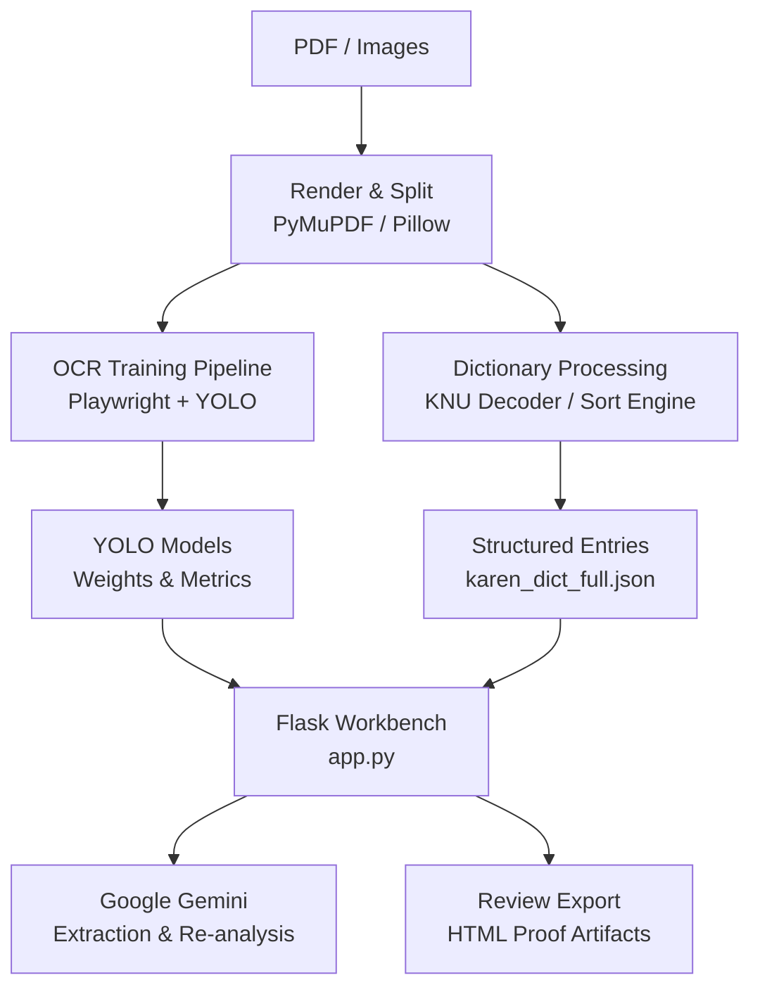
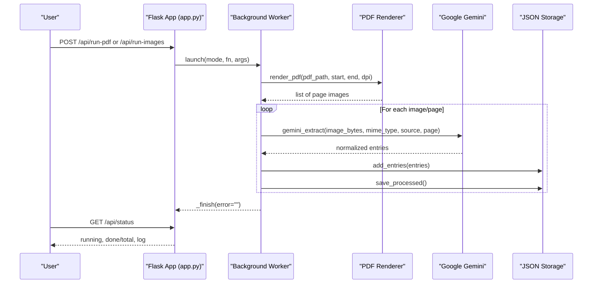
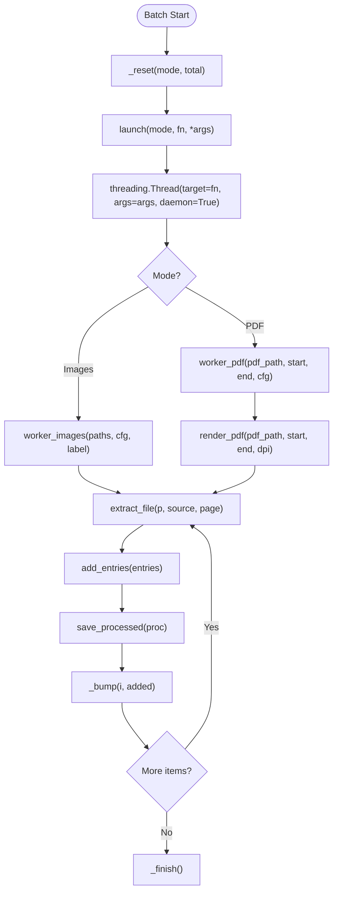
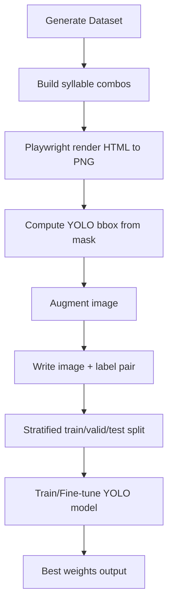
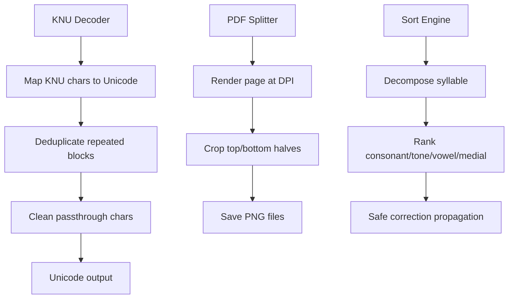
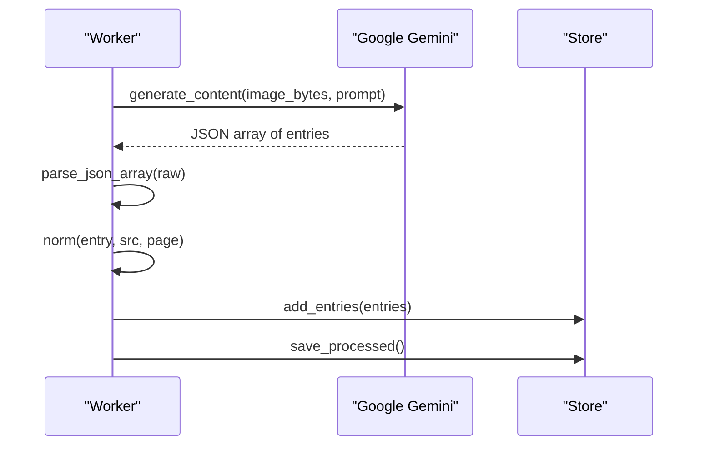
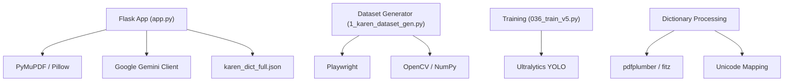

# System Overview and Data Flow

<cite>
**Referenced Files in This Document**
- [app.py](file://app.py)
- [README.md](file://README.md)
- [042_build_KNU_decoder.py](file://pipeline/dictionary_processing/042_build_KNU_decoder.py)
- [043_pdf_page_splitter_zoom.py](file://pipeline/dictionary_processing/043_pdf_page_splitter_zoom.py)
- [046_sort_engine.py](file://pipeline/dictionary_processing/046_sort_engine.py)
- [1_karen_dataset_gen.py](file://pipeline/ocr_training/1_karen_dataset_gen.py)
- [036_train_v5.py](file://pipeline/ocr_training/036_train_v5.py)
- [karen_dict_full.json](file://karen_dict_full.json)
</cite>

## Table of Contents
1. [Introduction](#introduction)
2. [Project Structure](#project-structure)
3. [Core Components](#core-components)
4. [Architecture Overview](#architecture-overview)
5. [Detailed Component Analysis](#detailed-component-analysis)
6. [Dependency Analysis](#dependency-analysis)
7. [Performance Considerations](#performance-considerations)
8. [Troubleshooting Guide](#troubleshooting-guide)
9. [Conclusion](#conclusion)

## Introduction
This document explains the end-to-end architecture of the Sgaw Karen OCR and Dictionary Pipeline. It covers how raw PDFs and images are rendered, processed by OCR and AI tools, transformed into structured dictionary entries, and reviewed through a Flask-based workbench. The system intentionally separates OCR model training from dictionary processing to keep synthetic data generation, YOLO training, legacy KNU decoding, PDF splitting, and human-in-the-loop review as independent but interoperable stages.

The pipeline supports:
- Synthetic dataset generation using Playwright to render Karen syllables and paragraphs for YOLO detection and recognition training.
- OCR model training and fine-tuning with Ultralytics YOLO.
- Legacy KNU-encoded dictionary extraction and Unicode conversion.
- High-resolution PDF page rendering and cropping for improved readability and downstream processing.
- A Flask web application that orchestrates background batch workers, integrates Google Gemini for intelligent extraction and re-analysis, and provides a review workbench for quality assurance and export.

## Project Structure
At a high level, the repository is organized around three main areas:
- Web application and orchestration: `app.py` exposes routes for health checks, configuration, entry management, and batch processing. It also contains the embedded review UI and worker logic.
- OCR training pipeline: scripts under `pipeline/ocr_training/` generate synthetic datasets, train models, and support inference workflows.
- Dictionary processing tools: scripts under `pipeline/dictionary_processing/` handle legacy KNU decoding, PDF page splitting, sorting, and translation-related utilities.

**Diagram sources**
- [app.py:536-613](file://app.py#L536-L613)
- [043_pdf_page_splitter_zoom.py:134-183](file://pipeline/dictionary_processing/043_pdf_page_splitter_zoom.py#L134-L183)
- [1_karen_dataset_gen.py:225-330](file://pipeline/ocr_training/1_karen_dataset_gen.py#L225-L330)
- [036_train_v5.py:10-31](file://pipeline/ocr_training/036_train_v5.py#L10-L31)
- [042_build_KNU_decoder.py:215-295](file://pipeline/dictionary_processing/042_build_KNU_decoder.py#L215-L295)
- [046_sort_engine.py:139-160](file://pipeline/dictionary_processing/046_sort_engine.py#L139-L160)

**Section sources**
- [README.md:1-63](file://README.md#L1-L63)

## Core Components
- Flask web application (`app.py`): Provides routes for health/status/config, entry CRUD, batch processing (images and PDF), cancel/reset controls, and an embedded review UI. It manages background workers via threads, persists state, and integrates Google Gemini for extraction and re-analysis.
- OCR training pipeline: Generates synthetic datasets using Playwright to render Karen text at controlled sizes, computes bounding boxes, augments images, splits into train/valid/test sets, and trains/fine-tunes YOLO models.
- Dictionary processing tools: Decode legacy KNU-encoded text to Unicode, split dictionary PDFs into zoomed halves for better readability, and sort entries according to Sgaw Karen linguistic rules with safe auto-correction propagation.
- AI integration: Uses Google Gemini to extract structured dictionary entries from images and to re-analyze existing entries for UI display without altering original definitions.

Key responsibilities:
- Rendering PDF pages to high-resolution images for OCR or visual inspection.
- Generating synthetic training data for robust OCR models.
- Converting legacy encodings and organizing entries for human review.
- Orchestrating batch jobs and exposing status/log endpoints for real-time feedback.

**Section sources**
- [app.py:17-66](file://app.py#L17-L66)
- [app.py:536-613](file://app.py#L536-L613)
- [app.py:638-729](file://app.py#L638-L729)
- [1_karen_dataset_gen.py:225-330](file://pipeline/ocr_training/1_karen_dataset_gen.py#L225-L330)
- [036_train_v5.py:10-31](file://pipeline/ocr_training/036_train_v5.py#L10-L31)
- [042_build_KNU_decoder.py:215-295](file://pipeline/dictionary_processing/042_build_KNU_decoder.py#L215-L295)
- [046_sort_engine.py:139-160](file://pipeline/dictionary_processing/046_sort_engine.py#L139-L160)

## Architecture Overview
The system follows a layered architecture:
- Input layer: Raw PDFs and images enter the system.
- Rendering layer: PyMuPDF renders pages to PNGs; optional splitting produces top/bottom halves for higher effective resolution.
- Processing layer: OCR training generates synthetic data and trains YOLO models; dictionary processing decodes legacy encodings and sorts entries.
- AI layer: Google Gemini extracts structured entries and enhances analysis fields while preserving original definitions.
- Application layer: Flask app orchestrates background workers, exposes APIs, and serves a review workbench UI.
- Output layer: Structured JSON entries and proof exports (HTML artifacts) are produced for downstream use.

**Diagram sources**
- [app.py:678-729](file://app.py#L678-L729)
- [app.py:619-632](file://app.py#L619-L632)
- [app.py:536-613](file://app.py#L536-L613)
- [app.py:1528-1530](file://app.py#L1528-L1530)

## Detailed Component Analysis

### Flask Web Application and Background Workers
The Flask application centralizes:
- Health, status, and configuration endpoints.
- Entry search, edit, promote, delete, and re-analyze operations.
- Batch processing for images and PDFs via background threads.
- State management with thread-safe locks and persistent logs.
- Integration with Google Gemini for extraction and re-analysis.

Key flows:
- Batch run: The user triggers a job; the app resets state, starts a daemon thread, and updates progress via polling.
- PDF processing: Pages are rendered to PNGs at configurable DPI; each page is sent to Gemini for extraction; results are normalized and appended to the dictionary file.
- Image processing: Directly sends images to Gemini; tracks processed files to avoid reprocessing when configured.
- Review workflow: The UI displays entries with linked headwords, examples, related items, and allows edits, merges, promotions, and re-analysis.

**Diagram sources**
- [app.py:134-169](file://app.py#L134-L169)
- [app.py:638-729](file://app.py#L638-L729)

**Section sources**
- [app.py:17-66](file://app.py#L17-L66)
- [app.py:536-613](file://app.py#L536-L613)
- [app.py:619-632](file://app.py#L619-L632)
- [app.py:638-729](file://app.py#L638-L729)
- [app.py:1510-1599](file://app.py#L1510-L1599)

### OCR Training Pipeline
The OCR training pipeline focuses on generating synthetic datasets and training YOLO models:
- Synthetic dataset generation uses Playwright to render Karen syllables and paragraph-like combinations at fixed dimensions, compute bounding boxes, apply augmentation, and split into train/valid/test sets.
- Training scripts fine-tune models from previous checkpoints, configure hyperparameters, and produce best weights for inference.

Design decisions:
- Playwright ensures consistent rendering across environments and enables precise control over font loading and screenshot clipping.
- Augmentation improves robustness against noise, blur, and rotation.
- Stratified splitting maintains class balance across splits.

**Diagram sources**
- [1_karen_dataset_gen.py:187-219](file://pipeline/ocr_training/1_karen_dataset_gen.py#L187-L219)
- [1_karen_dataset_gen.py:225-330](file://pipeline/ocr_training/1_karen_dataset_gen.py#L225-L330)
- [036_train_v5.py:10-31](file://pipeline/ocr_training/036_train_v5.py#L10-L31)

**Section sources**
- [1_karen_dataset_gen.py:225-330](file://pipeline/ocr_training/1_karen_dataset_gen.py#L225-L330)
- [036_train_v5.py:10-31](file://pipeline/ocr_training/036_train_v5.py#L10-L31)

### Dictionary Processing Tools
Dictionary processing handles legacy encoding conversion, PDF splitting, and sorting:
- KNU decoder maps legacy ASCII characters to Myanmar Unicode codepoints, deduplicates repeated blocks, and cleans passthrough characters.
- PDF splitter renders pages at high DPI and crops them into top/bottom halves to improve readability and effective zoom.
- Sort engine implements Sgaw Karen dictionary order based on consonant, tone, vowel, and medial levels, plus safe auto-correction propagation to avoid false positives.

**Diagram sources**
- [042_build_KNU_decoder.py:185-206](file://pipeline/dictionary_processing/042_build_KNU_decoder.py#L185-L206)
- [042_build_KNU_decoder.py:215-295](file://pipeline/dictionary_processing/042_build_KNU_decoder.py#L215-L295)
- [043_pdf_page_splitter_zoom.py:76-93](file://pipeline/dictionary_processing/043_pdf_page_splitter_zoom.py#L76-L93)
- [043_pdf_page_splitter_zoom.py:104-127](file://pipeline/dictionary_processing/043_pdf_page_splitter_zoom.py#L104-L127)
- [046_sort_engine.py:93-160](file://pipeline/dictionary_processing/046_sort_engine.py#L93-L160)
- [046_sort_engine.py:218-252](file://pipeline/dictionary_processing/046_sort_engine.py#L218-L252)

**Section sources**
- [042_build_KNU_decoder.py:215-295](file://pipeline/dictionary_processing/042_build_KNU_decoder.py#L215-L295)
- [043_pdf_page_splitter_zoom.py:134-183](file://pipeline/dictionary_processing/043_pdf_page_splitter_zoom.py#L134-L183)
- [046_sort_engine.py:139-160](file://pipeline/dictionary_processing/046_sort_engine.py#L139-L160)

### AI Integration Using Google Gemini
The Flask application integrates Google Gemini for:
- Extraction: Sends image bytes and a strict prompt to return valid JSON arrays of dictionary entries, preserving original definition text and enriching analysis fields.
- Re-analysis: Re-analyzes existing entries to enhance UI display without modifying definitions, returning only entry type and analysis.

Constraints and safeguards:
- Requires a configured API key and model name.
- Enforces response MIME type as JSON and limits token usage.
- Normalizes entries to ensure consistent structure and types.

**Diagram sources**
- [app.py:536-613](file://app.py#L536-L613)
- [app.py:336-353](file://app.py#L336-L353)
- [app.py:303-333](file://app.py#L303-L333)

**Section sources**
- [app.py:536-613](file://app.py#L536-L613)
- [app.py:336-353](file://app.py#L336-L353)
- [app.py:303-333](file://app.py#L303-L333)

### Review Workbench and Human-in-the-Loop Quality Assurance
The review workbench provides:
- Search and filtering by Karen text, English definitions, source, and entry index.
- Inline editing of Karen terms and definitions.
- Promotion of entries to headwords, deletion, merging, and re-analysis.
- Live status and log polling for batch runs.
- Export-ready HTML artifacts for proof and validation.

Architectural rationale:
- Separation of concerns keeps OCR training independent from dictionary processing and review.
- Background workers allow long-running tasks without blocking the UI.
- Persistent state and correction logging enable traceability and iterative improvement.

**Section sources**
- [app.py:1510-1599](file://app.py#L1510-L1599)
- [app.py:734-1491](file://app.py#L734-L1491)

## Dependency Analysis
The system has clear separation between components:
- Flask app depends on PDF rendering libraries, JSON storage, and Google Gemini client.
- OCR training depends on Playwright, OpenCV, NumPy, and Ultralytics YOLO.
- Dictionary processing depends on PDF parsing, image manipulation, and Unicode handling.

Potential coupling points:
- Shared JSON dictionary file acts as the contract between processing tools and the Flask app.
- Configuration and processed-state files coordinate batch runs and skip logic.
- Font assets are required for consistent rendering across tools.

**Diagram sources**
- [app.py:12-15](file://app.py#L12-L15)
- [1_karen_dataset_gen.py:13-20](file://pipeline/ocr_training/1_karen_dataset_gen.py#L13-L20)
- [036_train_v5.py:1-2](file://pipeline/ocr_training/036_train_v5.py#L1-L2)
- [042_build_KNU_decoder.py:1-4](file://pipeline/dictionary_processing/042_build_KNU_decoder.py#L1-L4)

**Section sources**
- [app.py:12-15](file://app.py#L12-L15)
- [1_karen_dataset_gen.py:13-20](file://pipeline/ocr_training/1_karen_dataset_gen.py#L13-L20)
- [036_train_v5.py:1-2](file://pipeline/ocr_training/036_train_v5.py#L1-L2)
- [042_build_KNU_decoder.py:1-4](file://pipeline/dictionary_processing/042_build_KNU_decoder.py#L1-L4)

## Performance Considerations
- Rendering DPI: Higher DPI improves glyph clarity but increases memory and disk usage. Adjust based on available resources and OCR accuracy needs.
- Batch delays: Configurable delay between requests helps avoid rate limiting and reduces resource contention during Gemini calls.
- Skip processed: Avoids reprocessing already handled images/pages to speed up reruns.
- Model training: Use appropriate batch size, image size, and learning rate schedules to balance speed and accuracy.
- Sorting and corrections: Context-aware correction propagation prevents costly mis-corrections and reduces manual rework.

[No sources needed since this section provides general guidance]

## Troubleshooting Guide
Common issues and resolutions:
- Missing Gemini API key: Ensure environment variable is set before starting the app; health endpoint indicates key presence.
- PDF not found: Place input PDFs in expected locations or adjust paths; error messages guide placement.
- Font not found: Ensure Padauk font is accessible; the app serves it via a route if present.
- Batch stuck: Use force reset or cancel endpoints to recover state; check logs for errors.
- Low OCR accuracy: Increase render DPI, augment training data, or refine prompts for Gemini extraction.

**Section sources**
- [app.py:22-30](file://app.py#L22-L30)
- [app.py:518-530](file://app.py#L518-L530)
- [app.py:1515-1525](file://app.py#L1515-L1525)
- [043_pdf_page_splitter_zoom.py:136-141](file://pipeline/dictionary_processing/043_pdf_page_splitter_zoom.py#L136-L141)

## Conclusion
The Sgaw Karen OCR and Dictionary Pipeline combines synthetic dataset generation, YOLO model training, legacy encoding conversion, high-resolution PDF rendering, and a Flask-based review workbench with Google Gemini integration. The architecture separates OCR training from dictionary processing to maintain modularity, scalability, and clarity of responsibilities. Background workers enable asynchronous batch processing, while the review interface supports human-in-the-loop quality assurance and exportable proof artifacts. This design balances automation with expert oversight, ensuring accurate and culturally faithful digitization of Sgaw Karen dictionary content.

[No sources needed since this section summarizes without analyzing specific files]