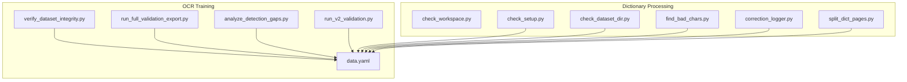
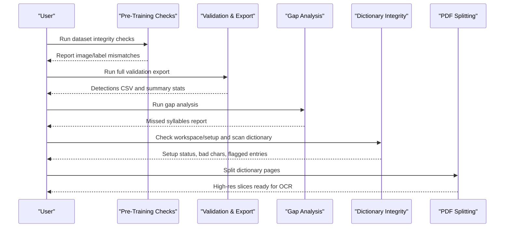
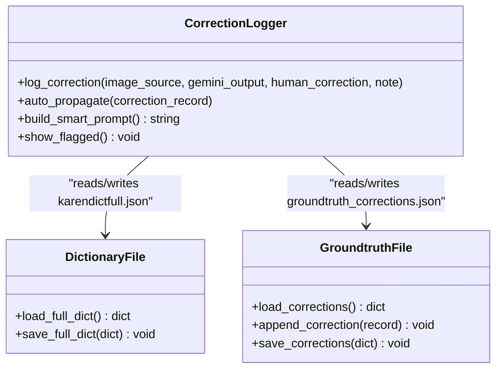
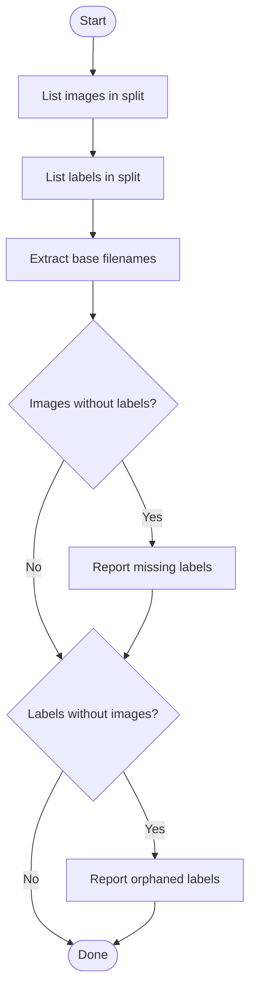
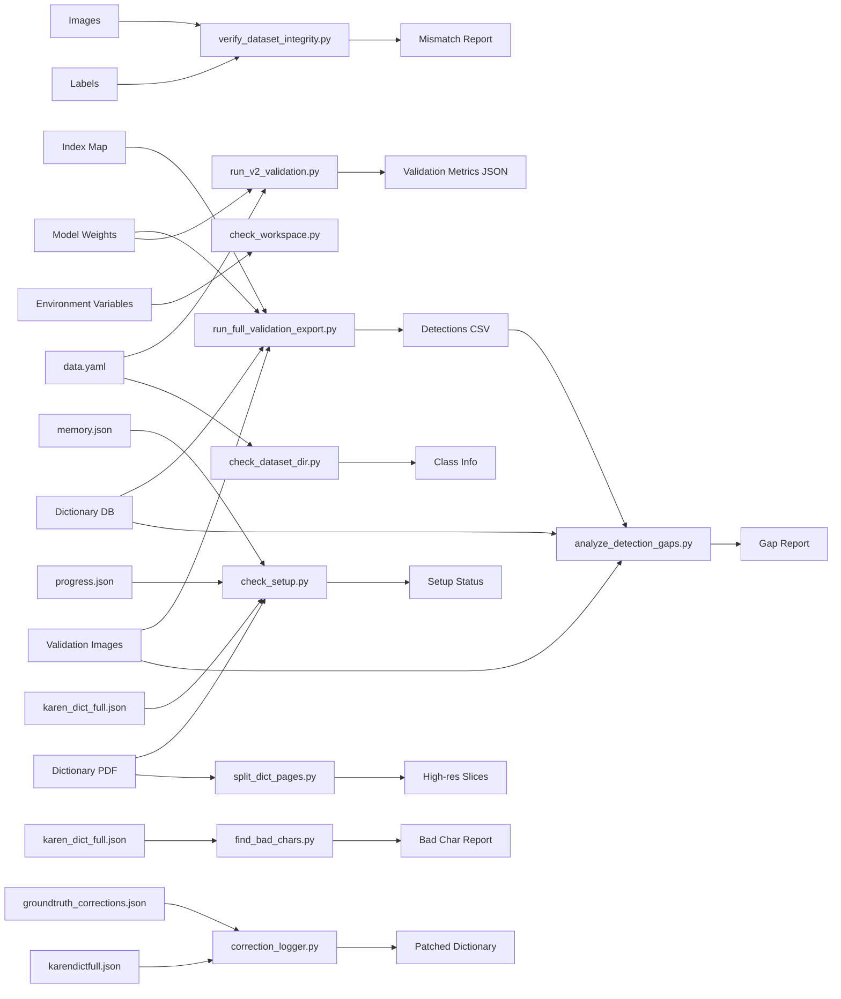

# Data Integrity Verification

<cite>
**Referenced Files in This Document**
- [009_verify_dataset_integrity.py](file://pipeline/ocr_training/009_verify_dataset_integrity.py)
- [016_run_full_validation_export.py](file://pipeline/ocr_training/016_run_full_validation_export.py)
- [017_analyze_detection_gaps.py](file://pipeline/ocr_training/017_analyze_detection_gaps.py)
- [027_run_v2_validation.py](file://pipeline/ocr_training/027_run_v2_validation.py)
- [check_workspace.py](file://pipeline/dictionary_processing/check_workspace.py)
- [check_setup.py](file://pipeline/dictionary_processing/check_setup.py)
- [check_dataset_dir.py](file://pipeline/dictionary_processing/check_dataset_dir.py)
- [find_bad_chars.py](file://pipeline/dictionary_processing/find_bad_chars.py)
- [correction_logger.py](file://pipeline/dictionary_processing/correction_logger.py)
- [split_dict_pages.py](file://pipeline/dictionary_processing/split_dict_pages.py)
- [data.yaml](file://data.yaml)
- [README.md](file://README.md)
- [FILE_AUDIT.md](file://docs/FILE_AUDIT.md)
</cite>

## Table of Contents
1. [Introduction](#introduction)
2. [Project Structure](#project-structure)
3. [Core Components](#core-components)
4. [Architecture Overview](#architecture-overview)
5. [Detailed Component Analysis](#detailed-component-analysis)
6. [Dependency Analysis](#dependency-analysis)
7. [Performance Considerations](#performance-considerations)
8. [Troubleshooting Guide](#troubleshooting-guide)
9. [Conclusion](#conclusion)
10. [Appendices](#appendices)

## Introduction
This document explains how to verify data integrity across the OCR and dictionary pipeline. It covers:
- Validating dataset consistency (image-label pairing, directory structure, class configuration)
- Detecting corruption or missing artifacts during OCR processing and dictionary management
- Running verification scripts and interpreting their reports
- Resolving common data quality issues
- Best practices for maintaining dataset consistency, backups, and recovery procedures

The goal is to ensure that training and validation datasets are consistent, model evaluation outputs are reliable, and dictionary assets remain correct and auditable.

## Project Structure
The repository organizes integrity-related checks into two main areas:
- OCR training pipeline: pre-training dataset checks, full validation export, gap analysis, and model validation metrics
- Dictionary processing pipeline: workspace setup checks, PDF and JSON integrity, character scanning, and correction logging

**Diagram sources**
- [009_verify_dataset_integrity.py:1-77](file://pipeline/ocr_training/009_verify_dataset_integrity.py#L1-L77)
- [016_run_full_validation_export.py:1-206](file://pipeline/ocr_training/016_run_full_validation_export.py#L1-L206)
- [017_analyze_detection_gaps.py:1-269](file://pipeline/ocr_training/017_analyze_detection_gaps.py#L1-L269)
- [027_run_v2_validation.py:1-29](file://pipeline/ocr_training/027_run_v2_validation.py#L1-L29)
- [check_workspace.py:1-16](file://pipeline/dictionary_processing/check_workspace.py#L1-L16)
- [check_setup.py:1-62](file://pipeline/dictionary_processing/check_setup.py#L1-L62)
- [check_dataset_dir.py:1-10](file://pipeline/dictionary_processing/check_dataset_dir.py#L1-L10)
- [find_bad_chars.py:1-23](file://pipeline/dictionary_processing/find_bad_chars.py#L1-L23)
- [correction_logger.py:1-181](file://pipeline/dictionary_processing/correction_logger.py#L1-L181)
- [split_dict_pages.py:1-37](file://pipeline/dictionary_processing/split_dict_pages.py#L1-L37)
- [data.yaml:1-800](file://data.yaml#L1-L800)

**Section sources**
- [README.md:1-63](file://README.md#L1-L63)
- [FILE_AUDIT.md:1-50](file://docs/FILE_AUDIT.md#L1-L50)

## Core Components
- Dataset integrity checker: ensures every image has a matching label and vice versa for train and valid splits
- Full validation exporter: runs inference on all validation images and logs detections to CSV for auditability
- Gap analyzer: identifies missed syllable classes from detection logs and expected labels
- Model validator: runs YOLO validation and exports per-class metrics to JSON
- Workspace and setup verifier: validates environment variables, PDF presence, JSON structures, and API keys
- Dataset directory inspector: inspects class names and detects non-numeric entries
- Bad character scanner: scans dictionary JSON for illegal characters
- Correction logger: records human corrections and auto-propagates fixes across the dictionary
- Page splitter: prepares high-resolution slices from dictionary PDFs for downstream OCR

These components collectively provide end-to-end integrity verification from raw inputs through model evaluation and dictionary curation.

**Section sources**
- [009_verify_dataset_integrity.py:1-77](file://pipeline/ocr_training/009_verify_dataset_integrity.py#L1-L77)
- [016_run_full_validation_export.py:1-206](file://pipeline/ocr_training/016_run_full_validation_export.py#L1-L206)
- [017_analyze_detection_gaps.py:1-269](file://pipeline/ocr_training/017_analyze_detection_gaps.py#L1-L269)
- [027_run_v2_validation.py:1-29](file://pipeline/ocr_training/027_run_v2_validation.py#L1-L29)
- [check_workspace.py:1-16](file://pipeline/dictionary_processing/check_workspace.py#L1-L16)
- [check_setup.py:1-62](file://pipeline/dictionary_processing/check_setup.py#L1-L62)
- [check_dataset_dir.py:1-10](file://pipeline/dictionary_processing/check_dataset_dir.py#L1-L10)
- [find_bad_chars.py:1-23](file://pipeline/dictionary_processing/find_bad_chars.py#L1-L23)
- [correction_logger.py:1-181](file://pipeline/dictionary_processing/correction_logger.py#L1-L181)
- [split_dict_pages.py:1-37](file://pipeline/dictionary_processing/split_dict_pages.py#L1-L37)

## Architecture Overview
The integrity workflow spans multiple stages:
- Pre-training: validate image-label pairing and dataset configuration
- Inference and evaluation: run full validation, export detections, compute metrics
- Post-evaluation: analyze gaps and identify underperforming classes
- Dictionary processing: verify workspace, check PDF and JSON integrity, scan for bad characters, log and propagate corrections
- Input preparation: split dictionary PDFs into high-quality images for OCR

**Diagram sources**
- [009_verify_dataset_integrity.py:1-77](file://pipeline/ocr_training/009_verify_dataset_integrity.py#L1-L77)
- [016_run_full_validation_export.py:1-206](file://pipeline/ocr_training/016_run_full_validation_export.py#L1-L206)
- [017_analyze_detection_gaps.py:1-269](file://pipeline/ocr_training/017_analyze_detection_gaps.py#L1-L269)
- [check_workspace.py:1-16](file://pipeline/dictionary_processing/check_workspace.py#L1-L16)
- [check_setup.py:1-62](file://pipeline/dictionary_processing/check_setup.py#L1-L62)
- [find_bad_chars.py:1-23](file://pipeline/dictionary_processing/find_bad_chars.py#L1-L23)
- [split_dict_pages.py:1-37](file://pipeline/dictionary_processing/split_dict_pages.py#L1-L37)

## Detailed Component Analysis

### Dataset Integrity Checker
Purpose:
- Ensures every image in train/valid has a corresponding label file and vice versa
- Prevents silent skipping of unpaired files during training

Key behaviors:
- Scans image directories for supported formats and extracts base filenames
- Scans label directories for .txt files and extracts base filenames
- Computes set differences to find images without labels and orphaned labels
- Prints counts and lists up to five examples for each mismatch category

Common issues detected:
- Missing labels for images
- Orphaned label files without images

Resolution steps:
- Add missing labels or remove unmatched images
- Remove orphaned labels or restore missing images

**Section sources**
- [009_verify_dataset_integrity.py:15-63](file://pipeline/ocr_training/009_verify_dataset_integrity.py#L15-L63)

### Full Validation Exporter
Purpose:
- Runs inference on all validation images and exports every detection to a CSV
- Provides a permanent performance snapshot for review and auditing

Key behaviors:
- Loads trained model weights and index mapping
- Iterates over sorted validation images and runs inference with a confidence threshold
- Writes per-detection rows including image name, class index, Roboflow label, syllable, English meaning placeholder, confidence, and normalized bounding box coordinates
- Tracks summary statistics and appends a timestamped entry to a server terminal log

Outputs:
- Detections CSV with columns for image, class index, Roboflow label, syllable, English meaning, confidence, and bounding box coordinates
- Server terminal log appended with run metadata and results

Interpretation tips:
- Use the CSV to filter by syllable or confidence to assess detection quality
- Low detection rates indicate potential need for more training data or retraining

**Section sources**
- [016_run_full_validation_export.py:32-165](file://pipeline/ocr_training/016_run_full_validation_export.py#L32-L165)
- [016_run_full_validation_export.py:167-206](file://pipeline/ocr_training/016_run_full_validation_export.py#L167-L206)

### Detection Gap Analyzer
Purpose:
- Identifies syllable classes never detected in the validation set
- Produces a ranked gap report and a missed syllables list for targeted retraining

Key behaviors:
- Reads detections CSV to count detected classes and images with detections
- Reconstructs expected syllable names from validation image filenames
- Compares expected vs detected sets to find missed syllables
- Breaks down missed syllables into bases, medials, vowels, and tones
- Writes a text report and a JSON list of missed syllables
- Appends a timestamped entry to the server terminal log

Outputs:
- Gap report text file with top missed components and full list
- Missed syllables JSON for subsequent retraining steps

Interpretation tips:
- Focus retraining efforts on frequently missed bases, medials, vowels, or tones
- Use the missed list to generate additional synthetic data for those classes

**Section sources**
- [017_analyze_detection_gaps.py:28-120](file://pipeline/ocr_training/017_analyze_detection_gaps.py#L28-L120)
- [017_analyze_detection_gaps.py:151-232](file://pipeline/ocr_training/017_analyze_detection_gaps.py#L151-L232)
- [017_analyze_detection_gaps.py:234-269](file://pipeline/ocr_training/017_analyze_detection_gaps.py#L234-L269)

### Model Validator (v2)
Purpose:
- Runs YOLO validation with specified parameters and exports per-class metrics
- Saves overall and per-class precision, recall, mAP50, and mAP5095

Key behaviors:
- Loads model weights and dataset YAML configuration
- Executes validation with low confidence threshold and IoU settings
- Extracts per-class metrics and writes a JSON output with summary and per-class details

Outputs:
- JSON file containing model path, summary metrics, and per-class metrics

Interpretation tips:
- Compare overall mAP50 and mAP5095 across versions to track improvements
- Inspect per-class metrics to identify weak classes needing more data or tuning

**Section sources**
- [027_run_v2_validation.py:1-29](file://pipeline/ocr_training/027_run_v2_validation.py#L1-L29)

### Workspace and Setup Verifiers
Workspace checker:
- Validates ROBOFLOW_API_KEY environment variable
- Queries Roboflow API and prints workspace info and full response

Setup checker:
- Verifies presence and readability of dictionary PDF
- Validates memory.json structure and last lesson snippet
- Checks progress.json for corrupt integer entries and warns if found
- Counts existing dictionary entries and flags missing definitions
- Confirms GEMINI_API_KEY environment variable presence

Dataset directory inspector:
- Loads data.yaml and prints total classes, first/last class names
- Detects non-numeric class names according to current paradigm

Bad character scanner:
- Scans dictionary JSON for illegal characters in Karen words
- Reports occurrences with page context and record index

Correction logger:
- Logs human corrections with classification of error type
- Auto-propagates fixes across the full dictionary by flagging or correcting similar patterns
- Builds smart prompts using recent corrections to improve future extractions

Page splitter:
- Splits dictionary PDF into high-resolution images
- Uses thresholding and ink density to detect table bounds and remove margins

**Section sources**
- [check_workspace.py:1-16](file://pipeline/dictionary_processing/check_workspace.py#L1-L16)
- [check_setup.py:1-62](file://pipeline/dictionary_processing/check_setup.py#L1-L62)
- [check_dataset_dir.py:1-10](file://pipeline/dictionary_processing/check_dataset_dir.py#L1-L10)
- [find_bad_chars.py:1-23](file://pipeline/dictionary_processing/find_bad_chars.py#L1-L23)
- [correction_logger.py:17-124](file://pipeline/dictionary_processing/correction_logger.py#L17-L124)
- [correction_logger.py:126-181](file://pipeline/dictionary_processing/correction_logger.py#L126-L181)
- [split_dict_pages.py:1-37](file://pipeline/dictionary_processing/split_dict_pages.py#L1-L37)

### Class Diagram: Correction Logger

**Diagram sources**
- [correction_logger.py:17-124](file://pipeline/dictionary_processing/correction_logger.py#L17-L124)
- [correction_logger.py:126-181](file://pipeline/dictionary_processing/correction_logger.py#L126-L181)

### Flowchart: Dataset Integrity Check

**Diagram sources**
- [009_verify_dataset_integrity.py:15-63](file://pipeline/ocr_training/009_verify_dataset_integrity.py#L15-L63)

## Dependency Analysis
Key dependencies and relationships:
- Dataset integrity checker depends on filesystem paths for images and labels
- Full validation exporter depends on model weights, index map, dictionary database, and validation images
- Gap analyzer depends on detections CSV, dictionary database, and validation images
- Model validator depends on model weights and dataset YAML
- Workspace and setup verifiers depend on environment variables and local files
- Correction logger depends on dictionary JSON and groundtruth corrections JSON
- Page splitter depends on PDF input and produces image slices

**Diagram sources**
- [009_verify_dataset_integrity.py:15-77](file://pipeline/ocr_training/009_verify_dataset_integrity.py#L15-L77)
- [016_run_full_validation_export.py:32-165](file://pipeline/ocr_training/016_run_full_validation_export.py#L32-L165)
- [017_analyze_detection_gaps.py:28-232](file://pipeline/ocr_training/017_analyze_detection_gaps.py#L28-L232)
- [027_run_v2_validation.py:1-29](file://pipeline/ocr_training/027_run_v2_validation.py#L1-L29)
- [check_workspace.py:1-16](file://pipeline/dictionary_processing/check_workspace.py#L1-L16)
- [check_setup.py:1-62](file://pipeline/dictionary_processing/check_setup.py#L1-L62)
- [check_dataset_dir.py:1-10](file://pipeline/dictionary_processing/check_dataset_dir.py#L1-L10)
- [find_bad_chars.py:1-23](file://pipeline/dictionary_processing/find_bad_chars.py#L1-L23)
- [correction_logger.py:17-124](file://pipeline/dictionary_processing/correction_logger.py#L17-L124)
- [split_dict_pages.py:1-37](file://pipeline/dictionary_processing/split_dict_pages.py#L1-L37)

**Section sources**
- [data.yaml:1-800](file://data.yaml#L1-L800)

## Performance Considerations
- Full validation export processes all validation images; expect runtime proportional to dataset size
- Using a low confidence threshold in validation can capture more detections but may increase false positives
- Gap analysis reads large CSV files; ensure sufficient memory and disk space
- Dictionary correction propagation scans entire dictionary JSON; consider batching or indexing for very large dictionaries
- PDF splitting uses thresholding and summation operations; adjust zoom and thresholds based on image quality

[No sources needed since this section provides general guidance]

## Troubleshooting Guide
Common issues and resolutions:
- Image-label mismatch:
  - Symptom: Script reports images without labels or orphaned labels
  - Resolution: Add missing labels or remove unmatched files; ensure naming conventions match
- Missing model weights:
  - Symptom: Validation script exits due to missing best.pt
  - Resolution: Ensure model path exists and weights are present before running validation
- Corrupt progress.json:
  - Symptom: Setup checker warns about corrupt integer entries
  - Resolution: Delete progress.json and restart processing to rebuild cleanly
- Illegal characters in dictionary:
  - Symptom: Scanner finds banned characters in Karen words
  - Resolution: Clean affected entries and re-run extraction or correction workflows
- Non-numeric class names:
  - Symptom: Dataset directory inspector reports non-numeric class names
  - Resolution: Update class naming convention to numeric IDs as required by current paradigm
- Environment variables not set:
  - Symptom: Workspace checker requires ROBOFLOW_API_KEY; setup checker requires GEMINI_API_KEY
  - Resolution: Set environment variables before running respective scripts

Recovery procedures:
- Backup critical files before running destructive operations (e.g., deleting progress.json)
- Maintain versioned copies of dictionary JSON and detection logs
- Use correction logger to log and propagate fixes; review flagged entries before finalizing changes
- Keep server terminal logs to trace runs and reproduce issues

**Section sources**
- [009_verify_dataset_integrity.py:48-63](file://pipeline/ocr_training/009_verify_dataset_integrity.py#L48-L63)
- [027_run_v2_validation.py:8-10](file://pipeline/ocr_training/027_run_v2_validation.py#L8-L10)
- [check_setup.py:31-43](file://pipeline/dictionary_processing/check_setup.py#L31-L43)
- [find_bad_chars.py:7-22](file://pipeline/dictionary_processing/find_bad_chars.py#L7-L22)
- [check_dataset_dir.py:1-10](file://pipeline/dictionary_processing/check_dataset_dir.py#L1-L10)
- [check_workspace.py:6-15](file://pipeline/dictionary_processing/check_workspace.py#L6-L15)

## Conclusion
The repository provides a comprehensive suite of data integrity verification tools spanning OCR dataset validation, model evaluation, gap analysis, and dictionary curation. By systematically running these scripts, interpreting their outputs, and applying corrective actions, you can maintain high data quality and ensure reliable training and inference outcomes. Adopting backup strategies, version control for critical artifacts, and continuous monitoring via logs will further strengthen data integrity across the pipeline.

[No sources needed since this section summarizes without analyzing specific files]

## Appendices

### Example Workflows
- Pre-training integrity check:
  - Run dataset integrity checker to confirm image-label pairing
  - Inspect dataset directory to verify class configuration
- Full validation and gap analysis:
  - Run full validation exporter to produce detections CSV
  - Run gap analyzer to identify missed syllables and generate reports
- Dictionary integrity:
  - Run workspace and setup checkers to validate environment and files
  - Scan dictionary for bad characters and log corrections
  - Split dictionary PDFs into high-resolution images for OCR

[No sources needed since this section provides conceptual guidance]