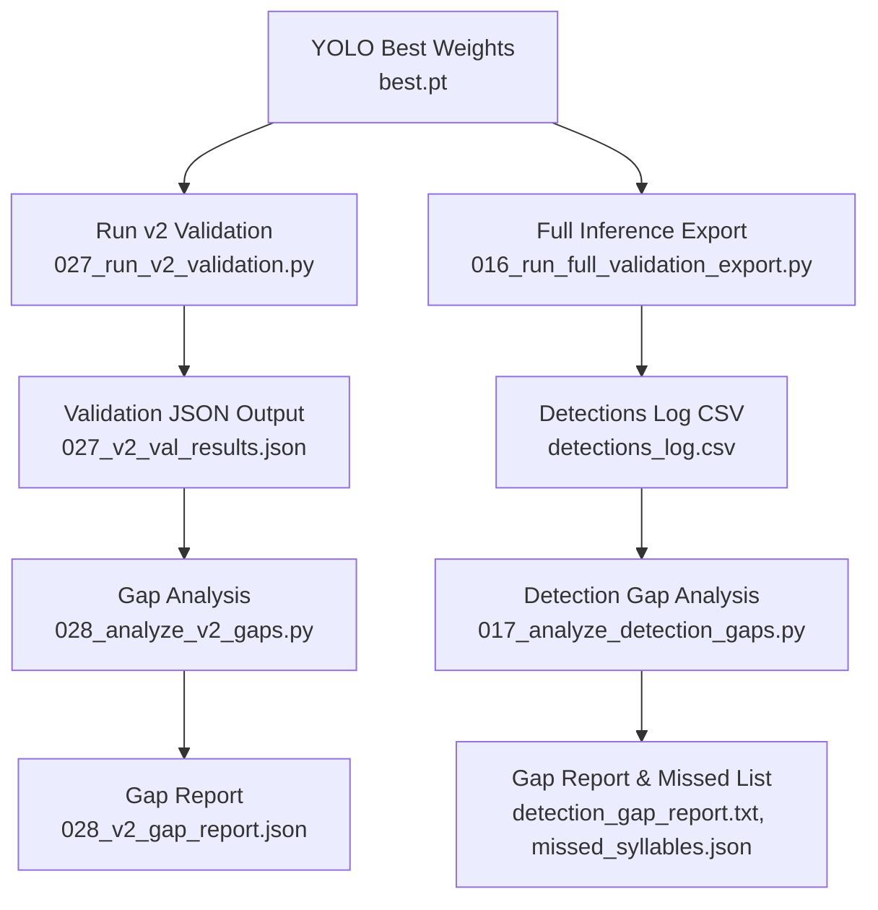
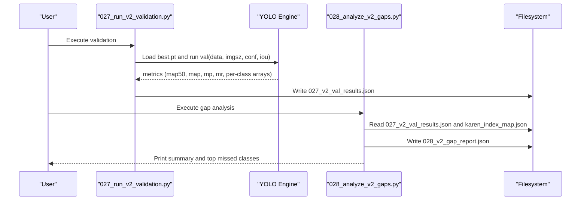
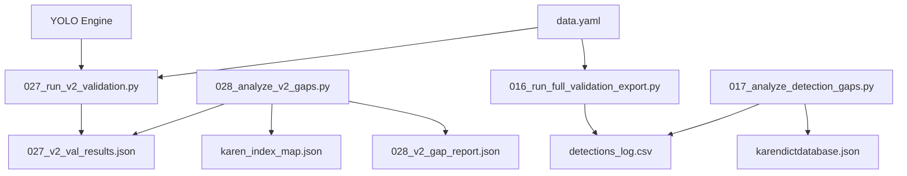

# Model Validation and Performance Metrics

<cite>
**Referenced Files in This Document**
- [027_run_v2_validation.py](file://pipeline/ocr_training/027_run_v2_validation.py)
- [028_analyze_v2_gaps.py](file://pipeline/ocr_training/028_analyze_v2_gaps.py)
- [016_run_full_validation_export.py](file://pipeline/ocr_training/016_run_full_validation_export.py)
- [017_analyze_detection_gaps.py](file://pipeline/ocr_training/017_analyze_detection_gaps.py)
- [data.yaml](file://data.yaml)
- [karen_index_map.json](file://karen_index_map.json)
- [Metric-v1-v2-Change.csv](file://assets/proof/training/Metric-v1-v2-Change.csv)
- [v1_results.csv](file://assets/proof/training/v1_results.csv)
- [results.csv (v2)](file://langtrans/karen_ocr_v2_boosted/results.csv)
- [028_v2_gap_report.json](file://pipeline/ocr_training/028_v2_gap_report.json)
</cite>

## Table of Contents
1. Introduction
2. Project Structure
3. Core Components
4. Architecture Overview
5. Detailed Component Analysis
6. Dependency Analysis
7. Performance Considerations
8. Troubleshooting Guide
9. Conclusion
10. Appendices

## Introduction
This document explains the OCR model validation pipeline for the Karen language detection model, focusing on how to run the v2 validation script, interpret performance metrics (mAP50, mAP50-95, precision, recall), perform per-class analysis, and execute a gap analysis workflow to identify underperforming classes and guide retraining. It also provides guidance on reading JSON output files, comparing results across model versions, interpreting confusion matrices, tracking metric changes between training iterations, and making retraining decisions based on validation outcomes.

## Project Structure
The validation pipeline is implemented as a sequence of scripts that:
- Run YOLO validation on the best model checkpoint and export structured metrics to JSON.
- Analyze per-class performance and produce a gap report identifying missed and weak classes.
- Optionally run full inference over all validation images and log detections to CSV for deeper inspection.
- Analyze detection gaps by comparing expected syllables from filenames with detected labels.

**Diagram sources**
- [027_run_v2_validation.py:1-29](file://pipeline/ocr_training/027_run_v2_validation.py#L1-L29)
- [028_analyze_v2_gaps.py:1-49](file://pipeline/ocr_training/028_analyze_v2_gaps.py#L1-L49)
- [016_run_full_validation_export.py:1-206](file://pipeline/ocr_training/016_run_full_validation_export.py#L1-L206)
- [017_analyze_detection_gaps.py:1-269](file://pipeline/ocr_training/017_analyze_detection_gaps.py#L1-L269)

**Section sources**
- [027_run_v2_validation.py:1-29](file://pipeline/ocr_training/027_run_v2_validation.py#L1-L29)
- [028_analyze_v2_gaps.py:1-49](file://pipeline/ocr_training/028_analyze_v2_gaps.py#L1-L49)
- [016_run_full_validation_export.py:1-206](file://pipeline/ocr_training/016_run_full_validation_export.py#L1-L206)
- [017_analyze_detection_gaps.py:1-269](file://pipeline/ocr_training/017_analyze_detection_gaps.py#L1-L269)

## Core Components
- v2 Validation Runner: Loads the best model, runs validation with specified image size, confidence, and IoU thresholds, and exports overall and per-class metrics to JSON.
- Gap Analyzer: Reads validation results and index mapping to classify classes as “missed” or “weak,” producing a prioritized list for targeted retraining.
- Full Validation Exporter: Runs inference across all validation images and logs every detection to CSV for detailed review.
- Detection Gap Analyzer: Compares expected syllables derived from filenames against detected labels to find classes never detected.

Key outputs:
- Validation JSON containing summary and per-class metrics.
- Gap report JSON listing missed and weak classes with their metrics.
- Detections CSV for granular inspection.
- Text and JSON gap reports for retraining planning.

**Section sources**
- [027_run_v2_validation.py:1-29](file://pipeline/ocr_training/027_run_v2_validation.py#L1-L29)
- [028_analyze_v2_gaps.py:1-49](file://pipeline/ocr_training/028_analyze_v2_gaps.py#L1-L49)
- [016_run_full_validation_export.py:1-206](file://pipeline/ocr_training/016_run_full_validation_export.py#L1-L206)
- [017_analyze_detection_gaps.py:1-269](file://pipeline/ocr_training/017_analyze_detection_gaps.py#L1-L269)

## Architecture Overview
The pipeline orchestrates model evaluation and diagnostic reporting through modular scripts. The v2 validation script computes standard object detection metrics and writes them into a structured JSON file. The gap analyzer then interprets these metrics using an index map to human-readable syllable names, categorizing classes by performance thresholds.

**Diagram sources**
- [027_run_v2_validation.py:1-29](file://pipeline/ocr_training/027_run_v2_validation.py#L1-L29)
- [028_analyze_v2_gaps.py:1-49](file://pipeline/ocr_training/028_analyze_v2_gaps.py#L1-L49)

## Detailed Component Analysis

### v2 Validation Script
Purpose:
- Validate the best model checkpoint against the dataset configuration.
- Compute overall and per-class metrics including mAP50, mAP50-95, precision, and recall.
- Save results to a JSON file for downstream analysis.

Key behaviors:
- Uses YOLO’s validation API with configurable image size, confidence threshold, and IoU.
- Extracts per-class arrays for precision, recall, mAP50, and mAP50-95.
- Writes a consolidated JSON with summary and per-class entries.

Interpreting outputs:
- Summary fields include overall mAP50, overall mAP50-95, overall precision, overall recall, and number of classes.
- Per-class entries provide class index, syllable name (via index map), and per-class metrics.

Example command:
- Run the v2 validation script to generate the JSON output file.

Output file:
- Validation JSON contains structured metrics suitable for automated comparison and visualization.

**Section sources**
- [027_run_v2_validation.py:1-29](file://pipeline/ocr_training/027_run_v2_validation.py#L1-L29)

### Gap Analysis Script
Purpose:
- Classify classes as “missed” or “weak” based on thresholds applied to per-class mAP50.
- Produce a gap report with counts and lists of problematic classes.

Thresholds:
- Missed: mAP50 below a defined threshold.
- Weak: mAP50 between the missed threshold and a higher cutoff.

Outputs:
- Gap report JSON includes overall mAP50, total classes, counts of missed and weak classes, and detailed lists with metrics.

Example command:
- Run the gap analysis script after generating the validation JSON.

Interpretation:
- Use the missed and weak lists to prioritize synthetic data generation or targeted retraining.
- Compare counts across versions to assess improvement.

**Section sources**
- [028_analyze_v2_gaps.py:1-49](file://pipeline/ocr_training/028_analyze_v2_gaps.py#L1-L49)
- [028_v2_gap_report.json:1-529](file://pipeline/ocr_training/028_v2_gap_report.json#L1-L529)

### Full Validation Export
Purpose:
- Run inference on all validation images and log every detection to CSV.
- Provide a comprehensive snapshot of what the model detects across the entire validation set.

Behavior:
- Iterates over all validation images, runs inference with a confidence threshold, and writes each detection row with image name, class index, label, syllable, English meaning placeholder, confidence, and normalized bounding box coordinates.
- Tracks counters for images with detections and total detections logged.

Outputs:
- CSV file with per-detection rows for manual inspection and filtering.

Example command:
- Run the full validation export script to generate the detections CSV.

Use cases:
- Identify specific images where certain syllables are missed.
- Cross-reference with filename-derived expected syllables to compute coverage.

**Section sources**
- [016_run_full_validation_export.py:1-206](file://pipeline/ocr_training/016_run_full_validation_export.py#L1-L206)

### Detection Gap Analysis
Purpose:
- Determine which syllable classes were never detected by comparing expected syllables from filenames with detected labels.
- Generate reports highlighting top missed components (bases, medials, vowels, tones).

Behavior:
- Builds a set of expected syllables from validation image filenames.
- Reads detections CSV to build a set of detected syllables via dictionary lookup.
- Computes missed syllables and analyzes patterns in missed bases, medials, vowels, and tones.

Outputs:
- Text gap report summarizing counts and top missed categories.
- JSON list of missed syllables for targeted augmentation.

Example command:
- Run the detection gap analysis script after exporting detections.

**Section sources**
- [017_analyze_detection_gaps.py:1-269](file://pipeline/ocr_training/017_analyze_detection_gaps.py#L1-L269)

## Dependency Analysis
The pipeline depends on:
- YOLO engine for model loading and validation/inference.
- Dataset configuration YAML defining paths and class names.
- Index mapping JSON bridging class indices to human-readable labels.
- Filesystem for reading/writing JSON and CSV artifacts.

**Diagram sources**
- [027_run_v2_validation.py:1-29](file://pipeline/ocr_training/027_run_v2_validation.py#L1-L29)
- [028_analyze_v2_gaps.py:1-49](file://pipeline/ocr_training/028_analyze_v2_gaps.py#L1-L49)
- [016_run_full_validation_export.py:1-206](file://pipeline/ocr_training/016_run_full_validation_export.py#L1-L206)
- [017_analyze_detection_gaps.py:1-269](file://pipeline/ocr_training/017_analyze_detection_gaps.py#L1-L269)
- [data.yaml:1-800](file://data.yaml#L1-L800)
- [karen_index_map.json](file://karen_index_map.json)

**Section sources**
- [data.yaml:1-800](file://data.yaml#L1-L800)
- [karen_index_map.json](file://karen_index_map.json)

## Performance Considerations
- Image size and thresholds: The v2 validation uses a fixed image size and low confidence threshold to ensure broad detection capture; adjust if needed for production constraints.
- Class imbalance: With thousands of classes, rare combinations may suffer from insufficient examples; use gap reports to target augmentation.
- Metric interpretation:
  - mAP50: Average precision at IoU=0.5; useful for quick checks.
  - mAP50-95: Average precision averaged over multiple IoUs; more robust measure of localization quality.
  - Precision vs Recall: High precision with low recall indicates few false positives but many misses; high recall with low precision indicates many detections but many false positives.
- Training iteration tracking: Use per-epoch CSVs to monitor convergence and detect overfitting or instability.

[No sources needed since this section provides general guidance]

## Troubleshooting Guide
Common issues and resolutions:
- Missing model path: Ensure the best checkpoint exists at the configured path before running validation.
- Missing index map: Gap analysis requires the index mapping file; verify its presence and correctness.
- Empty detections: If no detections are found, check confidence threshold and dataset paths; consider lowering confidence or verifying annotation quality.
- Large datasets: Full validation export can be time-consuming; progress updates are printed periodically.

Error handling highlights:
- Validation script exits early if the model file is not found.
- Gap analysis script exits early if the validation JSON is missing.
- Full export and gap analysis append status to a server log for auditability.

**Section sources**
- [027_run_v2_validation.py:1-29](file://pipeline/ocr_training/027_run_v2_validation.py#L1-L29)
- [028_analyze_v2_gaps.py:1-49](file://pipeline/ocr_training/028_analyze_v2_gaps.py#L1-L49)
- [016_run_full_validation_export.py:1-206](file://pipeline/ocr_training/016_run_full_validation_export.py#L1-L206)
- [017_analyze_detection_gaps.py:1-269](file://pipeline/ocr_training/017_analyze_detection_gaps.py#L1-L269)

## Conclusion
The validation pipeline provides a systematic approach to evaluating OCR detection models, quantifying performance with standard metrics, and identifying underperforming classes for targeted improvement. By combining v2 validation, gap analysis, and full detection logging, teams can make informed decisions about retraining, data augmentation, and threshold tuning. Comparing results across versions using provided CSVs and JSON reports enables clear tracking of progress and identification of remaining challenges.

[No sources needed since this section summarizes without analyzing specific files]

## Appendices

### Running Validation Commands
- Run v2 validation:
  - Execute the v2 validation script to generate the JSON output.
- Run gap analysis:
  - Execute the gap analysis script after generating the validation JSON.
- Run full validation export:
  - Execute the full validation export script to generate the detections CSV.
- Run detection gap analysis:
  - Execute the detection gap analysis script after exporting detections.

[No sources needed since this section provides procedural guidance]

### Interpreting JSON Output Files
- Validation JSON:
  - Contains summary metrics and per-class entries with class index, syllable name, precision, recall, mAP50, and mAP50-95.
- Gap report JSON:
  - Lists missed and weak classes with their metrics and counts for prioritization.

Example references:
- See the v2 gap report for concrete examples of missed and weak classes.

**Section sources**
- [028_v2_gap_report.json:1-529](file://pipeline/ocr_training/028_v2_gap_report.json#L1-L529)

### Comparing Results Across Versions
- Use version comparison CSV to track overall improvements in mAP50 and missed syllable counts.
- Compare per-epoch training/validation metrics across versions to understand learning dynamics.

**Section sources**
- [Metric-v1-v2-Change.csv:1-5](file://assets/proof/training/Metric-v1-v2-Change.csv#L1-L5)
- [v1_results.csv:1-102](file://assets/proof/training/v1_results.csv#L1-L102)
- [results.csv (v2):1-52](file://langtrans/karen_ocr_v2_boosted/results.csv#L1-L52)

### Confusion Matrices and Tracking Changes
- While explicit confusion matrix generation is not present in the referenced scripts, per-class precision and recall can be used to approximate confusion behavior:
  - Low recall with high precision suggests missed positives.
  - High recall with low precision suggests false positives.
- Track changes across training iterations using per-epoch CSVs to observe trends in precision, recall, and mAP.

**Section sources**
- [v1_results.csv:1-102](file://assets/proof/training/v1_results.csv#L1-L102)
- [results.csv (v2):1-52](file://langtrans/karen_ocr_v2_boosted/results.csv#L1-L52)

### Guiding Retraining Decisions
- Prioritize classes listed in the missed and weak lists for additional synthetic data or curated examples.
- Focus on components (bases, medials, vowels, tones) highlighted by detection gap analysis to address systemic weaknesses.
- Re-run validation after augmentation to quantify improvements and iterate.

**Section sources**
- [028_analyze_v2_gaps.py:1-49](file://pipeline/ocr_training/028_analyze_v2_gaps.py#L1-L49)
- [017_analyze_detection_gaps.py:1-269](file://pipeline/ocr_training/017_analyze_detection_gaps.py#L1-L269)