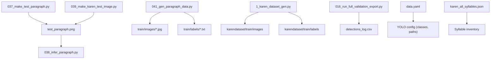
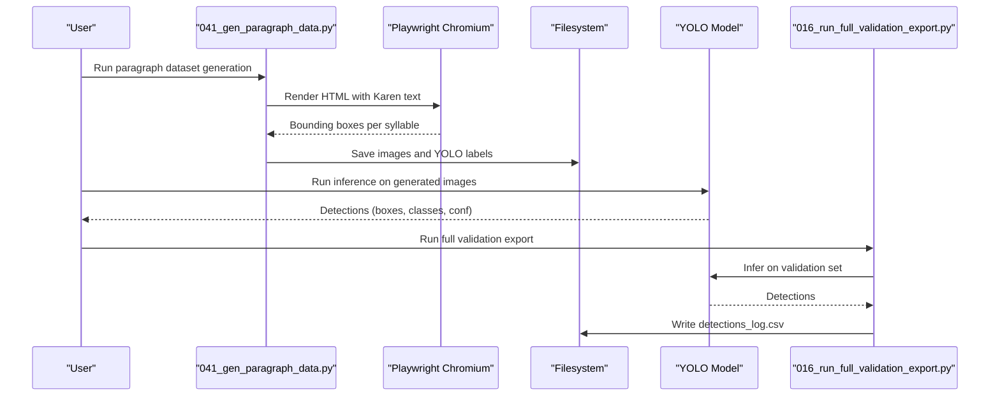

# Test Dataset Generation

<cite>
**Referenced Files in This Document**
- [037_make_test_paragraph.py](file://pipeline/ocr_training/037_make_test_paragraph.py)
- [038_infer_paragraph.py](file://pipeline/ocr_training/038_infer_paragraph.py)
- [039_make_karen_test_image.py](file://pipeline/ocr_training/039_make_karen_test_image.py)
- [041_gen_paragraph_data.py](file://pipeline/ocr_training/041_gen_paragraph_data.py)
- [1_karen_dataset_gen.py](file://pipeline/ocr_training/1_karen_dataset_gen.py)
- [016_run_full_validation_export.py](file://pipeline/ocr_training/016_run_full_validation_export.py)
- [karen_all_syllables.json](file://karen_all_syllables.json)
- [data.yaml](file://data.yaml)
</cite>

## Table of Contents
1. [Introduction](#introduction)
2. [Project Structure](#project-structure)
3. [Core Components](#core-components)
4. [Architecture Overview](#architecture-overview)
5. [Detailed Component Analysis](#detailed-component-analysis)
6. [Dependency Analysis](#dependency-analysis)
7. [Performance Considerations](#performance-considerations)
8. [Troubleshooting Guide](#troubleshooting-guide)
9. [Conclusion](#conclusion)
10. [Appendices](#appendices)

## Introduction
This document explains how to generate synthetic test datasets for OCR validation in the Sgaw Karen language using the provided scripts. It covers:
- Creating synthetic test paragraphs and images
- Generating paragraph-level datasets with bounding boxes
- Running inference on generated images to validate OCR performance
- Integrating generated data into the existing training/validation pipeline
- Best practices for representative test data covering diverse character combinations and formatting scenarios

The goal is to enable reproducible, automated generation of realistic test images and labels that exercise the model across many syllable classes, tones, and layouts.

## Project Structure
The test dataset generation workflow spans several scripts under the OCR training pipeline:
- Quick single-image tests: 037_make_test_paragraph.py, 039_make_karen_test_image.py
- Paragraph-level dataset generation with YOLO labels: 041_gen_paragraph_data.py
- Single-syllable dataset generation with augmentation: 1_karen_dataset_gen.py
- Inference and validation export: 038_infer_paragraph.py, 016_run_full_validation_export.py
- Data configuration and class mapping: data.yaml, karen_all_syllables.json

**Diagram sources**
- [037_make_test_paragraph.py:1-36](file://pipeline/ocr_training/037_make_test_paragraph.py#L1-L36)
- [039_make_karen_test_image.py:1-44](file://pipeline/ocr_training/039_make_karen_test_image.py#L1-L44)
- [041_gen_paragraph_data.py:1-230](file://pipeline/ocr_training/041_gen_paragraph_data.py#L1-L230)
- [1_karen_dataset_gen.py:1-200](file://pipeline/ocr_training/1_karen_dataset_gen.py#L1-L200)
- [038_infer_paragraph.py:1-59](file://pipeline/ocr_training/038_infer_paragraph.py#L1-L59)
- [016_run_full_validation_export.py:1-200](file://pipeline/ocr_training/016_run_full_validation_export.py#L1-L200)
- [data.yaml:1-800](file://data.yaml#L1-L800)

**Section sources**
- [037_make_test_paragraph.py:1-36](file://pipeline/ocr_training/037_make_test_paragraph.py#L1-L36)
- [039_make_karen_test_image.py:1-44](file://pipeline/ocr_training/039_make_karen_test_image.py#L1-L44)
- [041_gen_paragraph_data.py:1-230](file://pipeline/ocr_training/041_gen_paragraph_data.py#L1-L230)
- [1_karen_dataset_gen.py:1-200](file://pipeline/ocr_training/1_karen_dataset_gen.py#L1-L200)
- [038_infer_paragraph.py:1-59](file://pipeline/ocr_training/038_infer_paragraph.py#L1-L59)
- [016_run_full_validation_export.py:1-200](file://pipeline/ocr_training/016_run_full_validation_export.py#L1-L200)
- [data.yaml:1-800](file://data.yaml#L1-L800)

## Core Components
- Synthetic paragraph image generator (Pillow-based): creates a simple paragraph image from random syllables using a font.
- Playwright-based paragraph image generator: renders HTML with Padauk font to produce high-quality screenshots with precise spacing.
- Paragraph dataset generator: builds multi-syllable paragraphs, renders them via Playwright, captures per-syllable bounding boxes, and writes YOLO-format labels.
- Single-syllable dataset generator: generates individual syllable images with augmentations and computes bounding boxes via OpenCV thresholding.
- Inference runner: runs a trained YOLO model on generated images and exports detections.
- Validation exporter: runs inference on all validation images and logs detections to CSV for performance analysis.
- Configuration files: define class names and dataset paths for YOLO training and evaluation.

**Section sources**
- [037_make_test_paragraph.py:1-36](file://pipeline/ocr_training/037_make_test_paragraph.py#L1-L36)
- [039_make_karen_test_image.py:1-44](file://pipeline/ocr_training/039_make_karen_test_image.py#L1-L44)
- [041_gen_paragraph_data.py:1-230](file://pipeline/ocr_training/041_gen_paragraph_data.py#L1-L230)
- [1_karen_dataset_gen.py:1-200](file://pipeline/ocr_training/1_karen_dataset_gen.py#L1-L200)
- [038_infer_paragraph.py:1-59](file://pipeline/ocr_training/038_infer_paragraph.py#L1-L59)
- [016_run_full_validation_export.py:1-200](file://pipeline/ocr_training/016_run_full_validation_export.py#L1-L200)
- [data.yaml:1-800](file://data.yaml#L1-L800)

## Architecture Overview
The end-to-end flow for generating and validating test datasets:

**Diagram sources**
- [041_gen_paragraph_data.py:63-230](file://pipeline/ocr_training/041_gen_paragraph_data.py#L63-L230)
- [038_infer_paragraph.py:1-59](file://pipeline/ocr_training/038_infer_paragraph.py#L1-L59)
- [016_run_full_validation_export.py:1-200](file://pipeline/ocr_training/016_run_full_validation_export.py#L1-L200)

## Detailed Component Analysis

### Quick Test Paragraph Generator (Pillow)
Purpose:
- Generate a quick synthetic paragraph image using Pillow and a fixed font.
- Useful for rapid iteration when you only need a basic visual test.

Key behaviors:
- Loads an index map to obtain syllable strings.
- Randomly composes words and lines within a fixed canvas size.
- Draws text onto an RGB image and saves it.

Configuration highlights:
- Font path and output image path are hardcoded.
- Canvas dimensions and line spacing are fixed.

Best use cases:
- Fast smoke tests for layout or font rendering issues.
- Minimal dependency setup when Playwright is not available.

Limitations:
- Less control over precise glyph shaping and spacing compared to browser rendering.
- Not suitable for generating large-scale labeled datasets.

**Section sources**
- [037_make_test_paragraph.py:1-36](file://pipeline/ocr_training/037_make_test_paragraph.py#L1-L36)

### Quick Test Image Generator (Playwright)
Purpose:
- Create a high-quality test paragraph image by rendering HTML with the Padauk font in a headless browser.
- Ensures accurate Unicode shaping and consistent spacing via CSS.

Key behaviors:
- Builds an HTML page with span-wrapped syllables and CSS styling.
- Launches Chromium via Playwright, sets viewport and device scale factor, waits for content to render, and captures a full-page screenshot.

Configuration highlights:
- Consonants, vowels, and tone markers are defined to compose random syllables.
- Output image path and font path are configurable.

Best use cases:
- Visual validation of OCR pipelines.
- Producing representative samples with correct glyph composition.

Limitations:
- Requires Playwright and Chromium installation.
- Does not generate labels; used primarily for manual inspection or ad-hoc testing.

**Section sources**
- [039_make_karen_test_image.py:1-44](file://pipeline/ocr_training/039_make_karen_test_image.py#L1-L44)

### Paragraph-Level Dataset Generator
Purpose:
- Generate a large dataset of paragraph images with accurate per-syllable bounding boxes in YOLO format.
- Integrates with the project’s path configuration and index maps to ensure consistency with training.

Key behaviors:
- Reads path configuration and index map to locate fonts and syllable classes.
- Constructs HTML with each syllable wrapped in a span carrying a data-class attribute.
- Uses Playwright to render the paragraph and capture screenshots at a fixed canvas size.
- Extracts bounding boxes per syllable via DOM queries and converts them to normalized YOLO coordinates.
- Writes one label file per image with multiple lines (one per syllable).

Configuration highlights:
- NUM_PARAGRAPHS controls dataset size.
- SYLLABLES_PER_LINE_MIN/MAX and LINES_PER_PARA_MIN/MAX control layout variability.
- IMG_W/IMG_H and FONT_SIZE_PX define rendering parameters.
- Optional unicode_map can be used to render real Karen glyphs instead of Latin placeholders.

Integration points:
- Outputs to train/images and train/labels directories aligned with data.yaml.
- Appends to existing syllable datasets for retraining.

Best practices:
- Ensure path_config.json exists and points to the correct index map and font.
- Use a unicode_map if available to render authentic Karen characters.
- Validate that bounding boxes are within canvas bounds and non-zero size.

**Section sources**
- [041_gen_paragraph_data.py:1-230](file://pipeline/ocr_training/041_gen_paragraph_data.py#L1-L230)
- [data.yaml:1-800](file://data.yaml#L1-L800)

### Single-Syllable Dataset Generator
Purpose:
- Generate individual syllable images with augmentations and compute bounding boxes via OpenCV.
- Suitable for building a robust base dataset covering consonant-vowel-tone combinations.

Key behaviors:
- Defines consonants, vowels, tones, medials, and asat sequences to build combinations.
- Renders text via Playwright into a fixed-size canvas and captures screenshots.
- Computes bounding boxes by thresholding grayscale and finding contours.
- Applies augmentations such as rotation, blur, and noise.

Configuration highlights:
- IMAGES_PER_COMBO controls repetitions per combination.
- SPLIT_TRAIN/SPLIT_VALID define dataset splits.
- MAX_CLASSES allows limiting the number of classes for quick tests.

Best practices:
- Use this script to cover rare combinations and edge cases.
- Combine outputs with paragraph-level data for balanced training.

**Section sources**
- [1_karen_dataset_gen.py:1-200](file://pipeline/ocr_training/1_karen_dataset_gen.py#L1-L200)

### Inference Runner for Generated Images
Purpose:
- Run a trained YOLO model on generated test images to evaluate detection quality.
- Sorts detections in reading order and exports results to JSON.

Key behaviors:
- Loads the model weights and index map.
- Runs inference with confidence and IoU thresholds.
- Collects detections with class indices, confidence scores, and bounding boxes.
- Sorts detections by row and column to simulate reading order.
- Saves structured results for review.

Integration points:
- Consumes images produced by 037 or 039.
- Uses the same index map as training to interpret class indices.

Best practices:
- Adjust confidence thresholds based on image quality and font size.
- Inspect sorted output to verify reading order correctness.

**Section sources**
- [038_infer_paragraph.py:1-59](file://pipeline/ocr_training/038_infer_paragraph.py#L1-L59)

### Full Validation Export
Purpose:
- Run inference on the entire validation set and log every detection to a CSV for comprehensive performance analysis.

Key behaviors:
- Loads model, index map, and dictionary.
- Iterates over all validation images and records detections with metadata.
- Writes a CSV with columns for image, class index, label, syllable name, English meaning placeholder, confidence, and normalized box coordinates.
- Appends a summary log entry documenting run statistics.

Integration points:
- Uses the validation directory configured in data.yaml.
- Provides a permanent record for identifying weak classes and guiding data collection.

Best practices:
- Review detections_log.csv to identify low-detection classes.
- Use findings to prioritize additional synthetic data generation for problematic combinations.

**Section sources**
- [016_run_full_validation_export.py:1-200](file://pipeline/ocr_training/016_run_full_validation_export.py#L1-L200)

## Dependency Analysis
Component relationships and dependencies:

```mermaid
graph TB
A["041_gen_paragraph_data.py"] --> B["path_config.json"]
A --> C["karen_index_map.json"]
A --> D["Padauk font"]
A --> E["Playwright Chromium"]
A --> F["train/images & train/labels"]
G["037_make_test_paragraph.py"] --> H["index map"]
G --> I["Padauk font"]
G --> J["test_paragraph.png"]
K["039_make_karen_test_image.py"] --> L["Padauk font"]
K --> M["Playwright Chromium"]
K --> J
N["038_infer_paragraph.py"] --> O["YOLO model weights"]
N --> P["karen_index_map.json"]
N --> J
Q["016_run_full_validation_export.py"] --> R["validation images"]
Q --> O
Q --> S["detections_log.csv"]
T["data.yaml"] --> U["Dataset paths & classes"]
V["karen_all_syllables.json"] --> W["Syllable inventory"]
```

**Diagram sources**
- [041_gen_paragraph_data.py:37-52](file://pipeline/ocr_training/041_gen_paragraph_data.py#L37-L52)
- [037_make_test_paragraph.py:4-9](file://pipeline/ocr_training/037_make_test_paragraph.py#L4-L9)
- [039_make_karen_test_image.py:5-10](file://pipeline/ocr_training/039_make_karen_test_image.py#L5-L10)
- [038_infer_paragraph.py:4-14](file://pipeline/ocr_training/038_infer_paragraph.py#L4-L14)
- [016_run_full_validation_export.py:34-47](file://pipeline/ocr_training/016_run_full_validation_export.py#L34-L47)
- [data.yaml:1-800](file://data.yaml#L1-L800)
- [karen_all_syllables.json:1-800](file://karen_all_syllables.json#L1-L800)

**Section sources**
- [041_gen_paragraph_data.py:37-52](file://pipeline/ocr_training/041_gen_paragraph_data.py#L37-L52)
- [037_make_test_paragraph.py:4-9](file://pipeline/ocr_training/037_make_test_paragraph.py#L4-L9)
- [039_make_karen_test_image.py:5-10](file://pipeline/ocr_training/039_make_karen_test_image.py#L5-L10)
- [038_infer_paragraph.py:4-14](file://pipeline/ocr_training/038_infer_paragraph.py#L4-L14)
- [016_run_full_validation_export.py:34-47](file://pipeline/ocr_training/016_run_full_validation_export.py#L34-L47)
- [data.yaml:1-800](file://data.yaml#L1-L800)
- [karen_all_syllables.json:1-800](file://karen_all_syllables.json#L1-L800)

## Performance Considerations
- Rendering throughput: Playwright-based generation is CPU-bound due to headless browser rendering. Batch sizes should be tuned to avoid memory pressure.
- Label accuracy: Paragraph generator uses DOM bounding boxes for precise per-syllable labels; ensure spans are correctly isolated and rendered within canvas bounds.
- Augmentation impact: Single-syllable generator applies rotation, blur, and noise to improve robustness; consider similar augmentations for paragraph-level data if needed.
- Inference thresholds: Confidence and IoU thresholds affect detection counts; tune based on image quality and desired precision/recall trade-offs.
- Dataset balance: Use karen_all_syllables.json and data.yaml to ensure coverage across consonants, vowels, tones, and medials; prioritize rare combinations identified in validation logs.

[No sources needed since this section provides general guidance]

## Troubleshooting Guide
Common issues and resolutions:
- Missing font path: Ensure path_config.json points to a valid Padauk font file; otherwise, rendering may fall back to default fonts or fail.
- No unicode_map: If unicode_map is absent, paragraph generator will render Latin placeholders; generate or update the map to use real Karen glyphs.
- Playwright not installed: Install Playwright and Chromium before running scripts that rely on browser rendering.
- Empty or invalid bounding boxes: Verify that spans are within the canvas and have non-zero dimensions; adjust font size or canvas dimensions if necessary.
- Model weights not found: Confirm the YOLO model path exists before running inference; update MODEL_PATH accordingly.
- Validation export failures: Ensure the validation directory contains images and matches data.yaml configuration; check permissions and paths.

**Section sources**
- [041_gen_paragraph_data.py:117-130](file://pipeline/ocr_training/041_gen_paragraph_data.py#L117-L130)
- [038_infer_paragraph.py:9-12](file://pipeline/ocr_training/038_infer_paragraph.py#L9-L12)
- [016_run_full_validation_export.py:73-85](file://pipeline/ocr_training/016_run_full_validation_export.py#L73-L85)

## Conclusion
The repository provides a comprehensive toolkit for generating synthetic test datasets tailored to Sgaw Karen OCR validation. By combining quick single-image generators with scalable paragraph-level dataset creation, users can produce representative samples that exercise diverse character combinations and formatting scenarios. Integration with inference and validation export enables continuous performance monitoring and targeted data collection to address weaknesses identified in real-world samples.

[No sources needed since this section summarizes without analyzing specific files]

## Appendices

### Example Workflows

#### Create a Quick Test Paragraph Image
- Run the Pillow-based generator to produce a simple paragraph image for visual checks.
- Use the Playwright-based generator for higher-fidelity rendering with proper glyph shaping.

References:
- [037_make_test_paragraph.py:1-36](file://pipeline/ocr_training/037_make_test_paragraph.py#L1-L36)
- [039_make_karen_test_image.py:1-44](file://pipeline/ocr_training/039_make_karen_test_image.py#L1-L44)

#### Generate a Large Paragraph Dataset with Labels
- Configure path_config.json and ensure index map and font paths are correct.
- Run the paragraph generator to create images and YOLO labels in train/images and train/labels.
- Optionally include a unicode_map to render authentic Karen characters.

References:
- [041_gen_paragraph_data.py:37-52](file://pipeline/ocr_training/041_gen_paragraph_data.py#L37-L52)
- [041_gen_paragraph_data.py:63-230](file://pipeline/ocr_training/041_gen_paragraph_data.py#L63-L230)

#### Validate OCR Performance on Generated Images
- Run inference on generated images to inspect detections and reading order.
- Export results to JSON for detailed analysis.

References:
- [038_infer_paragraph.py:1-59](file://pipeline/ocr_training/038_infer_paragraph.py#L1-L59)

#### Run Full Validation Export
- Execute the validation exporter to process all validation images and log detections to CSV.
- Use the CSV to identify underperforming classes and guide further data generation.

References:
- [016_run_full_validation_export.py:1-200](file://pipeline/ocr_training/016_run_full_validation_export.py#L1-L200)

### Best Practices for Representative Test Data
- Cover all consonants, vowels, tones, and medials present in karen_all_syllables.json.
- Include varied line lengths and paragraph structures to challenge layout handling.
- Use appropriate font sizes and canvas dimensions to mimic real-world image conditions.
- Apply augmentations sparingly to maintain readability while improving robustness.
- Regularly review validation logs to target rare or problematic combinations.

**Section sources**
- [karen_all_syllables.json:1-800](file://karen_all_syllables.json#L1-L800)
- [data.yaml:1-800](file://data.yaml#L1-L800)