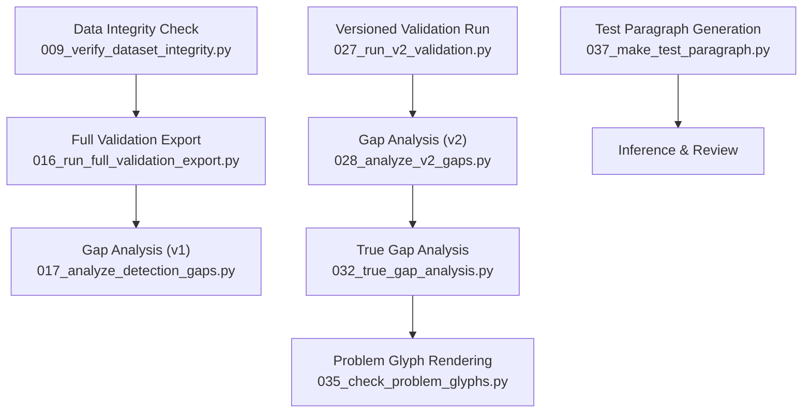
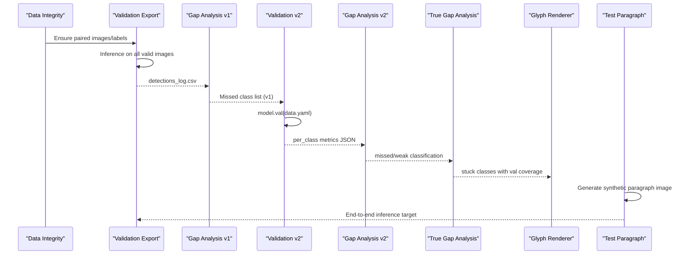
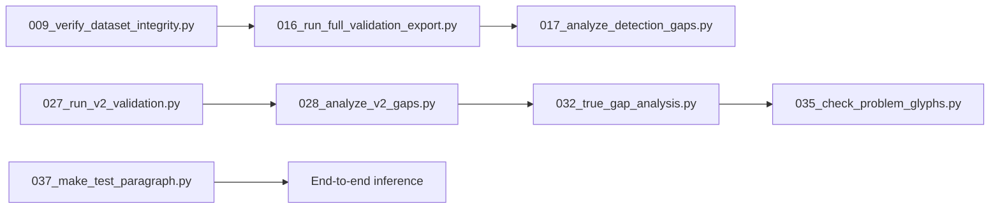

# Testing and Validation

<cite>
**Referenced Files in This Document**
- [016_run_full_validation_export.py](file://pipeline/ocr_training/016_run_full_validation_export.py)
- [017_analyze_detection_gaps.py](file://pipeline/ocr_training/017_analyze_detection_gaps.py)
- [027_run_v2_validation.py](file://pipeline/ocr_training/027_run_v2_validation.py)
- [028_analyze_v2_gaps.py](file://pipeline/ocr_training/028_analyze_v2_gaps.py)
- [032_true_gap_analysis.py](file://pipeline/ocr_training/032_true_gap_analysis.py)
- [009_verify_dataset_integrity.py](file://pipeline/ocr_training/009_verify_dataset_integrity.py)
- [check_dataset_dir.py](file://pipeline/dictionary_processing/check_dataset_dir.py)
- [010_export_detections_to_csv.py](file://pipeline/ocr_training/010_export_detections_to_csv.py)
- [Metric-v1-v2-Change.csv](file://assets/proof/training/Metric-v1-v2-Change.csv)
- [v1_results.csv](file://assets/proof/training/v1_results.csv)
- [detections_log.csv](file://assets/proof/training/detections_log.csv)
- [035_check_problem_glyphs.py](file://pipeline/ocr_training/035_check_problem_glyphs.py)
- [037_make_test_paragraph.py](file://pipeline/ocr_training/037_make_test_paragraph.py)
</cite>

## Table of Contents
1. Introduction
2. Project Structure
3. Core Components
4. Architecture Overview
5. Detailed Component Analysis
6. Dependency Analysis
7. Performance Considerations
8. Troubleshooting Guide
9. Conclusion
10. Appendices

## Introduction
This section documents the testing and validation sub-feature for the Karen OCR pipeline. It explains how the model is evaluated on a held-out validation set, how performance metrics are collected, how confusion and gap analyses are produced, and how test datasets and proof assets support quality assurance. It also covers data integrity checks, debugging techniques for OCR errors, and how validation results drive iterative model improvements.

## Project Structure
The validation workflow spans several scripts that run in sequence:
- Data integrity verification before training or retraining
- Full inference over the validation set with per-detection logging
- Gap analysis to identify underperforming classes
- Versioned validation runs producing structured JSON metrics
- True gap analysis that accounts for actual label coverage
- Utilities to visualize problematic glyphs and generate synthetic test images

**Diagram sources**
- [009_verify_dataset_integrity.py:16-77](file://pipeline/ocr_training/009_verify_dataset_integrity.py#L16-L77)
- [016_run_full_validation_export.py:32-165](file://pipeline/ocr_training/016_run_full_validation_export.py#L32-L165)
- [017_analyze_detection_gaps.py:28-232](file://pipeline/ocr_training/017_analyze_detection_gaps.py#L28-L232)
- [027_run_v2_validation.py:4-29](file://pipeline/ocr_training/027_run_v2_validation.py#L4-L29)
- [028_analyze_v2_gaps.py:3-49](file://pipeline/ocr_training/028_analyze_v2_gaps.py#L3-L49)
- [032_true_gap_analysis.py:9-87](file://pipeline/ocr_training/032_true_gap_analysis.py#L9-L87)
- [035_check_problem_glyphs.py:4-33](file://pipeline/ocr_training/035_check_problem_glyphs.py#L4-L33)
- [037_make_test_paragraph.py:4-36](file://pipeline/ocr_training/037_make_test_paragraph.py#L4-L36)

**Section sources**
- [009_verify_dataset_integrity.py:16-77](file://pipeline/ocr_training/009_verify_dataset_integrity.py#L16-L77)
- [016_run_full_validation_export.py:32-165](file://pipeline/ocr_training/016_run_full_validation_export.py#L32-L165)
- [017_analyze_detection_gaps.py:28-232](file://pipeline/ocr_training/017_analyze_detection_gaps.py#L28-L232)
- [027_run_v2_validation.py:4-29](file://pipeline/ocr_training/027_run_v2_validation.py#L4-L29)
- [028_analyze_v2_gaps.py:3-49](file://pipeline/ocr_training/028_analyze_v2_gaps.py#L3-L49)
- [032_true_gap_analysis.py:9-87](file://pipeline/ocr_training/032_true_gap_analysis.py#L9-L87)
- [035_check_problem_glyphs.py:4-33](file://pipeline/ocr_training/035_check_problem_glyphs.py#L4-L33)
- [037_make_test_paragraph.py:4-36](file://pipeline/ocr_training/037_make_test_paragraph.py#L4-L36)

## Core Components
- Data integrity verification: Ensures image-label pairing across train and valid splits to prevent silent dataset mismatches during training.
- Full validation export: Runs inference on all validation images and writes per-detection logs to CSV for spreadsheet review.
- Gap analysis (v1): Compares expected syllables from filenames against detected labels to produce a ranked missed-class report.
- Versioned validation (v2): Executes YOLO validation with structured outputs and per-class metrics saved to JSON.
- Gap analysis (v2): Classifies classes as missed or weak based on mAP50 thresholds and summarizes counts.
- True gap analysis: Incorporates label coverage to distinguish untestable classes from truly missed ones.
- Problem glyph rendering: Visualizes stuck syllables to aid manual inspection.
- Test paragraph generation: Creates synthetic images for end-to-end OCR tests.

**Section sources**
- [009_verify_dataset_integrity.py:16-77](file://pipeline/ocr_training/009_verify_dataset_integrity.py#L16-L77)
- [016_run_full_validation_export.py:32-165](file://pipeline/ocr_training/016_run_full_validation_export.py#L32-L165)
- [017_analyze_detection_gaps.py:28-232](file://pipeline/ocr_training/017_analyze_detection_gaps.py#L28-L232)
- [027_run_v2_validation.py:4-29](file://pipeline/ocr_training/027_run_v2_validation.py#L4-L29)
- [028_analyze_v2_gaps.py:3-49](file://pipeline/ocr_training/028_analyze_v2_gaps.py#L3-L49)
- [032_true_gap_analysis.py:9-87](file://pipeline/ocr_training/032_true_gap_analysis.py#L9-L87)
- [035_check_problem_glyphs.py:4-33](file://pipeline/ocr_training/035_check_problem_glyphs.py#L4-L33)
- [037_make_test_paragraph.py:4-36](file://pipeline/ocr_training/037_make_test_paragraph.py#L4-L36)

## Architecture Overview
The validation architecture connects data preparation, model evaluation, and reporting into a repeatable loop that drives targeted retraining.

**Diagram sources**
- [009_verify_dataset_integrity.py:16-77](file://pipeline/ocr_training/009_verify_dataset_integrity.py#L16-L77)
- [016_run_full_validation_export.py:32-165](file://pipeline/ocr_training/016_run_full_validation_export.py#L32-L165)
- [017_analyze_detection_gaps.py:28-232](file://pipeline/ocr_training/017_analyze_detection_gaps.py#L28-L232)
- [027_run_v2_validation.py:4-29](file://pipeline/ocr_training/027_run_v2_validation.py#L4-L29)
- [028_analyze_v2_gaps.py:3-49](file://pipeline/ocr_training/028_analyze_v2_gaps.py#L3-L49)
- [032_true_gap_analysis.py:9-87](file://pipeline/ocr_training/032_true_gap_analysis.py#L9-L87)
- [035_check_problem_glyphs.py:4-33](file://pipeline/ocr_training/035_check_problem_glyphs.py#L4-L33)
- [037_make_test_paragraph.py:4-36](file://pipeline/ocr_training/037_make_test_paragraph.py#L4-L36)

## Detailed Component Analysis

### Data Integrity Verification
Purpose:
- Detect missing labels or orphaned annotations before training to avoid silent dataset mismatches.
- Report counts and sample mismatches for quick remediation.

Key behaviors:
- Enumerates image stems and label stems for both train and valid splits.
- Computes set differences to find images without labels and labels without images.
- Prints summary and up to five examples of each mismatch type.

How to run:
- Execute the integrity check script to validate dataset consistency prior to training or retraining.

Interpretation:
- Any reported mismatches should be resolved by adding missing labels or removing orphaned files before proceeding.

**Section sources**
- [009_verify_dataset_integrity.py:16-77](file://pipeline/ocr_training/009_verify_dataset_integrity.py#L16-L77)

### Full Validation Export (v1)
Purpose:
- Run inference across all validation images and log every detection to a CSV for detailed review.

Key behaviors:
- Loads trained weights and lookup maps.
- Iterates through all validation images, runs inference, and writes one row per detection including class index, label, syllable name, confidence, and normalized bounding box coordinates.
- Produces a server terminal log entry summarizing totals.

How to run:
- Execute the full validation export script to generate the detections log CSV.

Interpretation:
- Use the CSV to filter by syllable or confidence and inspect per-image detections. Low-confidence or missing detections indicate areas needing more data or tuning.

**Section sources**
- [016_run_full_validation_export.py:32-165](file://pipeline/ocr_training/016_run_full_validation_export.py#L32-L165)

### Gap Analysis (v1)
Purpose:
- Identify syllable classes never detected in the validation set and categorize missed components (bases, medials, vowels, tones).

Key behaviors:
- Reads detections CSV to build detected class counts.
- Derives expected syllables from validation image filenames.
- Computes missed syllables and aggregates patterns to highlight problem areas.
- Writes a text gap report and a JSON list of missed syllables.

How to run:
- Execute the gap analysis script after generating the detections log CSV.

Interpretation:
- The top missed bases, medials, vowels, and tones guide targeted synthetic data generation and retraining focus.

**Section sources**
- [017_analyze_detection_gaps.py:28-232](file://pipeline/ocr_training/017_analyze_detection_gaps.py#L28-L232)

### Versioned Validation Run (v2)
Purpose:
- Produce standardized per-class metrics using YOLO’s validation interface and save them to JSON for downstream analysis.

Key behaviors:
- Loads model weights and data configuration.
- Runs validation with specified image size, confidence, and IoU settings.
- Extracts per-class precision, recall, mAP50, and mAP50-95, plus overall summaries.
- Saves structured JSON output.

How to run:
- Execute the v2 validation script to obtain metrics JSON for gap analysis.

Interpretation:
- Overall and per-class metrics provide a baseline for improvement tracking across versions.

**Section sources**
- [027_run_v2_validation.py:4-29](file://pipeline/ocr_training/027_run_v2_validation.py#L4-L29)

### Gap Analysis (v2)
Purpose:
- Classify classes as missed or weak based on mAP50 thresholds and summarize counts compared to previous versions.

Key behaviors:
- Reads v2 validation metrics and optional index map for human-readable names.
- Categorizes classes below thresholds into missed or weak lists.
- Sorts and prints top hardest classes; saves full report.

How to run:
- Execute the v2 gap analysis script after running v2 validation.

Interpretation:
- Reduced missed count indicates progress; remaining classes inform next iteration targets.

**Section sources**
- [028_analyze_v2_gaps.py:3-49](file://pipeline/ocr_training/028_analyze_v2_gaps.py#L3-L49)

### True Gap Analysis
Purpose:
- Refine gap identification by accounting for actual label coverage in the validation set, distinguishing untestable classes from truly missed ones.

Key behaviors:
- Counts instances per class from label files to determine which classes have validation coverage.
- Combines coverage with per-class metrics to classify no-val, missed, and weak categories.
- Outputs a comprehensive report with counts and top hardest classes.

How to run:
- Execute the true gap analysis script after obtaining v2 metrics.

Interpretation:
- Classes with no validation images cannot be assessed; focus efforts on truly missed classes with sufficient coverage.

**Section sources**
- [032_true_gap_analysis.py:9-87](file://pipeline/ocr_training/032_true_gap_analysis.py#L9-L87)

### Problem Glyph Rendering
Purpose:
- Visualize stuck syllables to facilitate manual inspection and correction.

Key behaviors:
- Reads index map and true gap report to select classes with high instance counts but low performance.
- Renders syllable text onto images with metadata and saves them to an output directory.

How to run:
- Execute the glyph rendering script to produce visual samples of problematic classes.

Interpretation:
- Visual inspection helps identify font rendering issues, labeling inconsistencies, or ambiguous glyph forms.

**Section sources**
- [035_check_problem_glyphs.py:4-33](file://pipeline/ocr_training/035_check_problem_glyphs.py#L4-L33)

### Test Paragraph Generation
Purpose:
- Create synthetic images composed of random syllables to simulate real-world OCR scenarios.

Key behaviors:
- Loads index map to sample syllables.
- Generates multiple lines of words and renders them into an image.
- Provides a target image for end-to-end inference and review.

How to run:
- Execute the test paragraph generation script to produce a synthetic image for testing.

Interpretation:
- Use this image to evaluate paragraph-level OCR behavior and detect layout or segmentation issues.

**Section sources**
- [037_make_test_paragraph.py:4-36](file://pipeline/ocr_training/037_make_test_paragraph.py#L4-L36)

## Dependency Analysis
The validation pipeline has clear dependencies between scripts and artifacts:

**Diagram sources**
- [009_verify_dataset_integrity.py:16-77](file://pipeline/ocr_training/009_verify_dataset_integrity.py#L16-L77)
- [016_run_full_validation_export.py:32-165](file://pipeline/ocr_training/016_run_full_validation_export.py#L32-L165)
- [017_analyze_detection_gaps.py:28-232](file://pipeline/ocr_training/017_analyze_detection_gaps.py#L28-L232)
- [027_run_v2_validation.py:4-29](file://pipeline/ocr_training/027_run_v2_validation.py#L4-L29)
- [028_analyze_v2_gaps.py:3-49](file://pipeline/ocr_training/028_analyze_v2_gaps.py#L3-L49)
- [032_true_gap_analysis.py:9-87](file://pipeline/ocr_training/032_true_gap_analysis.py#L9-L87)
- [035_check_problem_glyphs.py:4-33](file://pipeline/ocr_training/035_check_problem_glyphs.py#L4-L33)
- [037_make_test_paragraph.py:4-36](file://pipeline/ocr_training/037_make_test_paragraph.py#L4-L36)

**Section sources**
- [009_verify_dataset_integrity.py:16-77](file://pipeline/ocr_training/009_verify_dataset_integrity.py#L16-L77)
- [016_run_full_validation_export.py:32-165](file://pipeline/ocr_training/016_run_full_validation_export.py#L32-L165)
- [017_analyze_detection_gaps.py:28-232](file://pipeline/ocr_training/017_analyze_detection_gaps.py#L28-L232)
- [027_run_v2_validation.py:4-29](file://pipeline/ocr_training/027_run_v2_validation.py#L4-L29)
- [028_analyze_v2_gaps.py:3-49](file://pipeline/ocr_training/028_analyze_v2_gaps.py#L3-L49)
- [032_true_gap_analysis.py:9-87](file://pipeline/ocr_training/032_true_gap_analysis.py#L9-L87)
- [035_check_problem_glyphs.py:4-33](file://pipeline/ocr_training/035_check_problem_glyphs.py#L4-L33)
- [037_make_test_paragraph.py:4-36](file://pipeline/ocr_training/037_make_test_paragraph.py#L4-L36)

## Performance Considerations
- Thresholds: Confidence and IoU settings influence detection counts and metric stability. Adjust carefully when comparing versions.
- Dataset size: Larger validation sets improve metric reliability but increase runtime.
- Label coverage: True gap analysis highlights classes without validation images; these cannot be reliably assessed until coverage improves.
- Synthetic augmentation: Targeted generation for missed classes can accelerate convergence on hard cases.

[No sources needed since this section provides general guidance]

## Troubleshooting Guide
Common issues and debugging steps:
- Missing or extra files:
  - Run the data integrity check to detect image-label mismatches and resolve them before training.
- Low detection rates:
  - Inspect the detections log CSV to identify images with zero detections or low-confidence boxes.
  - Use gap reports to pinpoint syllables or components (medials, vowels, tones) that are underrepresented.
- Unreliable metrics:
  - Verify label coverage via true gap analysis; classes without validation images cannot be trusted for assessment.
- Glyph rendering problems:
  - Render stuck glyphs to visually confirm font or labeling issues and correct them accordingly.
- End-to-end failures:
  - Generate a test paragraph image and run inference to isolate layout or segmentation problems.

**Section sources**
- [009_verify_dataset_integrity.py:16-77](file://pipeline/ocr_training/009_verify_dataset_integrity.py#L16-L77)
- [016_run_full_validation_export.py:32-165](file://pipeline/ocr_training/016_run_full_validation_export.py#L32-L165)
- [017_analyze_detection_gaps.py:28-232](file://pipeline/ocr_training/017_analyze_detection_gaps.py#L28-L232)
- [032_true_gap_analysis.py:9-87](file://pipeline/ocr_training/032_true_gap_analysis.py#L9-L87)
- [035_check_problem_glyphs.py:4-33](file://pipeline/ocr_training/035_check_problem_glyphs.py#L4-L33)
- [037_make_test_paragraph.py:4-36](file://pipeline/ocr_training/037_make_test_paragraph.py#L4-L36)

## Conclusion
The validation pipeline provides a robust, iterative process for improving OCR accuracy:
- Start with data integrity checks to ensure clean inputs.
- Evaluate comprehensively with full validation exports and versioned metrics.
- Analyze gaps at multiple levels to prioritize retraining targets.
- Use synthetic test images and glyph rendering to diagnose and fix specific issues.
- Track progress across versions using structured metrics and proof assets.

[No sources needed since this section summarizes without analyzing specific files]

## Appendices

### How to Run Validation Tests
- Data integrity:
  - Execute the integrity check script to verify image-label pairing.
- Full validation export:
  - Run the full validation export script to generate the detections log CSV.
- Gap analysis:
  - Run the v1 gap analysis script after exporting detections.
  - Run the v2 validation script to produce metrics JSON.
  - Run the v2 gap analysis script to classify missed and weak classes.
  - Run the true gap analysis script to refine missed-class identification.
- Visualization:
  - Render problem glyphs to inspect stuck syllables.
  - Generate a test paragraph image for end-to-end testing.

**Section sources**
- [009_verify_dataset_integrity.py:16-77](file://pipeline/ocr_training/009_verify_dataset_integrity.py#L16-L77)
- [016_run_full_validation_export.py:32-165](file://pipeline/ocr_training/016_run_full_validation_export.py#L32-L165)
- [017_analyze_detection_gaps.py:28-232](file://pipeline/ocr_training/017_analyze_detection_gaps.py#L28-L232)
- [027_run_v2_validation.py:4-29](file://pipeline/ocr_training/027_run_v2_validation.py#L4-L29)
- [028_analyze_v2_gaps.py:3-49](file://pipeline/ocr_training/028_analyze_v2_gaps.py#L3-L49)
- [032_true_gap_analysis.py:9-87](file://pipeline/ocr_training/032_true_gap_analysis.py#L9-L87)
- [035_check_problem_glyphs.py:4-33](file://pipeline/ocr_training/035_check_problem_glyphs.py#L4-L33)
- [037_make_test_paragraph.py:4-36](file://pipeline/ocr_training/037_make_test_paragraph.py#L4-L36)

### Interpreting Performance Metrics
- Overall mAP50 and mAP50-95:
  - Compare across versions to assess global improvements.
- Per-class precision, recall, mAP50:
  - Identify classes with low scores; focus retraining on these.
- Missed vs weak classification:
  - Missed classes fall below a threshold; weak classes are borderline and may benefit from additional data or tuning.
- Coverage-aware assessment:
  - Use true gap analysis to exclude classes without validation images from failure claims.

**Section sources**
- [027_run_v2_validation.py:4-29](file://pipeline/ocr_training/027_run_v2_validation.py#L4-L29)
- [028_analyze_v2_gaps.py:3-49](file://pipeline/ocr_training/028_analyze_v2_gaps.py#L3-L49)
- [032_true_gap_analysis.py:9-87](file://pipeline/ocr_training/032_true_gap_analysis.py#L9-L87)

### Proof Assets
- Training metrics comparison:
  - Cross-version changes summarized in a CSV showing overall mAP50, missed syllables, inference speed, and training image counts.
- Training curves:
  - Epoch-wise metrics including losses, precision, recall, and mAP values for historical runs.
- Detections log:
  - Sample detections with confidence and bounding box coordinates for manual review.

**Section sources**
- [Metric-v1-v2-Change.csv:1-5](file://assets/proof/training/Metric-v1-v2-Change.csv#L1-L5)
- [v1_results.csv:1-102](file://assets/proof/training/v1_results.csv#L1-L102)
- [detections_log.csv:1-200](file://assets/proof/training/detections_log.csv#L1-L200)

### Relationship Between Validation Results and Model Improvement Cycles
- Validate current model → analyze gaps → generate targeted synthetic data → retrain → revalidate.
- Use true gap analysis to ensure efforts focus on classes with sufficient validation coverage.
- Track progress via versioned metrics and proof assets to quantify improvements.

**Section sources**
- [017_analyze_detection_gaps.py:28-232](file://pipeline/ocr_training/017_analyze_detection_gaps.py#L28-L232)
- [027_run_v2_validation.py:4-29](file://pipeline/ocr_training/027_run_v2_validation.py#L4-L29)
- [028_analyze_v2_gaps.py:3-49](file://pipeline/ocr_training/028_analyze_v2_gaps.py#L3-L49)
- [032_true_gap_analysis.py:9-87](file://pipeline/ocr_training/032_true_gap_analysis.py#L9-L87)

### Debugging Techniques for OCR Errors and Dictionary Processing Issues
- Inspect detections log CSV for low-confidence or missing detections per syllable.
- Use gap reports to identify component-level weaknesses (medials, vowels, tones).
- Render problem glyphs to visually confirm labeling or font issues.
- Generate test paragraphs to evaluate layout-sensitive errors.
- Verify dataset directory configuration and class naming conventions to avoid misalignment.

**Section sources**
- [016_run_full_validation_export.py:32-165](file://pipeline/ocr_training/016_run_full_validation_export.py#L32-L165)
- [017_analyze_detection_gaps.py:28-232](file://pipeline/ocr_training/017_analyze_detection_gaps.py#L28-L232)
- [035_check_problem_glyphs.py:4-33](file://pipeline/ocr_training/035_check_problem_glyphs.py#L4-L33)
- [037_make_test_paragraph.py:4-36](file://pipeline/ocr_training/037_make_test_paragraph.py#L4-L36)
- [check_dataset_dir.py:1-10](file://pipeline/dictionary_processing/check_dataset_dir.py#L1-L10)