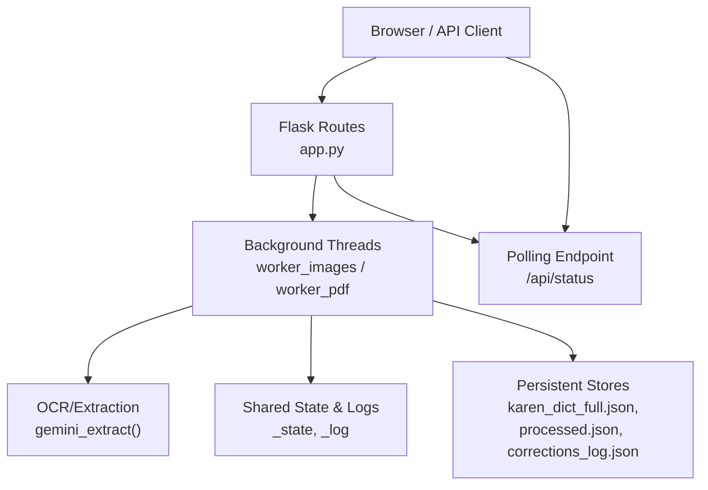
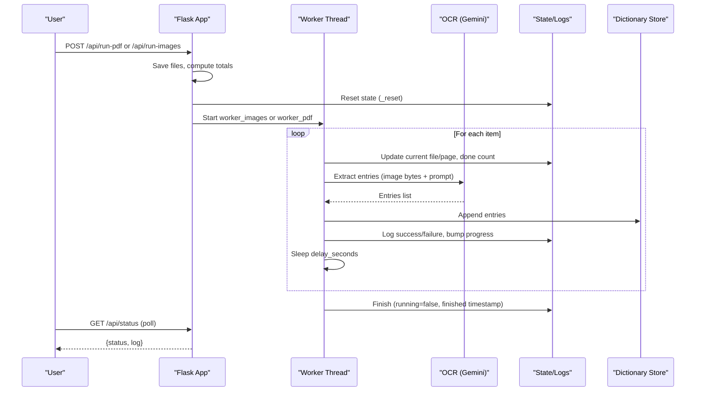
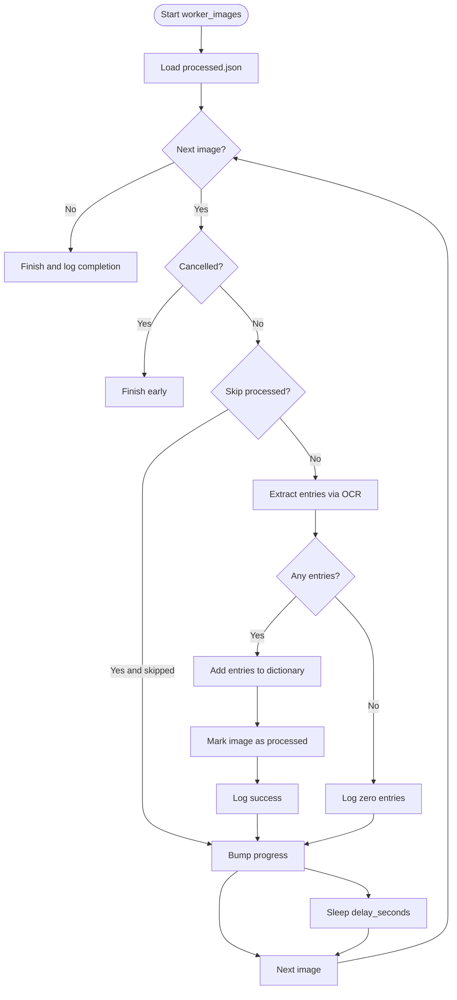
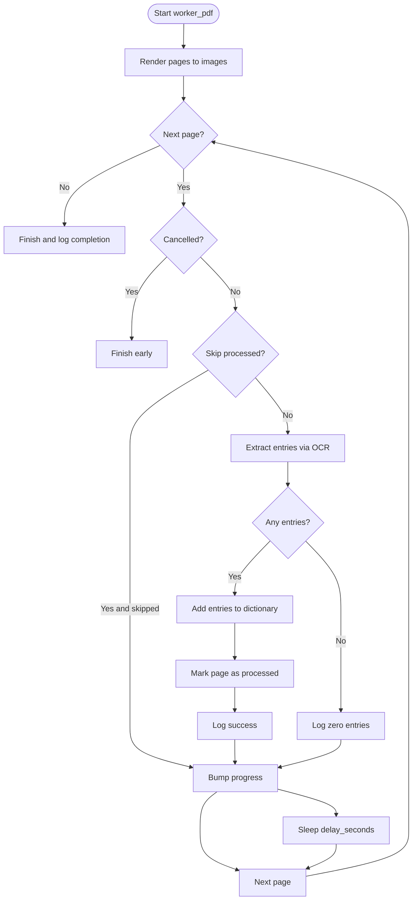
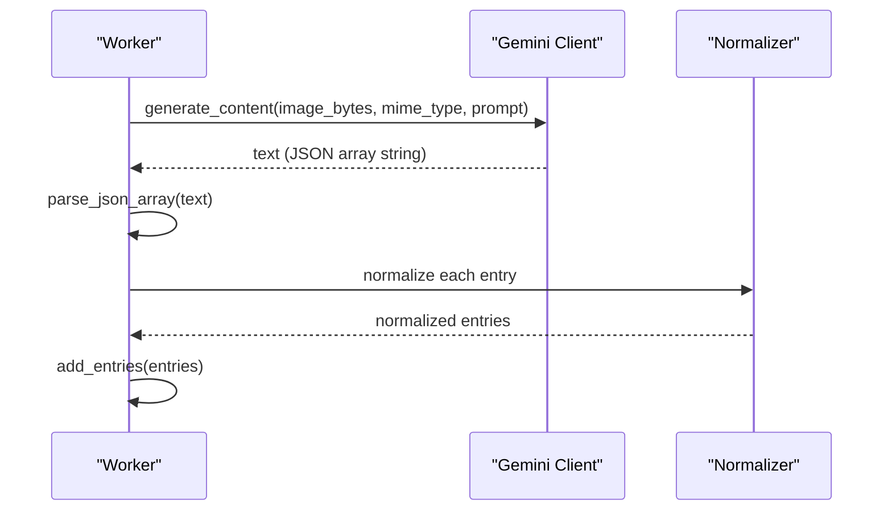
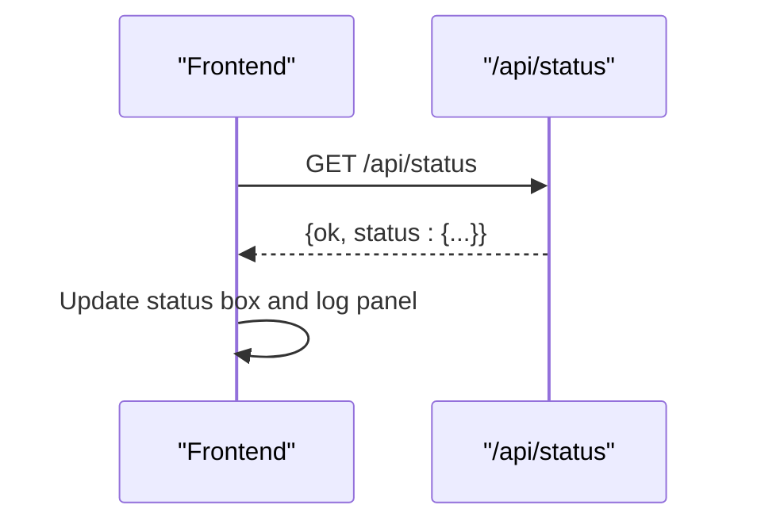
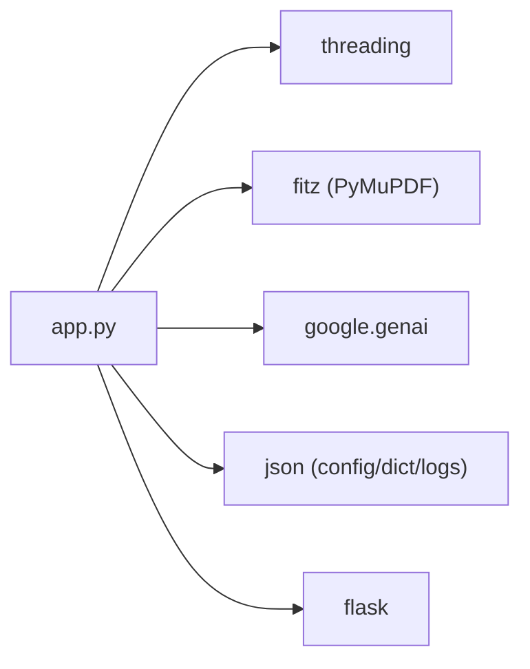

# Batch Processing System

<cite>
**Referenced Files in This Document**
- [app.py](file://app.py)
- [batch_config.json](file://batch_config.json)
</cite>

## Table of Contents
1. [Introduction](#introduction)
2. [Project Structure](#project-structure)
3. [Core Components](#core-components)
4. [Architecture Overview](#architecture-overview)
5. [Detailed Component Analysis](#detailed-component-analysis)
6. [Dependency Analysis](#dependency-analysis)
7. [Performance Considerations](#performance-considerations)
8. [Troubleshooting Guide](#troubleshooting-guide)
9. [Conclusion](#conclusion)
10. [Appendices](#appendices)

## Introduction
This document explains the batch processing sub-feature that powers OCR-driven extraction of dictionary entries from PDFs and images. It covers:
- Background worker threads for non-blocking batch jobs
- Progress tracking and real-time status updates via polling
- Batch configuration options and their effects
- File upload handling for PDFs and images
- Integration with the OCR/LLM pipeline (Gemini-based extraction)
- Error recovery, cancellation, and resumption patterns
- Relationship to OCR and dictionary processing components
- Troubleshooting guidance and best practices

## Project Structure
The batch processing system is implemented within a single Flask application module and a JSON configuration file:
- app.py: Implements routes, background workers, state management, OCR integration, and UI endpoints
- batch_config.json: Holds batch processing defaults and runtime overrides

**Diagram sources**
- [app.py:96-169](file://app.py#L96-L169)
- [app.py:638-729](file://app.py#L638-L729)
- [app.py:1528-1537](file://app.py#L1528-L1537)
- [app.py:1631-1658](file://app.py#L1631-L1658)

**Section sources**
- [app.py:1-120](file://app.py#L1-L120)
- [batch_config.json:1-9](file://batch_config.json#L1-L9)

## Core Components
- Background workers:
  - worker_images: processes uploaded or server-side image files
  - worker_pdf: renders PDF pages and processes each page as an image
- Shared state and logging:
  - Thread-safe state snapshotting, progress counters, timestamps, logs
- Configuration loader:
  - Merges defaults with user-provided values from batch_config.json
- OCR integration:
  - gemini_extract sends images to Gemini with structured prompts and parses JSON arrays into normalized entries
- Persistence:
  - Dictionary entries stored in karen_dict_full.json
  - Processed items tracked in processed.json to support skip_processed
  - Corrections logged in corrections_log.json for auditability

Key responsibilities:
- Launch and manage background threads without blocking requests
- Provide real-time status via /api/status for UI polling
- Enforce rate limiting via delay_seconds between API calls
- Track per-item progress and total counts for UI feedback
- Record errors and continue processing on failures

**Section sources**
- [app.py:96-169](file://app.py#L96-L169)
- [app.py:198-224](file://app.py#L198-L224)
- [app.py:536-614](file://app.py#L536-L614)
- [app.py:638-729](file://app.py#L638-L729)

## Architecture Overview
The batch processing architecture uses a request-driven launch pattern with background threads:
- Client uploads a PDF or images via /api/run-pdf or /api/run-images
- The route saves files, computes totals, resets shared state, and starts a daemon thread running the appropriate worker
- Workers iterate over inputs, optionally skipping already processed items, calling OCR, appending entries, updating progress, and sleeping according to delay_seconds
- The UI polls /api/status to render live progress and logs

**Diagram sources**
- [app.py:1631-1658](file://app.py#L1631-L1658)
- [app.py:723-729](file://app.py#L723-L729)
- [app.py:638-729](file://app.py#L638-L729)
- [app.py:536-614](file://app.py#L536-L614)
- [app.py:1528-1537](file://app.py#L1528-L1537)

## Detailed Component Analysis

### Background Worker: Images
Responsibilities:
- Iterate over image paths
- Skip if skip_processed is enabled and previously processed
- Extract entries via OCR
- Persist new entries and mark as processed
- Update progress and logs; handle exceptions without aborting the entire job

**Diagram sources**
- [app.py:638-676](file://app.py#L638-L676)

**Section sources**
- [app.py:638-676](file://app.py#L638-L676)

### Background Worker: PDF
Responsibilities:
- Render specified page range to images at configured DPI
- For each rendered page, extract entries via OCR
- Respect skip_processed using composite keys per page
- Update progress and logs; handle rendering and extraction errors gracefully

**Diagram sources**
- [app.py:678-720](file://app.py#L678-L720)

**Section sources**
- [app.py:619-633](file://app.py#L619-L633)
- [app.py:678-720](file://app.py#L678-L720)

### OCR Integration and Normalization
- gemini_extract: Sends image bytes and a strict prompt to Gemini, enforces JSON array output, and normalizes entries into a consistent schema
- norm: Ensures required fields exist, sanitizes types, sets timestamps and metadata
- parse_json_array: Robustly extracts JSON arrays from model responses, including fenced code blocks

**Diagram sources**
- [app.py:536-614](file://app.py#L536-L614)

**Section sources**
- [app.py:336-359](file://app.py#L336-L359)
- [app.py:303-333](file://app.py#L303-L333)
- [app.py:536-614](file://app.py#L536-L614)

### Real-Time Status and Polling
- /api/status returns a snapshot of the shared state including running flag, mode, file/page context, done/total counts, entries_added, timestamps, error, and recent logs
- Frontend polls this endpoint to update status and log panels in near real time

**Diagram sources**
- [app.py:1528-1537](file://app.py#L1528-L1537)

**Section sources**
- [app.py:96-169](file://app.py#L96-L169)
- [app.py:1528-1537](file://app.py#L1528-L1537)

### Batch Configuration Options
All options are loaded by merging defaults with batch_config.json values:
- pdf_pages_per_batch: Controls how many pages to process per run when launching PDF batches from the UI
- images_per_batch: Controls how many images to process per run when launching folder/image batches
- delay_seconds: Sleep interval between API calls to avoid rate limits
- page_offset: Numeric offset applied to detected page numbers in filenames or explicit page metadata
- render_dpi: Resolution used when rendering PDF pages to images
- skip_processed: If true, skips items already recorded in processed.json
- auto_import_bootstrap: If true, automatically imports bootstrap files matching known patterns on startup or on demand

Configuration persistence:
- GET /api/config returns current config
- POST /api/config updates and persists merged config

**Section sources**
- [app.py:57-68](file://app.py#L57-L68)
- [app.py:198-210](file://app.py#L198-L210)
- [app.py:1533-1537](file://app.py#L1533-L1537)
- [batch_config.json:1-9](file://batch_config.json#L1-L9)

### File Upload Handling
- PDF upload:
  - Route validates presence of a PDF file
  - Saves to PDF_DIR under a sanitized name
  - Starts worker_pdf with start/end page range and current config
- Image upload:
  - Route accepts multiple images
  - Saves each to IMG_DIR under sanitized names
  - Starts worker_images with saved paths and current config

Error handling:
- Returns 400 with descriptive errors if no files are provided

**Section sources**
- [app.py:1631-1658](file://app.py#L1631-L1658)

### Error Recovery and Cancellation
- Per-item try/except in workers ensures one failure does not stop the entire batch
- Errors are logged with stack traces truncated for readability
- Cancel flag allows graceful termination mid-batch
- Force reset clears running state to recover from stuck jobs
- Auto-import bootstrap can be forced via API to reimport missing initial data

**Section sources**
- [app.py:638-729](file://app.py#L638-L729)
- [app.py:1618-1628](file://app.py#L1618-L1628)

### Relationship to OCR and Dictionary Processing
- OCR component:
  - gemini_extract integrates with Gemini to perform OCR-like extraction tailored to dictionary entries
  - Strict prompt and response parsing ensure consistent JSON structures
- Dictionary processing:
  - Entries are appended to karen_dict_full.json
  - Bootstrap import mechanism populates initial entries from bootstrap files
  - Corrections are logged for traceability and potential downstream processing

**Section sources**
- [app.py:536-614](file://app.py#L536-L614)
- [app.py:486-512](file://app.py#L486-L512)

## Dependency Analysis
The batch processing system depends on:
- Threading for background execution
- Fitz (PyMuPDF) for PDF rendering
- Google GenAI client for OCR/LLM extraction
- JSON files for configuration, dictionary storage, processed tracking, and corrections

**Diagram sources**
- [app.py:1-17](file://app.py#L1-L17)
- [app.py:12-15](file://app.py#L12-L15)

**Section sources**
- [app.py:1-17](file://app.py#L1-L17)

## Performance Considerations
- Use delay_seconds to throttle API calls and avoid rate limits
- Increase render_dpi only if necessary; higher DPI increases memory and I/O
- Enable skip_processed to avoid reprocessing large batches
- Keep batch sizes reasonable based on available resources and API quotas
- Monitor logs and status to detect slow or failing items

[No sources needed since this section provides general guidance]

## Troubleshooting Guide
Common issues and resolutions:
- No files uploaded:
  - Ensure at least one image or PDF is selected before starting a batch
- Stuck batch:
  - Use force reset to clear running state
- Rate limit errors:
  - Increase delay_seconds
- Missing OCR results:
  - Verify GEMINI_API_KEY is set and accessible
  - Check logs for parsing errors in model output
- Skipped items:
  - Disable skip_processed temporarily to reprocess
- Bootstrap not imported:
  - Trigger manual import via API or enable auto_import_bootstrap

Operational tips:
- Use /api/status to inspect running mode, file/page context, and recent logs
- Inspect corrections_log.json for edit/delete/promote/reanalyze actions
- Validate batch_config.json merges correctly with defaults

**Section sources**
- [app.py:1631-1658](file://app.py#L1631-L1658)
- [app.py:1618-1628](file://app.py#L1618-L1628)
- [app.py:1528-1537](file://app.py#L1528-L1537)
- [app.py:486-512](file://app.py#L486-L512)

## Conclusion
The batch processing system provides a robust, thread-backed pipeline for extracting dictionary entries from PDFs and images. It offers configurable batching, resilient error handling, real-time monitoring, and seamless integration with OCR and dictionary storage. By tuning configuration options and following troubleshooting steps, users can efficiently process large volumes while maintaining control and visibility.

[No sources needed since this section summarizes without analyzing specific files]

## Appendices

### Example Workflows
- Configure batch sizes:
  - Set pdf_pages_per_batch and images_per_batch in batch_config.json or via /api/config
  - Adjust delay_seconds to balance throughput and API limits
- Monitor progress:
  - Poll /api/status from your UI or scripts to track done/total and logs
- Handle failures:
  - Review logs for per-item errors; adjust delay or retry after transient issues
- Implement custom stages:
  - Extend worker logic to insert additional processing steps between OCR and persistence
  - Use corrections_log.json to record custom events for downstream consumption

**Section sources**
- [app.py:198-210](file://app.py#L198-L210)
- [app.py:1533-1537](file://app.py#L1533-L1537)
- [app.py:638-729](file://app.py#L638-L729)
- [app.py:236-243](file://app.py#L236-L243)