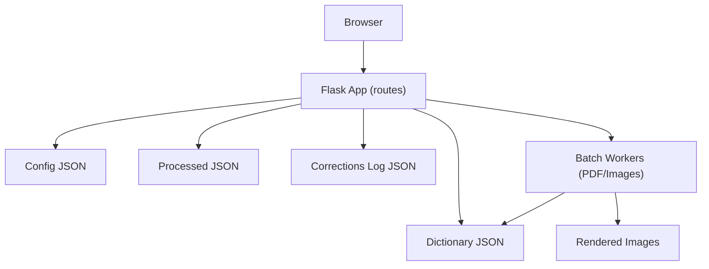
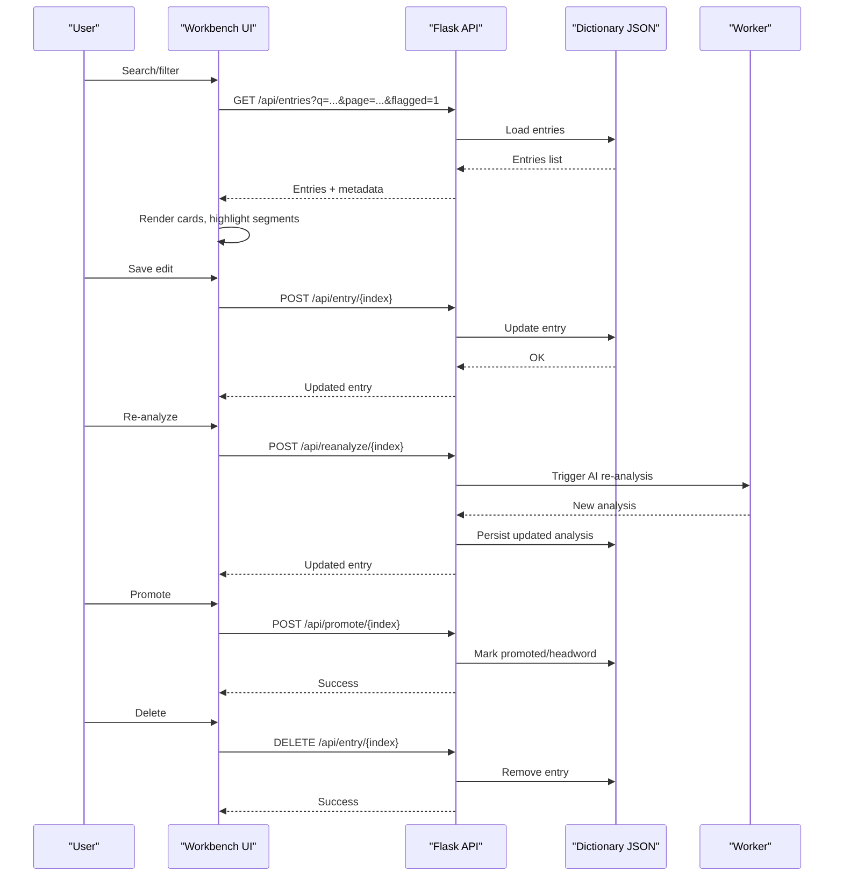
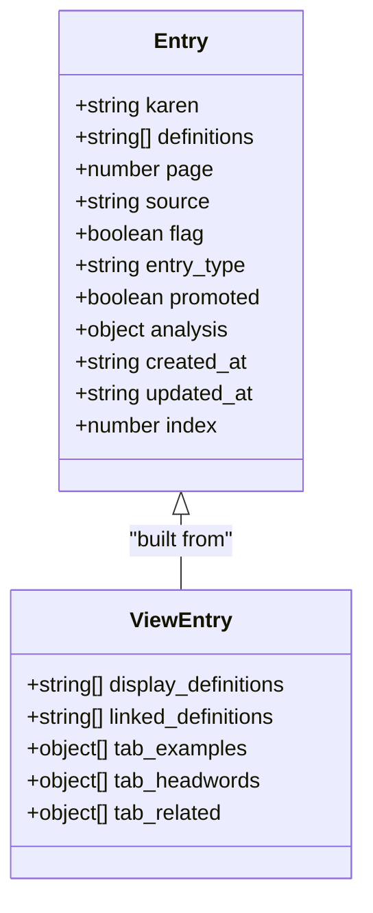
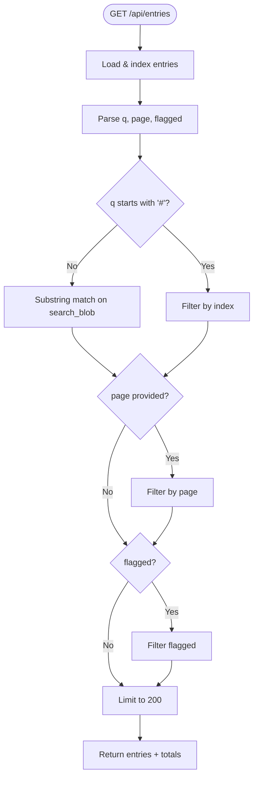
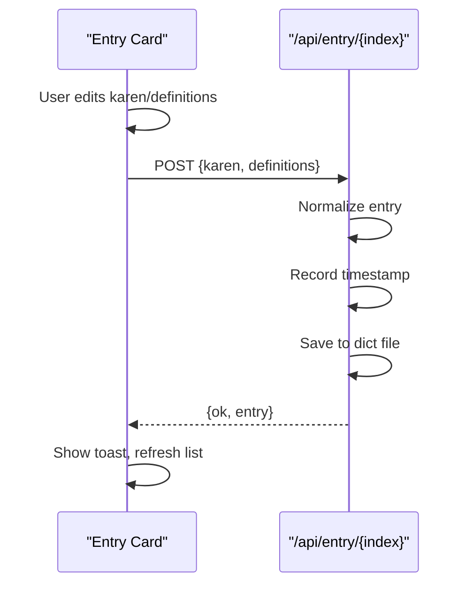
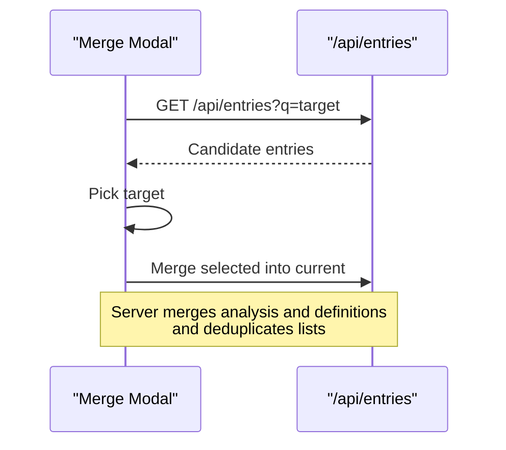
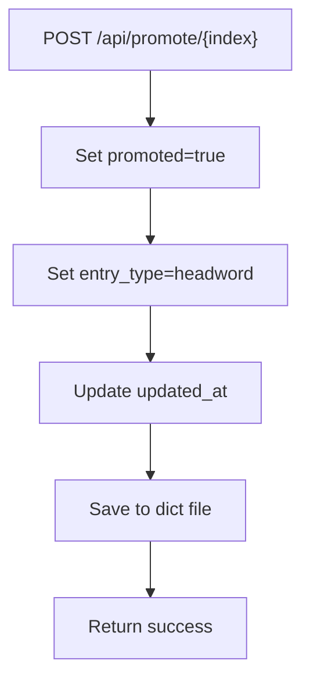
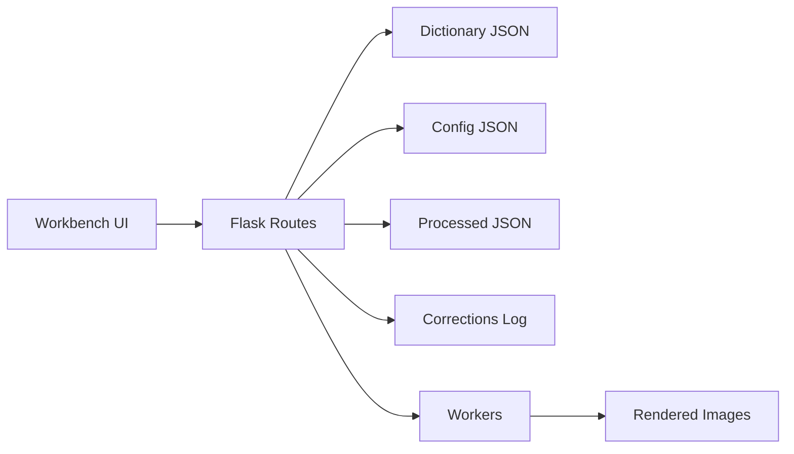

# Dictionary Management Interface

<cite>
**Referenced Files in This Document**
- [app.py](file://app.py)
- [karen_dict_full.json](file://karen_dict_full.json)
- [karen_dict_PAGE.html](file://assets/proof/dictionary/karen_dict_PAGE.html)
</cite>

## Table of Contents
1. [Introduction](#introduction)
2. [Project Structure](#project-structure)
3. [Core Components](#core-components)
4. [Architecture Overview](#architecture-overview)
5. [Detailed Component Analysis](#detailed-component-analysis)
6. [Dependency Analysis](#dependency-analysis)
7. [Performance Considerations](#performance-considerations)
8. [Troubleshooting Guide](#troubleshooting-guide)
9. [Conclusion](#conclusion)
10. [Appendices](#appendices)

## Introduction
This document describes the dictionary management interface for the Sgaw Karen OCR pipeline. It explains how users search and filter entries, edit them inline with validation and real-time feedback, merge and deduplicate duplicates, promote or flag entries, and extend the UI with new fields and custom rules. It also documents data binding to backend APIs, caching strategies, and accessibility considerations.

## Project Structure
The application is a Flask server that serves two primary user interfaces:
- A compact workbench page embedded in the main Python file for quick operations (search, edit, re-analyze, promote).
- A richer proofing UI in a separate HTML file for detailed review and batch configuration.

Data persistence uses JSON files on disk:
- The main dictionary is stored as a list of entries in a single JSON file.
- Batch processing state, configuration, processed items, and correction logs are stored in separate JSON files.

**Diagram sources**
- [app.py:1510-1664](file://app.py#L1510-L1664)
- [app.py:171-234](file://app.py#L171-L234)

**Section sources**
- [app.py:17-67](file://app.py#L17-L67)
- [app.py:171-234](file://app.py#L171-L234)
- [app.py:1510-1664](file://app.py#L1510-L1664)

## Core Components
- Entry model and normalization: Each entry has Karen text, definitions, metadata (page, source), flags/promotion status, entry type, analysis segments, and timestamps. Normalization ensures consistent structure and safe defaults.
- Search and filtering: Full-text search across Karen text, English definitions, source, and analysis; optional page filter; flagged-only mode; direct index lookup via #N syntax.
- Inline editing: Editable Karen headword and definitions per entry; save updates normalized entry back to storage; delete removes entries; re-analyze triggers AI-based re-extraction of analysis fields without altering original definitions.
- Promotion and flagging: Promote moves an entry to headword type and marks it promoted; flag highlights entries for review.
- Merge and deduplication: UI-driven merge workflow to combine related entries; server-side deduplication utilities for lists within analysis and merged content.
- Batch ingestion: Upload images or PDFs; background workers render pages, extract entries via AI, append to dictionary, and track progress/status.

**Section sources**
- [app.py:268-327](file://app.py#L268-L327)
- [app.py:426-484](file://app.py#L426-L484)
- [app.py:1540-1599](file://app.py#L1540-L1599)
- [app.py:1600-1664](file://app.py#L1600-L1664)

## Architecture Overview
The interface communicates with the Flask backend through REST endpoints. The frontend renders cards for each entry, supports inline edits, and invokes actions like save, delete, re-analyze, promote, and merge. Background workers process batches and update shared state visible via status polling.

**Diagram sources**
- [app.py:1540-1599](file://app.py#L1540-L1599)
- [app.py:1600-1664](file://app.py#L1600-L1664)

## Detailed Component Analysis

### Entry Model and Data Binding
- Entry fields include Karen text, definitions array, page, source, flag, entry_type, promoted, analysis (examples, headword_terms, related_items, segments, sense_labels), created_at, updated_at.
- Normalization enforces types and defaults; indices are assigned when listing entries for UI.
- Data binding:
  - GET /api/entries returns indexed entries with pre-built view fields (display_definitions, linked_definitions, tabs for examples/headwords/related).
  - POST /api/entry/{index} accepts karen and definitions; normalizes and persists; records correction.
  - DELETE /api/entry/{index} removes entry; records correction.

**Diagram sources**
- [app.py:268-327](file://app.py#L268-L327)
- [app.py:455-484](file://app.py#L455-L484)
- [app.py:1494-1507](file://app.py#L1494-L1507)

**Section sources**
- [app.py:268-327](file://app.py#L268-L327)
- [app.py:455-484](file://app.py#L455-L484)
- [app.py:1494-1507](file://app.py#L1494-L1507)
- [app.py:1540-1599](file://app.py#L1540-L1599)

### Search and Filtering
- Full-text search builds a searchable blob combining Karen text, definitions, source, and analysis JSON; queries match substrings case-insensitively.
- Supports:
  - Free text search across all fields.
  - Page filter by exact page number.
  - Flagged-only filter.
  - Direct index lookup using #N syntax to jump to a specific entry.
- Results are capped at 200 entries for performance; total count is returned for UI badges.

**Diagram sources**
- [app.py:474-484](file://app.py#L474-L484)
- [app.py:1540-1567](file://app.py#L1540-L1567)

**Section sources**
- [app.py:474-484](file://app.py#L474-L484)
- [app.py:1540-1567](file://app.py#L1540-L1567)

### Inline Editing, Validation, and Real-Time Feedback
- Inline editing:
  - Each card toggles between view and edit modes.
  - Karen field and definitions textarea are editable; Save posts normalized changes to backend.
- Validation rules:
  - Definitions are split by newline and trimmed; empty lines are filtered out.
  - Entry normalization enforces allowed entry_type values and ensures arrays are present.
- Real-time feedback:
  - Toast notifications confirm save, delete, re-analyze, and promote actions.
  - Status panel polls worker progress and logs; auto-refreshes after completion.

**Diagram sources**
- [app.py:1302-1314](file://app.py#L1302-L1314)
- [app.py:1570-1585](file://app.py#L1570-L1585)

**Section sources**
- [app.py:1184-1256](file://app.py#L1184-L1256)
- [app.py:1302-1314](file://app.py#L1302-L1314)
- [app.py:1570-1585](file://app.py#L1570-L1585)

### Merge and Deduplication Tools
- Merge workflow:
  - Open merge modal for current entry; search targets by Karen text or index.
  - Select target entry; merge combines analysis fields and definitions while deduplicating lists.
- Deduplication:
  - Utilities remove duplicate items in lists (e.g., examples, headword_terms, related_items) based on JSON serialization keys.
  - Merging preserves original definition text and augments analysis without cutting content.

**Diagram sources**
- [app.py:1337-1365](file://app.py#L1337-L1365)
- [app.py:287-301](file://app.py#L287-L301)
- [app.py:416-424](file://app.py#L416-L424)

**Section sources**
- [app.py:287-301](file://app.py#L287-L301)
- [app.py:416-424](file://app.py#L416-L424)
- [app.py:1337-1365](file://app.py#L1337-L1365)

### Promotion and Flagging Systems
- Promotion:
  - Marks entry as promoted and sets entry_type to headword; persisted with updated timestamp.
  - UI shows promoted badge and visual indicators.
- Flagging:
  - Entries can be flagged for review; flagged-only search filters results.
  - Visual styling highlights flagged cards.

**Diagram sources**
- [app.py:1588-1599](file://app.py#L1588-L1599)

**Section sources**
- [app.py:1588-1599](file://app.py#L1588-L1599)

### Extending the UI with New Fields, Custom Validation, and Bulk Operations
- Adding new fields:
  - Extend the entry normalization function to accept and persist new fields.
  - Update the UI templates to render/edit the new fields and bind to API payloads.
- Custom validation:
  - Add checks before saving (e.g., regex patterns, required fields) in the client-side save flow and/or server-side normalization.
  - Provide immediate feedback via error messages or disabled save buttons until valid.
- Bulk operations:
  - Implement batch endpoints (e.g., bulk promote, bulk delete) that iterate over selected indices, apply transformations, and persist changes.
  - Use existing correction logging to record bulk actions for auditability.

[No sources needed since this section provides general guidance]

### Data Binding Between UI and Backend APIs
- Endpoints used by the UI:
  - Health and status: GET /api/health, GET /api/status
  - Entries: GET /api/entries (with query params), POST /api/entry/{index}, DELETE /api/entry/{index}
  - Actions: POST /api/promote/{index}, POST /api/reanalyze/{index}
  - Batch: POST /api/run-images, POST /api/run-pdf, POST /api/cancel, POST /api/force-reset
  - Config: GET/POST /api/config
  - Bootstrap import: POST /api/import-bootstrap
- Frontend calls use fetch with JSON payloads; errors are handled via unified response checking and toast notifications.

**Section sources**
- [app.py:1515-1664](file://app.py#L1515-L1664)
- [app.py:1106-1113](file://app.py#L1106-L1113)

### Caching Strategies for Performance
- Client-side caching:
  - Avoid unnecessary re-fetches by maintaining local state for entries and only refreshing after mutations.
  - Debounce search input to reduce request frequency.
- Server-side considerations:
  - Limit result set to 200 entries per request to prevent large payloads.
  - Use efficient substring matching on precomputed search blobs.
  - Persist processed items to skip reprocessing during batch runs.

[No sources needed since this section provides general guidance]

### Accessibility Considerations
- Keyboard navigation:
  - Ensure all interactive elements are focusable and operable via keyboard.
  - Provide visible focus styles and logical tab order.
- Screen readers:
  - Use semantic HTML (headings, labels, buttons) and ARIA attributes where necessary (e.g., role="tablist", aria-selected).
  - Announce dynamic updates (e.g., toast messages) with appropriate roles.
- Color and contrast:
  - Maintain sufficient color contrast for text and indicators.
  - Do not rely solely on color to convey meaning; add icons or text labels.
- Language and fonts:
  - Set lang attribute appropriately; load Karen fonts reliably via font routes.

**Section sources**
- [app.py:518-530](file://app.py#L518-L530)
- [app.py:734-934](file://app.py#L734-L934)

## Dependency Analysis
- UI components depend on Flask routes for data retrieval and mutations.
- Worker processes depend on configuration and processed tracking to avoid redundant work.
- Entry rendering depends on analysis normalization and segment decoration to produce highlighted definitions.

**Diagram sources**
- [app.py:1510-1664](file://app.py#L1510-L1664)
- [app.py:171-234](file://app.py#L171-L234)

**Section sources**
- [app.py:1510-1664](file://app.py#L1510-L1664)
- [app.py:171-234](file://app.py#L171-L234)

## Performance Considerations
- Search optimization:
  - Precompute search blobs to speed up substring matching.
  - Cap results to a reasonable limit and provide pagination if needed.
- Rendering efficiency:
  - Minimize DOM churn by updating only changed parts of the list.
  - Use virtualized lists for very large datasets.
- Batch processing:
  - Respect delay settings to avoid overwhelming external services.
  - Track and skip already processed items to reduce redundant work.

[No sources needed since this section provides general guidance]

## Troubleshooting Guide
- No entries found:
  - Verify dictionary file exists and contains valid JSON array.
  - Check health endpoint for key presence and model configuration.
- Search returns no results:
  - Confirm search terms exist in Karen text, definitions, source, or analysis.
  - Try broader terms or remove filters (page, flagged).
- Save fails:
  - Ensure definitions are non-empty strings; check normalization constraints.
  - Review network responses and toast messages for error details.
- Batch stuck:
  - Use cancel or force reset endpoints to clear state.
  - Inspect status and log panels for errors.

**Section sources**
- [app.py:22-31](file://app.py#L22-L31)
- [app.py:1120-1149](file://app.py#L1120-L1149)
- [app.py:1618-1628](file://app.py#L1618-L1628)

## Conclusion
The dictionary management interface provides a comprehensive toolset for searching, editing, merging, promoting, and flagging Sgaw Karen dictionary entries. It integrates seamlessly with batch extraction workflows and offers robust data binding, performance safeguards, and accessibility features. Extensions can be added by modifying normalization, UI templates, and API endpoints while leveraging existing utilities for validation, deduplication, and logging.

## Appendices

### API Reference Summary
- GET /api/health: System health and configuration status.
- GET /api/status: Live batch processing status and logs.
- GET /api/config, POST /api/config: Retrieve/update batch configuration.
- GET /api/entries: Search/filter entries with full-text support.
- POST /api/entry/{index}: Update entry fields (karen, definitions).
- DELETE /api/entry/{index}: Remove an entry.
- POST /api/promote/{index}: Promote entry to headword.
- POST /api/reanalyze/{index}: Re-run analysis without changing definitions.
- POST /api/run-images: Queue image batch extraction.
- POST /api/run-pdf: Queue PDF batch extraction.
- POST /api/cancel: Cancel running batch.
- POST /api/force-reset: Reset batch state.
- POST /api/import-bootstrap: Import bootstrap JSON files into dictionary.

**Section sources**
- [app.py:1515-1664](file://app.py#L1515-L1664)