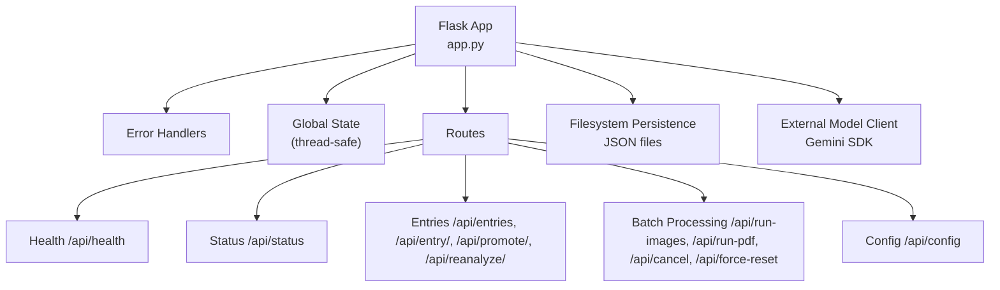
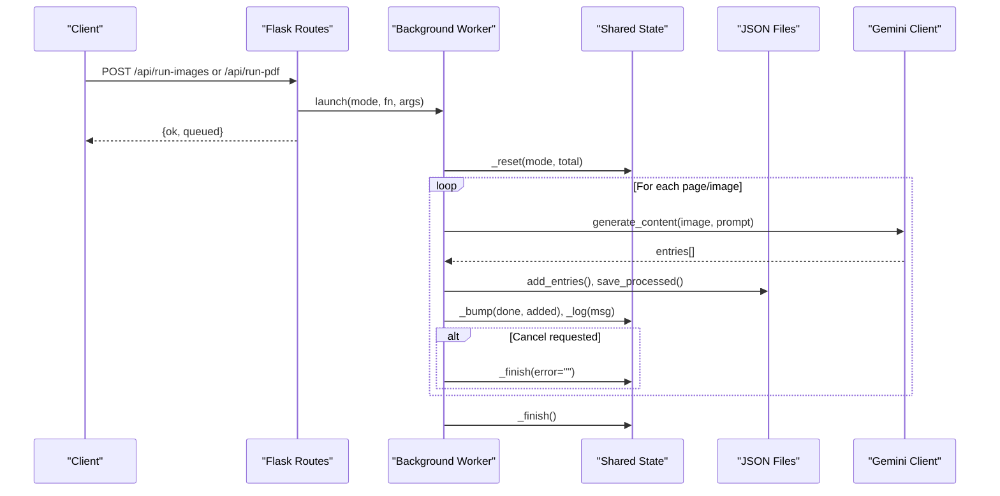
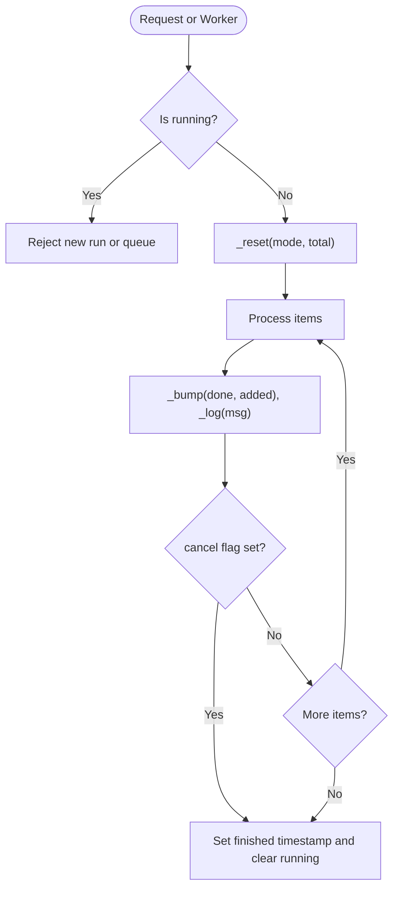
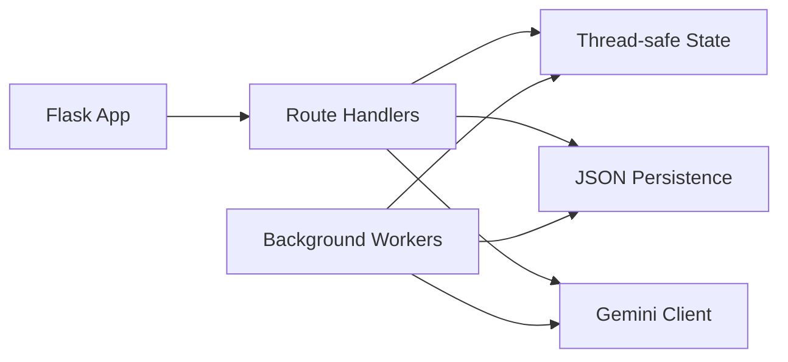

# Flask Application Architecture

<cite>
**Referenced Files in This Document**
- [app.py](file://app.py)
- [batch_config.json](file://batch_config.json)
</cite>

## Table of Contents
1. [Introduction](#introduction)
2. [Project Structure](#project-structure)
3. [Core Components](#core-components)
4. [Architecture Overview](#architecture-overview)
5. [Detailed Component Analysis](#detailed-component-analysis)
6. [Dependency Analysis](#dependency-analysis)
7. [Performance Considerations](#performance-considerations)
8. [Troubleshooting Guide](#troubleshooting-guide)
9. [Conclusion](#conclusion)
10. [Appendices](#appendices)

## Introduction
This document explains the Flask application architecture for the Sgaw Karen OCR Dictionary Workbench. It covers app initialization, error handling, global state management with thread-safe operations, route definitions (health checks, status monitoring, entry management, batch processing, and configuration), request/response schemas, authentication mechanisms, session handling, middleware patterns, context management, dependency injection approaches, and guidance to extend routes and integrate with existing processing pipelines.

## Project Structure
The application is implemented as a single-file Flask app that:
- Initializes the Flask app and registers error handlers
- Manages global processing state with a threading lock for thread safety
- Provides REST endpoints for health, status, entries, configuration, and batch processing
- Integrates with an external AI model via an SDK client
- Persists dictionary entries, processed items, corrections, and configuration to JSON files on disk
- Serves a minimal HTML UI embedded in the Python file

**Diagram sources**
- [app.py:17-31](file://app.py#L17-L31)
- [app.py:96-163](file://app.py#L96-L163)
- [app.py:1515-1664](file://app.py#L1515-L1664)

**Section sources**
- [app.py:17-31](file://app.py#L17-L31)
- [app.py:96-163](file://app.py#L96-L163)
- [app.py:1515-1664](file://app.py#L1515-L1664)

## Core Components
- App initialization and error handling: The Flask app is created and two error handlers are registered to return structured JSON errors for unexpected exceptions and 404s.
- Global state and thread safety: A module-level state dictionary tracks running mode, progress, logs, and control flags. Access is guarded by a threading lock to ensure consistency across background workers and requests.
- Data persistence helpers: Functions load/save dictionaries, processed records, corrections, and configuration from/to JSON files with atomic writes using temporary files and rename.
- Batch processing pipeline: Background threads process images or PDF pages, extract entries via an external model, update persisted data, and report progress through the shared state.
- Routes: REST endpoints expose health, status, entries CRUD, promotion, reanalysis, bootstrap import, cancellation, force reset, and configuration management.

**Section sources**
- [app.py:17-31](file://app.py#L17-L31)
- [app.py:96-163](file://app.py#L96-L163)
- [app.py:171-233](file://app.py#L171-L233)
- [app.py:638-729](file://app.py#L638-L729)
- [app.py:1515-1664](file://app.py#L1515-L1664)

## Architecture Overview
The system follows a simple but robust pattern:
- Requests hit Flask routes which validate inputs and delegate work to helper functions or background workers.
- Background workers mutate shared state under locks and persist changes to JSON files.
- External model calls are made per image/page to extract structured dictionary entries.
- The UI polls /api/status and /api/health to reflect live progress and health.

**Diagram sources**
- [app.py:638-729](file://app.py#L638-L729)
- [app.py:96-163](file://app.py#L96-L163)
- [app.py:1631-1658](file://app.py#L1631-L1658)

## Detailed Component Analysis

### Flask App Initialization and Error Handling
- App creation and error handlers:
  - A global exception handler returns a structured JSON response with a truncated traceback for debugging.
  - A 404 handler returns a structured JSON response indicating the missing route.
- These handlers ensure consistent API error shapes for all unhandled cases.

**Section sources**
- [app.py:17-31](file://app.py#L17-L31)

### Global State Management and Thread Safety
- Shared state object includes flags like running, cancel, mode, file, page, counters, timestamps, error messages, and a log buffer.
- All mutations use a threading.Lock to prevent race conditions between request threads and background worker threads.
- Helper functions provide safe snapshots, resets, finish signals, logging, and progress bumps.

**Diagram sources**
- [app.py:96-163](file://app.py#L96-L163)
- [app.py:638-729](file://app.py#L638-L729)

**Section sources**
- [app.py:96-163](file://app.py#L96-L163)

### Route Definitions and Request/Response Schemas

#### Health Check
- Endpoint: GET /api/health
- Response schema:
  - ok: boolean
  - key_ok: boolean (indicates presence of model API key)
  - model: string (model name)
  - entries: integer (current dictionary size)
  - dictionary_file: string (filename)

**Section sources**
- [app.py:1515-1525](file://app.py#L1515-L1525)

#### Status Monitoring
- Endpoint: GET /api/status
- Response schema:
  - ok: boolean
  - status: object containing running, cancel, mode, file, page, done, total, entries_added, started, finished, error, log[]

**Section sources**
- [app.py:1528-1531](file://app.py#L1528-L1531)

#### Entry Management
- List/Search Entries
  - Endpoint: GET /api/entries
  - Query parameters:
    - q: string; supports full-text search and exact index lookup via "#N"
    - page: string; filter by source page number
    - flagged: "1"; show only flagged entries
  - Response schema:
    - ok: boolean
    - entries: array of normalized entries (with display fields and analysis)
    - total: integer (total entries in dictionary)
    - shown: integer (number returned)
    - correction_count: integer (number of recorded corrections)

- Create/Update/Delete Entry
  - Endpoint: POST /api/entry/<index>
  - Request body: JSON with fields such as karen, definitions, entry_type, etc.
  - Behavior: Updates the specified entry, sets updated_at, records a correction event
  - Response schema:
    - ok: boolean
    - entry: normalized entry object including index

  - Endpoint: DELETE /api/entry/<index>
  - Behavior: Removes entry at index, records a correction event
  - Response schema:
    - ok: boolean
    - deleted: integer (index removed)

- Promote Entry
  - Endpoint: POST /api/promote/<index>
  - Behavior: Marks entry as promoted and sets entry_type to headword
  - Response schema:
    - ok: boolean
    - index: integer

- Re-analyze Entry
  - Endpoint: POST /api/reanalyze/<index>
  - Behavior: Calls model to recompute entry_type and analysis, updates entry
  - Response schema:
    - ok: boolean
    - entry: updated entry object including index

**Section sources**
- [app.py:1540-1610](file://app.py#L1540-L1610)

#### Batch Processing Routes
- Run Images
  - Endpoint: POST /api/run-images
  - Request: multipart form with field "images" containing one or more image files
  - Behavior: Saves uploaded images, launches background worker to process them
  - Response schema:
    - ok: boolean
    - queued: integer (count of images queued)

- Run PDF
  - Endpoint: POST /api/run-pdf
  - Request: multipart form with field "pdf" and optional "start", "end" page range
  - Behavior: Saves PDF, renders selected pages to images, launches background worker
  - Response schema:
    - ok: boolean
    - queued: object with pdf filename and start/end page range

- Cancel Batch
  - Endpoint: POST /api/cancel
  - Behavior: Sets cancel flag in shared state; workers check this flag and stop gracefully
  - Response schema:
    - ok: boolean

- Force Reset
  - Endpoint: POST /api/force-reset
  - Behavior: Clears running state if stuck
  - Response schema:
    - ok: boolean

**Section sources**
- [app.py:1618-1658](file://app.py#L1618-L1658)

#### Configuration Management
- Endpoint: GET/POST /api/config
- GET behavior: Returns current configuration merged with defaults
- POST behavior: Merges provided config into defaults and persists it
- Response schema:
  - ok: boolean
  - config: object with keys such as pdf_pages_per_batch, images_per_batch, delay_seconds, page_offset, render_dpi, skip_processed, auto_import_bootstrap

**Section sources**
- [app.py:1533-1537](file://app.py#L1533-L1537)
- [batch_config.json:1-9](file://batch_config.json#L1-L9)

### Authentication Mechanisms and Session Handling
- Authentication: No built-in authentication middleware or token-based auth is present in the application code. Security should be enforced at the deployment boundary (e.g., reverse proxy, WSGI gateway, or network firewall).
- Sessions: No server-side sessions are used. The application is stateless except for shared in-memory state protected by a lock and persistent JSON files.

[No sources needed since this section summarizes implementation characteristics without quoting specific lines]

### Middleware Patterns, Context Management, and Dependency Injection
- Middleware: No custom Flask middleware is defined. Cross-cutting concerns (error handling, logging) are handled via error handlers and centralized helper functions.
- Context management: The application uses module-level globals for configuration and state. Thread safety is achieved via a threading.Lock around state mutations.
- Dependency injection: Dependencies (paths, configuration, model client) are accessed via module-level variables and helper functions rather than explicit DI containers. To improve testability and modularity, consider injecting dependencies through function parameters or a lightweight service registry.

**Section sources**
- [app.py:17-31](file://app.py#L17-L31)
- [app.py:96-163](file://app.py#L96-L163)
- [app.py:171-233](file://app.py#L171-L233)

### Extending Routes and Adding New API Endpoints
To add a new endpoint:
- Define a new @app.route(...) decorator with appropriate HTTP methods.
- Validate inputs using request.args or request.get_json(silent=True).
- Use existing helpers for persistence (load_dict/save_dict, load_cfg/save_cfg) and state updates (_snap/_reset/_finish/_log/_bump).
- Return consistent JSON responses with ok and payload fields.
- If long-running work is required, launch a background thread via launch(...) and update shared state accordingly.

Example integration points:
- Add a new batch job type by implementing a worker function similar to worker_images/worker_pdf and launching it via launch(...).
- Integrate with additional external services by creating a client builder similar to build_client() and calling it within route handlers or workers.

**Section sources**
- [app.py:638-729](file://app.py#L638-L729)
- [app.py:1631-1658](file://app.py#L1631-L1658)

## Dependency Analysis
The application has the following key dependencies and relationships:
- Flask framework for routing and request handling
- Threading for background processing
- Filesystem for persistence (JSON files)
- External model client for extraction and reanalysis

**Diagram sources**
- [app.py:17-31](file://app.py#L17-L31)
- [app.py:96-163](file://app.py#L96-L163)
- [app.py:638-729](file://app.py#L638-L729)
- [app.py:1515-1664](file://app.py#L1515-L1664)

**Section sources**
- [app.py:17-31](file://app.py#L17-L31)
- [app.py:96-163](file://app.py#L96-L163)
- [app.py:638-729](file://app.py#L638-L729)
- [app.py:1515-1664](file://app.py#L1515-L1664)

## Performance Considerations
- Concurrency: Background workers run in daemon threads. Ensure sufficient system resources and avoid CPU-bound tasks blocking request handling.
- Rate limiting: The delay_seconds configuration helps pace model calls; tune based on provider limits and throughput needs.
- I/O efficiency: Atomic writes via temporary files reduce corruption risk during concurrent saves.
- Pagination and filtering: The entries endpoint caps results to a reasonable limit; consider adding server-side pagination for large datasets.
- Rendering DPI: Adjust render_dpi to balance quality and performance when processing PDFs.

[No sources needed since this section provides general guidance]

## Troubleshooting Guide
Common issues and resolutions:
- Missing model API key: Health endpoint indicates key_ok=false; set the required environment variable before starting the app.
- Stuck batch run: Use /api/force-reset to clear running state if a worker terminated unexpectedly.
- Cancel not taking effect: Ensure workers are checking the cancel flag; they do so at iteration boundaries.
- Errors in processing: Inspect the log buffer via /api/status; detailed tracebacks are captured in the global exception handler for unhandled exceptions.

**Section sources**
- [app.py:22-31](file://app.py#L22-L31)
- [app.py:1515-1531](file://app.py#L1515-L1531)
- [app.py:1618-1629](file://app.py#L1618-L1629)

## Conclusion
The Flask application provides a compact, thread-safe architecture for managing dictionary entries and orchestrating batch OCR processing. It exposes a clean set of REST endpoints for health, status, entries, configuration, and batch jobs, while persisting state to JSON files and coordinating background workers with a shared lock. Extensibility is straightforward: add routes, implement workers, and leverage existing helpers for state and persistence. For production deployments, consider adding authentication, rate limiting, and structured logging at the gateway layer.

[No sources needed since this section summarizes without analyzing specific files]

## Appendices

### Appendix A: Route Summary Table
- GET /api/health
  - Purpose: Health check and model key status
  - Response: { ok, key_ok, model, entries, dictionary_file }

- GET /api/status
  - Purpose: Live processing status and logs
  - Response: { ok, status: { ... } }

- GET /api/entries
  - Purpose: Search/list entries
  - Query: q, page, flagged
  - Response: { ok, entries[], total, shown, correction_count }

- POST /api/entry/<index>
  - Purpose: Update entry
  - Request: JSON with entry fields
  - Response: { ok, entry }

- DELETE /api/entry/<index>
  - Purpose: Delete entry
  - Response: { ok, deleted }

- POST /api/promote/<index>
  - Purpose: Promote entry to headword
  - Response: { ok, index }

- POST /api/reanalyze/<index>
  - Purpose: Re-run analysis for entry
  - Response: { ok, entry }

- POST /api/run-images
  - Purpose: Queue image batch processing
  - Request: multipart images[]
  - Response: { ok, queued }

- POST /api/run-pdf
  - Purpose: Queue PDF batch processing
  - Request: multipart pdf + start/end
  - Response: { ok, queued }

- POST /api/cancel
  - Purpose: Cancel running batch
  - Response: { ok }

- POST /api/force-reset
  - Purpose: Clear running state
  - Response: { ok }

- GET/POST /api/config
  - Purpose: Read/update configuration
  - Response: { ok, config }

**Section sources**
- [app.py:1515-1664](file://app.py#L1515-L1664)