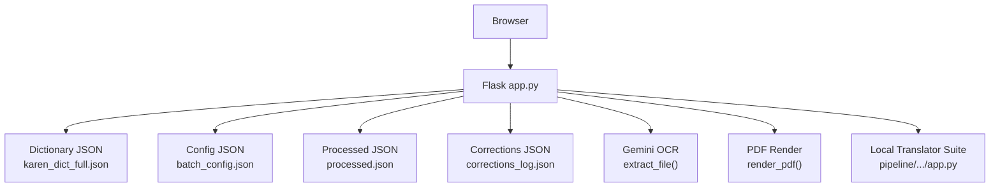
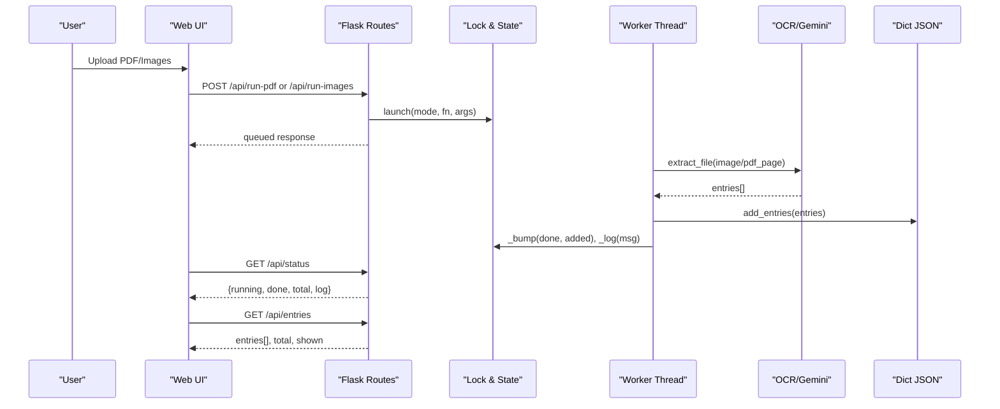
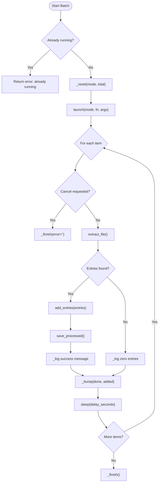
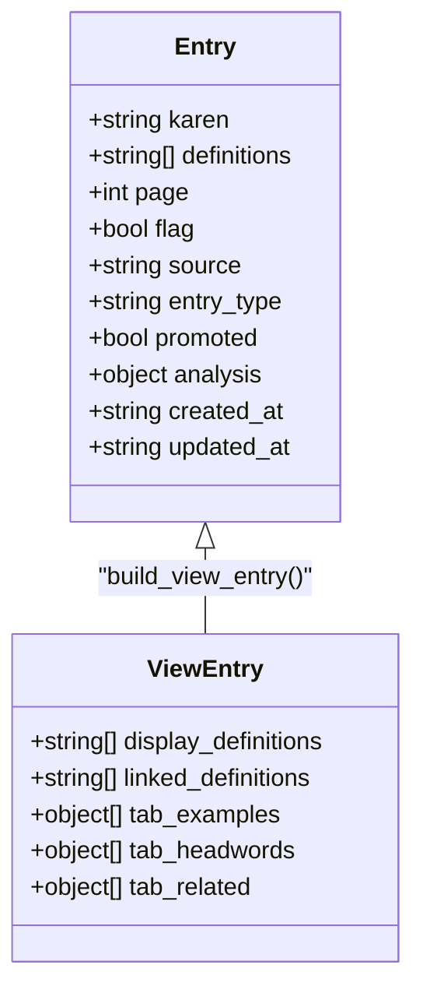
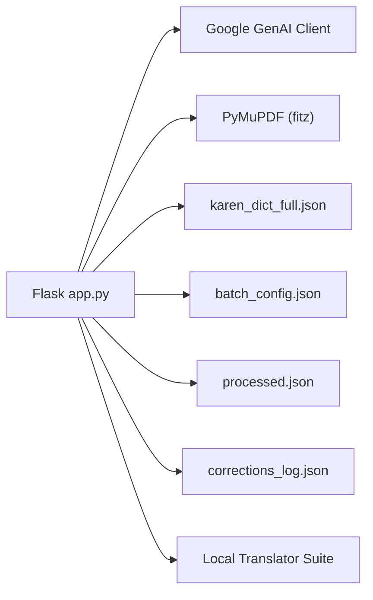

# Web Interface and Workbench

<cite>
**Referenced Files in This Document**
- [app.py](file://app.py)
- [batch_config.json](file://batch_config.json)
- [karen_dict_full.json](file://karen_dict_full.json)
- [local_translator_suite/app.py](file://pipeline/dictionary_processing/local_translator_suite/app.py)
- [local_translator_suite/templates/index.html](file://pipeline/dictionary_processing/local_translator_suite/templates/index.html)
- [local_translator_suite/static/styles.css](file://pipeline/dictionary_processing/local_translator_suite/static/styles.css)
</cite>

## Table of Contents
1. Introduction
2. Project Structure
3. Core Components
4. Architecture Overview
5. Detailed Component Analysis
6. Dependency Analysis
7. Performance Considerations
8. Troubleshooting Guide
9. Conclusion
10. Appendices

## Introduction
This document explains the web interface and workbench sub-feature for Sgaw Karen dictionary processing. It covers the Flask application architecture, route definitions for health checks, status monitoring, entry management, and batch processing endpoints. It also documents the interactive dictionary review UI, real-time batch processing with background workers, progress tracking, logging, merge and deduplication tools, promotion/flagging systems, configuration options, session-less state management, file upload handling, and integration with OCR and dictionary processing components.

## Project Structure
The project centers on a single-page Flask application that:
- Serves an embedded HTML/CSS/JS interface for reviewing and editing dictionary entries
- Exposes REST-like API routes for health, status, configuration, entries CRUD, promotion, re-analysis, bootstrap import, cancel, force reset, and batch runs (images and PDFs)
- Runs background worker threads to process images and PDF pages through an OCR pipeline powered by a Gemini model
- Persists dictionary entries, corrections log, processed items, and configuration as JSON files
- Provides a secondary local translator suite under pipeline/dictionary_processing/local_translator_suite for translation workflows and live batch processing

**Diagram sources**
- [app.py:17-55](file://app.py#L17-L55)
- [app.py:619-728](file://app.py#L619-L728)
- [app.py:1510-1664](file://app.py#L1510-L1664)
- [local_translator_suite/app.py:1-30](file://pipeline/dictionary_processing/local_translator_suite/app.py#L1-L30)

**Section sources**
- [app.py:17-55](file://app.py#L17-L55)
- [batch_config.json:1-9](file://batch_config.json#L1-L9)

## Core Components
- Health and status endpoints: provide system readiness and live batch run status
- Configuration endpoint: read/write runtime settings for batch processing
- Entries endpoints: list/search/filter entries; update/delete individual entries
- Promotion and re-analysis: mark entries as promoted headwords or re-run analysis via Gemini
- Bootstrap import: auto-import bootstrap JSON files into the dictionary
- Batch processing: queue image folders and PDF page ranges for extraction
- Background workers: thread-based processors that render PDFs, call OCR, persist results, and update progress/log
- UI templates: embedded HTML/CSS/JS for interactive review, search, edit, merge, and keyboard input

**Section sources**
- [app.py:1515-1664](file://app.py#L1515-L1664)
- [app.py:638-728](file://app.py#L638-L728)
- [app.py:734-1491](file://app.py#L734-L1491)

## Architecture Overview
The Flask app is the central orchestrator:
- Routes handle HTTP requests and delegate to helper functions
- Workers run in daemon threads to avoid blocking the server
- State is shared via a thread-safe in-memory structure with locks
- Data persistence uses atomic JSON writes to avoid corruption
- OCR integration calls Gemini to extract structured entries from images/PDF pages
- The UI polls status and entries endpoints to reflect live progress and updated content

**Diagram sources**
- [app.py:723-728](file://app.py#L723-L728)
- [app.py:638-728](file://app.py#L638-L728)
- [app.py:1515-1664](file://app.py#L1515-L1664)

## Detailed Component Analysis

### Flask Routes and APIs
- Health check: returns key presence, model name, entry count, and dictionary file path
- Status: returns current batch run state including mode, file/page context, progress counters, timestamps, error, and log tail
- Configuration: GET returns current config; POST merges provided fields into defaults and persists
- Entries: supports query by text, page number, flagged-only filter; returns up to 200 view-ready entries with linked definitions and tabs
- Entry CRUD: POST updates karen and definitions; DELETE removes entry; both record corrections
- Promote: marks entry as promoted and sets type to headword
- Re-analyze: calls Gemini to refine entry_type and analysis without altering definitions
- Import bootstrap: scans for bootstrap JSON files and imports normalized entries
- Cancel/force-reset: signals cancellation or resets running state
- Run images: accepts multiple images, saves to disk, queues worker
- Run PDF: accepts PDF plus start/end pages, saves to disk, queues worker

**Section sources**
- [app.py:1515-1664](file://app.py#L1515-L1664)

### Interactive Dictionary Review Interface
- Embedded HTML template includes:
  - Top bar with health badge, entry count, correction count
  - Batch controls: PDF upload with page range, folder path runner, image upload, bootstrap import, cancel, force reset
  - Live status and log panels
  - Search panel with keyword, page, and flagged filters
  - Entry cards showing Karen headword, tags (type, flagged, promoted), source/page, definitions, extracted examples, potential headwords, related items
  - Actions: Edit, Save, Cancel, Re-analyze, Merge, Promote, Delete
  - Merge modal: search targets and confirm merge
  - Karen Unicode keyboard overlay for quick input
- CSS provides dark theme, responsive layout, styled badges, chips, modals, and keyboard grid

**Section sources**
- [app.py:734-1491](file://app.py#L734-L1491)

### Real-Time Batch Processing System
- Worker threads:
  - worker_images: iterates image paths, optionally skips processed items, extracts entries via OCR, updates counts, logs progress, handles errors
  - worker_pdf: renders PDF pages at configured DPI, processes each page similarly, tracks per-page context
- Progress tracking:
  - Shared state tracks running flag, mode, file/page, done/total, entries_added, timestamps, error, and log lines
  - UI polls /api/status to display live progress and logs
- Logging:
  - Each step appends timestamped messages to in-memory log, capped at recent entries
  - Errors include stack trace snippets for debugging
- Cancellation and reset:
  - /api/cancel sets cancel flag checked at loop start
  - /api/force-reset clears running state

**Diagram sources**
- [app.py:638-728](file://app.py#L638-L728)
- [app.py:134-169](file://app.py#L134-L169)

**Section sources**
- [app.py:638-728](file://app.py#L638-L728)
- [app.py:134-169](file://app.py#L134-L169)

### Dictionary Management Interface
- Search and filtering:
  - Text search across Karen, definitions, source, and analysis blob
  - Page filter by numeric page value
  - Flagged-only filter for entries marked for attention
- Interactive editing:
  - Inline edit mode toggles Karen field and definitions textarea
  - Save posts updated fields back to server and refreshes view
- Merge and deduplication:
  - Merge modal searches target entries and merges analysis and definitions using normalization and deduplication helpers
  - Dedupe utilities ensure unique lists for examples, headword terms, and related items
- Promotion and flagging:
  - Promote sets promoted flag and entry_type to headword
  - Flagging is stored per entry and used in filtered views

**Diagram sources**
- [app.py:303-326](file://app.py#L303-L326)
- [app.py:455-471](file://app.py#L455-L471)

**Section sources**
- [app.py:1540-1599](file://app.py#L1540-L1599)
- [app.py:287-301](file://app.py#L287-L301)
- [app.py:416-471](file://app.py#L416-L471)

### Local Translator Suite Integration
- Separate Flask app under pipeline/dictionary_processing/local_translator_suite provides:
  - Search editor with auto/manual routing between English-to-Karen and Karen-to-English
  - Live batch runner over translations_website.txt with progress bars and tables
  - Audit trail and lookup attempts JSON viewer
  - Styles and templates for a light-themed workspace
- While independent, it complements the main workbench by offering translation workflows and detailed auditability

**Section sources**
- [local_translator_suite/app.py:1-30](file://pipeline/dictionary_processing/local_translator_suite/app.py#L1-L30)
- [local_translator_suite/templates/index.html:1-193](file://pipeline/dictionary_processing/local_translator_suite/templates/index.html#L1-L193)
- [local_translator_suite/static/styles.css:1-579](file://pipeline/dictionary_processing/local_translator_suite/static/styles.css#L1-L579)

## Dependency Analysis
- External dependencies:
  - Flask for routing and templating
  - Google GenAI client for OCR extraction
  - PyMuPDF (fitz) for PDF rendering
- Internal dependencies:
  - JSON files for dictionary, configuration, processed items, and corrections log
  - Threading primitives for safe concurrent access to shared state
  - Helper functions for normalization, deduplication, and view building

**Diagram sources**
- [app.py:12-17](file://app.py#L12-L17)
- [app.py:42-55](file://app.py#L42-L55)
- [local_translator_suite/app.py:1-30](file://pipeline/dictionary_processing/local_translator_suite/app.py#L1-L30)

**Section sources**
- [app.py:12-17](file://app.py#L12-L17)
- [app.py:42-55](file://app.py#L42-L55)

## Performance Considerations
- Batch delays: configurable delay_seconds prevents rate-limiting and reduces load on OCR service
- Skip processed: avoids reprocessing identical images/pages when enabled
- PDF DPI: render_dpi balances quality vs performance; higher DPI increases memory/time
- Entry view limit: capped at 200 entries per request to keep UI responsive
- Atomic writes: temporary files replaced atomically to prevent partial reads during persistence
- Thread safety: lock protects shared state and log updates

[No sources needed since this section provides general guidance]

## Troubleshooting Guide
- Missing Gemini key: health endpoint indicates key presence; set environment variable accordingly
- No entries returned: verify search terms, page filter, and flagged filter; ensure entries exist in dictionary file
- Batch stuck: use cancel or force reset to clear state; check status for error messages
- OCR failures: inspect log for exceptions; adjust delay_seconds or retry after transient errors
- File not found: ensure font path exists or configure PADAUK_FONT; verify uploaded files saved to expected directories
- Large datasets: reduce batch sizes or increase delay_seconds; consider pagination strategies if extending UI

**Section sources**
- [app.py:22-30](file://app.py#L22-L30)
- [app.py:1515-1537](file://app.py#L1515-L1537)
- [app.py:619-728](file://app.py#L619-L728)

## Conclusion
The web interface and workbench provide a comprehensive, interactive environment for managing and refining Sgaw Karen dictionary entries. It integrates OCR-driven extraction, background batch processing, real-time progress tracking, and robust editing tools. The design emphasizes data integrity, user feedback, and extensibility through modular routes and helpers. The local translator suite complements these capabilities with translation workflows and detailed auditing.

[No sources needed since this section summarizes without analyzing specific files]

## Appendices

### Extending Routes and Adding UI Components
- Add new routes by defining @app.route handlers in app.py and corresponding JavaScript fetch calls in the embedded template
- For example, to add a new action:
  - Define a route like /api/custom-action with GET/POST methods
  - Implement logic using existing helpers (load_dict, save_dict, record_correction)
  - Add a button in the UI template and wire it to call the new endpoint
- To integrate with processing pipelines:
  - Use extract_file for OCR on images or rendered PDF pages
  - Normalize entries with norm and add via add_entries
  - Update processed records to avoid reprocessing

**Section sources**
- [app.py:1510-1664](file://app.py#L1510-L1664)
- [app.py:536-614](file://app.py#L536-L614)
- [app.py:329-353](file://app.py#L329-L353)

### Configuration Options
- batch_config.json fields:
  - pdf_pages_per_batch: pages per batch for PDF runs
  - images_per_batch: images per batch for folder runs
  - delay_seconds: pause between items to manage rate limits
  - page_offset: offset applied to page numbers during extraction
  - render_dpi: resolution for PDF page rendering
  - skip_processed: whether to skip already processed items
  - auto_import_bootstrap: whether to auto-import bootstrap files on startup

**Section sources**
- [batch_config.json:1-9](file://batch_config.json#L1-L9)
- [app.py:57-68](file://app.py#L57-L68)

### Session Management and File Upload Handling
- Stateless design: no server-side sessions; state is in-memory and persisted via JSON files
- File uploads:
  - Images are saved to IMG_DIR with sanitized names
  - PDFs are saved to PDF_DIR with sanitized names
  - MIME detection ensures correct handling for various image formats
- Font serving: dedicated route serves Padauk font for proper Karen script rendering

**Section sources**
- [app.py:245-266](file://app.py#L245-L266)
- [app.py:518-530](file://app.py#L518-L530)
- [app.py:1631-1658](file://app.py#L1631-L1658)

### Relationship with OCR and Dictionary Processing Components
- OCR integration:
  - gemini_extract sends image bytes and prompt to Gemini model to extract structured entries
  - parse_json_array normalizes model output into entry arrays
  - extract_file wraps OCR for both images and rendered PDF pages
- Dictionary processing:
  - Entries are normalized and stored in karen_dict_full.json
  - Corrections are logged to corrections_log.json for auditability
  - Processed items tracked in processed.json to support skip logic
- Local translator suite:
  - Independent but complementary tool for translation workflows and live batch processing
  - Uses its own templates, styles, and state management

**Section sources**
- [app.py:536-614](file://app.py#L536-L614)
- [app.py:171-233](file://app.py#L171-L233)
- [local_translator_suite/app.py:1-30](file://pipeline/dictionary_processing/local_translator_suite/app.py#L1-L30)