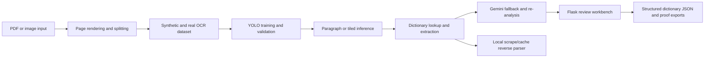

# Architecture

## Pipeline

## Main Components

`app.py` is the public demo workbench. It searches existing dictionary entries, starts image/PDF extraction jobs, records corrections, and exposes API endpoints for review workflows.

`pipeline/ocr_training/` preserves the OCR model work: initial diagnosis, data generation, dataset validation, gap analysis, booster generation, fine-tuning, and paragraph inference.

`pipeline/dictionary_processing/` contains the dictionary-specific work: KNU legacy encoding conversion, PDF page splitting, row extraction, cleanup helpers, relation extraction, and authentic Sgaw Karen sort/correction logic.

`pipeline/dictionary_processing/local_translator_suite/` preserves the strongest imported dictionary-builder side app. It is separate from the main OCR workbench and demonstrates local web lookup, cache review, reverse parsing, batch text processing, and a seed plan for expanding Sgaw Karen language data.

`assets/proof/` contains only selected visual evidence. Full datasets, raw page dumps, generated images, model checkpoints, and local logs stay out of Git.

## Best Demo Path

1. Show `pipeline/ocr_training/1_karen_dataset_gen.py` generating Roboflow-ready syllable classes.
2. Show `pipeline/ocr_training/036_train_v5.py` and proof metrics in `assets/proof/training/`.
3. Show `pipeline/ocr_training/041_gen_paragraph_data.py` and `040_tile_infer.py` moving from isolated syllables to paragraph reading.
4. Show `pipeline/dictionary_processing/042_build_KNU_decoder.py` handling legacy dictionary text.
5. Run `python app.py` and show dictionary entries in the review workbench.
6. Optionally run the local translator suite to show scrape/cache lookup and reverse parsing as a separate "dictionary intelligence" proof.
